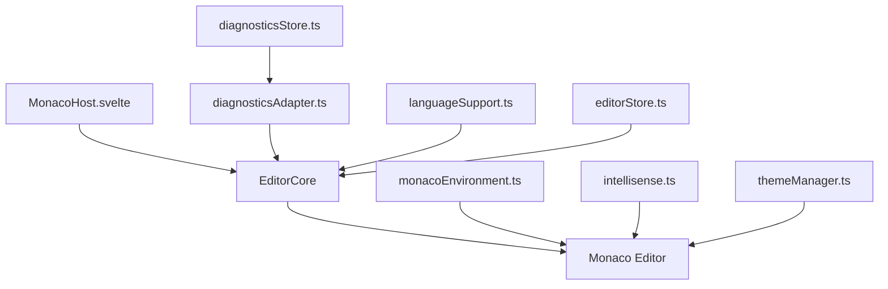
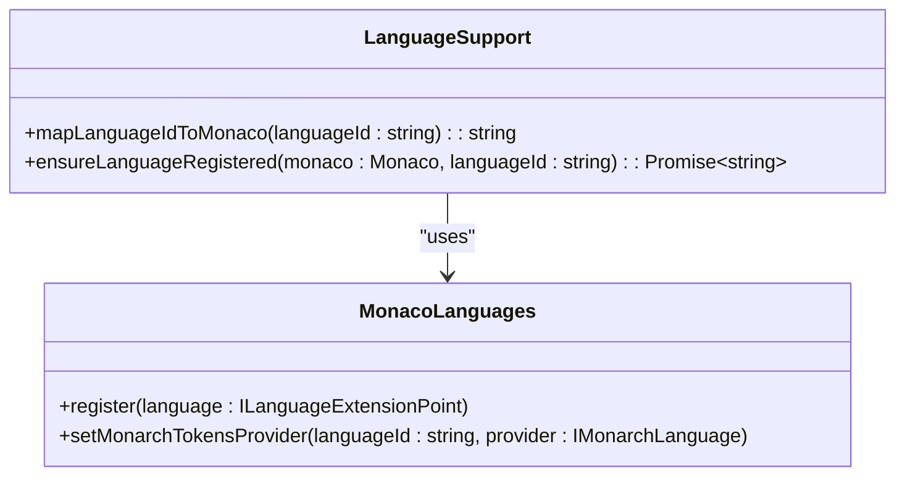
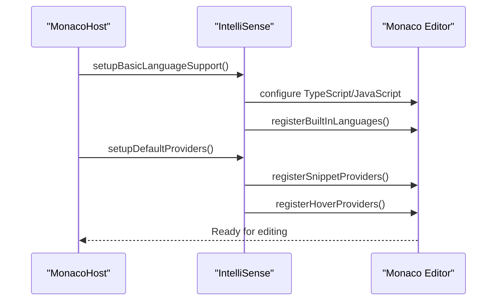
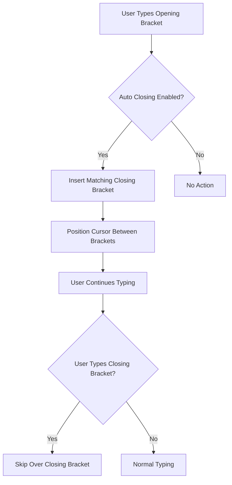
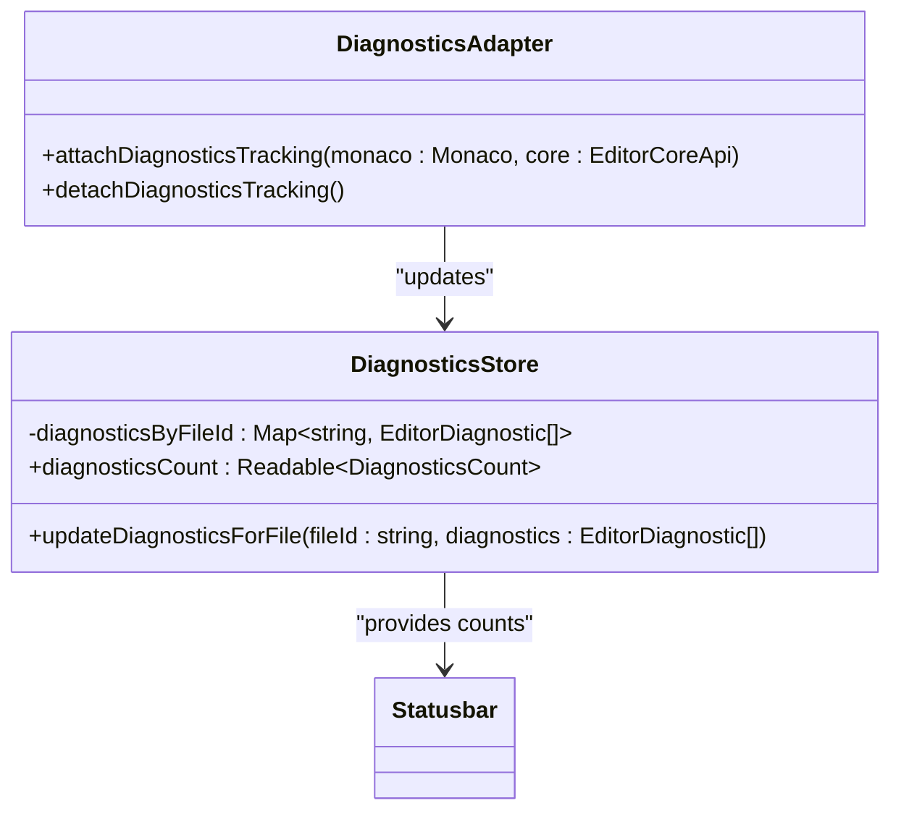
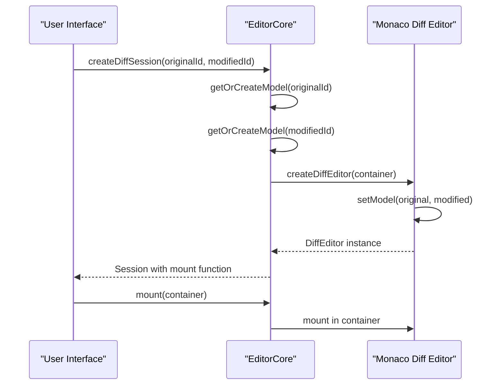
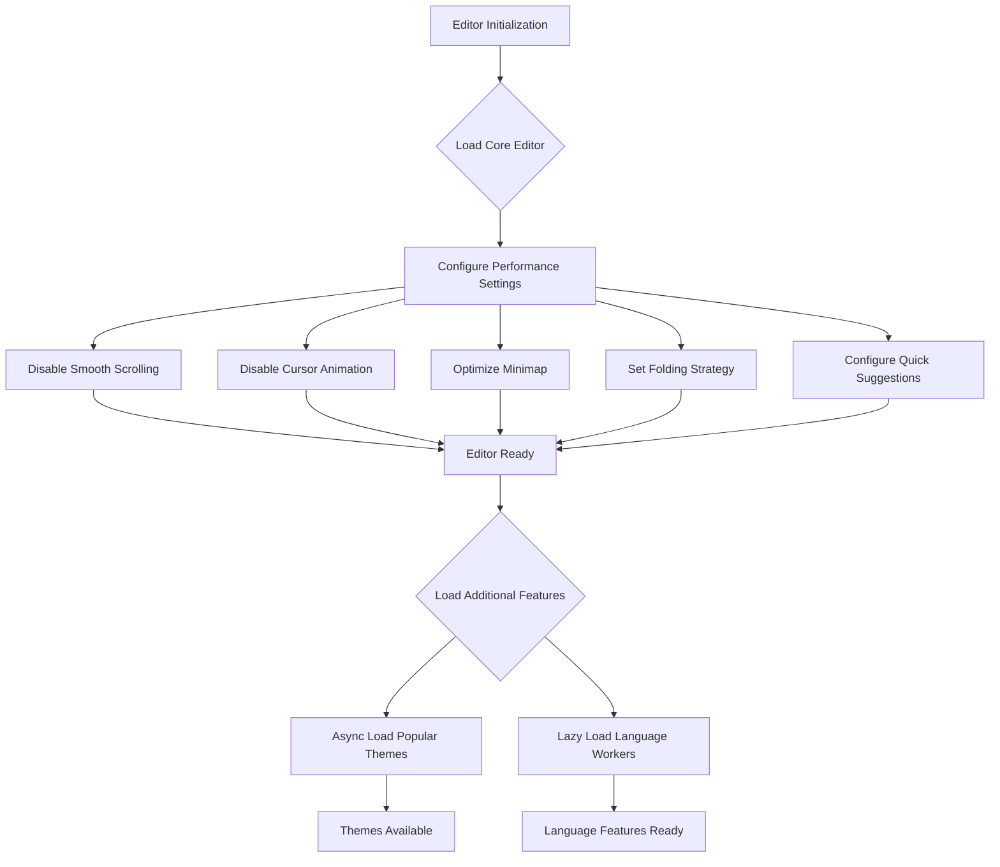

# Editor Features

<cite>
**Referenced Files in This Document**   
- [EditorCore.ts](file://src/lib/editor/EditorCore.ts)
- [intellisense.ts](file://src/lib/editor/intellisense.ts)
- [languageSupport.ts](file://src/lib/editor/languageSupport.ts)
- [diagnosticsAdapter.ts](file://src/lib/editor/diagnosticsAdapter.ts)
- [themeManager.ts](file://src/lib/editor/themeManager.ts)
- [monacoEnvironment.ts](file://src/lib/editor/monacoEnvironment.ts)
- [monacoUnhandledRejection.ts](file://src/lib/editor/monacoUnhandledRejection.ts)
- [MonacoHost.svelte](file://src/lib/editor/MonacoHost.svelte)
- [editorStore.ts](file://src/lib/stores/editorStore.ts)
- [diagnosticsStore.ts](file://src/lib/stores/diagnosticsStore.ts)
</cite>

## Table of Contents

1. [Introduction](#introduction)
2. [Core Editor Architecture](#core-editor-architecture)
3. [Syntax Highlighting and Language Support](#syntax-highlighting-and-language-support)
4. [IntelliSense Implementation](#intellisense-implementation)
5. [Code Folding and Bracket Matching](#code-folding-and-bracket-matching)
6. [Diagnostics System](#diagnostics-system)
7. [Diff Editor Functionality](#diff-editor-functionality)
8. [Editor Customization Options](#editor-customization-options)
9. [Performance Optimizations](#performance-optimizations)
10. [Conclusion](#conclusion)

## Introduction

The NC code editor provides a rich, modern editing experience through its integration with the Monaco Editor, the same editor that powers Visual Studio Code. This document details the implementation of advanced code editing capabilities in the NC editor, focusing on syntax highlighting, IntelliSense, code folding, bracket matching, diagnostics, diff editor functionality, and customization options. The editor architecture is designed to be lightweight, extensible, and performant, leveraging the powerful APIs of Monaco Editor while providing a seamless user experience.

**Section sources**

- [EditorCore.ts](file://src/lib/editor/EditorCore.ts#L1-L891)
- [MonacoHost.svelte](file://src/lib/editor/MonacoHost.svelte#L1-L260)

## Core Editor Architecture

The NC editor's architecture is built around a modular design that separates concerns between the editor core, language services, and UI integration. At the heart of this system is the `EditorCore` class, which serves as a lightweight wrapper around the Monaco Editor API, providing a clean, typed interface for managing editor functionality.

The `EditorCore` encapsulates direct interactions with the Monaco Editor API, exposing a simplified interface for essential operations such as attaching to DOM containers, managing editor models, configuring editor options, and handling content changes. This abstraction allows the editor to maintain a consistent interface while leveraging the full power of Monaco's capabilities.

The editor initialization process begins with the configuration of the Monaco environment through `monacoEnvironment.ts`, which sets up web workers for language services. These workers handle syntax highlighting, validation, and IntelliSense operations in separate threads, preventing UI blocking during intensive operations. The `silenceMonacoCancellationErrors` function in `monacoUnhandledRejection.ts` ensures that cancellation errors during editor disposal are properly handled, maintaining application stability.



**Diagram sources**

- [EditorCore.ts](file://src/lib/editor/EditorCore.ts#L1-L891)
- [MonacoHost.svelte](file://src/lib/editor/MonacoHost.svelte#L1-L260)
- [monacoEnvironment.ts](file://src/lib/editor/monacoEnvironment.ts#L1-L131)

**Section sources**

- [EditorCore.ts](file://src/lib/editor/EditorCore.ts#L1-L891)
- [MonacoHost.svelte](file://src/lib/editor/MonacoHost.svelte#L1-L260)
- [monacoEnvironment.ts](file://src/lib/editor/monacoEnvironment.ts#L1-L131)
- [monacoUnhandledRejection.ts](file://src/lib/editor/monacoUnhandledRejection.ts#L1-L30)

## Syntax Highlighting and Language Support

The NC editor provides comprehensive syntax highlighting and language support through a combination of Monaco's built-in capabilities and custom extensions. The language support system is implemented in `languageSupport.ts`, which maps file extensions and language identifiers to their corresponding Monaco language IDs.

The `mapLanguageIdToMonaco` function handles the translation between internal language identifiers and Monaco's language IDs, supporting common programming languages such as TypeScript, JavaScript, Rust, Python, JSON, Markdown, HTML, CSS, TOML, and YAML. This mapping ensures that files are properly recognized and highlighted according to their language type.

For languages that require additional syntax definitions, the `ensureLanguageRegistered` function dynamically imports and registers language grammars from Monaco's basic-languages package. This includes support for Rust, TOML, and Python, which are loaded on-demand when a file of the corresponding type is opened. The implementation uses Monaco's Monarch tokenization system to provide accurate syntax highlighting for these languages.

The editor also supports built-in languages such as JSON, HTML, CSS, and Markdown through explicit registration in the `registerBuiltInLanguages` function in `intellisense.ts`. This ensures that these languages are available for syntax highlighting and language features without requiring additional configuration.



**Diagram sources**

- [languageSupport.ts](file://src/lib/editor/languageSupport.ts#L1-L70)
- [intellisense.ts](file://src/lib/editor/intellisense.ts#L1-L327)

**Section sources**

- [languageSupport.ts](file://src/lib/editor/languageSupport.ts#L1-L70)
- [intellisense.ts](file://src/lib/editor/intellisense.ts#L1-L327)
- [monaco-languages.d.ts](file://src/types/monaco-languages.d.ts#L1-L12)

## IntelliSense Implementation

The IntelliSense system in the NC editor is implemented in `intellisense.ts`, providing code completion, hover information, and other intelligent editing features. The implementation follows best practices for Monaco Editor integration, with optimizations for performance and responsiveness.

The `setupBasicLanguageSupport` function initializes language services for TypeScript and JavaScript, configuring compiler options, diagnostics, and model synchronization. For TypeScript, it sets modern compiler targets (ES2020), enables strict type checking, and configures module resolution for Node.js. The JavaScript configuration is optimized for performance with semantic validation disabled, as JavaScript files typically don't require full type checking.

The IntelliSense system includes a snippet provider that offers common code patterns for TypeScript and JavaScript, such as console logging, error statements, arrow functions, async functions, try-catch blocks, and import statements. These snippets are triggered by specific characters (dot and dollar sign) and are implemented with proper cancellation token handling to ensure UI responsiveness.

Hover providers are implemented to display documentation for built-in JavaScript objects and functions, including console, JSON, Promise, async, and await. This provides contextual information without requiring external documentation lookups.

The system also supports adding custom type definitions through the `addExtraLibs` function, which allows for the inclusion of global type declarations that can enhance IntelliSense for project-specific APIs.



**Diagram sources**

- [intellisense.ts](file://src/lib/editor/intellisense.ts#L1-L327)

**Section sources**

- [intellisense.ts](file://src/lib/editor/intellisense.ts#L1-L327)

## Code Folding and Bracket Matching

The NC editor implements code folding and bracket matching through Monaco's built-in features, configured and exposed through the `EditorCore` API. These features enhance code navigation and readability by allowing users to collapse and expand code sections and visually identify matching brackets.

Code folding is enabled by default in the editor configuration, with the folding strategy set to "indentation" for better performance compared to language-based folding. This means that code blocks are folded based on their indentation level, which works well for most programming languages. The folding controls are displayed in the editor's gutter, allowing users to click to fold or unfold sections of code.

Bracket pair colorization is another key feature that helps developers identify matching brackets in nested code structures. This is configured through the `bracketPairColorization` option in the editor configuration, with independent color pools for different bracket types to improve visual distinction. The feature supports various bracket types including parentheses, square brackets, and curly braces, coloring them in matching pairs to make it easier to track nested expressions.

The editor also includes automatic bracket closing, which inserts the closing bracket when an opening bracket is typed. This feature is configurable and enabled by default for all bracket types, improving coding efficiency and reducing syntax errors.



**Diagram sources**

- [EditorCore.ts](file://src/lib/editor/EditorCore.ts#L1-L891)

**Section sources**

- [EditorCore.ts](file://src/lib/editor/EditorCore.ts#L1-L891)

## Diagnostics System

The NC editor's diagnostics system provides real-time feedback on code quality and errors through a combination of Monaco's marker system and custom store integration. The implementation is split between `diagnosticsAdapter.ts`, which handles the integration with Monaco's marker system, and `diagnosticsStore.ts`, which manages the state and provides derived data for UI components.

The `attachDiagnosticsTracking` function in `diagnosticsAdapter.ts` subscribes to Monaco's marker change events, translating them into updates for the `diagnosticsStore`. When markers (diagnostic messages) are added, modified, or removed in the editor, this adapter captures the changes and updates the store accordingly. This ensures that the UI components have access to the latest diagnostic information without directly interacting with the Monaco API.

The `diagnosticsStore` maintains a map of diagnostics by file ID, allowing for efficient lookup and aggregation. It provides a derived store called `diagnosticsCount` that computes the number of errors and warnings for the currently active editor. This derived store is used by the status bar to display diagnostic counts, providing users with immediate feedback on code quality.

The system supports different severity levels including error, warning, info, and hint, with appropriate visual indicators in the editor. Diagnostic messages are displayed as squiggly underlines in the code, with tooltips providing detailed information when hovered. The gutter also displays icons indicating the presence of diagnostics on specific lines.



**Diagram sources**

- [diagnosticsAdapter.ts](file://src/lib/editor/diagnosticsAdapter.ts#L1-L61)
- [diagnosticsStore.ts](file://src/lib/stores/diagnosticsStore.ts#L1-L142)

**Section sources**

- [diagnosticsAdapter.ts](file://src/lib/editor/diagnosticsAdapter.ts#L1-L61)
- [diagnosticsStore.ts](file://src/lib/stores/diagnosticsStore.ts#L1-L142)
- [EditorCore.ts](file://src/lib/editor/EditorCore.ts#L1-L891)

## Diff Editor Functionality

The NC editor includes a diff editor for comparing file versions, implemented through Monaco's built-in diff editor component. The functionality is exposed through the `createDiffSession` method in the `EditorCore` API, allowing for side-by-side comparison of two file versions.

The diff editor session is created by specifying the file IDs of the original and modified versions. The editor creates or retrieves the corresponding text models and configures the diff editor with appropriate options such as side-by-side rendering, read-only status for the original file, and whitespace ignoring. The diff editor highlights additions, deletions, and modifications between the two versions, with color-coded indicators and line-by-line comparison.

The implementation preserves the undo/redo history for both files, allowing users to make changes to the modified version while maintaining a clear view of the differences. The diff editor also supports navigation between changes, allowing users to quickly jump to the next or previous difference.

The diff editor is integrated with the editor's theme system, ensuring consistent styling with the main editor. It also respects the editor's configuration options such as font settings, tab behavior, and word wrap, providing a cohesive user experience.



**Diagram sources**

- [EditorCore.ts](file://src/lib/editor/EditorCore.ts#L1-L891)

**Section sources**

- [EditorCore.ts](file://src/lib/editor/EditorCore.ts#L1-L891)

## Editor Customization Options

The NC editor provides extensive customization options through the `EditorCoreOptions` interface and the `themeManager` class. These options allow users to personalize their editing experience according to their preferences and workflow requirements.

The editor supports font customization including font family, size, and ligatures. The default configuration uses JetBrains Mono and Fira Code, popular programming fonts that support ligatures for improved code readability. Users can adjust the font size to suit their display and preferences.

Tab behavior is configurable with options for tab size, space insertion, and bracket closing behavior. The editor supports both tab characters and spaces, with a default configuration of 2-space indentation. Automatic bracket, quote, and overtype closing can be configured to enhance coding efficiency.

The theme system is implemented in `themeManager.ts`, providing support for both built-in Monaco themes and custom themes. The system includes a `ThemeManager` class that handles theme registration, application, and management. It supports popular themes such as Monokai, Dracula, and Nord, which are loaded asynchronously to avoid blocking editor initialization.

Custom themes can be created from JSON definitions and applied dynamically. The system also integrates with the application's color palette system, allowing themes to be generated based on the selected UI palette. This ensures visual consistency between the editor and the rest of the application interface.

```mermaid
classDiagram
class EditorCoreOptions {
+theme? : string
+tabSize? : number
+insertSpaces? : boolean
+wordWrap? : 'off' | 'on' | 'wordWrapColumn' | 'bounded'
+minimap? : { enabled : boolean, ... }
+folding? : boolean
+bracketPairColorization? : { enabled : boolean, ... }
+readOnly? : boolean
+fontSize? : number
+fontFamily? : string
+fontLigatures? : boolean
}
class ThemeManager {
+initialize(monaco : Monaco)
+registerBuiltInTheme(themeId : string)
+registerCustomTheme(themeJson : string)
+applyTheme(themeId : string)
+getAvailableThemes()
+createThemeFromPalette(paletteId : string)
+loadPopularThemes()
}
EditorCore --> EditorCoreOptions : "uses"
EditorCore --> ThemeManager : "uses"
```

**Diagram sources**

- [EditorCore.ts](file://src/lib/editor/EditorCore.ts#L1-L891)
- [themeManager.ts](file://src/lib/editor/themeManager.ts#L1-L274)

**Section sources**

- [EditorCore.ts](file://src/lib/editor/EditorCore.ts#L1-L891)
- [themeManager.ts](file://src/lib/editor/themeManager.ts#L1-L274)

## Performance Optimizations

The NC editor incorporates several performance optimizations to ensure a responsive and smooth editing experience, even with large files and complex codebases. These optimizations are implemented at multiple levels of the editor architecture.

The editor configuration includes several performance-focused settings such as disabled smooth scrolling, turned-off cursor smooth caret animation, and optimized validation decorations that only render for editable regions. Quick suggestions are configured with a minimal 10ms delay to provide immediate feedback while minimizing performance impact.

The folding strategy is set to "indentation" rather than "language-based" for better performance, as it doesn't require language-specific parsing to determine foldable regions. The minimap is optimized with character rendering disabled and a maximum column width of 80 to reduce rendering overhead.

The theme loading system uses asynchronous loading for popular themes, preventing them from blocking editor initialization. The `loadPopularThemes` function in `themeManager.ts` loads themes in the background using dynamic imports, ensuring that the editor is available for use as quickly as possible.

The IntelliSense system is optimized with eager model synchronization enabled, which keeps the TypeScript language service worker synchronized with editor models for faster IntelliSense responses. The JavaScript language service has semantic validation disabled to improve performance, as full type checking is typically not required for JavaScript files.



**Diagram sources**

- [EditorCore.ts](file://src/lib/editor/EditorCore.ts#L1-L891)
- [themeManager.ts](file://src/lib/editor/themeManager.ts#L1-L274)
- [monacoEnvironment.ts](file://src/lib/editor/monacoEnvironment.ts#L1-L131)

**Section sources**

- [EditorCore.ts](file://src/lib/editor/EditorCore.ts#L1-L891)
- [themeManager.ts](file://src/lib/editor/themeManager.ts#L1-L274)
- [monacoEnvironment.ts](file://src/lib/editor/monacoEnvironment.ts#L1-L131)

## Conclusion

The NC code editor provides a comprehensive set of advanced editing features through its integration with the Monaco Editor. The architecture is designed to be modular, extensible, and performant, with clear separation between the editor core, language services, and UI integration.

Key features such as syntax highlighting, IntelliSense, code folding, bracket matching, and diagnostics are implemented using best practices for Monaco Editor integration, with optimizations for performance and user experience. The editor supports a wide range of programming languages and provides extensive customization options for font settings, tab behavior, and themes.

The diff editor functionality enables effective comparison of file versions, while the diagnostics system provides real-time feedback on code quality. The implementation leverages Monaco's powerful APIs while providing a clean, typed interface through the `EditorCore` abstraction.

Overall, the NC editor delivers a professional-grade editing experience that enhances developer productivity through intelligent code assistance, efficient navigation, and customizable interface options.
