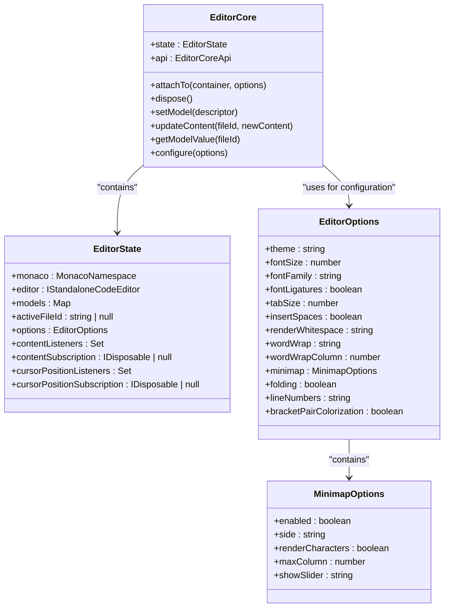
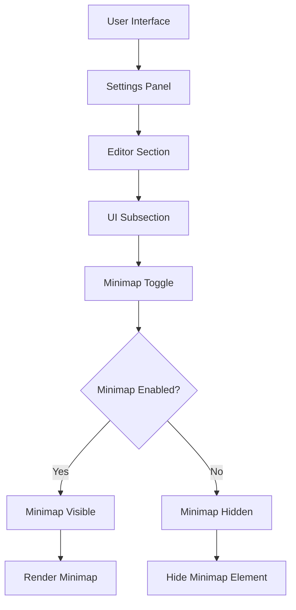
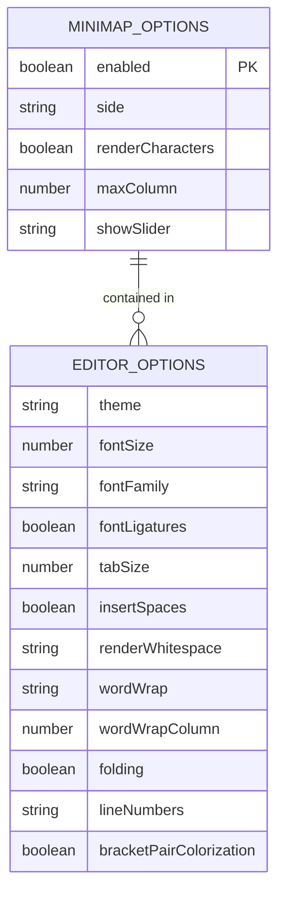
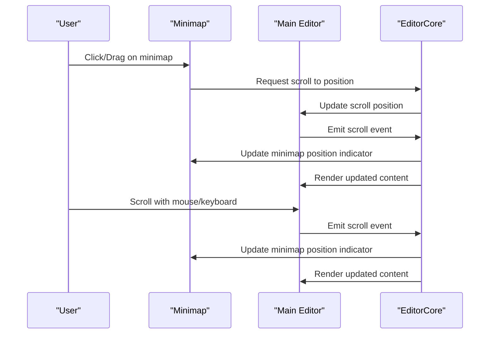
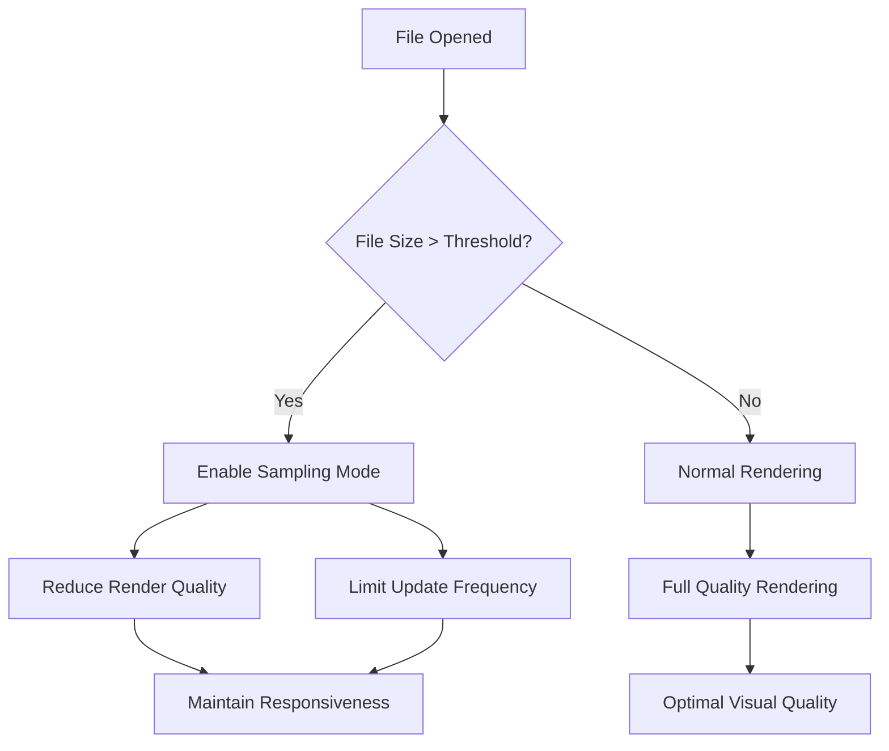
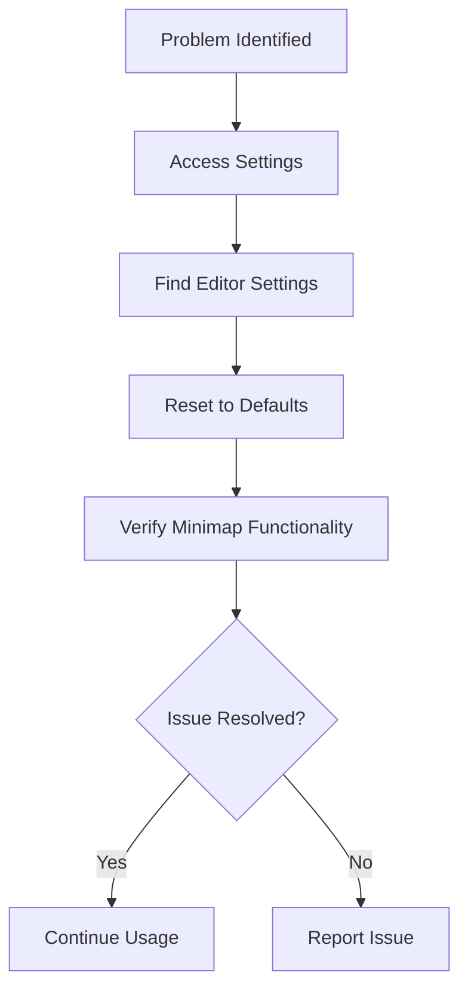

# Minimap

<cite>
**Referenced Files in This Document**   
- [EditorCore.ts](file://src/lib/editor/EditorCore.ts)
- [editorSettingsStore.ts](file://src/lib/stores/editorSettingsStore.ts)
- [registry.ts](file://src/lib/settings/registry.ts)
- [types.ts](file://src/lib/settings/types.ts)
</cite>

## Table of Contents
1. [Introduction](#introduction)
2. [Minimap Implementation](#minimap-implementation)
3. [Configuration Options](#configuration-options)
4. [Integration with Main Editor](#integration-with-main-editor)
5. [Performance Considerations](#performance-considerations)
6. [Troubleshooting Guide](#troubleshooting-guide)
7. [Conclusion](#conclusion)

## Introduction
The minimap feature in the NC code editor provides a bird's-eye view of the entire document, enabling users to navigate large files efficiently and maintain context while editing. Built on the Monaco Editor framework, the minimap renders a condensed representation of the code that synchronizes with the main editor viewport. This documentation details the implementation, configuration, integration, and optimization of the minimap feature for both end-users and developers.

## Minimap Implementation

The minimap is implemented as part of the editor's core configuration within the `EditorCore.ts` file. It leverages Monaco Editor's built-in minimap functionality with performance-oriented defaults. The implementation focuses on balancing visual utility with optimal performance, especially for large files.

Key implementation aspects include:
- Default enabling of the minimap (`enabled: true`)
- Strategic placement on the right side of the editor
- Performance optimization through character rendering disablement
- Width limitation to prevent excessive horizontal space usage
- Conditional slider visibility to reduce visual clutter

**Diagram sources**
- [EditorCore.ts](file://src/lib/editor/EditorCore.ts#L371-L378)
- [EditorCore.ts](file://src/lib/editor/EditorCore.ts#L476-L481)

**Section sources**
- [EditorCore.ts](file://src/lib/editor/EditorCore.ts#L371-L486)

## Configuration Options

The minimap feature offers several configuration options that allow users to customize its visibility, size, and rendering quality according to their preferences and performance requirements.

### Visibility Control
The minimap can be toggled on or off through the editor settings. By default, it is enabled to provide immediate context for users.

**Diagram sources**
- [registry.ts](file://src/lib/settings/registry.ts#L330-L342)
- [editorSettingsStore.ts](file://src/lib/stores/editorSettingsStore.ts#L23)

### Size and Rendering Configuration
The minimap's appearance and performance characteristics can be adjusted through several parameters:

| Configuration Option | Default Value | Description |
|----------------------|-------------|-------------|
| `enabled` | `true` | Controls whether the minimap is displayed |
| `side` | `'right'` | Determines the minimap's position relative to the editor |
| `renderCharacters` | `false` | Enables/disables character rendering for performance |
| `maxColumn` | `80` | Limits the width of the minimap to improve performance |
| `showSlider` | `'mouseover'` | Controls slider visibility (always visible or on mouse hover) |

These options are configured in the editor's initialization process and can be modified through the settings system.

**Diagram sources**
- [EditorCore.ts](file://src/lib/editor/EditorCore.ts#L371-L378)
- [EditorCore.ts](file://src/lib/editor/EditorCore.ts#L476-L481)

**Section sources**
- [EditorCore.ts](file://src/lib/editor/EditorCore.ts#L371-L378)
- [registry.ts](file://src/lib/settings/registry.ts#L330-L342)

## Integration with Main Editor

The minimap integrates seamlessly with the main editor viewport, providing synchronized navigation and context preservation. This integration is achieved through event subscriptions and coordinated state management.

### Synchronization Mechanism
The minimap and main editor viewport are synchronized through the editor's scroll and cursor position events. When the user scrolls in either the main editor or interacts with the minimap, both views update to reflect the current position.

**Diagram sources**
- [EditorCore.ts](file://src/lib/editor/EditorCore.ts#L574-L583)
- [EditorCore.ts](file://src/lib/editor/EditorCore.ts#L586-L599)

### Cursor Position Tracking
The minimap also reflects the current cursor position, helping users maintain spatial awareness within the document. This is achieved through subscription to cursor position changes:

**Section sources**
- [EditorCore.ts](file://src/lib/editor/EditorCore.ts#L586-L599)
- [editorCursorStore.ts](file://src/lib/stores/editorCursorStore.ts#L64-L70)

## Performance Considerations

The minimap implementation includes several performance optimizations to ensure smooth operation, especially with large files.

### Performance Optimizations
The following optimizations are implemented to minimize performance impact:

1. **Character rendering disabled**: By default, `renderCharacters` is set to `false` to reduce rendering overhead
2. **Column width limitation**: The `maxColumn` parameter limits the minimap width to 80 columns, preventing excessive rendering for wide files
3. **Conditional slider display**: The slider only appears on mouse hover (`showSlider: 'mouseover'`), reducing visual clutter and improving performance
4. **Efficient event handling**: The editor uses optimized event subscription patterns to minimize processing overhead

### Handling Large Files
For very large files, the minimap employs sampling techniques to maintain responsiveness. The Monaco Editor framework automatically adjusts the rendering strategy based on file size and system capabilities.

**Section sources**
- [EditorCore.ts](file://src/lib/editor/EditorCore.ts#L373-L378)
- [EditorCore.ts](file://src/lib/editor/EditorCore.ts#L476-L481)

## Troubleshooting Guide

This section addresses common issues users may encounter with the minimap feature and provides solutions.

### Common Issues and Solutions

| Issue | Possible Cause | Solution |
|------|---------------|---------|
| Minimap not visible | Feature disabled in settings | Enable minimap in Editor Settings → UI |
| Poor performance with large files | High rendering quality settings | Disable character rendering and ensure maxColumn is limited |
| Display artifacts or glitches | Graphics rendering issues | Try disabling hardware acceleration or updating graphics drivers |
| Minimap not synchronizing with editor | Event subscription failure | Restart the editor or check for JavaScript errors |
| Excessive memory usage | Large file with detailed minimap | Reduce minimap quality settings or disable for very large files |

### Configuration Reset
If the minimap behavior becomes problematic, users can reset to default settings:

**Section sources**
- [editorSettingsStore.ts](file://src/lib/stores/editorSettingsStore.ts#L147-L149)
- [registry.ts](file://src/lib/settings/registry.ts#L330-L342)

## Conclusion
The minimap feature in the NC code editor provides an essential navigation aid that enhances the editing experience, particularly for large files. Implemented with performance as a primary consideration, the minimap offers configurable options for visibility, size, and rendering quality. Its tight integration with the main editor viewport ensures synchronized navigation and context preservation. By understanding the configuration options and performance characteristics, users can optimize the minimap to suit their workflow, while developers can extend and customize the feature as needed.