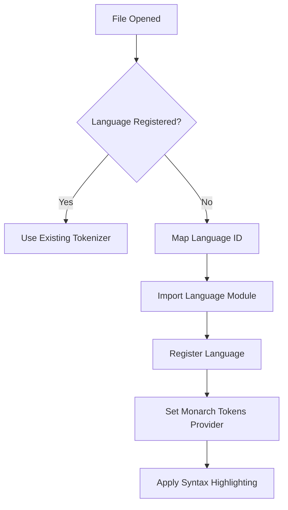
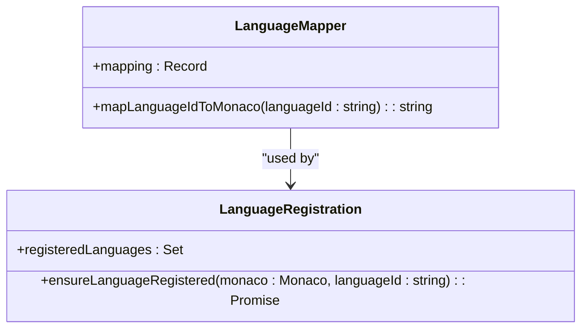
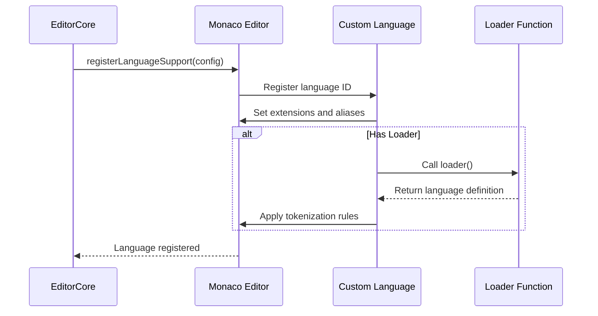
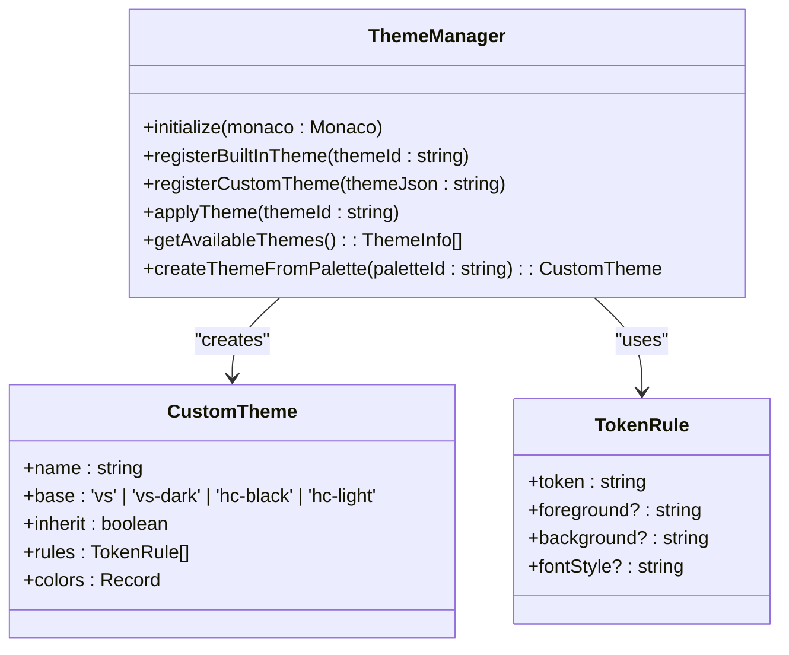
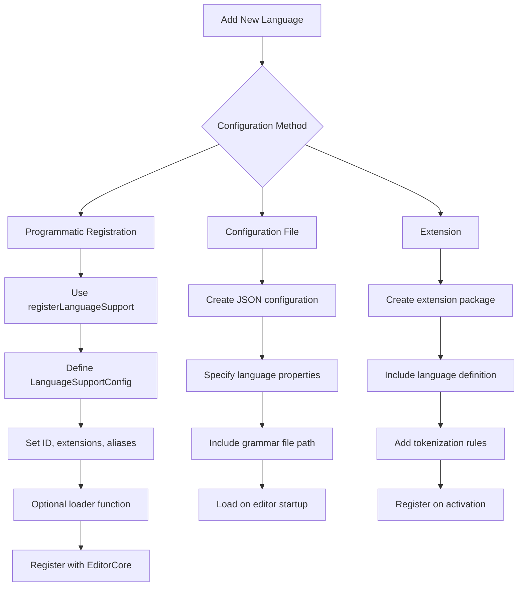
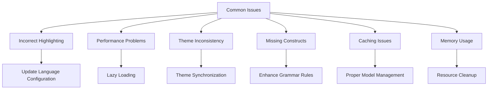

# Syntax Highlighting

<cite>
**Referenced Files in This Document**   
- [languageSupport.ts](file://src/lib/editor/languageSupport.ts)
- [themeManager.ts](file://src/lib/editor/themeManager.ts)
- [EditorCore.ts](file://src/lib/editor/EditorCore.ts)
- [monacoEnvironment.ts](file://src/lib/editor/monacoEnvironment.ts)
- [editorSettingsStore.ts](file://src/lib/stores/editorSettingsStore.ts)
- [THEME_PALETTES.ts](file://src/lib/stores/THEME_PALETTES.ts)
- [themeStore.ts](file://src/lib/stores/themeStore.ts)
- [intellisense.ts](file://src/lib/editor/intellisense.ts)
- [editorStore.ts](file://src/lib/stores/editorStore.ts)
</cite>

## Table of Contents

1. [Introduction](#introduction)
2. [Monaco Editor Tokenization System](#monaco-editor-tokenization-system)
3. [Language Configuration Process](#language-configuration-process)
4. [Custom Language Definitions](#custom-language-definitions)
5. [Theme Integration and Token Colors](#theme-integration-and-token-colors)
6. [Adding New Languages](#adding-new-languages)
7. [Common Issues and Solutions](#common-issues-and-solutions)
8. [Conclusion](#conclusion)

## Introduction

The NC code editor implements sophisticated syntax highlighting through the Monaco Editor's tokenization system, providing accurate and performant code visualization for multiple programming languages. This documentation details the architecture and implementation of syntax highlighting in the NC editor, covering language registration, theme integration, custom language support, and configuration mechanisms. The system is designed to enhance code readability, reduce errors, and provide a consistent development experience across different programming languages and user preferences.

**Section sources**

- [languageSupport.ts](file://src/lib/editor/languageSupport.ts#L1-L70)
- [themeManager.ts](file://src/lib/editor/themeManager.ts#L1-L274)

## Monaco Editor Tokenization System

The NC code editor leverages Monaco Editor's advanced tokenization system to provide accurate syntax highlighting. The tokenization process is implemented through a combination of built-in language support and dynamic language registration. The system uses Monarch tokenization, a rule-based approach that processes text through regular expressions and state transitions to identify language constructs.

The tokenization workflow begins when a file is opened in the editor. The `ensureLanguageRegistered` function in `languageSupport.ts` handles the registration process, mapping internal language identifiers to Monaco's language IDs and loading the appropriate tokenization rules. For supported languages, this involves importing the corresponding language module from Monaco's basic-languages package and setting up the Monarch tokens provider.

**Diagram sources**

- [languageSupport.ts](file://src/lib/editor/languageSupport.ts#L33-L69)

The tokenization system supports both built-in languages (such as TypeScript, JavaScript, JSON, HTML, CSS, and Markdown) and additional languages loaded on demand. Built-in languages are automatically registered by Monaco, while languages like Rust, TOML, and Python are registered dynamically when first encountered. This approach optimizes startup performance by loading language support only when needed.

**Section sources**

- [languageSupport.ts](file://src/lib/editor/languageSupport.ts#L1-L70)
- [EditorCore.ts](file://src/lib/editor/EditorCore.ts#L1-L800)

## Language Configuration Process

The language configuration process in the NC editor involves mapping language identifiers, file extensions, and MIME types to ensure accurate syntax highlighting. The system uses a comprehensive mapping mechanism to translate internal language IDs to Monaco's standardized language identifiers.

The `mapLanguageIdToMonaco` function implements a dictionary-based mapping system that converts abbreviated language identifiers (like "ts" for TypeScript, "py" for Python) to their full Monaco equivalents. This mapping ensures consistency across the editor and supports both common abbreviations and full language names. The function normalizes input by converting to lowercase before performing the lookup, making the mapping case-insensitive.

**Diagram sources**

- [languageSupport.ts](file://src/lib/editor/languageSupport.ts#L9-L27)

Language registration is handled by the `ensureLanguageRegistered` function, which implements a switch-case pattern to load the appropriate language module based on the mapped language ID. The function uses dynamic imports to load language-specific modules from Monaco's ESM distribution, ensuring that only the required language support is loaded. This lazy loading approach significantly reduces the initial bundle size and improves editor startup time.

The system maintains a `registeredLanguages` set to track already registered languages, preventing redundant registration and improving performance when switching between files of the same language type. For built-in languages, the function simply returns the mapped language ID without additional registration, as these are automatically handled by Monaco.

**Section sources**

- [languageSupport.ts](file://src/lib/editor/languageSupport.ts#L1-L70)
- [editorStore.ts](file://src/lib/stores/editorStore.ts#L70-L79)

## Custom Language Definitions

The NC editor supports custom language definitions through Monaco's language registration API. Custom languages can be defined by implementing the `LanguageSupportConfig` interface, which specifies the language identifier, file extensions, aliases, and an optional loader function for dynamic grammar loading.

The `registerLanguageSupport` method in the `EditorCore` class provides a simplified interface for registering custom languages. It delegates to Monaco's `languages.register` function, passing the language configuration including ID, extensions, and aliases. This allows the editor to associate specific file extensions with language definitions and provide appropriate syntax highlighting.

For languages requiring more complex grammars, the loader property enables dynamic loading of language-specific tokenization rules. This is particularly useful for domain-specific languages or less common programming languages that may not be included in Monaco's basic-languages package. The loader function returns a promise that resolves to the language definition, allowing for asynchronous loading of grammar files.

The editor also supports custom completion providers and hover providers through the `registerCompletionProvider` and `registerHoverProvider` methods. These allow for enhanced IntelliSense capabilities, including custom snippets, documentation, and type information for custom languages.

**Diagram sources**

- [EditorCore.ts](file://src/lib/editor/EditorCore.ts#L652-L666)
- [intellisense.ts](file://src/lib/editor/intellisense.ts#L173-L204)

**Section sources**

- [EditorCore.ts](file://src/lib/editor/EditorCore.ts#L115-L142)
- [intellisense.ts](file://src/lib/editor/intellisense.ts#L1-L327)

## Theme Integration and Token Colors

The NC editor implements a sophisticated theme integration system that ensures consistent color schemes across the editor interface and syntax highlighting. The theme system is built around the `ThemeManager` class, which manages both built-in and custom themes, handling the integration between the editor's visual appearance and syntax highlighting colors.

The theme system uses a multi-layered approach to color management. At the foundation are the `THEME_PALETTES`, which define the base color schemes for light and dark modes. These palettes contain carefully selected colors that ensure readability and visual consistency across the entire application. The `ThemeManager` creates custom Monaco themes based on these palettes, mapping application colors to editor token colors.

**Diagram sources**

- [themeManager.ts](file://src/lib/editor/themeManager.ts#L8-L19)
- [THEME_PALETTES.ts](file://src/lib/stores/THEME_PALETTES.ts#L21-L35)

The `createThemeFromPalette` method generates Monaco themes from the application's color palettes, defining token rules for common language constructs such as comments, keywords, strings, and numbers. These rules use the palette's text color and apply specific hues to differentiate language elements while maintaining visual harmony with the overall theme.

The system supports both built-in Monaco themes and popular third-party themes like Monokai, Dracula, and Nord. The `loadPopularThemes` method asynchronously loads these themes from the `monaco-themes` package, registering them with Monaco without blocking editor initialization. This allows users to access a wide range of established color schemes while maintaining fast startup performance.

Theme synchronization between the editor and the application UI is handled through the `getMonacoThemeId` function, which determines the appropriate theme based on the current UI theme state and editor settings. When the editor theme is set to 'auto', it follows the application's palette, ensuring visual consistency across the entire interface.

**Section sources**

- [themeManager.ts](file://src/lib/editor/themeManager.ts#L1-L274)
- [THEME_PALETTES.ts](file://src/lib/stores/THEME_PALETTES.ts#L1-L314)
- [themeStore.ts](file://src/lib/stores/themeStore.ts#L1-L120)

## Adding New Languages

Adding new languages to the NC editor involves configuring language support through the editor's API and ensuring proper integration with the syntax highlighting system. The process can be accomplished through configuration files, extensions, or programmatic registration.

The primary mechanism for adding new languages is through the `registerLanguageSupport` method in the `EditorCore` class. This method accepts a `LanguageSupportConfig` object that specifies the language identifier, file extensions, aliases, and an optional loader function. For example, to add support for a new language like "mylang", a configuration would specify the ID "mylang", extensions like [".my", ".mylang"], and aliases such as "My Language".

For languages with existing Monarch grammars, the loader function can import the grammar definition and register it with Monaco's tokenization system. The loader returns a promise that resolves to the language definition, allowing for asynchronous loading of grammar files. This approach enables the editor to support a wide range of languages without increasing the initial bundle size.

Configuration files can be used to define language support that is automatically loaded when the editor starts. The system could read language definitions from JSON configuration files, allowing users to add custom language support without modifying the editor's source code. These configuration files would specify the language properties and the location of grammar files.

Extensions provide another mechanism for adding language support. An extension could register new languages, provide custom tokenization rules, and add language-specific features like snippets and hover documentation. The extension system would allow the community to contribute language support for specialized or emerging programming languages.

The editor's architecture supports dynamic language loading, meaning that language support can be added at runtime without requiring a restart. This enables features like language packs that can be installed and activated while the editor is running.

**Diagram sources**

- [EditorCore.ts](file://src/lib/editor/EditorCore.ts#L652-L666)
- [languageSupport.ts](file://src/lib/editor/languageSupport.ts#L33-L69)

**Section sources**

- [EditorCore.ts](file://src/lib/editor/EditorCore.ts#L115-L142)
- [languageSupport.ts](file://src/lib/editor/languageSupport.ts#L1-L70)

## Common Issues and Solutions

Several common issues can arise with syntax highlighting in the NC editor, along with their corresponding solutions. Understanding these issues helps ensure optimal performance and user experience.

One common issue is incorrect syntax highlighting for files with non-standard extensions. This occurs when the language detection system fails to map a file extension to the correct language ID. The solution is to ensure proper language configuration in the `LanguageSupportConfig`, including all relevant file extensions and aliases. The `detectLanguage` function in `editorStore.ts` can be updated to recognize additional file patterns.

Performance issues may occur when loading multiple language grammars simultaneously. The editor addresses this through lazy loading, where language support is only loaded when a file of that type is first opened. This prevents unnecessary loading of unused language grammars and maintains fast startup times. The `ensureLanguageRegistered` function implements this lazy loading pattern using dynamic imports.

Theme inconsistency between the editor and the application UI can occur when custom themes are not properly synchronized. The solution is to use the `createThemeFromPalette` method to generate editor themes that match the application's color palette. This ensures visual consistency across the entire interface.

Missing syntax highlighting for certain language constructs typically indicates incomplete grammar definitions. For custom languages, this can be resolved by enhancing the Monarch grammar rules to cover additional language features. The tokenization rules should be thoroughly tested with various code samples to ensure comprehensive coverage.

Caching issues may cause syntax highlighting to not update correctly when switching between files. The editor mitigates this by maintaining a `registeredLanguages` set to track loaded languages and properly managing the editor model lifecycle. When switching files, the editor ensures the correct language mode is applied to the model.

For languages with complex grammars, memory usage can become a concern. The editor optimizes memory usage by sharing language grammars between editor instances and properly disposing of unused models. The `dispose` method in `EditorCore` ensures that all resources are cleaned up when the editor is destroyed.

**Diagram sources**

- [languageSupport.ts](file://src/lib/editor/languageSupport.ts#L3-L69)
- [themeManager.ts](file://src/lib/editor/themeManager.ts#L1-L274)
- [EditorCore.ts](file://src/lib/editor/EditorCore.ts#L517-L541)

**Section sources**

- [languageSupport.ts](file://src/lib/editor/languageSupport.ts#L1-L70)
- [themeManager.ts](file://src/lib/editor/themeManager.ts#L1-L274)
- [EditorCore.ts](file://src/lib/editor/EditorCore.ts#L1-L800)

## Conclusion

The NC code editor's syntax highlighting system provides a robust and flexible foundation for accurate code visualization across multiple programming languages. By leveraging Monaco Editor's tokenization system, the editor delivers high-performance syntax highlighting with support for both built-in and custom languages.

The architecture emphasizes performance through lazy loading of language support, ensuring fast startup times while maintaining comprehensive language coverage. The theme integration system provides consistent visual styling across the editor interface, with support for both built-in themes and custom color schemes.

The language configuration process is designed to be extensible, allowing for easy addition of new languages through programmatic registration, configuration files, or extensions. This flexibility enables the editor to support a wide range of programming languages and adapt to evolving development needs.

The implementation demonstrates careful attention to user experience, with features that enhance code readability and reduce errors. The integration between language support and theme system ensures a cohesive and visually appealing editing environment that can be customized to individual preferences.

Overall, the syntax highlighting implementation in the NC editor represents a sophisticated balance of performance, flexibility, and user experience, providing developers with a powerful tool for code visualization and editing.

**Section sources**

- [languageSupport.ts](file://src/lib/editor/languageSupport.ts#L1-L70)
- [themeManager.ts](file://src/lib/editor/themeManager.ts#L1-L274)
- [EditorCore.ts](file://src/lib/editor/EditorCore.ts#L1-L800)
