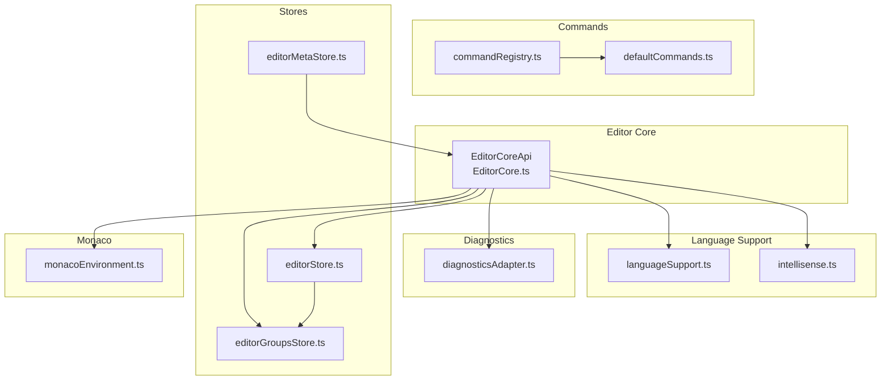
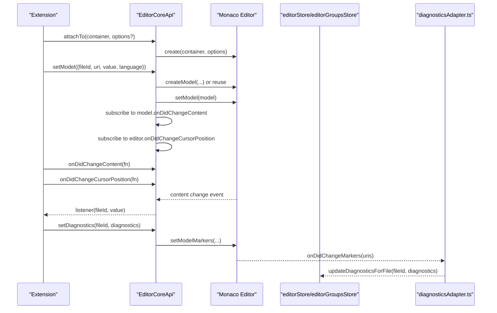
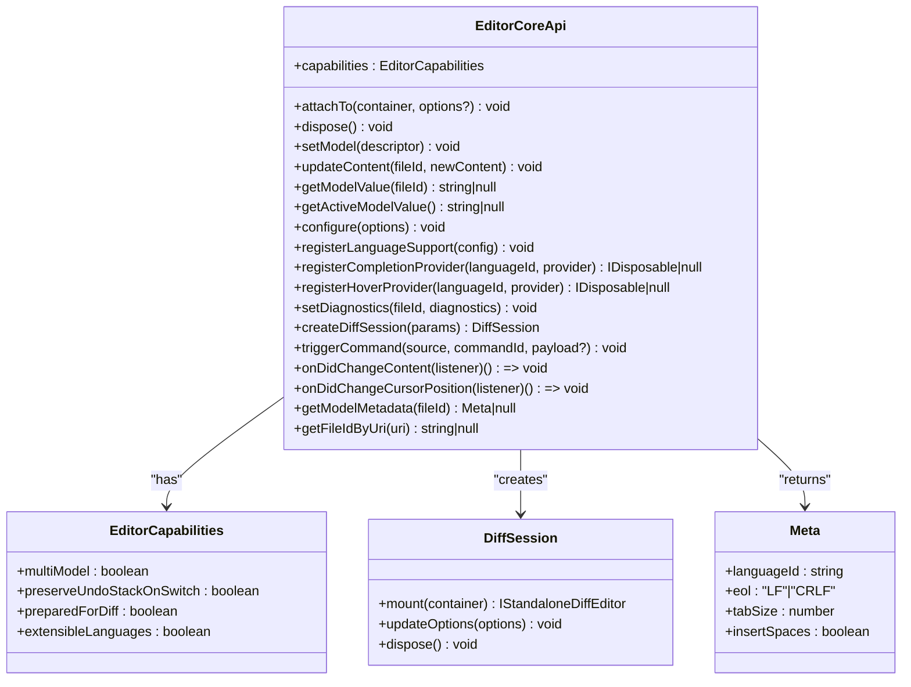
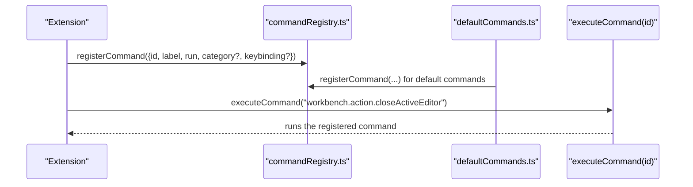
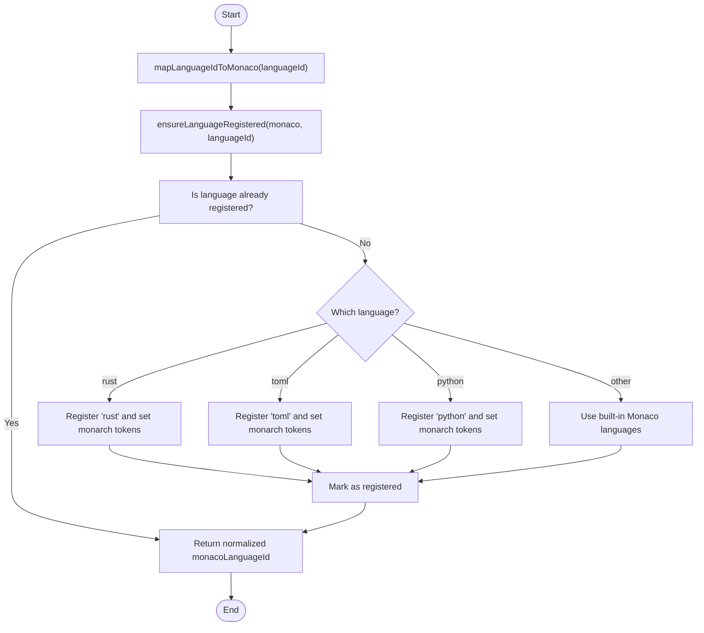
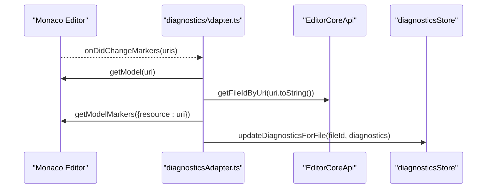
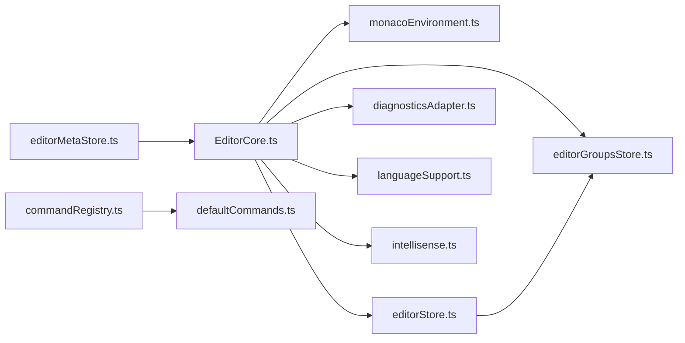

# API Reference

<cite>
**Referenced Files in This Document**
- [EditorCore.ts](file://src/lib/editor/EditorCore.ts)
- [commandRegistry.ts](file://src/lib/commands/commandRegistry.ts)
- [defaultCommands.ts](file://src/lib/commands/defaultCommands.ts)
- [languageSupport.ts](file://src/lib/editor/languageSupport.ts)
- [intellisense.ts](file://src/lib/editor/intellisense.ts)
- [diagnosticsAdapter.ts](file://src/lib/editor/diagnosticsAdapter.ts)
- [editorStore.ts](file://src/lib/stores/editorStore.ts)
- [editorGroupsStore.ts](file://src/lib/stores/layout/editorGroupsStore.ts)
- [monacoEnvironment.ts](file://src/lib/editor/monacoEnvironment.ts)
- [editorMetaStore.ts](file://src/lib/stores/editorMetaStore.ts)
</cite>

## Table of Contents
1. [Introduction](#introduction)
2. [Project Structure](#project-structure)
3. [Core Components](#core-components)
4. [Architecture Overview](#architecture-overview)
5. [Detailed Component Analysis](#detailed-component-analysis)
6. [Dependency Analysis](#dependency-analysis)
7. [Performance Considerations](#performance-considerations)
8. [Troubleshooting Guide](#troubleshooting-guide)
9. [Conclusion](#conclusion)
10. [Appendices](#appendices)

## Introduction
This document provides a comprehensive API reference for the extensibility APIs in the NC code editor. It focuses on:
- The EditorCore interface that allows extensions to interact with the Monaco editor instance, manage editor groups, and handle editor events.
- The commandRegistry API for registering, retrieving, and executing commands programmatically.
- The language support API for registering new languages, tokenizers, and language features.
- Event emitters and listeners that extensions can use to respond to application state changes.
- Versioning considerations, deprecation policies, and backwards compatibility.
- Client implementation guidelines and performance optimization tips for extension developers.

## Project Structure
The extensibility APIs are implemented across several modules:
- EditorCore: a thin, typed wrapper around Monaco Editor APIs for models, configuration, providers, diagnostics, and diff sessions.
- Command Registry: a centralized registry for commands with registration, retrieval, and execution.
- Language Support: mapping and registration helpers for Monaco languages and tokenizers.
- IntelliSense: optimized setup for TypeScript/JavaScript language services and default providers.
- Diagnostics Adapter: bridge between Monaco markers and the application diagnostics store.
- Stores: editorStore and editorGroupsStore manage tabs and groups independently, enabling flexible layouts.
- Monaco Environment: worker configuration for Monaco in Vite/Svelte/Tauri environments.
- Editor Meta Store: a safe way to share an EditorCore instance across components without direct imports.

**Diagram sources**
- [EditorCore.ts](file://src/lib/editor/EditorCore.ts#L163-L314)
- [commandRegistry.ts](file://src/lib/commands/commandRegistry.ts#L18-L64)
- [defaultCommands.ts](file://src/lib/commands/defaultCommands.ts#L35-L268)
- [languageSupport.ts](file://src/lib/editor/languageSupport.ts#L1-L70)
- [intellisense.ts](file://src/lib/editor/intellisense.ts#L43-L168)
- [diagnosticsAdapter.ts](file://src/lib/editor/diagnosticsAdapter.ts#L1-L61)
- [editorStore.ts](file://src/lib/stores/editorStore.ts#L1-L381)
- [editorGroupsStore.ts](file://src/lib/stores/layout/editorGroupsStore.ts#L1-L413)
- [monacoEnvironment.ts](file://src/lib/editor/monacoEnvironment.ts#L1-L131)
- [editorMetaStore.ts](file://src/lib/stores/editorMetaStore.ts#L19-L40)

**Section sources**
- [EditorCore.ts](file://src/lib/editor/EditorCore.ts#L1-L314)
- [commandRegistry.ts](file://src/lib/commands/commandRegistry.ts#L18-L64)
- [defaultCommands.ts](file://src/lib/commands/defaultCommands.ts#L35-L268)
- [languageSupport.ts](file://src/lib/editor/languageSupport.ts#L1-L70)
- [intellisense.ts](file://src/lib/editor/intellisense.ts#L43-L168)
- [diagnosticsAdapter.ts](file://src/lib/editor/diagnosticsAdapter.ts#L1-L61)
- [editorStore.ts](file://src/lib/stores/editorStore.ts#L1-L381)
- [editorGroupsStore.ts](file://src/lib/stores/layout/editorGroupsStore.ts#L1-L413)
- [monacoEnvironment.ts](file://src/lib/editor/monacoEnvironment.ts#L1-L131)
- [editorMetaStore.ts](file://src/lib/stores/editorMetaStore.ts#L19-L40)

## Core Components
This section documents the primary extensibility APIs and their capabilities.

### EditorCore API
EditorCore provides a minimal, typed interface to Monaco Editor, encapsulating models, configuration, providers, diagnostics, diff sessions, and event subscriptions. It exposes capabilities, attaches to containers, manages models, applies configuration, registers language support and providers, sets diagnostics, creates diff sessions, triggers commands, and subscribes to content and cursor position changes.

Key capabilities:
- multiModel: supports multiple models per editor instance.
- preserveUndoStackOnSwitch: preserves undo/redo history when switching models.
- preparedForDiff: enables diff editor integration.
- extensibleLanguages: supports registering custom languages and providers.

Public API surface:
- attachTo(container, options?): attach to a DOM container and create an editor instance; re-attach replaces the editor.
- dispose(): dispose the editor and all models; does not touch external state.
- setModel(descriptor): create or reuse a model by fileId and set it active without losing undo/redo.
- updateContent(fileId, newContent): update model content without switching active model.
- getModelValue(fileId): get current model value by fileId or null.
- getActiveModelValue(): get current active model value or null.
- configure(options): apply editor configuration (theme, tab size, wrapping, minimap, folding, etc.).
- registerLanguageSupport(config): register a language with Monaco.
- registerCompletionProvider(languageId, provider): register a completion provider; returns IDisposable or null.
- registerHoverProvider(languageId, provider): register a hover provider; returns IDisposable or null.
- setDiagnostics(fileId, diagnostics): set markers for a model by fileId.
- createDiffSession(params): create a diff session; returns mount/update/dispose.
- triggerCommand(source, commandId, payload?): trigger Monaco commands via editor.trigger.
- onDidChangeContent(listener): subscribe to active model content changes; returns unsubscribe function.
- onDidChangeCursorPosition(listener): subscribe to cursor position changes; returns unsubscribe function.
- getModelMetadata(fileId): get languageId, EOL, tabSize, insertSpaces for a model or null.
- getFileIdByUri(uri): resolve a model’s fileId by URI.

Exceptions and error handling:
- createDiffSession throws if Monaco is not initialized.
- Methods guard against uninitialized Monaco or missing editor; they return early without errors.

Usage examples from the codebase:
- Creating and attaching an editor instance during host initialization.
- Switching active models while preserving undo/redo stacks.
- Applying editor configuration and registering language support.
- Subscribing to content and cursor position changes for status bar and diagnostics.

**Section sources**
- [EditorCore.ts](file://src/lib/editor/EditorCore.ts#L163-L314)
- [EditorCore.ts](file://src/lib/editor/EditorCore.ts#L357-L891)

### Command Registry API
The command registry centralizes command definitions and execution:
- CommandId: string identifier.
- CommandDefinition: id, label, run(), optional category, optional keybinding.
- registerCommand(cmd): register or override a command (last-write-wins).
- getAllCommands(): retrieve all registered commands.
- executeCommand(id): execute a command asynchronously; no-op if not found.

Integration:
- defaultCommands.ts registers a set of workbench commands that operate on layout, sidebar, panels, and editor groups.

**Section sources**
- [commandRegistry.ts](file://src/lib/commands/commandRegistry.ts#L18-L64)
- [defaultCommands.ts](file://src/lib/commands/defaultCommands.ts#L35-L268)

### Language Support API
Language support includes:
- mapLanguageIdToMonaco(languageId): normalize internal IDs to Monaco language IDs.
- ensureLanguageRegistered(monaco, languageId): lazily register Monaco basic languages (Rust, TOML, Python) and track registration.

Additionally, EditorCore supports:
- registerLanguageSupport(config): delegate to monaco.languages.register with id, extensions, aliases, and optional loader.
- registerCompletionProvider(languageId, provider): completion provider registration.
- registerHoverProvider(languageId, provider): hover provider registration.

IntelliSense:
- setupBasicLanguageSupport(monaco): configure TypeScript/JavaScript defaults and register built-in languages.
- setupDefaultProviders(monaco): register snippet and hover providers.
- addExtraLibs(monaco, definitions, filePath): add extra TypeScript definitions.

**Section sources**
- [languageSupport.ts](file://src/lib/editor/languageSupport.ts#L1-L70)
- [EditorCore.ts](file://src/lib/editor/EditorCore.ts#L211-L234)
- [intellisense.ts](file://src/lib/editor/intellisense.ts#L43-L168)
- [intellisense.ts](file://src/lib/editor/intellisense.ts#L170-L327)

### Diagnostics and Events
- diagnosticsAdapter.ts: subscribes to Monaco markers and forwards them to the diagnostics store via EditorCore.getFileIdByUri.
- EditorCore events:
  - onDidChangeContent(listener): fires when the active model content changes.
  - onDidChangeCursorPosition(listener): fires when the cursor position changes in the active editor.

These events enable extensions to respond to application state changes (e.g., status bar updates, diagnostics synchronization).

**Section sources**
- [diagnosticsAdapter.ts](file://src/lib/editor/diagnosticsAdapter.ts#L1-L61)
- [EditorCore.ts](file://src/lib/editor/EditorCore.ts#L276-L309)

### Editor Groups Management
Editor groups are managed separately from editor models:
- editorGroupsStore.ts: maintains groups, tab ordering, active group/tab, and operations to add/remove/reorder/move tabs and split groups.
- editorStore.ts: maintains logical tabs and active editor; integrates with groups via tab IDs.

This separation allows flexible layouts and editor group operations without touching Monaco models.

**Section sources**
- [editorGroupsStore.ts](file://src/lib/stores/layout/editorGroupsStore.ts#L1-L413)
- [editorStore.ts](file://src/lib/stores/editorStore.ts#L1-L381)

### Monaco Environment
- monacoEnvironment.ts: configures Monaco workers for Vite/Svelte/Tauri using ESM workers and a singleton initialization pattern.

**Section sources**
- [monacoEnvironment.ts](file://src/lib/editor/monacoEnvironment.ts#L1-L131)

### Editor Meta Store
- editorMetaStore.ts: holds a reference to EditorCoreApi to avoid direct imports and circular dependencies; initializes the meta layer with a core instance.

**Section sources**
- [editorMetaStore.ts](file://src/lib/stores/editorMetaStore.ts#L19-L40)

## Architecture Overview
The extensibility architecture separates concerns:
- EditorCore encapsulates Monaco interactions and exposes a stable API for models, configuration, providers, and events.
- Stores manage logical tabs and groups independently, enabling flexible layouts.
- Language support and IntelliSense are layered on top of Monaco with optimized defaults.
- Diagnostics are bridged from Monaco markers to the application diagnostics store.
- Commands are centrally registered and executed, integrating with layout and editor operations.

**Diagram sources**
- [EditorCore.ts](file://src/lib/editor/EditorCore.ts#L410-L601)
- [EditorCore.ts](file://src/lib/editor/EditorCore.ts#L693-L725)
- [diagnosticsAdapter.ts](file://src/lib/editor/diagnosticsAdapter.ts#L1-L61)
- [editorStore.ts](file://src/lib/stores/editorStore.ts#L284-L307)

## Detailed Component Analysis

### EditorCore API Surface

**Diagram sources**
- [EditorCore.ts](file://src/lib/editor/EditorCore.ts#L163-L314)
- [EditorCore.ts](file://src/lib/editor/EditorCore.ts#L241-L262)
- [EditorCore.ts](file://src/lib/editor/EditorCore.ts#L295-L309)

**Section sources**
- [EditorCore.ts](file://src/lib/editor/EditorCore.ts#L163-L314)
- [EditorCore.ts](file://src/lib/editor/EditorCore.ts#L357-L891)

### Command Registry Workflow

**Diagram sources**
- [commandRegistry.ts](file://src/lib/commands/commandRegistry.ts#L18-L64)
- [defaultCommands.ts](file://src/lib/commands/defaultCommands.ts#L35-L268)

**Section sources**
- [commandRegistry.ts](file://src/lib/commands/commandRegistry.ts#L18-L64)
- [defaultCommands.ts](file://src/lib/commands/defaultCommands.ts#L35-L268)

### Language Registration Flow

**Diagram sources**
- [languageSupport.ts](file://src/lib/editor/languageSupport.ts#L1-L70)

**Section sources**
- [languageSupport.ts](file://src/lib/editor/languageSupport.ts#L1-L70)
- [EditorCore.ts](file://src/lib/editor/EditorCore.ts#L211-L234)
- [intellisense.ts](file://src/lib/editor/intellisense.ts#L120-L141)

### Diagnostics Bridge

**Diagram sources**
- [diagnosticsAdapter.ts](file://src/lib/editor/diagnosticsAdapter.ts#L1-L61)
- [EditorCore.ts](file://src/lib/editor/EditorCore.ts#L311-L314)

**Section sources**
- [diagnosticsAdapter.ts](file://src/lib/editor/diagnosticsAdapter.ts#L1-L61)
- [EditorCore.ts](file://src/lib/editor/EditorCore.ts#L311-L314)

## Dependency Analysis
- EditorCore depends on Monaco Editor and interacts with models, providers, and editors.
- Stores (editorStore, editorGroupsStore) are decoupled from Monaco and manage logical tabs and groups.
- Language support relies on Monaco’s language registry and tokenizer providers.
- Diagnostics adapter bridges Monaco markers to the application diagnostics store.
- Command registry integrates with stores and layout APIs to implement workbench commands.

**Diagram sources**
- [EditorCore.ts](file://src/lib/editor/EditorCore.ts#L1-L314)
- [monacoEnvironment.ts](file://src/lib/editor/monacoEnvironment.ts#L1-L131)
- [editorStore.ts](file://src/lib/stores/editorStore.ts#L1-L381)
- [editorGroupsStore.ts](file://src/lib/stores/layout/editorGroupsStore.ts#L1-L413)
- [diagnosticsAdapter.ts](file://src/lib/editor/diagnosticsAdapter.ts#L1-L61)
- [languageSupport.ts](file://src/lib/editor/languageSupport.ts#L1-L70)
- [intellisense.ts](file://src/lib/editor/intellisense.ts#L43-L168)
- [commandRegistry.ts](file://src/lib/commands/commandRegistry.ts#L18-L64)
- [defaultCommands.ts](file://src/lib/commands/defaultCommands.ts#L35-L268)
- [editorMetaStore.ts](file://src/lib/stores/editorMetaStore.ts#L19-L40)

**Section sources**
- [EditorCore.ts](file://src/lib/editor/EditorCore.ts#L1-L314)
- [editorStore.ts](file://src/lib/stores/editorStore.ts#L1-L381)
- [editorGroupsStore.ts](file://src/lib/stores/layout/editorGroupsStore.ts#L1-L413)
- [diagnosticsAdapter.ts](file://src/lib/editor/diagnosticsAdapter.ts#L1-L61)
- [languageSupport.ts](file://src/lib/editor/languageSupport.ts#L1-L70)
- [intellisense.ts](file://src/lib/editor/intellisense.ts#L43-L168)
- [commandRegistry.ts](file://src/lib/commands/commandRegistry.ts#L18-L64)
- [defaultCommands.ts](file://src/lib/commands/defaultCommands.ts#L35-L268)
- [editorMetaStore.ts](file://src/lib/stores/editorMetaStore.ts#L19-L40)

## Performance Considerations
- Monaco Editor configuration:
  - automaticLayout: true for responsive resizing.
  - smoothScrolling: false to improve responsiveness.
  - cursorSmoothCaretAnimation: 'off' to reduce GPU load.
  - renderValidationDecorations: 'editable' to limit validation to editable models.
  - quickSuggestionsDelay: 10ms for near-instant suggestions.
- Language services:
  - eager model sync enabled for TypeScript/JavaScript.
  - skipLibCheck and isolatedModules for faster compilation.
- Worker configuration:
  - ESM workers via Vite with a singleton initialization pattern to avoid redundant worker creation.

**Section sources**
- [EditorCore.ts](file://src/lib/editor/EditorCore.ts#L346-L512)
- [intellisense.ts](file://src/lib/editor/intellisense.ts#L64-L118)
- [monacoEnvironment.ts](file://src/lib/editor/monacoEnvironment.ts#L59-L131)

## Troubleshooting Guide
- Monaco not initialized:
  - createDiffSession throws if Monaco is not initialized; ensure EditorCore.attachTo was called.
- Missing editor or models:
  - Methods guard against uninitialized Monaco or missing editor; they return early without errors.
- Provider registration:
  - registerCompletionProvider/registerHoverProvider return IDisposable or null; dispose when no longer needed.
- Diagnostics not updating:
  - Ensure diagnosticsAdapter is attached and EditorCore.getFileIdByUri resolves URIs to file IDs.
- Commands not executing:
  - Verify command registration via registerCommand and that executeCommand is called with the correct id.

**Section sources**
- [EditorCore.ts](file://src/lib/editor/EditorCore.ts#L727-L730)
- [diagnosticsAdapter.ts](file://src/lib/editor/diagnosticsAdapter.ts#L1-L61)
- [commandRegistry.ts](file://src/lib/commands/commandRegistry.ts#L18-L64)

## Conclusion
The NC code editor provides a robust, extensible API surface centered around EditorCore, a command registry, language support, and diagnostics bridging. By leveraging these APIs, extensions can interact with Monaco models, register language features, manage editor groups, and respond to editor events. The architecture emphasizes separation of concerns, performance optimizations, and clear integration points with stores and commands.

## Appendices

### API Definitions and Contracts

- EditorCore API
  - attachTo(container, options?): Attaches to a DOM container and creates an editor; re-attach replaces the editor.
  - dispose(): Disposes the editor and all models; does not touch external state.
  - setModel(descriptor): Creates or reuses a model by fileId and sets it active without losing undo/redo.
  - updateContent(fileId, newContent): Updates model content without switching active model.
  - getModelValue(fileId): Returns current model value or null.
  - getActiveModelValue(): Returns current active model value or null.
  - configure(options): Applies editor configuration (theme, tab size, wrapping, minimap, folding, etc.).
  - registerLanguageSupport(config): Registers a language with Monaco.
  - registerCompletionProvider(languageId, provider): Registers a completion provider; returns IDisposable or null.
  - registerHoverProvider(languageId, provider): Registers a hover provider; returns IDisposable or null.
  - setDiagnostics(fileId, diagnostics): Sets markers for a model by fileId.
  - createDiffSession(params): Creates a diff session; returns mount/update/dispose.
  - triggerCommand(source, commandId, payload?): Triggers Monaco commands via editor.trigger.
  - onDidChangeContent(listener): Subscribes to active model content changes; returns unsubscribe function.
  - onDidChangeCursorPosition(listener): Subscribes to cursor position changes; returns unsubscribe function.
  - getModelMetadata(fileId): Returns languageId, EOL, tabSize, insertSpaces for a model or null.
  - getFileIdByUri(uri): Resolves a model’s fileId by URI.

- Command Registry API
  - registerCommand(cmd): Registers or overrides a command (last-write-wins).
  - getAllCommands(): Retrieves all registered commands.
  - executeCommand(id): Executes a command asynchronously; no-op if not found.

- Language Support API
  - mapLanguageIdToMonaco(languageId): Normalizes internal IDs to Monaco language IDs.
  - ensureLanguageRegistered(monaco, languageId): Lazily registers Monaco basic languages and tracks registration.
  - setupBasicLanguageSupport(monaco): Configures TypeScript/JavaScript defaults and registers built-in languages.
  - setupDefaultProviders(monaco): Registers snippet and hover providers.
  - addExtraLibs(monaco, definitions, filePath): Adds extra TypeScript definitions.

- Diagnostics and Events
  - diagnosticsAdapter.ts: Subscribes to Monaco markers and forwards them to the diagnostics store.
  - EditorCore events: onDidChangeContent and onDidChangeCursorPosition.

- Editor Groups Management
  - editorGroupsStore.ts: Manages groups, tab ordering, active group/tab, and operations to add/remove/reorder/move tabs and split groups.
  - editorStore.ts: Manages logical tabs and active editor; integrates with groups via tab IDs.

- Monaco Environment
  - monacoEnvironment.ts: Configures Monaco workers for Vite/Svelte/Tauri using ESM workers and a singleton initialization pattern.

- Editor Meta Store
  - editorMetaStore.ts: Holds a reference to EditorCoreApi to avoid direct imports and circular dependencies.

**Section sources**
- [EditorCore.ts](file://src/lib/editor/EditorCore.ts#L163-L314)
- [commandRegistry.ts](file://src/lib/commands/commandRegistry.ts#L18-L64)
- [languageSupport.ts](file://src/lib/editor/languageSupport.ts#L1-L70)
- [intellisense.ts](file://src/lib/editor/intellisense.ts#L43-L168)
- [diagnosticsAdapter.ts](file://src/lib/editor/diagnosticsAdapter.ts#L1-L61)
- [editorGroupsStore.ts](file://src/lib/stores/layout/editorGroupsStore.ts#L1-L413)
- [editorStore.ts](file://src/lib/stores/editorStore.ts#L1-L381)
- [monacoEnvironment.ts](file://src/lib/editor/monacoEnvironment.ts#L1-L131)
- [editorMetaStore.ts](file://src/lib/stores/editorMetaStore.ts#L19-L40)