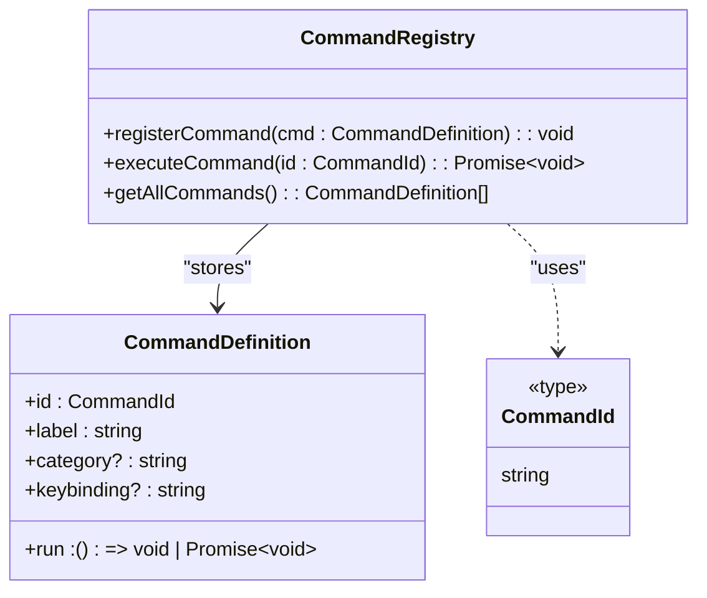
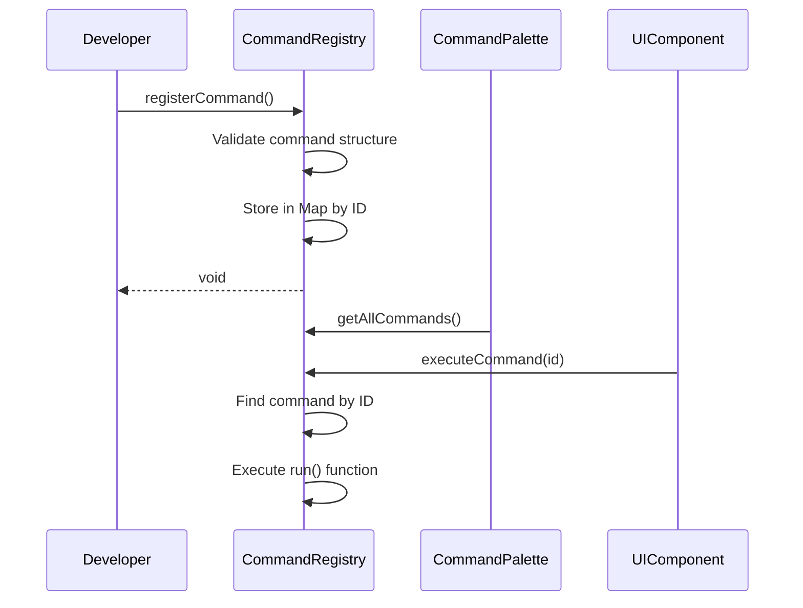
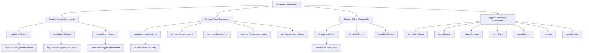
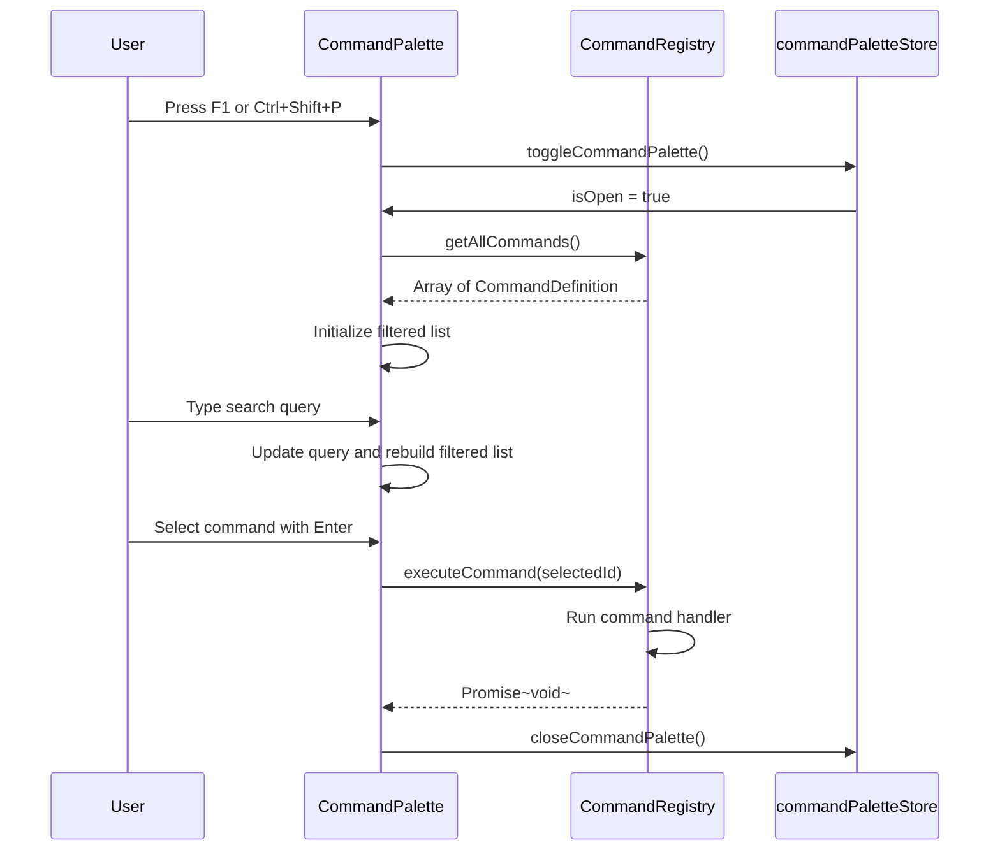
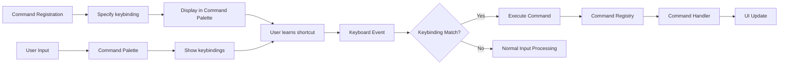
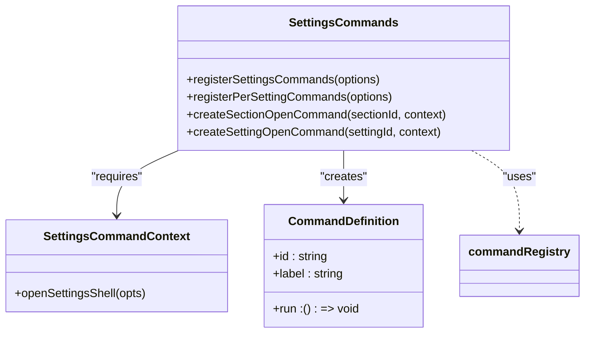
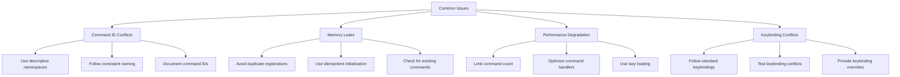
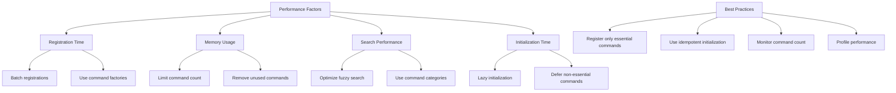

# Custom Commands

<cite>
**Referenced Files in This Document**   
- [commandRegistry.ts](file://src/lib/commands/commandRegistry.ts)
- [defaultCommands.ts](file://src/lib/commands/defaultCommands.ts)
- [CommandPalette.svelte](file://src/lib/commands/CommandPalette.svelte)
- [commandPaletteStore.ts](file://src/lib/stores/commandPaletteStore.ts)
- [layoutStore.ts](file://src/lib/stores/layout/layoutStore.ts)
- [sidebarRegistry.ts](file://src/lib/layout/sidebarRegistry.ts)
- [commands.ts](file://src/lib/settings/commands.ts)
</cite>

## Table of Contents

1. [Introduction](#introduction)
2. [Command Registry Architecture](#command-registry-architecture)
3. [Creating and Registering Custom Commands](#creating-and-registering-custom-commands)
4. [Default Command Implementation](#default-command-implementation)
5. [Command Palette Integration](#command-palette-integration)
6. [Keybinding System Relationship](#keybinding-system-relationship)
7. [Settings Command System](#settings-command-system)
8. [Common Issues and Best Practices](#common-issues-and-best-practices)
9. [Command Organization and Namespaces](#command-organization-and-namespaces)
10. [Performance Considerations](#performance-considerations)

## Introduction

The NC code editor features a comprehensive command system that serves as the central nervous system for user interactions, UI operations, and application workflows. Inspired by the VS Code command palette architecture, this system provides a unified interface for executing actions throughout the application. The command system is designed to be extensible, allowing developers to create custom commands that integrate seamlessly with the editor's core functionality. This document provides a detailed exploration of the command registry architecture, command creation and registration process, integration with UI components like the command palette, and best practices for implementing custom commands. The system is built with accessibility in mind, supporting keyboard navigation, fuzzy search, and command history to enhance user productivity.

## Command Registry Architecture

The command registry serves as the single source of truth for all commands within the NC code editor. Implemented as a centralized registry pattern, it provides a clean API for registering, discovering, and executing commands across the application. The architecture is designed to be lightweight and efficient, using a Map data structure to store command definitions with O(1) lookup performance.



**Diagram sources**

- [commandRegistry.ts](file://src/lib/commands/commandRegistry.ts#L19-L64)

**Section sources**

- [commandRegistry.ts](file://src/lib/commands/commandRegistry.ts#L1-L64)

## Creating and Registering Custom Commands

Creating custom commands in the NC code editor follows a straightforward pattern that emphasizes consistency and discoverability. Each command is defined as a CommandDefinition object containing essential properties that describe its behavior and presentation. The registration process is handled through the registerCommand function, which adds the command to the central registry.

To create a custom command, developers must provide a unique identifier (id), a human-readable label, and an execution handler function. Optional properties include category (for organizational grouping) and keybinding (for keyboard shortcuts). The command ID follows a namespace pattern similar to VS Code, typically using a dot-separated format like "workbench.action.toggleSidebarVisibility" to indicate the command's domain and purpose.

When registering commands, it's important to note that the system follows a "last write wins" policy. If a command with the same ID is registered multiple times, the most recent registration will overwrite the previous one. This allows for command overriding and dynamic updates but requires careful management to avoid unintended conflicts.



**Diagram sources**

- [commandRegistry.ts](file://src/lib/commands/commandRegistry.ts#L38-L64)
- [CommandPalette.svelte](file://src/lib/commands/CommandPalette.svelte#L16-L25)

**Section sources**

- [commandRegistry.ts](file://src/lib/commands/commandRegistry.ts#L19-L64)

## Default Command Implementation

The NC code editor comes with a set of default commands that provide essential functionality for navigating and interacting with the interface. These commands are registered through the initDefaultCommands function, which sets up the core command set during application initialization. The default commands follow a systematic organization, grouping related functionality under common prefixes.

The implementation of default commands demonstrates the integration between the command system and various application stores. For example, commands that control the sidebar visibility directly invoke functions from the layoutStore, while commands that navigate between editor groups interact with the editorGroupsStore. This approach maintains separation of concerns, with the command system serving as a thin abstraction layer over the underlying state management.



**Diagram sources**

- [defaultCommands.ts](file://src/lib/commands/defaultCommands.ts#L35-L268)
- [layoutStore.ts](file://src/lib/stores/layout/layoutStore.ts#L53-L99)

**Section sources**

- [defaultCommands.ts](file://src/lib/commands/defaultCommands.ts#L1-L269)

## Command Palette Integration

The Command Palette provides a user-friendly interface for discovering and executing commands through a searchable dropdown menu. It serves as the primary UI component for interacting with the command system, offering fuzzy search, command history, and keyboard navigation. The CommandPalette.svelte component is responsible for rendering the palette and handling user interactions.

The integration between the Command Palette and the command registry is seamless and efficient. When the palette is opened, it retrieves the complete list of registered commands from the registry and maintains its own filtered list based on the user's search query. The fuzzy search algorithm prioritizes matches at the beginning of command labels and shorter labels, providing intuitive results that align with user expectations.



**Diagram sources**

- [CommandPalette.svelte](file://src/lib/commands/CommandPalette.svelte#L1-L441)
- [commandPaletteStore.ts](file://src/lib/stores/commandPaletteStore.ts#L19-L28)

**Section sources**

- [CommandPalette.svelte](file://src/lib/commands/CommandPalette.svelte#L1-L441)

## Keybinding System Relationship

The command system is tightly integrated with the keybinding system, allowing users to execute commands through keyboard shortcuts. Each command can optionally specify a keybinding property that defines the keyboard combination for triggering the command. This relationship enables a consistent and discoverable keyboard navigation experience throughout the application.

The keybinding implementation follows established conventions from popular code editors, using familiar combinations like Ctrl+B for toggling the sidebar and Ctrl+` for toggling the terminal. When a keybinding is defined for a command, it appears alongside the command label in the Command Palette, providing visual feedback about available shortcuts.



**Diagram sources**

- [defaultCommands.ts](file://src/lib/commands/defaultCommands.ts#L50-L51)
- [CommandPalette.svelte](file://src/lib/commands/CommandPalette.svelte#L320-L322)

**Section sources**

- [defaultCommands.ts](file://src/lib/commands/defaultCommands.ts#L1-L269)

## Settings Command System

The settings command system provides a specialized layer for managing commands related to application preferences and configuration. Implemented in the settings/commands module, this system follows a parameterized approach that allows for dynamic command generation based on available settings sections and individual settings.

The settings command system uses a namespace pattern with commands like "settings.open.section._" and "settings.open.setting._" to organize configuration-related actions. This approach enables the creation of specific commands for each settings section and individual setting without requiring manual registration of each command. The system leverages factory functions like createSectionOpenCommand and createSettingOpenCommand to generate command definitions dynamically.



**Diagram sources**

- [commands.ts](file://src/lib/settings/commands.ts#L50-L174)
- [commandRegistry.ts](file://src/lib/commands/commandRegistry.ts#L22-L28)

**Section sources**

- [commands.ts](file://src/lib/settings/commands.ts#L1-L174)

## Common Issues and Best Practices

When working with the command system, several common issues and best practices should be considered to ensure reliable and maintainable code. One of the most important considerations is command ID uniqueness and namespace management. Since the registry follows a "last write wins" policy, conflicting command IDs can lead to unexpected behavior where one command overwrites another.

Proper disposal of command registrations is another critical aspect, particularly for dynamically created commands. While the current implementation doesn't include explicit disposal mechanisms, developers should be aware that once a command is registered, it remains in the registry for the lifetime of the application unless explicitly overwritten.



**Diagram sources**

- [commandRegistry.ts](file://src/lib/commands/commandRegistry.ts#L38-L44)
- [defaultCommands.ts](file://src/lib/commands/defaultCommands.ts#L32-L37)

**Section sources**

- [commandRegistry.ts](file://src/lib/commands/commandRegistry.ts#L1-L64)
- [defaultCommands.ts](file://src/lib/commands/defaultCommands.ts#L1-L269)

## Command Organization and Namespaces

Effective command organization is essential for maintaining a scalable and discoverable command system. The NC code editor follows a hierarchical namespace convention inspired by VS Code, using dot-separated prefixes to group related commands. This approach provides a clear structure that helps users and developers understand the purpose and domain of each command.

The primary namespace categories include "workbench.action" for general IDE operations, "workbench.view" for view-related commands, "editor.action" for editor-specific functionality, and "settings.open" for configuration commands. This consistent naming convention enables intuitive command discovery and supports the fuzzy search algorithm in the Command Palette.

```mermaid
tree
root((Commands))
root --- workbench
workbench --- action
workbench --- view
workbench --- action --- toggleSidebarVisibility
workbench --- action --- togglePanel
workbench --- action --- closeActiveEditor
workbench --- action --- focusLeftGroup
workbench --- action --- focusRightGroup
workbench --- view --- explorer
workbench --- view --- search
workbench --- view --- scm
workbench --- view --- extensions
workbench --- view --- settings
root --- editor
editor --- action
editor --- action --- toggleWordWrap
editor --- action --- gotoLine
editor --- action --- quickOutline
root --- settings
settings --- open
settings --- open --- section
settings --- open --- setting
```

**Diagram sources**

- [defaultCommands.ts](file://src/lib/commands/defaultCommands.ts#L47-L267)
- [commands.ts](file://src/lib/settings/commands.ts#L59-L165)

**Section sources**

- [defaultCommands.ts](file://src/lib/commands/defaultCommands.ts#L1-L269)

## Performance Considerations

The command system is designed with performance in mind, but certain practices should be followed when registering large numbers of commands or implementing complex command handlers. The registry uses a Map for O(1) lookup performance, making command execution efficient regardless of the total number of registered commands.

However, the initialization time and memory usage scale with the number of registered commands. When registering large numbers of commands, it's recommended to batch the registrations and consider lazy loading patterns for commands that are not immediately needed. The Command Palette's search performance is also affected by the total command count, as all commands are loaded into memory when the palette is opened.



**Diagram sources**

- [commandRegistry.ts](file://src/lib/commands/commandRegistry.ts#L32-L33)
- [CommandPalette.svelte](file://src/lib/commands/CommandPalette.svelte#L116-L144)

**Section sources**

- [commandRegistry.ts](file://src/lib/commands/commandRegistry.ts#L1-L64)
- [CommandPalette.svelte](file://src/lib/commands/CommandPalette.svelte#L1-L441)
