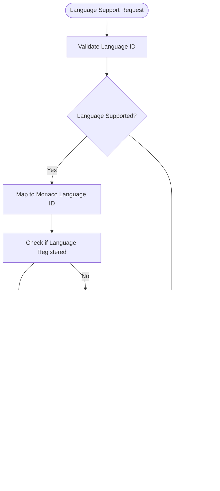

# Extensibility

<cite>
**Referenced Files in This Document**   
- [commandRegistry.ts](file://src/lib/commands/commandRegistry.ts)
- [defaultCommands.ts](file://src/lib/commands/defaultCommands.ts)
- [languageSupport.ts](file://src/lib/editor/languageSupport.ts)
- [themeManager.ts](file://src/lib/editor/themeManager.ts)
- [EditorCore.ts](file://src/lib/editor/EditorCore.ts)
- [commandPaletteStore.ts](file://src/lib/stores/commandPaletteStore.ts)
- [sidebarRegistry.ts](file://src/lib/layout/sidebarRegistry.ts)
- [settingsRegistry.ts](file://src/lib/settings/registry.ts)
- [themeStore.ts](file://src/lib/stores/themeStore.ts)
- [THEME_PALETTES.ts](file://src/lib/stores/THEME_PALETTES.ts)
- [main.rs](file://src-tauri/src/main.rs)
- [tauri.conf.json](file://src-tauri/tauri.conf.json)
- [ExtensionsView.svelte](file://src/lib/sidebar/ExtensionsView.svelte)
</cite>

## Table of Contents

1. [Introduction](#introduction)
2. [Plugin Architecture](#plugin-architecture)
3. [Command System](#command-system)
4. [Language Support](#language-support)
5. [Editor API](#editor-api)
6. [Tauri Integration](#tauri-integration)
7. [Theme Customization](#theme-customization)
8. [Extension Development Patterns](#extension-development-patterns)
9. [Security and Permissions](#security-and-permissions)
10. [Conclusion](#conclusion)

## Introduction

The NC code editor is designed with extensibility as a core principle, enabling developers to customize and enhance its functionality through various extension mechanisms. This document provides comprehensive guidance on the extensibility features of the NC editor, covering plugin architecture, command registration, language support, API access, Tauri integration, theme customization, and security considerations. The editor's architecture is inspired by VS Code but adapted for the SvelteKit and Tauri v2 ecosystem, providing a modern, performant foundation for extension development.

**Section sources**

- [commandRegistry.ts](file://src/lib/commands/commandRegistry.ts#L1-L64)
- [EditorCore.ts](file://src/lib/editor/EditorCore.ts#L1-L891)

## Plugin Architecture

The NC code editor implements a modular plugin architecture that allows adding new functionality through well-defined extension points. The architecture is centered around a component-based system where sidebar views and other UI elements are registered through configuration objects. The `sidebarRegistry.ts` file defines the sidebar view configurations, allowing plugins to register new views that appear in the activity bar.

The plugin system follows a declarative approach where extensions register their components, commands, and settings through configuration objects rather than hardcoding them into the application. This design enables dynamic loading and unloading of functionality without requiring application restarts. The `ExtensionsView.svelte` component provides a user interface for managing installed extensions, showing their status and providing access to extension details.

Plugins can extend the editor by registering new sidebar views, commands, language support, and settings. The architecture supports both built-in extensions (like the Explorer, Search, and Git views) and third-party extensions that can be developed independently. The system is designed to be type-safe, with TypeScript interfaces defining the contracts for extension points.

**Diagram sources**

- [sidebarRegistry.ts](file://src/lib/layout/sidebarRegistry.ts#L1-L73)
- [ExtensionsView.svelte](file://src/lib/sidebar/ExtensionsView.svelte#L1-L147)

**Section sources**

- [sidebarRegistry.ts](file://src/lib/layout/sidebarRegistry.ts#L1-L73)
- [ExtensionsView.svelte](file://src/lib/sidebar/ExtensionsView.svelte#L1-L147)

## Command System

The NC editor features a comprehensive command system that enables adding custom functionality accessible through the command palette, keyboard shortcuts, and programmatic calls. The command registry, implemented in `commandRegistry.ts`, serves as the single source of truth for all commands in the application, following a design inspired by VS Code's command palette and workbench commands API.

Commands are defined with a unique identifier, label, execution function, optional category, and keybinding. The system supports both synchronous and asynchronous command execution, allowing for flexible implementation of various operations. Commands can be registered or overridden at runtime, with the last write winning in case of identifier conflicts.

The command palette, controlled by `commandPaletteStore.ts`, provides a central interface for discovering and executing commands. Users can open the command palette with a keyboard shortcut and search for commands by name or category. The system supports command categorization, making it easier to organize and discover functionality.

**Diagram sources**

- [commandRegistry.ts](file://src/lib/commands/commandRegistry.ts#L1-L64)
- [commandPaletteStore.ts](file://src/lib/stores/commandPaletteStore.ts#L1-L29)

**Section sources**

- [commandRegistry.ts](file://src/lib/commands/commandRegistry.ts#L1-L64)
- [commandPaletteStore.ts](file://src/lib/stores/commandPaletteStore.ts#L1-L29)

## Language Support

The NC editor provides a robust language support system that enables defining syntax highlighting and IntelliSense for programming languages through the Monaco Editor integration. The `languageSupport.ts` file implements a language registration system that maps internal language identifiers to Monaco language IDs and ensures proper registration of language features.

The system includes a mapping function that translates common file extensions to their corresponding Monaco language identifiers (e.g., "ts" to "typescript", "py" to "python"). For supported languages, the system dynamically imports the appropriate language grammar from Monaco's basic languages package and registers it with the editor. This approach enables syntax highlighting for languages like Rust, Python, and TOML without requiring full language server integration.

For advanced language features like IntelliSense, the editor exposes APIs through `EditorCore.ts` that allow extensions to register completion providers, hover providers, and other language services. These providers can be implemented to offer code completion, parameter hints, hover documentation, and other IDE-like features for custom languages.

**Diagram sources**

- [languageSupport.ts](file://src/lib/editor/languageSupport.ts#L1-L70)
- [EditorCore.ts](file://src/lib/editor/EditorCore.ts#L1-L891)

**Section sources**

- [languageSupport.ts](file://src/lib/editor/languageSupport.ts#L1-L70)
- [EditorCore.ts](file://src/lib/editor/EditorCore.ts#L1-L891)

## Editor API

The NC editor exposes a comprehensive API for creating extensions that can modify editor behavior or add new UI components. The `EditorCore.ts` file provides the primary interface for interacting with the Monaco Editor, encapsulating direct access to the Monaco API while providing a simplified, type-safe interface.

The EditorCore API includes methods for managing editor models, configuring editor options, registering language support, and handling diagnostics. Extensions can use this API to create and manage text models, update editor configuration, register custom language features, and display diagnostic information. The API also provides event subscriptions for monitoring content changes and cursor position updates.

For UI extensions, the system provides access to Svelte stores that manage application state, such as `editorStore`, `workspaceStore`, and `themeStore`. These stores allow extensions to react to changes in the editor state, workspace content, and theme settings. The component-based architecture enables extensions to add new UI elements by registering Svelte components through the sidebar registry or other extension points.

**Diagram sources**

- [EditorCore.ts](file://src/lib/editor/EditorCore.ts#L1-L891)

**Section sources**

- [EditorCore.ts](file://src/lib/editor/EditorCore.ts#L1-L891)

## Tauri Integration

The NC editor leverages Tauri for native capabilities, providing a bridge between the web frontend and system-level functionality. The Tauri integration is configured in `tauri.conf.json`, which defines the application metadata, window properties, security settings, and asset protocols.

The main Rust entry point in `main.rs` initializes the Tauri application and runs the Nova Code library. This integration enables the editor to access native file system operations, dialog boxes, and other system capabilities while maintaining a secure boundary between the web and native layers.

Extensions can integrate with Tauri plugins to provide additional native functionality. For example, the file service uses Tauri's dialog plugin to open folder selection dialogs, as seen in the `ExplorerView.svelte` component. The security model in `tauri.conf.json` controls which system capabilities are exposed to the web application, ensuring that extensions operate within defined permission boundaries.

**Diagram sources**

- [main.rs](file://src-tauri/src/main.rs#L1-L7)
- [tauri.conf.json](file://src-tauri/tauri.conf.json#L1-L44)
- [ExplorerView.svelte](file://src/lib/sidebar/ExplorerView.svelte#L1-L204)

**Section sources**

- [main.rs](file://src-tauri/src/main.rs#L1-L7)
- [tauri.conf.json](file://src-tauri/tauri.conf.json#L1-L44)
- [ExplorerView.svelte](file://src/lib/sidebar/ExplorerView.svelte#L1-L204)

## Theme Customization

The NC editor features a sophisticated theme customization system that allows users to create and share custom themes. The `themeManager.ts` file implements a theme manager class that handles the registration, application, and management of both built-in and custom themes.

The system supports three types of themes: built-in themes (light, dark, high contrast), popular themes (Monokai, Dracula, Nord, etc.), and custom themes created by users. Custom themes are defined as JSON objects that specify token colors, background colors, and font styles, following the Monaco theme format.

The theme manager provides APIs for registering custom themes from JSON, applying themes by ID, exporting themes for sharing, and removing custom themes. The system also integrates with the application's color palette system, allowing themes to be generated based on predefined color palettes. The `THEME_PALETTES.ts` file defines the available color palettes, which can be used to create consistent visual themes across the application.

**Diagram sources**

- [themeManager.ts](file://src/lib/editor/themeManager.ts#L1-L274)
- [THEME_PALETTES.ts](file://src/lib/stores/THEME_PALETTES.ts#L1-L314)

**Section sources**

- [themeManager.ts](file://src/lib/editor/themeManager.ts#L1-L274)
- [THEME_PALETTES.ts](file://src/lib/stores/THEME_PALETTES.ts#L1-L314)

## Extension Development Patterns

Developing extensions for the NC editor follows several common patterns that leverage the available APIs and extension points. The most common patterns include command registration, sidebar view creation, language support implementation, and theme customization.

For command-based extensions, developers register commands through the command registry and make them accessible via the command palette. These commands can perform various operations, from simple UI interactions to complex file operations using Tauri plugins.

Sidebar view extensions follow a component-based pattern where a Svelte component is registered with the sidebar registry. The component can include its own state management, event handling, and integration with application stores. The `ExtensionsView.svelte` component serves as an example of this pattern, displaying a list of installed extensions with their status and actions.

Language support extensions typically implement the language support API to provide syntax highlighting and IntelliSense features. This involves registering the language with the editor, defining tokenization rules, and optionally implementing completion and hover providers for advanced language features.

Theme extensions can be created by defining custom theme JSON files or by developing extensions that generate themes based on specific design principles. The theme manager API allows for programmatic creation, modification, and sharing of themes.

**Section sources**

- [commandRegistry.ts](file://src/lib/commands/commandRegistry.ts#L1-L64)
- [sidebarRegistry.ts](file://src/lib/layout/sidebarRegistry.ts#L1-L73)
- [languageSupport.ts](file://src/lib/editor/languageSupport.ts#L1-L70)
- [themeManager.ts](file://src/lib/editor/themeManager.ts#L1-L274)
- [ExtensionsView.svelte](file://src/lib/sidebar/ExtensionsView.svelte#L1-L147)

## Security and Permissions

The NC editor implements a security model that governs the capabilities of extensions and protects the user's system. The Tauri configuration in `tauri.conf.json` defines the security policies, including content security policies and asset protocol scopes that control which resources the application can access.

The permission model follows the principle of least privilege, where extensions are granted only the permissions they need to function. Native capabilities are exposed through Tauri plugins, which require explicit configuration in the Tauri manifest. This ensures that extensions cannot access system resources without proper authorization.

The command system provides a controlled interface for executing operations, with commands being registered and executed through a centralized registry. This allows for auditing and potentially restricting command execution based on security policies.

The theme system operates within the browser's security model, with custom themes being applied as CSS and editor configurations. The theme manager validates theme JSON structures before registration, preventing malformed themes from causing application instability.

**Section sources**

- [tauri.conf.json](file://src-tauri/tauri.conf.json#L1-L44)
- [commandRegistry.ts](file://src/lib/commands/commandRegistry.ts#L1-L64)
- [themeManager.ts](file://src/lib/editor/themeManager.ts#L1-L274)

## Conclusion

The NC code editor provides a comprehensive extensibility framework that enables developers to customize and enhance its functionality through various extension mechanisms. The plugin architecture, command system, language support, editor API, Tauri integration, and theme customization features work together to create a flexible and powerful development environment.

By following the documented patterns and APIs, developers can create extensions that integrate seamlessly with the editor, providing new features, language support, and visual themes. The security model ensures that extensions operate within defined boundaries, protecting the user's system while enabling powerful functionality.

The extensibility system is designed to be intuitive and accessible, with clear documentation and well-defined interfaces that make it easy for developers to get started with extension development. As the ecosystem grows, these extension points will enable the NC editor to support an ever-expanding range of programming languages, tools, and workflows.
