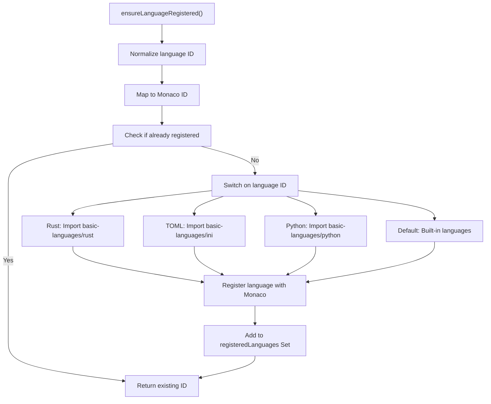
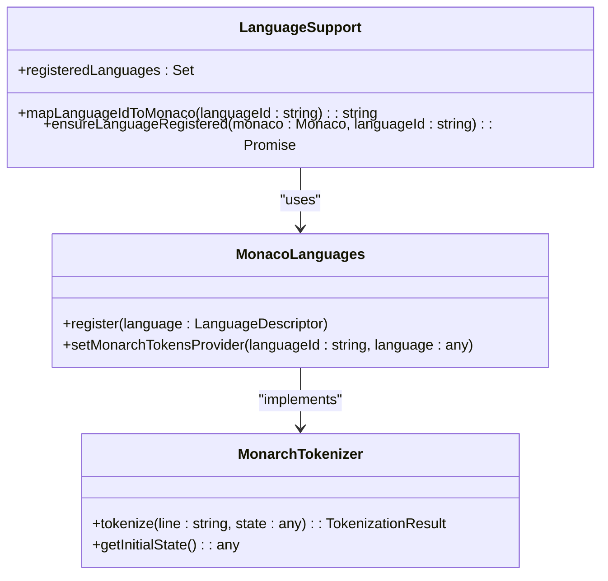
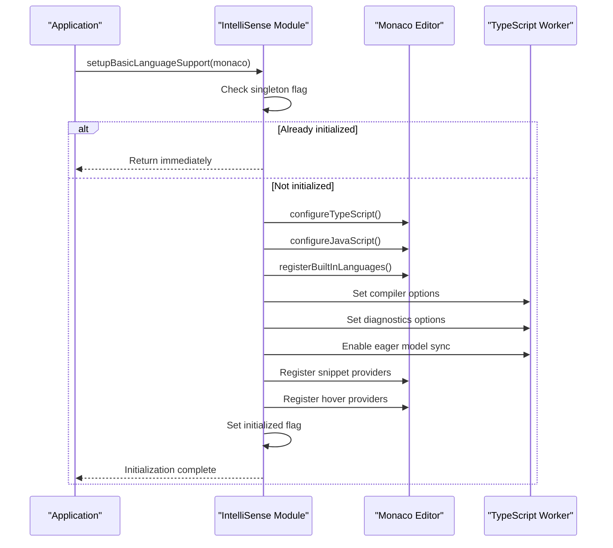
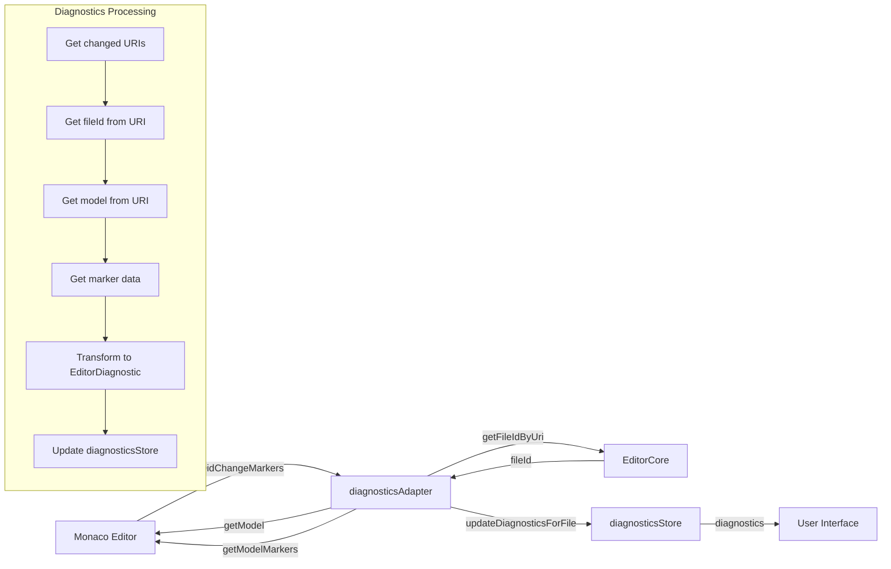
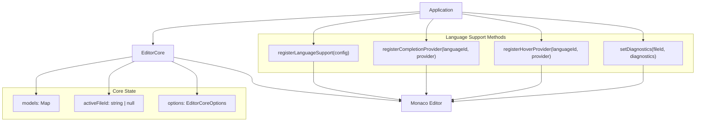

# Language Support

<cite>
**Referenced Files in This Document**   
- [languageSupport.ts](file://src/lib/editor/languageSupport.ts)
- [EditorCore.ts](file://src/lib/editor/EditorCore.ts)
- [intellisense.ts](file://src/lib/editor/intellisense.ts)
- [monacoEnvironment.ts](file://src/lib/editor/monacoEnvironment.ts)
- [diagnosticsAdapter.ts](file://src/lib/editor/diagnosticsAdapter.ts)
- [monaco-languages.d.ts](file://src/types/monaco-languages.d.ts)
</cite>

## Table of Contents
1. [Introduction](#introduction)
2. [Language Registration and Configuration](#language-registration-and-configuration)
3. [Syntax Highlighting and Tokenization](#syntax-highlighting-and-tokenization)
4. [IntelliSense Implementation](#intellisense-implementation)
5. [Diagnostics and Error Reporting](#diagnostics-and-error-reporting)
6. [Worker Environment Configuration](#worker-environment-configuration)
7. [Integration with EditorCore](#integration-with-editorcore)
8. [Performance Optimization](#performance-optimization)
9. [Common Issues and Solutions](#common-issues-and-solutions)
10. [Conclusion](#conclusion)

## Introduction

The NC code editor implements a comprehensive language support system built on the Monaco Editor API. This system provides syntax highlighting, IntelliSense (completions, hover information, signatures), diagnostics, and other language features for various programming languages. The architecture is designed to be extensible, allowing for easy addition of new languages and customization of existing language features.

The language support system is composed of several key components that work together to provide a rich editing experience. These components include language registration, syntax highlighting, IntelliSense providers, diagnostics handling, and worker environment configuration. The system is optimized for performance and follows best practices for Monaco Editor integration.

**Section sources**
- [EditorCore.ts](file://src/lib/editor/EditorCore.ts#L1-L50)
- [languageSupport.ts](file://src/lib/editor/languageSupport.ts#L1-L30)

## Language Registration and Configuration

The language support system in NC provides a structured approach to registering and configuring programming languages. The core mechanism for language registration is implemented in the `languageSupport.ts` module, which handles the mapping of internal language IDs to Monaco Editor language IDs and manages the registration process.

Language registration is performed through the `ensureLanguageRegistered` function, which takes a Monaco instance and a language ID as parameters. This function first normalizes the language ID and maps it to the corresponding Monaco language ID using the `mapLanguageIdToMonaco` function. The mapping table includes common language aliases such as "ts" for "typescript", "js" for "javascript", "rs" for "rust", and "py" for "python".



**Diagram sources**
- [languageSupport.ts](file://src/lib/editor/languageSupport.ts#L33-L69)

For languages that require additional grammar definitions, the system dynamically imports the appropriate Monarch tokenizer provider from Monaco's basic-languages package. Currently, this includes support for Rust, TOML, and Python languages. The system checks if a language has already been registered using a Set to prevent duplicate registrations, ensuring efficient resource usage.

The `LanguageSupportConfig` interface in `EditorCore.ts` provides a type-safe way to configure language support with properties for the language ID, file extensions, aliases, and an optional lazy-loader function that can be used for dynamic registration of complex grammars.

**Section sources**
- [languageSupport.ts](file://src/lib/editor/languageSupport.ts#L9-L69)
- [EditorCore.ts](file://src/lib/editor/EditorCore.ts#L115-L127)

## Syntax Highlighting and Tokenization

Syntax highlighting in the NC editor is implemented using Monaco Editor's Monarch tokenization system. The system leverages Monaco's built-in language grammars for basic syntax highlighting, which are loaded on-demand to optimize startup performance.

When a language is registered through the `ensureLanguageRegistered` function, the system sets up the appropriate Monarch tokens provider for that language. For example, when registering Rust support, the system imports the Rust language definition from `monaco-editor/esm/vs/basic-languages/rust/rust` and sets it as the tokens provider using `monaco.languages.setMonarchTokensProvider`.

The tokenization process works by defining grammar rules that match patterns in the source code and assign token types to different parts of the code. These token types are then mapped to CSS classes that apply the appropriate colors and styles. The Monarch system supports complex grammar definitions with states, regular expressions, and token inheritance.

For languages that are built into Monaco Editor (such as TypeScript, JavaScript, JSON, HTML, CSS, and Markdown), the syntax highlighting is automatically available without additional configuration. The system simply needs to register the language ID, and Monaco handles the rest.

The `mapLanguageIdToMonaco` function ensures that various common language aliases are properly mapped to their corresponding Monaco language IDs, allowing the editor to apply the correct syntax highlighting regardless of how the language is identified in the application.



**Diagram sources**
- [languageSupport.ts](file://src/lib/editor/languageSupport.ts#L3-L69)
- [monaco-languages.d.ts](file://src/types/monaco-languages.d.ts#L1-L12)

**Section sources**
- [languageSupport.ts](file://src/lib/editor/languageSupport.ts#L43-L60)
- [monaco-languages.d.ts](file://src/types/monaco-languages.d.ts#L1-L12)

## IntelliSense Implementation

The IntelliSense system in NC is implemented through the `intellisense.ts` module, which provides a comprehensive set of language features including completions, hover information, and signature help. The system is designed with performance and responsiveness in mind, following Monaco Editor best practices.

IntelliSense initialization is handled by the `setupBasicLanguageSupport` function, which configures the TypeScript and JavaScript language services with optimized compiler options. This function implements a singleton pattern to ensure that language support is initialized only once, even if called multiple times.



**Diagram sources**
- [intellisense.ts](file://src/lib/editor/intellisense.ts#L43-L58)
- [EditorCore.ts](file://src/lib/editor/EditorCore.ts#L133-L141)

The TypeScript language service is configured with modern compiler options targeting ES2020 with ES modules. Performance optimizations include setting `skipLibCheck: true` to speed up compilation by skipping type checking of declaration files, and `isolatedModules: true` for compatibility with ESM bundlers. The `setEagerModelSync(true)` option ensures that models are synchronized with the TypeScript worker for up-to-date IntelliSense.

The system also registers built-in languages such as JSON, HTML, CSS, SCSS, LESS, XML, Markdown, and YAML, making their language features available throughout the editor. For TypeScript and JavaScript, the system provides additional IntelliSense features through the `setupDefaultProviders` function, which registers completion item providers with common snippets and hover providers with documentation for built-in objects.

Completion providers are implemented with cancellation token support to ensure UI responsiveness, returning empty results when cancellation is requested rather than null to maintain consistency. The system includes a collection of common snippets for patterns like console logging, error statements, arrow functions, try-catch blocks, and import statements.

Hover providers supply documentation for frequently used built-in objects such as `console`, `JSON`, `Promise`, `async`, and `await`, enhancing the developer experience with contextual information.

**Section sources**
- [intellisense.ts](file://src/lib/editor/intellisense.ts#L43-L140)
- [EditorCore.ts](file://src/lib/editor/EditorCore.ts#L133-L141)

## Diagnostics and Error Reporting

The NC editor implements a robust diagnostics system that integrates Monaco Editor's marker system with the application's state management. The diagnostics functionality is primarily handled by the `diagnosticsAdapter.ts` module, which bridges Monaco's diagnostic markers with the application's `diagnosticsStore`.

The system uses the `attachDiagnosticsTracking` function to subscribe to changes in Monaco's markers and synchronize them with the application state. When markers change, the adapter processes each URI, retrieves the corresponding file ID from the EditorCore, and updates the diagnostics store with the translated diagnostic information.



**Diagram sources**
- [diagnosticsAdapter.ts](file://src/lib/editor/diagnosticsAdapter.ts#L11-L61)

The `setDiagnostics` method in `EditorCore.ts` provides a simplified API for setting diagnostic markers on a model by fileId. This method converts the application's `EditorDiagnostic` interface to Monaco's `IMarkerData` format, handling the translation of severity levels and other properties.

The diagnostics system supports all standard severity levels: error, warning, info, and hint. Each diagnostic includes message text, position information (start and end line/column), and an optional code identifier. This comprehensive information enables rich error reporting in the editor interface.

The adapter ensures that diagnostics are properly synchronized between Monaco and the application state, allowing other components to react to diagnostic changes. The `detachDiagnosticsTracking` function provides cleanup functionality to dispose of event subscriptions when the editor is destroyed.

**Section sources**
- [diagnosticsAdapter.ts](file://src/lib/editor/diagnosticsAdapter.ts#L11-L61)
- [EditorCore.ts](file://src/lib/editor/EditorCore.ts#L693-L725)

## Worker Environment Configuration

The NC editor configures a specialized worker environment to handle the computationally intensive tasks of syntax highlighting, language services, and diagnostics. This configuration is implemented in the `monacoEnvironment.ts` module, which sets up the Web Worker infrastructure required by Monaco Editor.

The worker environment is configured using Monaco's `MonacoEnvironment` global object, which provides a `getWorker` function to control worker creation. The NC implementation uses Vite's ESM worker import syntax (`?worker`) to bundle the workers efficiently and ensure proper loading in the Tauri desktop application environment.

```mermaid
classDiagram
class MonacoEnvironment {
+getWorker(workerId : string, label : string) : Worker
}
class WorkerFactory {
+createWorkerFactory() : (workerId : string, label : string) => Worker
+workerMap : Record<string, () => Worker>
}
class Workers {
+editorWorker : Worker
+jsonWorker : Worker
+cssWorker : Worker
+htmlWorker : Worker
+tsWorker : Worker
}
MonacoEnvironment --> WorkerFactory : "uses"
WorkerFactory --> Workers : "creates"
class WorkerMap {
+json : jsonWorker
+css : cssWorker
+scss : cssWorker
+less : cssWorker
+html : htmlWorker
+handlebars : htmlWorker
+razor : htmlWorker
+typescript : tsWorker
+javascript : tsWorker
+default : editorWorker
}
WorkerFactory --> WorkerMap : "contains"
```

**Diagram sources**
- [monacoEnvironment.ts](file://src/lib/editor/monacoEnvironment.ts#L94-L119)

The worker factory creates a mapping between language labels and specific worker instances. Different language features are handled by specialized workers:
- JSON: JSON Schema validation and formatting
- CSS/SCSS/LESS: CSS language features
- HTML/Handlebars/Razor: HTML language features
- TypeScript/JavaScript: TypeScript language service (the most resource-intensive)
- Default (editor): Basic editor operations

The system implements a singleton pattern to ensure that the worker environment is initialized only once per application lifecycle. A global flag `__MONACO_ENV_INITIALIZED__` prevents duplicate initialization, which could lead to memory leaks or inconsistent behavior.

The configuration is designed for optimal performance with several key optimizations:
- ESM workers through Vite's `?worker` import for native bundler support
- Direct worker instance control via `getWorker` instead of `getWorkerUrl`
- Lazy loading of workers, which are created only when first needed for a specific language
- Singleton initialization to prevent redundant setup

The worker environment must be imported before the first use of Monaco Editor to ensure proper configuration. This is typically done as a side-effect import in the application's entry point.

**Section sources**
- [monacoEnvironment.ts](file://src/lib/editor/monacoEnvironment.ts#L1-L131)

## Integration with EditorCore

The language support system is tightly integrated with the `EditorCore.ts` module, which serves as the central interface between the application and Monaco Editor. The EditorCore provides a simplified, type-safe API for language-related operations while encapsulating the complexity of the underlying Monaco API.

The integration is achieved through several key methods in the `EditorCoreApi` interface:



**Diagram sources**
- [EditorCore.ts](file://src/lib/editor/EditorCore.ts#L215-L239)

The `registerLanguageSupport` method provides a thin wrapper around `monaco.languages.register`, accepting a `LanguageSupportConfig` object that includes the language ID, file extensions, aliases, and an optional lazy-loader function. If a loader is provided, it is invoked immediately to enable dynamic language feature registration.

Completion and hover providers are registered through dedicated methods that wrap the corresponding Monaco API calls. These methods return disposable objects that can be used for manual cleanup if needed, providing fine-grained control over provider lifecycle.

The EditorCore also manages the relationship between file IDs and editor models, ensuring that language features are correctly associated with the appropriate files. When a model is created or activated, the EditorCore handles the language registration process transparently.

The system's architecture follows the principle of encapsulation, with all Monaco dependencies localized within the EditorCore module. This design allows the rest of the application to interact with the editor through a clean, well-defined interface without direct dependencies on Monaco's API.

**Section sources**
- [EditorCore.ts](file://src/lib/editor/EditorCore.ts#L215-L239)
- [EditorCore.ts](file://src/lib/editor/EditorCore.ts#L543-L563)

## Performance Optimization

The NC editor implements several performance optimizations to ensure responsive editing even with large files or complex grammars. These optimizations are applied at multiple levels of the language support system.

For the editor itself, the `EditorCore` configuration includes several performance-focused settings:
- `smoothScrolling: false` to improve responsiveness
- `cursorSmoothCaretAnimation: 'off'` to reduce GPU load
- `renderValidationDecorations: 'editable'` to limit validation rendering to editable areas
- `quickSuggestionsDelay: 10` milliseconds for near-instant IntelliSense suggestions
- Minimap configured with `renderCharacters: false` and `maxColumn: 80` to reduce rendering overhead

The language support system employs lazy loading strategies to minimize initial load time. Language grammars are loaded only when a file of that type is first opened, rather than pre-loading all supported languages. The `ensureLanguageRegistered` function checks if a language has already been registered before importing its grammar, preventing unnecessary work.

Worker processes are optimized through the custom `monacoEnvironment` configuration, which ensures that workers are created only when needed and reused across editor instances. The worker factory maps specific language labels to dedicated worker instances, avoiding the overhead of creating new workers for each language feature.

IntelliSense providers are implemented with cancellation token support to ensure UI responsiveness. When a user continues typing while suggestions are being computed, the operation can be cancelled to prevent unresponsive behavior. Providers return empty results instead of null when cancelled, maintaining consistency in the API.

The diagnostics system is optimized by translating Monaco's marker events into the application's state management system efficiently. The adapter processes only the URIs that have changed, retrieving and transforming only the necessary diagnostic data.

For large files, the system benefits from Monaco's built-in optimizations such as:
- Incremental syntax highlighting
- Virtualized rendering of content
- Efficient model change tracking
- Debounced event handling

These optimizations work together to provide a smooth editing experience while maintaining rich language features across various file sizes and complexity levels.

**Section sources**
- [EditorCore.ts](file://src/lib/editor/EditorCore.ts#L350-L356)
- [EditorCore.ts](file://src/lib/editor/EditorCore.ts#L484-L487)
- [intellisense.ts](file://src/lib/editor/intellisense.ts#L11-L14)
- [monacoEnvironment.ts](file://src/lib/editor/monacoEnvironment.ts#L12-L15)

## Common Issues and Solutions

When implementing language support in the NC editor, several common issues may arise. Understanding these issues and their solutions is essential for maintaining a stable and performant editing experience.

**Issue 1: Language features not appearing for certain file types**
This typically occurs when a language has not been properly registered or the file extension is not associated with the correct language ID. Solution: Ensure that the language is registered through `ensureLanguageRegistered` and that the file extension is included in the language configuration.

**Issue 2: High memory usage with multiple large files**
Monaco Editor can consume significant memory when handling multiple large files simultaneously. Solution: Implement file size limits for syntax highlighting and IntelliSense, or use Monaco's `largeFileOptimizations` option to reduce feature richness for very large files.

**Issue 3: Slow startup time due to language loading**
Pre-loading all language grammars can significantly increase application startup time. Solution: Rely on the lazy loading mechanism already implemented in the system, which loads language grammars only when first needed.

**Issue 4: Worker initialization errors**
These errors often occur when the worker environment is not configured before Monaco is first used. Solution: Ensure that `monacoEnvironment.ts` is imported as a side-effect before any Monaco components are rendered.

**Issue 5: IntelliSense lag or unresponsiveness**
This can happen when the TypeScript language service is processing large files or complex type information. Solution: Optimize TypeScript compiler options with `skipLibCheck: true` and `isolatedModules: true`, and ensure that `setEagerModelSync(true)` is configured for efficient model synchronization.

**Issue 6: Diagnostic markers not synchronizing with application state**
This occurs when the diagnostics adapter is not properly attached or detached. Solution: Ensure that `attachDiagnosticsTracking` is called when the editor is initialized and `detachDiagnosticsTracking` is called when the editor is destroyed.

**Issue 7: Syntax highlighting not applying correctly**
This may happen when language IDs are not properly mapped. Solution: Verify that the `mapLanguageIdToMonaco` function correctly translates the application's language IDs to Monaco's expected format.

By understanding these common issues and their solutions, developers can effectively implement and troubleshoot language support in the NC editor, ensuring a high-quality editing experience for users.

**Section sources**
- [languageSupport.ts](file://src/lib/editor/languageSupport.ts#L9-L27)
- [monacoEnvironment.ts](file://src/lib/editor/monacoEnvironment.ts#L52-L86)
- [intellisense.ts](file://src/lib/editor/intellisense.ts#L64-L80)

## Conclusion

The language support system in the NC code editor provides a comprehensive and extensible framework for implementing rich editing features across multiple programming languages. By leveraging the Monaco Editor API and following best practices for performance and architecture, the system delivers syntax highlighting, IntelliSense, diagnostics, and other language features in a responsive and efficient manner.

Key aspects of the system include:
- A modular architecture that separates concerns between language registration, IntelliSense, diagnostics, and worker management
- Performance optimizations at multiple levels, from editor configuration to lazy loading of language grammars
- Type-safe interfaces that provide a clean API for integrating language features
- Efficient state synchronization between Monaco Editor and the application's state management system

The system is designed to be accessible to beginners while providing sufficient depth for experienced developers implementing custom language extensions. By following the patterns and practices documented here, developers can extend the editor's capabilities to support additional languages or enhance existing language features.

The combination of Monaco Editor's powerful language services with the NC editor's thoughtful integration creates a robust foundation for code editing that balances feature richness with performance and maintainability.