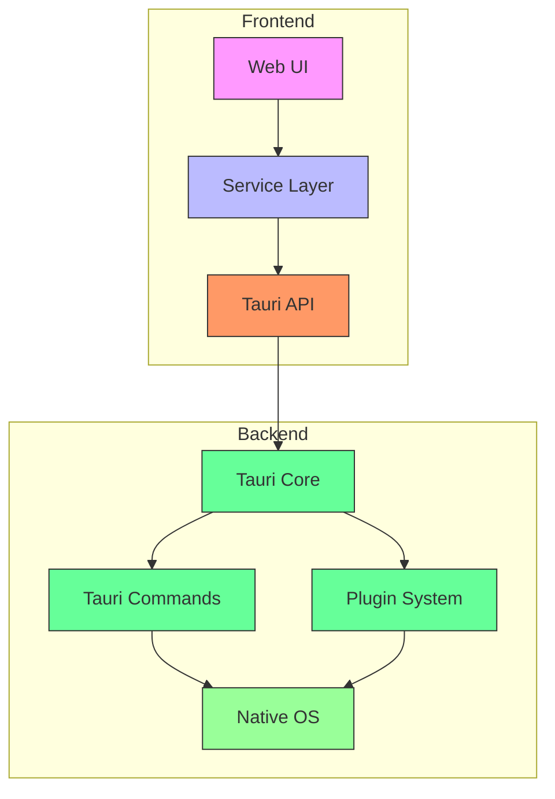
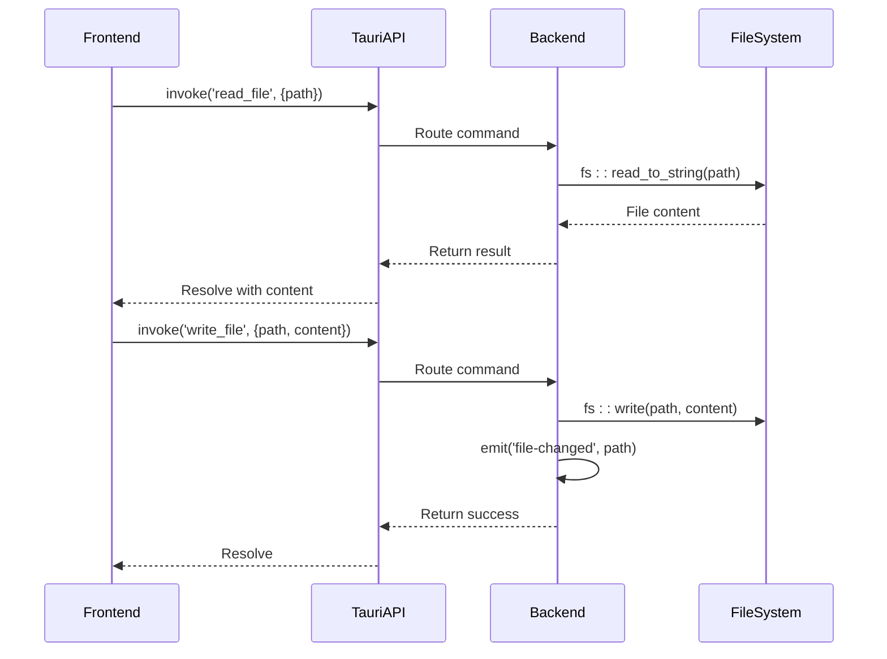

# Plugins

<cite>
**Referenced Files in This Document**   
- [Cargo.toml](file://src-tauri/Cargo.toml)
- [tauri.conf.json](file://src-tauri/tauri.conf.json)
- [lib.rs](file://src-tauri/src/lib.rs)
- [default.json](file://src-tauri/capabilities/default.json)
- [package.json](file://package.json)
- [fileService.ts](file://src/lib/services/fileService.ts)
- [quickActions.ts](file://src/lib/settings/quickActions.ts)
- [searchStore.svelte.ts](file://src/lib/stores/searchStore.svelte.ts)
</cite>

## Table of Contents

1. [Introduction](#introduction)
2. [Plugin Architecture Overview](#plugin-architecture-overview)
3. [Core Plugin Integration](#core-plugin-integration)
4. [File System Operations](#file-system-operations)
5. [Security Model and Permissions](#security-model-and-permissions)
6. [Frontend Integration Patterns](#frontend-integration-patterns)
7. [Error Handling and Availability](#error-handling-and-availability)
8. [Performance Considerations](#performance-considerations)
9. [Best Practices for Plugin Development](#best-practices-for-plugin-development)
10. [Conclusion](#conclusion)

## Introduction

The NC code editor leverages Tauri's plugin system to provide native capabilities while maintaining a web-based frontend. This documentation details how Tauri plugins are integrated to extend the application with essential native features such as file system operations, system dialogs, and OS-level integrations. The plugin architecture enables secure communication between the frontend and backend through well-defined command interfaces, allowing the editor to perform system-level operations while maintaining a responsive user interface.

## Plugin Architecture Overview



**Diagram sources**

- [tauri.conf.json](file://src-tauri/tauri.conf.json)
- [lib.rs](file://src-tauri/src/lib.rs)
- [fileService.ts](file://src/lib/services/fileService.ts)

**Section sources**

- [tauri.conf.json](file://src-tauri/tauri.conf.json)
- [lib.rs](file://src-tauri/src/lib.rs)

## Core Plugin Integration

The NC code editor integrates Tauri plugins through both Rust and JavaScript/TypeScript configurations. The integration process involves adding dependencies to Cargo.toml for the backend and package.json for the frontend, then configuring the plugins in the Tauri initialization code.

In the backend (src-tauri/Cargo.toml), plugins are added as dependencies:

```toml
[dependencies]
tauri = { version = "2", features = ["protocol-asset"] }
tauri-plugin-opener = "2"
tauri-plugin-dialog = "2"
tauri-plugin-fs = "2"
tauri-plugin-shell = "2"
```

The plugins are then initialized in the Rust code (src-tauri/src/lib.rs):

```rust
tauri::Builder::default()
    .plugin(tauri_plugin_opener::init())
    .plugin(tauri_plugin_dialog::init())
    .invoke_handler(tauri::generate_handler![
        // command handlers
    ])
```

On the frontend, the corresponding npm packages are installed:

```json
{
  "dependencies": {
    "@tauri-apps/api": "^2.9.0",
    "@tauri-apps/plugin-dialog": "^2.4.2",
    "@tauri-apps/plugin-opener": "^2.5.2"
  }
}
```

This dual-configuration approach ensures that both the Rust backend and JavaScript frontend have the necessary components to communicate through the plugin system.

**Section sources**

- [Cargo.toml](file://src-tauri/Cargo.toml)
- [package.json](file://package.json)
- [lib.rs](file://src-tauri/src/lib.rs)

## File System Operations

The NC editor implements comprehensive file system operations through custom Tauri commands rather than relying solely on the tauri-plugin-fs plugin. These operations are exposed through a well-defined API that handles various file operations with proper error handling and cross-platform compatibility.

The backend implementation in lib.rs provides commands for:

- Reading and writing files with UTF-8 support
- Creating and deleting files and directories
- Renaming files with parent directory creation
- Moving files to trash using the trash crate
- Revealing files in the system file explorer



**Diagram sources**

- [lib.rs](file://src-tauri/src/lib.rs)
- [fileService.ts](file://src/lib/services/fileService.ts)

**Section sources**

- [lib.rs](file://src-tauri/src/lib.rs)
- [fileService.ts](file://src/lib/services/fileService.ts)

## Security Model and Permissions

The NC editor implements a capability-based security model through Tauri's permission system. This model ensures that plugins and commands are only accessible when explicitly permitted, providing fine-grained control over native capabilities.

The permissions are configured in the capabilities/default.json file:

```json
{
  "permissions": [
    "core:default",
    "opener:default",
    "core:window:default",
    "core:window:allow-minimize",
    "core:window:allow-toggle-maximize",
    "core:window:allow-close",
    "core:window:allow-start-dragging",
    "dialog:allow-open",
    "dialog:allow-save"
  ]
}
```

This configuration grants specific permissions for window management and dialog operations while restricting other capabilities. The security model follows the principle of least privilege, where only necessary permissions are granted for the application to function properly.

The capability system allows for:

- Granular control over window operations
- Controlled access to file dialogs
- Explicit permission for opening external applications
- Prevention of unauthorized system access

**Section sources**

- [default.json](file://src-tauri/capabilities/default.json)
- [tauri.conf.json](file://src-tauri/tauri.conf.json)

## Frontend Integration Patterns

The frontend codebase demonstrates consistent patterns for integrating with Tauri plugins and commands. These patterns ensure type safety, proper error handling, and maintainable code structure.

The fileService.ts module provides a clean service layer abstraction:

```typescript
export const fileService: FileService = {
  async readFile(fileId) {
    return invoke<string>('read_file', { path: fileId });
  },

  async writeFile(fileId, content) {
    await invoke<void>('write_file', { request: { path: fileId, content } });
  },

  async onFileChange(cb) {
    const unlisten = await listen<string>('file-changed', (event) => {
      cb(event.payload);
    });
    return () => unlisten();
  },
};
```

Key integration patterns include:

- Using the invoke function for command execution
- Implementing event listeners for real-time updates
- Creating service layers to abstract Tauri interactions
- Proper error handling with try-catch blocks
- Type-safe parameter passing and return values

The search functionality demonstrates complex command usage with cancellation support:

```typescript
async search(root: string, query: string): Promise<void> {
  try {
    await invoke('search_files', { request: { root, query } });
  } catch (error) {
    this.state.error = error instanceof Error ? error.message : String(error);
  }
}

async cancel(): Promise<void> {
  await invoke('cancel_search');
}
```

**Section sources**

- [fileService.ts](file://src/lib/services/fileService.ts)
- [searchStore.svelte.ts](file://src/lib/stores/searchStore.svelte.ts)
- [quickActions.ts](file://src/lib/settings/quickActions.ts)

## Error Handling and Availability

The NC editor implements robust error handling for plugin operations to ensure application stability and provide meaningful feedback to users. The error handling strategy includes both backend validation and frontend error management.

Backend error handling in Rust uses Result types with descriptive error messages:

```rust
fn read_json_file<T: for<'de> Deserialize<'de>>(path: &PathBuf) -> Result<Option<T>, String> {
    if !path.exists() {
        return Ok(None);
    }
    let data = fs::read_to_string(path)
        .map_err(|e| format!("Failed to read {}: {e}", path.display()))?;
    // ... parsing logic
}
```

Frontend error handling follows these patterns:

- Wrapping invoke calls in try-catch blocks
- Converting errors to user-friendly messages
- Logging errors for debugging purposes
- Providing fallback behaviors when possible

The application also handles plugin availability by:

- Checking for command existence before invocation
- Providing graceful degradation when features are unavailable
- Implementing proper cleanup for event listeners
- Validating parameters before making native calls

**Section sources**

- [lib.rs](file://src-tauri/src/lib.rs)
- [fileService.ts](file://src/lib/services/fileService.ts)
- [quickActions.ts](file://src/lib/settings/quickActions.ts)

## Performance Considerations

The plugin system in NC code editor is designed with performance in mind, particularly for operations that involve inter-process communication (IPC) between the frontend and backend.

Key performance considerations include:

- **Asynchronous Operations**: All Tauri commands are invoked asynchronously to prevent UI blocking
- **Batch Operations**: Related operations are batched to minimize IPC overhead
- **Event-Driven Updates**: File changes are communicated through events rather than polling
- **Background Processing**: Long-running operations like search are executed in background threads

The search functionality demonstrates performance optimization:

```rust
#[tauri::command]
async fn search_files(app: AppHandle, request: SearchFilesRequest) -> Result<(), String> {
    thread::spawn(move || {
        let _ = perform_search(app, root_path, query, use_regex, case_sensitive);
    });
    Ok(())
}
```

This approach ensures that intensive operations don't block the main thread, maintaining application responsiveness. The file watcher implementation also uses a dedicated thread for monitoring file system changes and emitting events when changes occur.

**Section sources**

- [lib.rs](file://src-tauri/src/lib.rs)
- [searchStore.svelte.ts](file://src/lib/stores/searchStore.svelte.ts)

## Best Practices for Plugin Development

Based on the NC code editor implementation, several best practices emerge for developing and using Tauri plugins:

1. **Layered Architecture**: Implement a service layer to abstract Tauri interactions from UI components
2. **Type Safety**: Use TypeScript interfaces to ensure type-safe communication between frontend and backend
3. **Error Resilience**: Implement comprehensive error handling with user-friendly messages
4. **Resource Management**: Properly clean up event listeners and other resources
5. **Cross-Platform Compatibility**: Use conditional compilation for OS-specific functionality
6. **Security First**: Follow the principle of least privilege in permission configuration
7. **Performance Awareness**: Use asynchronous operations and background threads for intensive tasks
8. **Clear Contracts**: Define clear interfaces between frontend and backend components

When creating new plugins, consider:

- Whether the functionality can be implemented as custom commands instead of external plugins
- The security implications of the native capabilities being exposed
- The performance impact of IPC communication
- The user experience implications of synchronous vs asynchronous operations

**Section sources**

- [lib.rs](file://src-tauri/src/lib.rs)
- [fileService.ts](file://src/lib/services/fileService.ts)
- [tauri.conf.json](file://src-tauri/tauri.conf.json)

## Conclusion

The NC code editor demonstrates a robust implementation of Tauri's plugin system, providing native capabilities while maintaining a clean separation between frontend and backend concerns. The architecture balances functionality, security, and performance through well-defined command interfaces, proper error handling, and thoughtful permission management. By following the patterns established in this codebase, developers can create secure and efficient native extensions that enhance the editor's capabilities without compromising stability or user experience.
