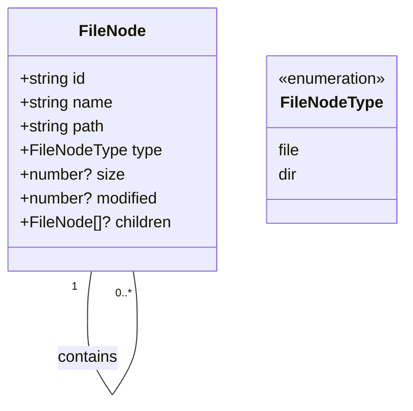
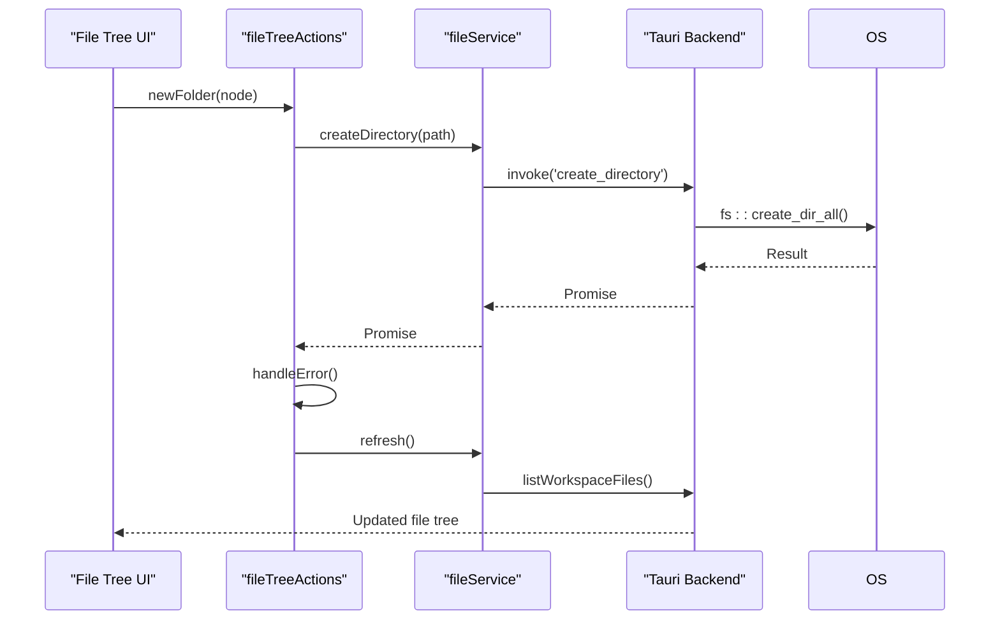
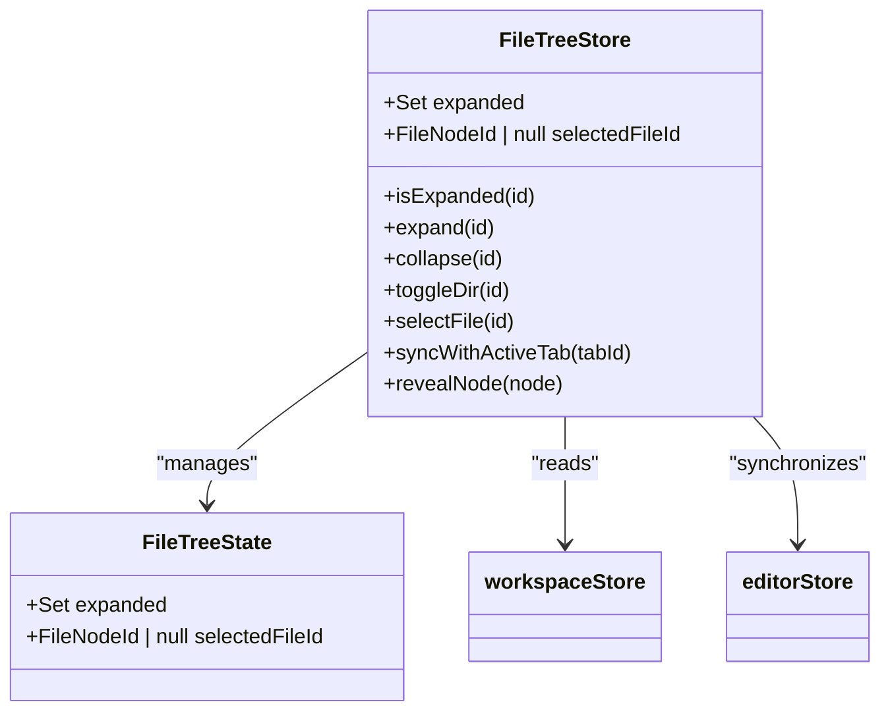
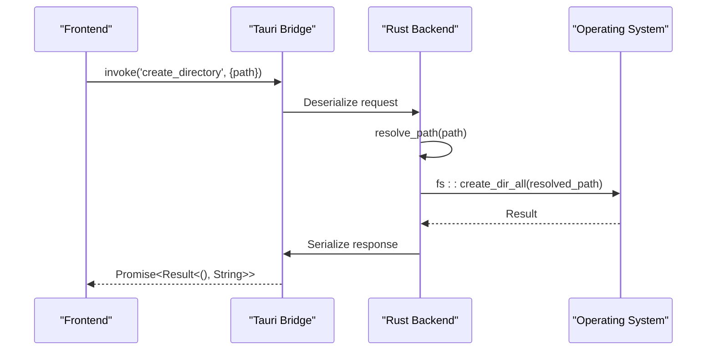
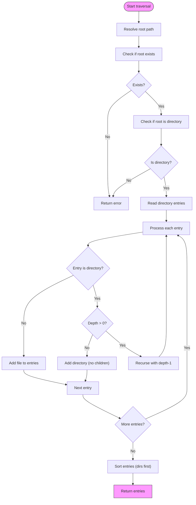
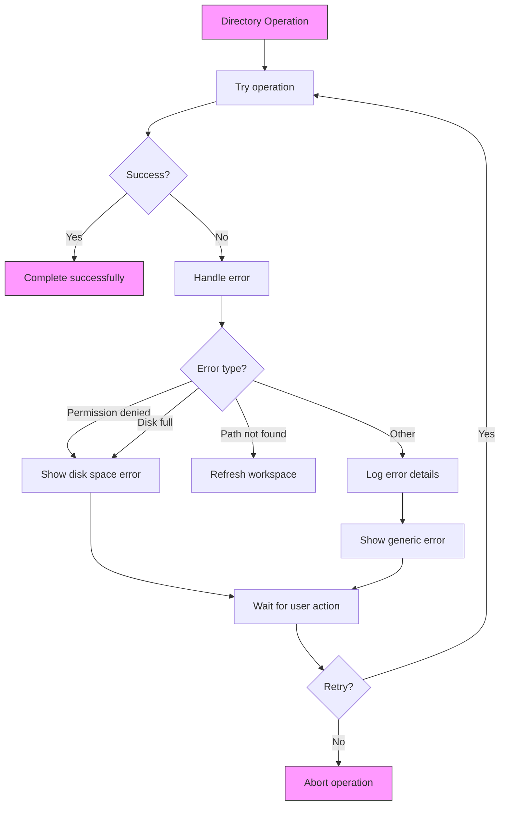

# Directory Management

<cite>
**Referenced Files in This Document**   
- [fileTreeStore.ts](file://src/lib/stores/fileTreeStore.ts)
- [fileNode.ts](file://src/lib/types/fileNode.ts)
- [fileService.ts](file://src/lib/services/fileService.ts)
- [fileTreeActions.ts](file://src/lib/sidebar/fileTreeActions.ts)
- [workspaceStore.ts](file://src/lib/stores/workspaceStore.ts)
- [lib.rs](file://src-tauri/src/lib.rs)
</cite>

## Table of Contents
1. [Introduction](#introduction)
2. [Data Model for Directory Structure](#data-model-for-directory-structure)
3. [Directory Operations Implementation](#directory-operations-implementation)
4. [File Tree State Management](#file-tree-state-management)
5. [Tauri Backend Implementation](#tauri-backend-implementation)
6. [Recursive Directory Traversal](#recursive-directory-traversal)
7. [Configuration Options for Directory Display](#configuration-options-for-directory-display)
8. [Error Handling and Edge Cases](#error-handling-and-edge-cases)
9. [Performance Considerations](#performance-considerations)
10. [Conclusion](#conclusion)

## Introduction
The NC code editor implements a comprehensive directory management system that enables users to interact with file systems through a hierarchical tree view. This document details the implementation of directory operations including creation, deletion, and traversal, with a focus on the fileTreeStore.ts module that manages the hierarchical representation of directories and files in the workspace. The system leverages Tauri's backend capabilities to perform file operations while maintaining a responsive frontend interface. The architecture follows a clean separation between UI state management and backend operations, using Svelte stores for reactive state and Tauri commands for secure filesystem access.

## Data Model for Directory Structure
The directory structure in NC is represented by a hierarchical data model defined in the FileNode interface. Each node in the directory tree can be either a file or directory, with appropriate metadata and child references.

**Diagram sources**
- [fileNode.ts](file://src/lib/types/fileNode.ts#L8-L18)

The FileNode interface defines the core data structure for representing both files and directories in the workspace. Each node has a unique identifier (id), name, path, and type (either 'file' or 'dir'). Directory nodes can contain children through the optional children property, which is an array of FileNode objects, creating the hierarchical tree structure. Additional metadata includes size (for files) and modification timestamp. The id field serves as the primary key for UI state tracking, while the path provides the filesystem location. This data model is consistent between the frontend TypeScript code and the backend Rust implementation, ensuring seamless data transfer through Tauri's invoke commands.

**Section sources**
- [fileNode.ts](file://src/lib/types/fileNode.ts#L8-L18)

## Directory Operations Implementation
The NC code editor implements directory operations through a layered architecture that separates UI actions from backend execution. The fileTreeActions.ts module provides the primary interface for directory operations, handling user interactions and coordinating between the frontend and backend systems.

**Diagram sources**
- [fileTreeActions.ts](file://src/lib/sidebar/fileTreeActions.ts#L96-L106)
- [fileService.ts](file://src/lib/services/fileService.ts#L57-L58)
- [lib.rs](file://src-tauri/src/lib.rs#L294-L298)

Directory operations are initiated through the fileTreeActions module, which exports functions for creating, renaming, and deleting directories. When a user requests to create a new folder, the newFolder function computes the target directory path based on the selected node (or workspace root if no node is selected), then calls the fileService.createDirectory method. The fileService acts as a frontend wrapper for Tauri commands, abstracting the communication with the backend. After successful directory creation, the workspace is refreshed to reflect the changes in the UI. Similar patterns are followed for other operations like renaming and deletion, with appropriate error handling to manage permission issues or invalid paths.

**Section sources**
- [fileTreeActions.ts](file://src/lib/sidebar/fileTreeActions.ts#L96-L134)
- [fileService.ts](file://src/lib/services/fileService.ts#L57-L67)

## File Tree State Management
The fileTreeStore.ts module implements a dedicated state management system for the file tree UI component, tracking the visual state of the directory hierarchy independently from the actual filesystem structure. This store maintains which directories are expanded and which file is currently selected, providing a reactive interface for the UI components.

**Diagram sources**
- [fileTreeStore.ts](file://src/lib/stores/fileTreeStore.ts#L27-L30)
- [fileTreeStore.ts](file://src/lib/stores/fileTreeStore.ts#L138-L269)

The fileTreeStore uses Svelte's writable and derived stores to manage the UI state of the file explorer. The internal state consists of a Set containing the IDs of expanded directories and a reference to the currently selected file ID. The store provides a comprehensive API for modifying this state, including methods to expand, collapse, and toggle directory nodes, as well as select files. A key feature is the syncWithActiveTab function, which automatically expands parent directories and selects the corresponding file node when a new editor tab becomes active, ensuring the file tree remains synchronized with the user's editing context. The store derives its data from the workspaceStore rather than directly accessing the filesystem, maintaining separation between UI state and data source.

**Section sources**
- [fileTreeStore.ts](file://src/lib/stores/fileTreeStore.ts#L27-L289)

## Tauri Backend Implementation
The Tauri backend implements directory operations through Rust functions exposed as asynchronous commands to the frontend. These commands provide secure access to the filesystem while handling platform-specific differences and error conditions.

**Diagram sources**
- [lib.rs](file://src-tauri/src/lib.rs#L294-L298)
- [fileService.ts](file://src/lib/services/fileService.ts#L57-L58)

The backend implementation in lib.rs defines several #[tauri::command] functions that handle directory operations. The create_directory command resolves the provided path, creates all necessary parent directories using fs::create_dir_all, and returns appropriate error messages if permission is denied or other issues occur. Similarly, the delete_file command supports both permanent deletion and moving to trash (using the trash crate), while the rename_file command handles renaming with automatic parent directory creation if needed. The backend also implements the read_workspace command, which recursively traverses the directory tree up to a maximum depth (MAX_TREE_DEPTH = 4), collecting file metadata and building the hierarchical structure returned to the frontend. All commands include comprehensive error handling with descriptive messages to help diagnose issues.

**Section sources**
- [lib.rs](file://src-tauri/src/lib.rs#L294-L324)
- [fileService.ts](file://src/lib/services/fileService.ts#L57-L67)

## Recursive Directory Traversal
The NC code editor implements recursive directory traversal through a depth-limited approach that balances performance with usability. The traversal occurs on the backend in Rust, leveraging efficient system calls while preventing excessive resource consumption.

**Diagram sources**
- [lib.rs](file://src-tauri/src/lib.rs#L221-L246)
- [lib.rs](file://src-tauri/src/lib.rs#L187-L219)

The recursive traversal is implemented in the read_workspace_entries and build_file_entry functions in the Tauri backend. The process begins by resolving the workspace root path and validating its existence and type. The traversal then reads all entries in the directory, filtering out any that cannot be accessed due to permission restrictions. For each entry, the system determines whether it's a file or directory and collects appropriate metadata. Directory entries with remaining depth budget trigger recursive calls to read their contents, with the maximum depth controlled by the MAX_TREE_DEPTH constant (set to 4). After collecting all entries, they are sorted with directories appearing before files, and names sorted case-insensitively. This depth-limited approach prevents performance issues with deeply nested or very large directory structures while still providing a useful hierarchical view.

**Section sources**
- [lib.rs](file://src-tauri/src/lib.rs#L221-L246)
- [lib.rs](file://src-tauri/src/lib.rs#L187-L219)

## Configuration Options for Directory Display
The directory display in NC is configured through a combination of backend traversal parameters and frontend state management. While explicit configuration options for sorting and display are not directly exposed in the analyzed code, the system implements sensible defaults for user experience.

The directory traversal depth is configured through the MAX_TREE_DEPTH constant in the Tauri backend, which limits recursive exploration to four levels. This prevents performance issues with deeply nested directory structures while still providing sufficient context for most projects. The sorting order is hardcoded in the read_workspace_entries function to display directories before files, with case-insensitive alphabetical ordering within each type. This matches common file explorer conventions and helps users quickly locate directories of interest.

The frontend fileTreeStore maintains the visual state of the directory tree, including which nodes are expanded and which file is selected. While the current implementation doesn't expose user-configurable sorting options, the architecture supports potential future enhancements through the workspaceStore and fileService layers. The system could be extended to support configurable sorting (by name, date, size) and filtering options by adding parameters to the read_workspace command and corresponding UI controls.

**Section sources**
- [lib.rs](file://src-tauri/src/lib.rs#L167)
- [lib.rs](file://src-tauri/src/lib.rs#L236-L243)

## Error Handling and Edge Cases
The NC code editor implements comprehensive error handling for directory operations, addressing common edge cases such as permission issues, invalid paths, and concurrent file system changes.

**Diagram sources**
- [fileTreeActions.ts](file://src/lib/sidebar/fileTreeActions.ts#L44-L47)
- [lib.rs](file://src-tauri/src/lib.rs#L296-L298)

The system handles several edge cases in directory management. When reading directories, the implementation gracefully handles permission-denied errors by returning an empty list of entries rather than failing the entire operation, allowing users to still access parts of the workspace they have permission to view. Symbolic links are handled through the follow_links(false) option in the search functionality, preventing potential infinite loops in directory traversal. Network drives are supported through standard filesystem APIs, though performance may vary depending on connection quality. The file watcher system detects external changes to the filesystem and automatically refreshes the workspace view, ensuring the UI remains consistent with the actual file state even when changes occur outside the editor.

**Section sources**
- [lib.rs](file://src-tauri/src/lib.rs#L224-L228)
- [fileTreeActions.ts](file://src/lib/sidebar/fileTreeActions.ts#L44-L47)
- [workspaceStore.ts](file://src/lib/stores/workspaceStore.ts#L76-L82)

## Performance Considerations
The directory management system in NC incorporates several performance optimizations to ensure responsive operation even with large codebases.

The most significant optimization is the depth-limited recursive traversal, which restricts directory exploration to four levels by default. This prevents the performance degradation that would occur with unlimited recursion through deeply nested directory structures. The backend implementation uses efficient Rust code with minimal overhead, leveraging the performant std::fs module for filesystem operations. The frontend employs a store-based architecture that only updates the UI when necessary, avoiding expensive re-renders of the entire file tree.

The system implements a file watcher that monitors the workspace for external changes, eliminating the need for periodic polling. This event-driven approach reduces CPU usage while ensuring the UI stays up-to-date. For directory creation and deletion operations, the implementation creates parent directories as needed using fs::create_dir_all, which is more efficient than creating directories one level at a time. The sorting of directory entries is performed on the backend, reducing the computational load on the frontend JavaScript runtime.

**Section sources**
- [lib.rs](file://src-tauri/src/lib.rs#L167)
- [workspaceStore.ts](file://src/lib/stores/workspaceStore.ts#L76-L86)

## Conclusion
The NC code editor's directory management system provides a robust and user-friendly interface for navigating and manipulating file systems. Through a well-architected separation of concerns, the implementation cleanly divides UI state management (handled by Svelte stores) from filesystem operations (executed by the Tauri Rust backend). The fileTreeStore effectively manages the visual state of the directory hierarchy, while the fileService and Tauri commands provide secure access to filesystem functionality. The depth-limited recursive traversal ensures good performance with large codebases, and comprehensive error handling addresses common edge cases like permission issues and network drives. Future enhancements could include configurable sorting options, improved handling of symbolic links, and additional configuration parameters for the directory display, building upon the solid foundation already in place.