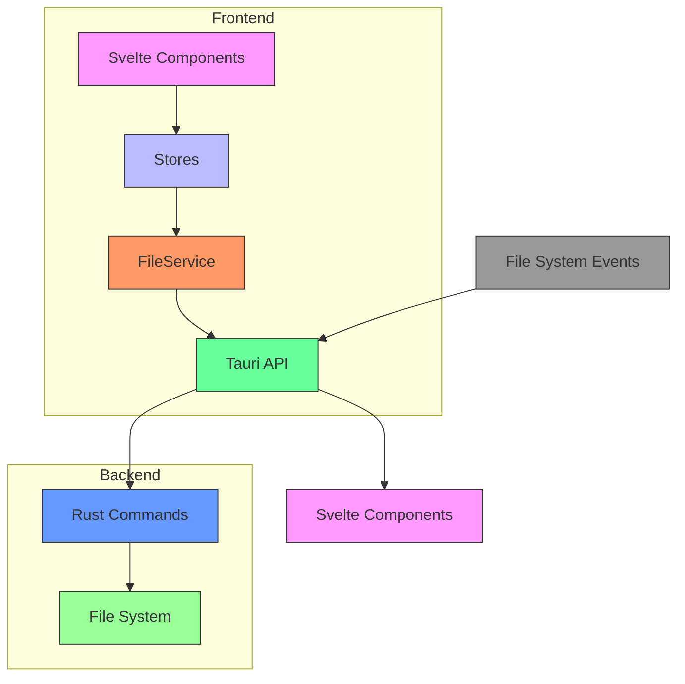
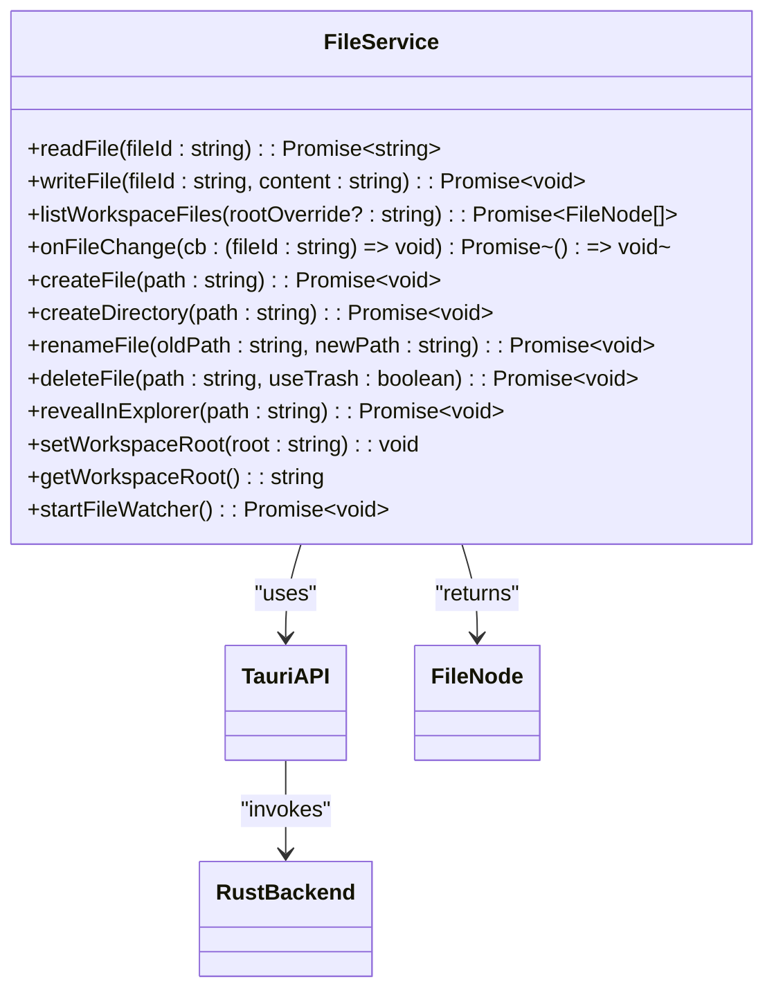
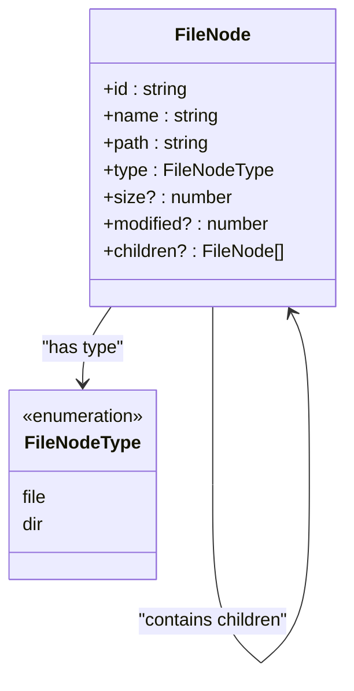
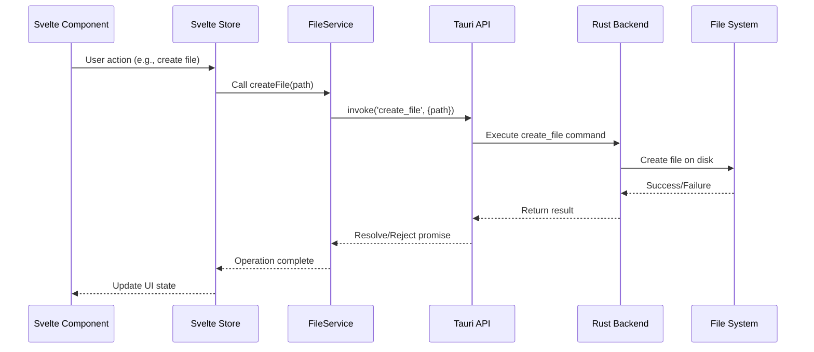
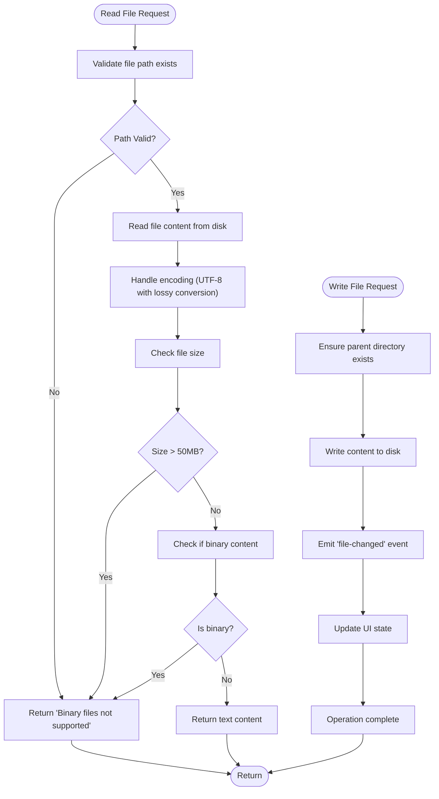
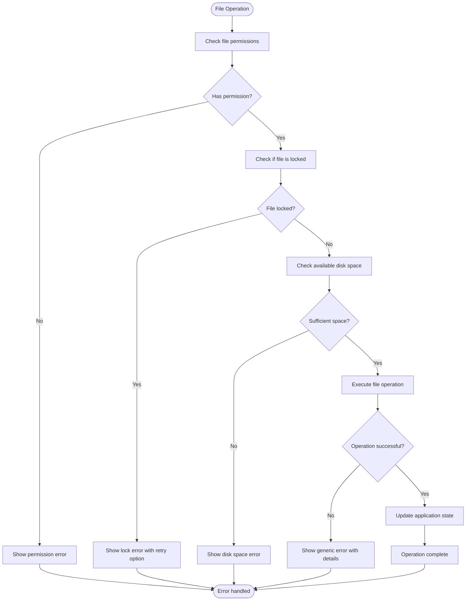
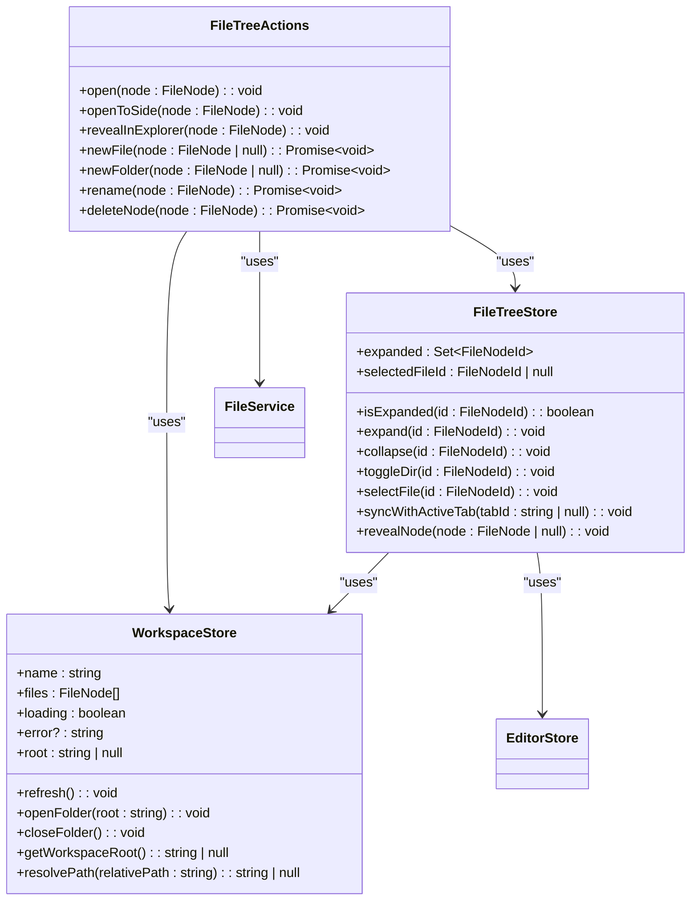

# File Operations

<cite>
**Referenced Files in This Document**   
- [fileService.ts](file://src/lib/services/fileService.ts)
- [fileNode.ts](file://src/lib/types/fileNode.ts)
- [fileTreeStore.ts](file://src/lib/stores/fileTreeStore.ts)
- [workspaceStore.ts](file://src/lib/stores/workspaceStore.ts)
- [editorStore.ts](file://src/lib/stores/editorStore.ts)
- [fileTreeActions.ts](file://src/lib/sidebar/fileTreeActions.ts)
- [lib.rs](file://src-tauri/src/lib.rs)
- [fileValidator.ts](file://src/lib/utils/fileValidator.ts)
</cite>

## Table of Contents

1. [Introduction](#introduction)
2. [Architecture Overview](#architecture-overview)
3. [Core Components](#core-components)
4. [File Service Implementation](#file-service-implementation)
5. [Domain Model](#domain-model)
6. [CRUD Operations Flow](#crud-operations-flow)
7. [File Reading and Writing](#file-reading-and-writing)
8. [Configuration Options](#configuration-options)
9. [Error Handling and Common Issues](#error-handling-and-common-issues)
10. [Integration with Svelte Components](#integration-with-svelte-components)

## Introduction

This document provides comprehensive documentation for the file operations sub-feature in the NC code editor. It details the implementation of create, read, update, and delete (CRUD) operations through the fileService.ts frontend wrapper for Tauri's file system commands. The documentation covers the invocation relationship between Svelte components, stores, and the Tauri backend through the invoke/listen pattern, explains the domain model including FileNode representation, and addresses configuration options and common issues. The content is designed to be accessible to beginners while providing sufficient technical depth for experienced developers regarding the Rust-Tauri-TypeScript integration.

## Architecture Overview

The file operations system in NC follows a layered architecture that separates concerns between the frontend UI, service layer, and backend implementation. The system uses Tauri's invoke/listen pattern to communicate between the frontend TypeScript code and the backend Rust implementation, ensuring type safety and efficient inter-process communication.

**Diagram sources**

- [fileService.ts](file://src/lib/services/fileService.ts#L1-L84)
- [lib.rs](file://src-tauri/src/lib.rs#L248-L807)

**Section sources**

- [fileService.ts](file://src/lib/services/fileService.ts#L1-L84)
- [lib.rs](file://src-tauri/src/lib.rs#L248-L807)

## Core Components

The file operations system consists of several core components that work together to provide a seamless file management experience. These components include the fileService.ts service layer, various Svelte stores for state management, and the Rust backend implementation. The architecture follows a clean separation of concerns, with each component having a well-defined responsibility.

**Section sources**

- [fileService.ts](file://src/lib/services/fileService.ts#L1-L84)
- [fileTreeStore.ts](file://src/lib/stores/fileTreeStore.ts#L1-L290)
- [workspaceStore.ts](file://src/lib/stores/workspaceStore.ts#L1-L130)

## File Service Implementation

The fileService.ts implementation serves as a frontend wrapper for Tauri's file system commands, providing a unified asynchronous API that can be easily tested and potentially replaced with mock logic during development. The service exposes a comprehensive interface for all file operations, abstracting the underlying Tauri invoke mechanism.

**Diagram sources**

- [fileService.ts](file://src/lib/services/fileService.ts#L15-L27)
- [lib.rs](file://src-tauri/src/lib.rs#L248-L807)

**Section sources**

- [fileService.ts](file://src/lib/services/fileService.ts#L1-L84)

## Domain Model

The domain model for file operations centers around the FileNode interface, which represents files and directories in the workspace. This model is shared between the frontend and backend, ensuring consistency in how file system entities are represented across the application.

**Diagram sources**

- [fileNode.ts](file://src/lib/types/fileNode.ts#L8-L18)

**Section sources**

- [fileNode.ts](file://src/lib/types/fileNode.ts#L1-L19)

## CRUD Operations Flow

The CRUD operations in NC follow a consistent pattern of communication between the frontend and backend. When a user initiates a file operation through the UI, the request flows through Svelte components, stores, and the file service before being invoked on the Tauri backend. The backend processes the request and returns a response, which is then handled by the frontend to update the UI state.

**Diagram sources**

- [fileService.ts](file://src/lib/services/fileService.ts#L53-L55)
- [lib.rs](file://src-tauri/src/lib.rs#L281-L290)
- [fileTreeActions.ts](file://src/lib/sidebar/fileTreeActions.ts#L84-L93)

**Section sources**

- [fileService.ts](file://src/lib/services/fileService.ts#L1-L84)
- [lib.rs](file://src-tauri/src/lib.rs#L281-L290)
- [fileTreeActions.ts](file://src/lib/sidebar/fileTreeActions.ts#L84-L134)

## File Reading and Writing

File reading and writing operations in NC are implemented with careful consideration for performance and user experience. The system handles various edge cases such as large files and binary content, providing appropriate feedback and optimizations when necessary.

**Diagram sources**

- [fileService.ts](file://src/lib/services/fileService.ts#L31-L37)
- [lib.rs](file://src-tauri/src/lib.rs#L267-L279)
- [fileValidator.ts](file://src/lib/utils/fileValidator.ts#L15-L87)

**Section sources**

- [fileService.ts](file://src/lib/services/fileService.ts#L31-L37)
- [lib.rs](file://src-tauri/src/lib.rs#L267-L279)
- [fileValidator.ts](file://src/lib/utils/fileValidator.ts#L1-L131)

## Configuration Options

The file operations system includes configuration options for handling file encoding and line endings. These options are managed through the application's settings system and can be customized by users to match their preferences and project requirements.

**Section sources**

- [fileService.ts](file://src/lib/services/fileService.ts#L31-L37)
- [lib.rs](file://src-tauri/src/lib.rs#L276-L278)

## Error Handling and Common Issues

The file operations system implements comprehensive error handling for common issues such as file locking, permission errors, and disk space limitations. The system provides user-friendly error messages and recovery options to ensure a smooth user experience even when operations fail.

**Diagram sources**

- [fileService.ts](file://src/lib/services/fileService.ts#L84-L134)
- [lib.rs](file://src-tauri/src/lib.rs#L281-L324)
- [fileValidator.ts](file://src/lib/utils/fileValidator.ts#L15-L87)

**Section sources**

- [fileService.ts](file://src/lib/services/fileService.ts#L84-L134)
- [lib.rs](file://src-tauri/src/lib.rs#L281-L324)
- [fileValidator.ts](file://src/lib/utils/fileValidator.ts#L1-L131)

## Integration with Svelte Components

The file operations system is tightly integrated with Svelte components through a combination of stores and actions. The fileTreeStore manages the state of the file explorer, while the workspaceStore handles workspace-level operations. The fileTreeActions module provides action handlers for user interactions with the file tree.

**Diagram sources**

- [fileTreeStore.ts](file://src/lib/stores/fileTreeStore.ts#L1-L290)
- [workspaceStore.ts](file://src/lib/stores/workspaceStore.ts#L1-L130)
- [fileTreeActions.ts](file://src/lib/sidebar/fileTreeActions.ts#L1-L135)
- [editorStore.ts](file://src/lib/stores/editorStore.ts#L1-L381)

**Section sources**

- [fileTreeStore.ts](file://src/lib/stores/fileTreeStore.ts#L1-L290)
- [workspaceStore.ts](file://src/lib/stores/workspaceStore.ts#L1-L130)
- [fileTreeActions.ts](file://src/lib/sidebar/fileTreeActions.ts#L1-L135)
