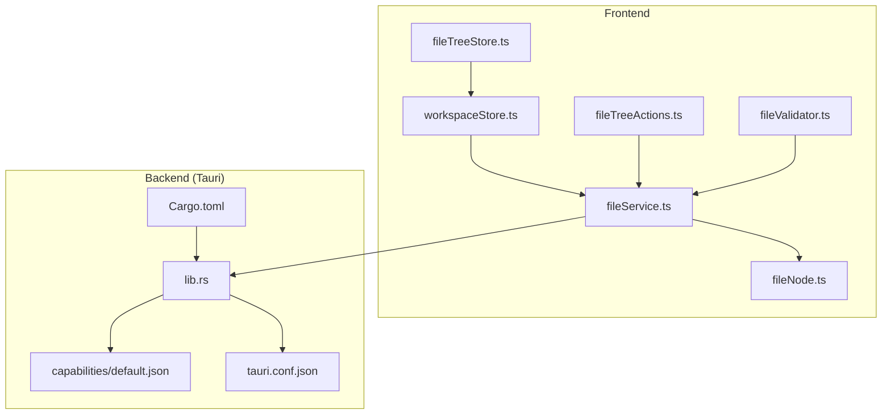
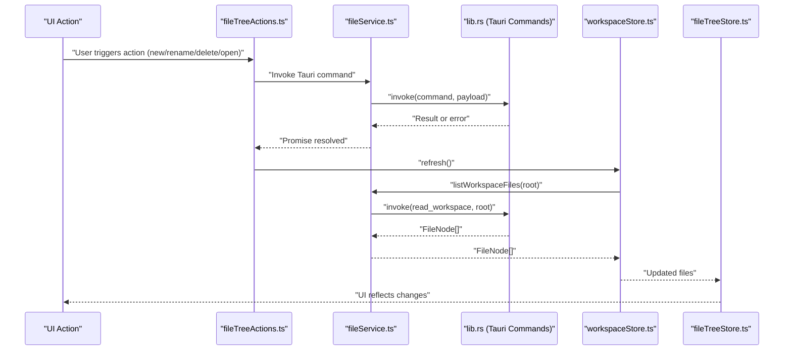
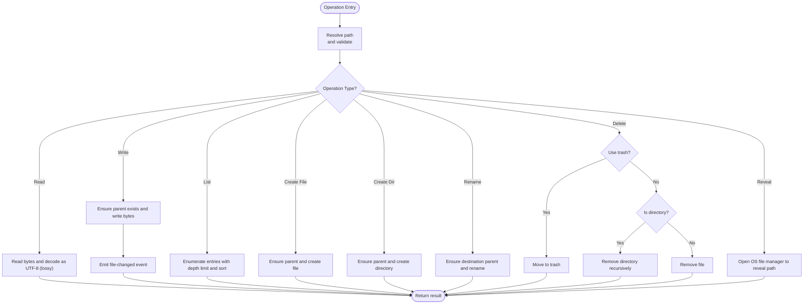
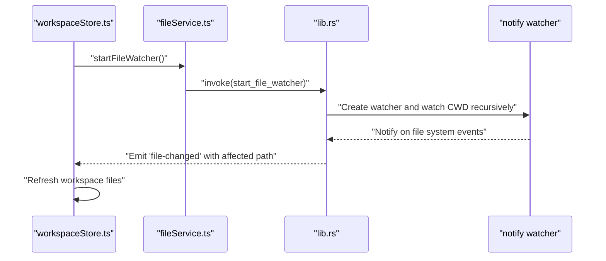
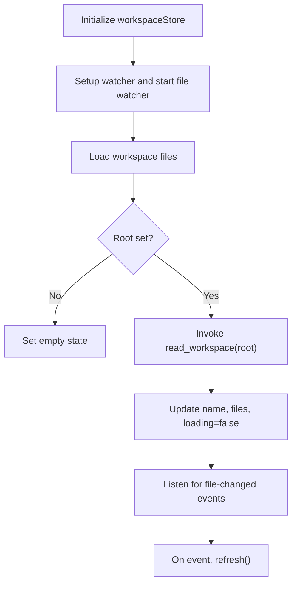
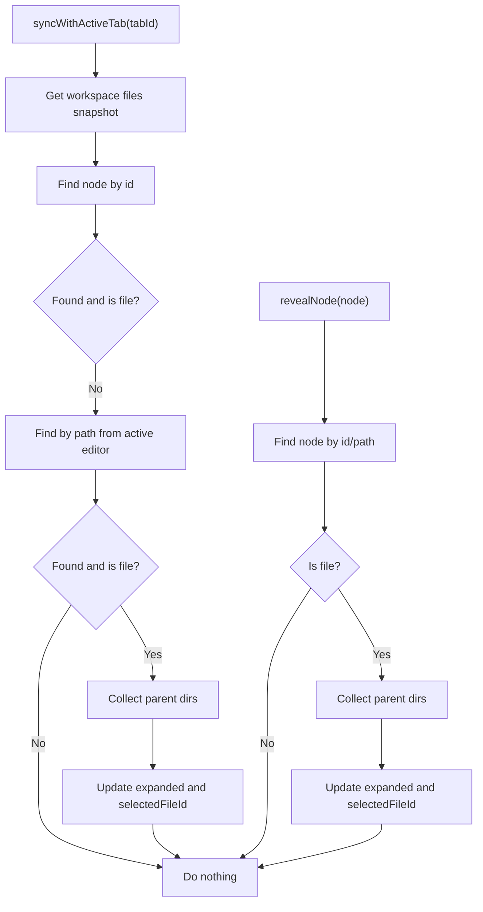
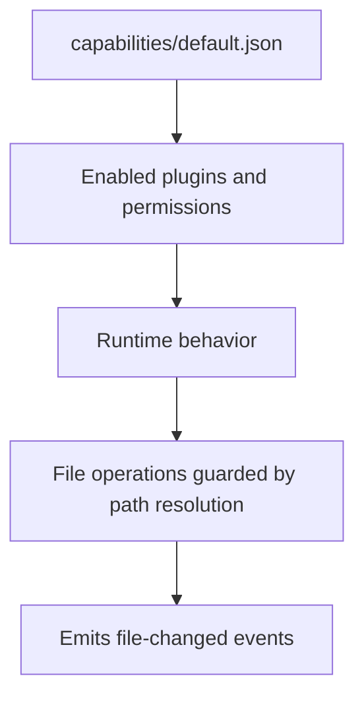
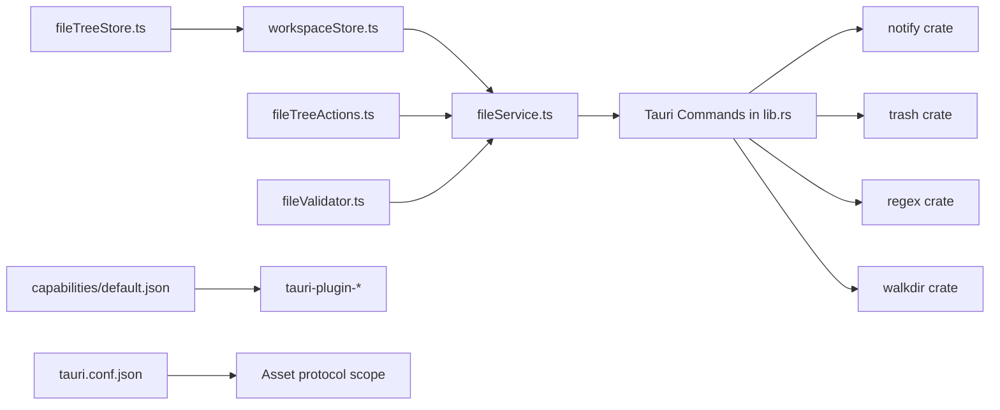

# File System Integration

<cite>
**Referenced Files in This Document**
- [fileService.ts](file://src/lib/services/fileService.ts)
- [fileTreeStore.ts](file://src/lib/stores/fileTreeStore.ts)
- [fileTreeActions.ts](file://src/lib/sidebar/fileTreeActions.ts)
- [workspaceStore.ts](file://src/lib/stores/workspaceStore.ts)
- [fileNode.ts](file://src/lib/types/fileNode.ts)
- [lib.rs](file://src-tauri/src/lib.rs)
- [Cargo.toml](file://src-tauri/Cargo.toml)
- [default.json](file://src-tauri/capabilities/default.json)
- [tauri.conf.json](file://src-tauri/tauri.conf.json)
- [fileValidator.ts](file://src/lib/utils/fileValidator.ts)
</cite>

## Table of Contents

1. [Introduction](#introduction)
2. [Project Structure](#project-structure)
3. [Core Components](#core-components)
4. [Architecture Overview](#architecture-overview)
5. [Detailed Component Analysis](#detailed-component-analysis)
6. [Dependency Analysis](#dependency-analysis)
7. [Performance Considerations](#performance-considerations)
8. [Troubleshooting Guide](#troubleshooting-guide)
9. [Conclusion](#conclusion)

## Introduction

This document explains how the NC code editor integrates with the local file system through Tauri. It covers file operations (create, read, update, delete), the file watcher system, workspace management, security permissions, encoding and line endings handling, performance optimizations for large directories, and error handling strategies. The goal is to help developers understand the end-to-end flow from UI actions to backend file system commands and how the editor keeps the UI synchronized with the file system.

## Project Structure

The file system integration spans the frontend and backend:

- Frontend services and stores orchestrate file operations and UI state.
- Backend (Rust) exposes Tauri commands for file operations and file watching.
- Capabilities and configuration define security permissions and runtime behavior.

**Diagram sources**

- [fileService.ts](file://src/lib/services/fileService.ts#L1-L84)
- [workspaceStore.ts](file://src/lib/stores/workspaceStore.ts#L1-L130)
- [fileTreeStore.ts](file://src/lib/stores/fileTreeStore.ts#L1-L290)
- [fileTreeActions.ts](file://src/lib/sidebar/fileTreeActions.ts#L1-L135)
- [fileValidator.ts](file://src/lib/utils/fileValidator.ts#L1-L131)
- [fileNode.ts](file://src/lib/types/fileNode.ts#L1-L19)
- [lib.rs](file://src-tauri/src/lib.rs#L1-L800)
- [Cargo.toml](file://src-tauri/Cargo.toml#L1-L33)
- [default.json](file://src-tauri/capabilities/default.json#L1-L18)
- [tauri.conf.json](file://src-tauri/tauri.conf.json#L1-L44)

**Section sources**

- [fileService.ts](file://src/lib/services/fileService.ts#L1-L84)
- [workspaceStore.ts](file://src/lib/stores/workspaceStore.ts#L1-L130)
- [fileTreeStore.ts](file://src/lib/stores/fileTreeStore.ts#L1-L290)
- [fileTreeActions.ts](file://src/lib/sidebar/fileTreeActions.ts#L1-L135)
- [fileValidator.ts](file://src/lib/utils/fileValidator.ts#L1-L131)
- [fileNode.ts](file://src/lib/types/fileNode.ts#L1-L19)
- [lib.rs](file://src-tauri/src/lib.rs#L1-L800)
- [Cargo.toml](file://src-tauri/Cargo.toml#L1-L33)
- [default.json](file://src-tauri/capabilities/default.json#L1-L18)
- [tauri.conf.json](file://src-tauri/tauri.conf.json#L1-L44)

## Core Components

- Frontend service abstraction: Provides a unified asynchronous API for file operations and workspace listing, and listens for file change events.
- Workspace store: Manages workspace state, loads file trees, and subscribes to file change events to keep the UI updated.
- File tree store: Maintains UI state for expanded/collapsed directories and selected file, with utilities to synchronize with the active editor tab.
- File tree actions: Implements UI actions (open, open to side, reveal in explorer, new file/folder, rename, delete) and coordinates with the service and workspace store.
- Backend commands: Implements Tauri commands for reading/writing files, listing workspace, creating/deleting/revealing, and starting the file watcher.
- Validation utilities: Validates files for opening based on size and binary detection.

**Section sources**

- [fileService.ts](file://src/lib/services/fileService.ts#L1-L84)
- [workspaceStore.ts](file://src/lib/stores/workspaceStore.ts#L1-L130)
- [fileTreeStore.ts](file://src/lib/stores/fileTreeStore.ts#L1-L290)
- [fileTreeActions.ts](file://src/lib/sidebar/fileTreeActions.ts#L1-L135)
- [lib.rs](file://src-tauri/src/lib.rs#L248-L425)
- [fileValidator.ts](file://src/lib/utils/fileValidator.ts#L1-L131)

## Architecture Overview

The frontend invokes Tauri commands via the service layer. The backend executes file system operations and emits events back to the frontend. The workspace store listens to these events and refreshes the file tree. The file tree store manages UI state and synchronizes with the active editor tab.

**Diagram sources**

- [fileTreeActions.ts](file://src/lib/sidebar/fileTreeActions.ts#L1-L135)
- [fileService.ts](file://src/lib/services/fileService.ts#L1-L84)
- [workspaceStore.ts](file://src/lib/stores/workspaceStore.ts#L1-L130)
- [fileTreeStore.ts](file://src/lib/stores/fileTreeStore.ts#L1-L290)
- [lib.rs](file://src-tauri/src/lib.rs#L248-L425)

## Detailed Component Analysis

### File Operations Implementation

- Read file: Resolves path, checks existence and type, reads bytes, converts to string using lossy UTF-8 decoding.
- Write file: Resolves path, ensures parent directory exists, writes bytes, emits a file-changed event.
- List workspace: Resolves path, validates directory, enumerates entries up to a maximum depth, sorts directories first, then names case-insensitively.
- Create file: Resolves path, ensures parent exists, creates file.
- Create directory: Resolves path, creates directory recursively.
- Rename file: Resolves old/new paths, ensures parent of destination exists, renames.
- Delete file: Resolves path; if trash enabled, moves to trash; otherwise deletes file or directory recursively.
- Reveal in explorer: Resolves path, validates existence, opens OS-specific file manager to reveal the file/directory.

**Diagram sources**

- [lib.rs](file://src-tauri/src/lib.rs#L248-L425)

**Section sources**

- [lib.rs](file://src-tauri/src/lib.rs#L248-L425)

### File Watcher System

- Starts a recursive file watcher on the current working directory.
- Emits a “file-changed” event for each observed path.
- Frontend subscribes to this event and refreshes the workspace tree.

**Diagram sources**

- [workspaceStore.ts](file://src/lib/stores/workspaceStore.ts#L74-L94)
- [fileService.ts](file://src/lib/services/fileService.ts#L1-L84)
- [lib.rs](file://src-tauri/src/lib.rs#L390-L425)

**Section sources**

- [workspaceStore.ts](file://src/lib/stores/workspaceStore.ts#L74-L94)
- [fileService.ts](file://src/lib/services/fileService.ts#L1-L84)
- [lib.rs](file://src-tauri/src/lib.rs#L390-L425)

### Workspace Management

- Maintains workspace root, name, loading state, and file tree.
- Loads files via the service, derives a human-friendly workspace name from the root, and exposes a refresh method.
- Subscribes to file change events and refreshes automatically.

**Diagram sources**

- [workspaceStore.ts](file://src/lib/stores/workspaceStore.ts#L1-L130)
- [fileService.ts](file://src/lib/services/fileService.ts#L1-L84)
- [lib.rs](file://src-tauri/src/lib.rs#L248-L265)

**Section sources**

- [workspaceStore.ts](file://src/lib/stores/workspaceStore.ts#L1-L130)

### File Tree State and UI Synchronization

- Tracks expanded directories and selected file.
- Provides utilities to find nodes by id/path, collect parent directories, and synchronize selection with the active editor tab.
- Exposes revealNode to highlight a given node in the tree.

**Diagram sources**

- [fileTreeStore.ts](file://src/lib/stores/fileTreeStore.ts#L1-L290)

**Section sources**

- [fileTreeStore.ts](file://src/lib/stores/fileTreeStore.ts#L1-L290)

### Security Considerations and Permissions

- Capabilities define which Tauri APIs are available to the main window, including basic window controls and dialogs.
- The backend uses explicit path resolution and guards against invalid paths and non-existent targets.
- File watcher runs on the current working directory and emits events back to the frontend.

**Diagram sources**

- [default.json](file://src-tauri/capabilities/default.json#L1-L18)
- [lib.rs](file://src-tauri/src/lib.rs#L248-L425)

**Section sources**

- [default.json](file://src-tauri/capabilities/default.json#L1-L18)
- [lib.rs](file://src-tauri/src/lib.rs#L248-L425)

### Encoding and Line Endings

- Reading files uses lossy UTF-8 decoding to avoid failures on non-text or binary files.
- Sorting and display use case-insensitive names; path normalization is performed for cross-platform compatibility.
- Binary detection heuristics prevent opening binary files in the text editor.

**Section sources**

- [lib.rs](file://src-tauri/src/lib.rs#L266-L279)
- [fileTreeStore.ts](file://src/lib/stores/fileTreeStore.ts#L36-L41)
- [fileValidator.ts](file://src/lib/utils/fileValidator.ts#L1-L131)

### Performance Optimizations for Large Directories

- Workspace listing enforces a maximum depth to prevent deep traversal overhead.
- Directory enumeration catches permission errors gracefully and continues with available entries.
- File watcher monitors the current working directory recursively; consider scoping to workspace roots for large projects.
- Large file detection disables certain editor features to improve responsiveness.

**Section sources**

- [lib.rs](file://src-tauri/src/lib.rs#L167-L178)
- [lib.rs](file://src-tauri/src/lib.rs#L221-L246)
- [fileValidator.ts](file://src/lib/utils/fileValidator.ts#L1-L131)

### Common File Operations and Expected Behavior

- Create file: Creates an empty file at the specified path; ensures parent directories exist.
- Create directory: Creates a directory recursively.
- Rename: Renames a file or directory; ensures destination parent exists.
- Delete: Moves to trash if enabled; otherwise deletes file or recursively removes directory.
- Read: Returns file content as a string; uses lossy UTF-8 decoding.
- Write: Writes content to the file; emits a file-changed event.
- Reveal in explorer: Opens the OS file manager to reveal the file or directory.

**Section sources**

- [fileTreeActions.ts](file://src/lib/sidebar/fileTreeActions.ts#L84-L135)
- [lib.rs](file://src-tauri/src/lib.rs#L281-L350)
- [lib.rs](file://src-tauri/src/lib.rs#L366-L388)

### Error Handling and Recovery Strategies

- Frontend actions wrap operations in try/catch and surface user-friendly messages.
- Backend commands return descriptive error strings; frontend can surface these to users.
- Workspace loading sets an error state and clears files on failure.
- File watcher subscription is resilient; repeated starts are idempotent.

**Section sources**

- [fileTreeActions.ts](file://src/lib/sidebar/fileTreeActions.ts#L100-L134)
- [workspaceStore.ts](file://src/lib/stores/workspaceStore.ts#L55-L71)
- [lib.rs](file://src-tauri/src/lib.rs#L248-L350)

## Dependency Analysis

- Frontend depends on Tauri’s invoke/listen APIs and the backend commands.
- Backend depends on notify for file watching, trash for moving to trash, and standard library for file operations.
- Capabilities and configuration define runtime permissions and asset protocol scope.

**Diagram sources**

- [fileService.ts](file://src/lib/services/fileService.ts#L1-L84)
- [workspaceStore.ts](file://src/lib/stores/workspaceStore.ts#L1-L130)
- [fileTreeStore.ts](file://src/lib/stores/fileTreeStore.ts#L1-L290)
- [fileTreeActions.ts](file://src/lib/sidebar/fileTreeActions.ts#L1-L135)
- [fileValidator.ts](file://src/lib/utils/fileValidator.ts#L1-L131)
- [lib.rs](file://src-tauri/src/lib.rs#L1-L800)
- [Cargo.toml](file://src-tauri/Cargo.toml#L1-L33)
- [default.json](file://src-tauri/capabilities/default.json#L1-L18)
- [tauri.conf.json](file://src-tauri/tauri.conf.json#L1-L44)

**Section sources**

- [Cargo.toml](file://src-tauri/Cargo.toml#L1-L33)
- [lib.rs](file://src-tauri/src/lib.rs#L1-L800)

## Performance Considerations

- Limit recursion depth when listing workspace files to avoid heavy scans.
- Prefer scoped watchers (e.g., watch only the workspace root) to reduce event volume.
- For large files, disable expensive editor features and warn users about performance limitations.
- Batch UI updates after refreshing the workspace tree to minimize reflows.

[No sources needed since this section provides general guidance]

## Troubleshooting Guide

- If workspace does not load, verify the root path exists and is a directory.
- If file changes are not reflected, ensure the file watcher is started and the event listener is active.
- If file operations fail, check backend error messages and confirm path resolution and permissions.
- For binary files, use the validation utility to detect and avoid opening unsupported files.

**Section sources**

- [workspaceStore.ts](file://src/lib/stores/workspaceStore.ts#L37-L71)
- [lib.rs](file://src-tauri/src/lib.rs#L248-L350)
- [fileValidator.ts](file://src/lib/utils/fileValidator.ts#L1-L131)

## Conclusion

The NC code editor integrates tightly with the local file system through a clean separation of concerns: frontend services and stores manage UI state and user actions, while the backend provides robust Tauri commands for file operations and file watching. Security is enforced via capability configuration, and performance is addressed through depth limits, binary detection, and selective editor feature disabling for large files. Together, these mechanisms deliver a responsive and reliable file editing experience.
