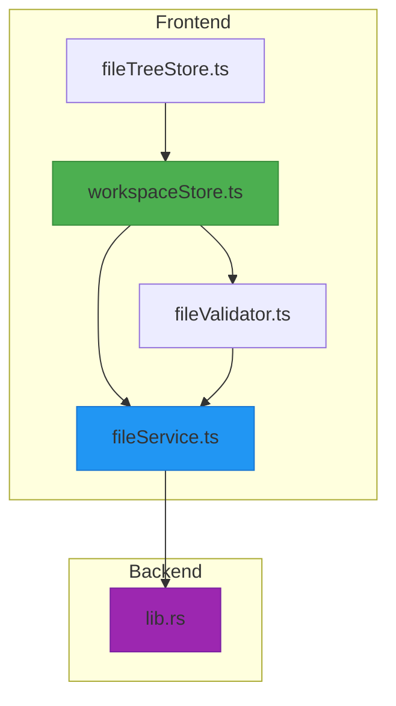
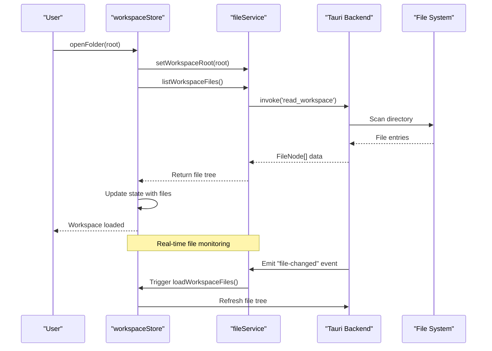
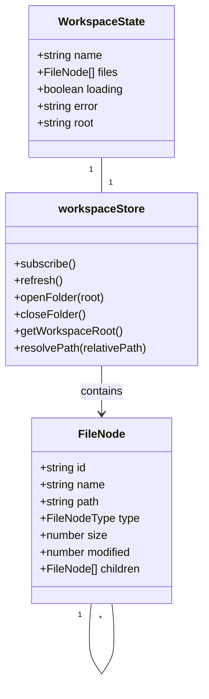
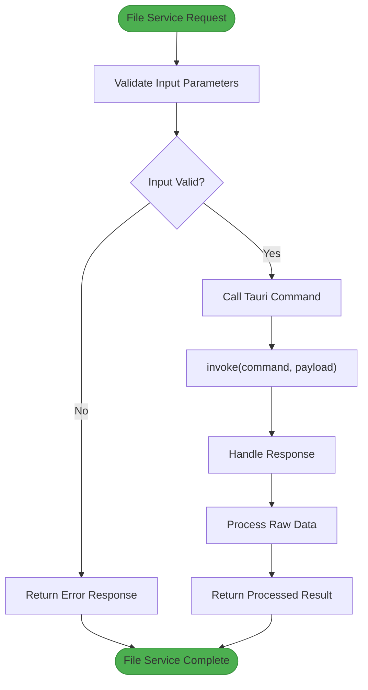
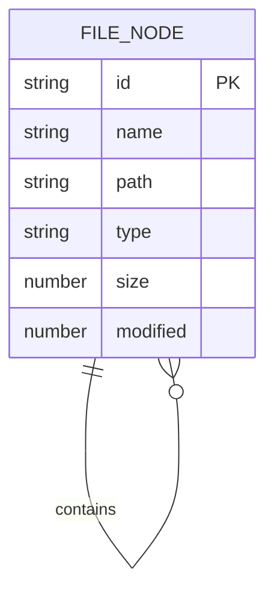
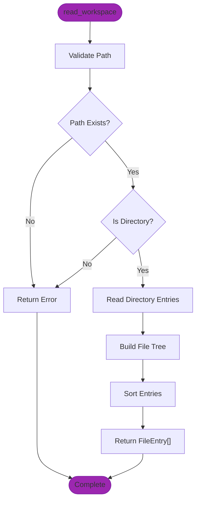

# Workspace Management

<cite>
**Referenced Files in This Document**   
- [workspaceStore.ts](file://src/lib/stores/workspaceStore.ts)
- [fileService.ts](file://src/lib/services/fileService.ts)
- [fileNode.ts](file://src/lib/types/fileNode.ts)
- [lib.rs](file://src-tauri/src/lib.rs)
- [fileTreeStore.ts](file://src/lib/stores/fileTreeStore.ts)
- [fileValidator.ts](file://src/lib/utils/fileValidator.ts)
</cite>

## Table of Contents
1. [Introduction](#introduction)
2. [Project Structure](#project-structure)
3. [Core Components](#core-components)
4. [Architecture Overview](#architecture-overview)
5. [Detailed Component Analysis](#detailed-component-analysis)
6. [Dependency Analysis](#dependency-analysis)
7. [Performance Considerations](#performance-considerations)
8. [Troubleshooting Guide](#troubleshooting-guide)
9. [Conclusion](#conclusion)

## Introduction
The NC code editor's workspace management system provides a robust mechanism for handling project folders and maintaining workspace state across sessions. This documentation details the implementation of workspace operations including opening, closing, and persistence, with a focus on the coordination between frontend stores and backend services. The system is built on a Svelte store architecture integrated with Tauri for native file system access, enabling seamless state synchronization and real-time file system monitoring. The workspaceStore.ts serves as the central component for managing workspace state, while various supporting components handle file operations, validation, and UI state coordination.

## Project Structure
The workspace management functionality is distributed across several key directories in the project structure. The core logic resides in the `src/lib/stores` directory with `workspaceStore.ts` as the primary component, supported by `fileService.ts` in `src/lib/services` for backend communication. The Tauri backend implementation is located in `src-tauri/src/lib.rs`, providing native file system operations. UI state for the file tree is managed in `fileTreeStore.ts`, while file validation logic is implemented in `fileValidator.ts`. The type definitions for file nodes are centralized in `fileNode.ts` to ensure consistency across the application.

**Diagram sources**
- [workspaceStore.ts](file://src/lib/stores/workspaceStore.ts)
- [fileService.ts](file://src/lib/services/fileService.ts)
- [lib.rs](file://src-tauri/src/lib.rs)

**Section sources**
- [workspaceStore.ts](file://src/lib/stores/workspaceStore.ts)
- [fileService.ts](file://src/lib/services/fileService.ts)
- [lib.rs](file://src-tauri/src/lib.rs)

## Core Components
The workspace management system consists of several interconnected components that work together to provide a seamless user experience. The `workspaceStore.ts` is the central store that maintains the current workspace state, including the file tree, loading status, and error conditions. It coordinates with `fileService.ts` to communicate with the Tauri backend for file operations. The `fileNode.ts` defines the data model for file and directory representations, ensuring consistency across the application. The `fileTreeStore.ts` manages UI-specific state for the file explorer, such as expanded directories and selected files, while `fileValidator.ts` handles file validation before opening in the editor.

**Section sources**
- [workspaceStore.ts](file://src/lib/stores/workspaceStore.ts)
- [fileService.ts](file://src/lib/services/fileService.ts)
- [fileNode.ts](file://src/lib/types/fileNode.ts)
- [fileTreeStore.ts](file://src/lib/stores/fileTreeStore.ts)
- [fileValidator.ts](file://src/lib/utils/fileValidator.ts)

## Architecture Overview
The workspace management architecture follows a clean separation between frontend state management and backend file operations. The frontend uses Svelte stores to maintain reactive state, while Tauri provides secure native access to the file system. When a workspace is opened, the `workspaceStore` coordinates with `fileService` to request the file tree from the Rust backend, which recursively scans the directory and returns structured data. File system changes are monitored through a watcher that emits events to refresh the workspace view. The architecture ensures that UI components remain decoupled from file system implementation details while providing real-time updates.

**Diagram sources**
- [workspaceStore.ts](file://src/lib/stores/workspaceStore.ts#L99-L103)
- [fileService.ts](file://src/lib/services/fileService.ts#L39-L42)
- [lib.rs](file://src-tauri/src/lib.rs#L248-L264)

## Detailed Component Analysis

### Workspace Store Analysis
The `workspaceStore.ts` is the central component responsible for managing workspace state in the NC code editor. It maintains the current workspace root, file tree, loading status, and error conditions. The store uses Svelte's writable store pattern to provide reactive state management for UI components. When a workspace is opened or closed, the store updates its internal state and triggers a refresh of the file tree through the file service. The store also handles error conditions gracefully, providing meaningful error messages when workspace operations fail.

**Diagram sources**
- [workspaceStore.ts](file://src/lib/stores/workspaceStore.ts#L11-L17)
- [fileNode.ts](file://src/lib/types/fileNode.ts#L10-L18)

**Section sources**
- [workspaceStore.ts](file://src/lib/stores/workspaceStore.ts)

### File Service Analysis
The `fileService.ts` acts as a bridge between the frontend application and the Tauri backend, providing a clean API for file operations. It encapsulates the complexity of Tauri's invoke mechanism, presenting a simple interface for reading files, listing workspace contents, and monitoring file changes. The service maintains the current workspace root and provides methods to set and retrieve this value. It also handles the connection between the frontend and the file system watcher, ensuring that UI components can respond to file changes in real time.

**Diagram sources**
- [fileService.ts](file://src/lib/services/fileService.ts#L15-L28)
- [lib.rs](file://src-tauri/src/lib.rs#L248-L279)

**Section sources**
- [fileService.ts](file://src/lib/services/fileService.ts)

### File Node Data Model
The `fileNode.ts` defines the data structure used to represent files and directories in the workspace. The `FileNode` interface includes essential properties such as id, name, path, and type (file or directory). Optional properties like size and modified timestamp provide additional metadata for display and sorting purposes. The recursive children property enables the representation of nested directory structures, allowing the UI to render a hierarchical file tree. This data model is shared between the frontend and backend, ensuring consistency in how file information is represented throughout the application.

**Diagram sources**
- [fileNode.ts](file://src/lib/types/fileNode.ts#L10-L18)
- [lib.rs](file://src-tauri/src/lib.rs#L123-L133)

**Section sources**
- [fileNode.ts](file://src/lib/types/fileNode.ts)

### Backend Implementation Analysis
The Tauri backend implementation in `lib.rs` provides the native file system operations required by the workspace management system. The `read_workspace` command recursively scans a directory up to a maximum depth (configured as 4 levels), building a hierarchical representation of the file structure. The implementation includes robust error handling, gracefully handling cases where directories cannot be read due to permission issues. File metadata such as size and modification time is captured and included in the response. The backend also implements a file watcher that monitors the workspace for changes and emits events to notify the frontend of modifications.

**Diagram sources**
- [lib.rs](file://src-tauri/src/lib.rs#L248-L264)
- [lib.rs](file://src-tauri/src/lib.rs#L221-L246)

**Section sources**
- [lib.rs](file://src-tauri/src/lib.rs)

## Dependency Analysis
The workspace management system demonstrates a well-structured dependency graph with clear separation of concerns. The frontend components depend on the file service for data access, while the file service depends on Tauri's invoke mechanism to communicate with the backend. The backend implementation has no dependencies on frontend code, maintaining a clean separation between UI and business logic. The file tree store depends on the workspace store for file data but maintains its own state for UI-specific concerns like expanded directories. This architecture enables independent development and testing of components while ensuring cohesive functionality.

**Diagram sources**
- [workspaceStore.ts](file://src/lib/stores/workspaceStore.ts)
- [fileService.ts](file://src/lib/services/fileService.ts)
- [lib.rs](file://src-tauri/src/lib.rs)
- [fileTreeStore.ts](file://src/lib/stores/fileTreeStore.ts)
- [fileValidator.ts](file://src/lib/utils/fileValidator.ts)

**Section sources**
- [workspaceStore.ts](file://src/lib/stores/workspaceStore.ts)
- [fileService.ts](file://src/lib/services/fileService.ts)
- [lib.rs](file://src-tauri/src/lib.rs)

## Performance Considerations
The workspace management system incorporates several performance optimizations to ensure responsive operation with large projects. The file tree is loaded asynchronously to prevent UI blocking, with a loading state displayed during the operation. The backend limits directory traversal to a maximum depth of 4 levels to prevent excessive resource consumption with deeply nested structures. File system events are debounced to avoid overwhelming the UI with rapid successive changes. For large files, the system implements validation to prevent opening files that exceed reasonable size limits (50MB), with additional optimizations applied to files over 10MB to maintain editor responsiveness.

**Section sources**
- [workspaceStore.ts](file://src/lib/stores/workspaceStore.ts#L37-L72)
- [fileValidator.ts](file://src/lib/utils/fileValidator.ts#L54-L86)
- [lib.rs](file://src-tauri/src/lib.rs#L167)

## Troubleshooting Guide
Common issues in workspace management typically involve invalid paths, permission errors, or network locations. When a workspace fails to open, the system provides specific error messages indicating whether the path does not exist or is not a directory. Permission issues are handled gracefully by returning empty directory listings rather than failing completely. For network locations, the system may experience delays or timeouts, which are handled through standard error mechanisms. Workspace migration between machines is supported as long as the file structure remains consistent, though absolute paths in configuration files may need adjustment. The file validation system prevents opening binary files in the text editor and provides clear warnings for files that are too large to edit efficiently.

**Section sources**
- [workspaceStore.ts](file://src/lib/stores/workspaceStore.ts#L63-L71)
- [lib.rs](file://src-tauri/src/lib.rs#L251-L262)
- [fileValidator.ts](file://src/lib/utils/fileValidator.ts)

## Conclusion
The NC code editor's workspace management system provides a robust and efficient solution for handling project folders and maintaining workspace state. Through a well-architected combination of frontend stores and backend services, the system delivers a seamless user experience with real-time file system monitoring and responsive UI updates. The clear separation between UI state and file operations enables maintainable code and facilitates future enhancements. The implementation demonstrates best practices in state management, error handling, and performance optimization, making it a reliable foundation for code editing workflows. The system's design accommodates both simple single-file projects and complex multi-directory workspaces, providing a consistent experience across different use cases.