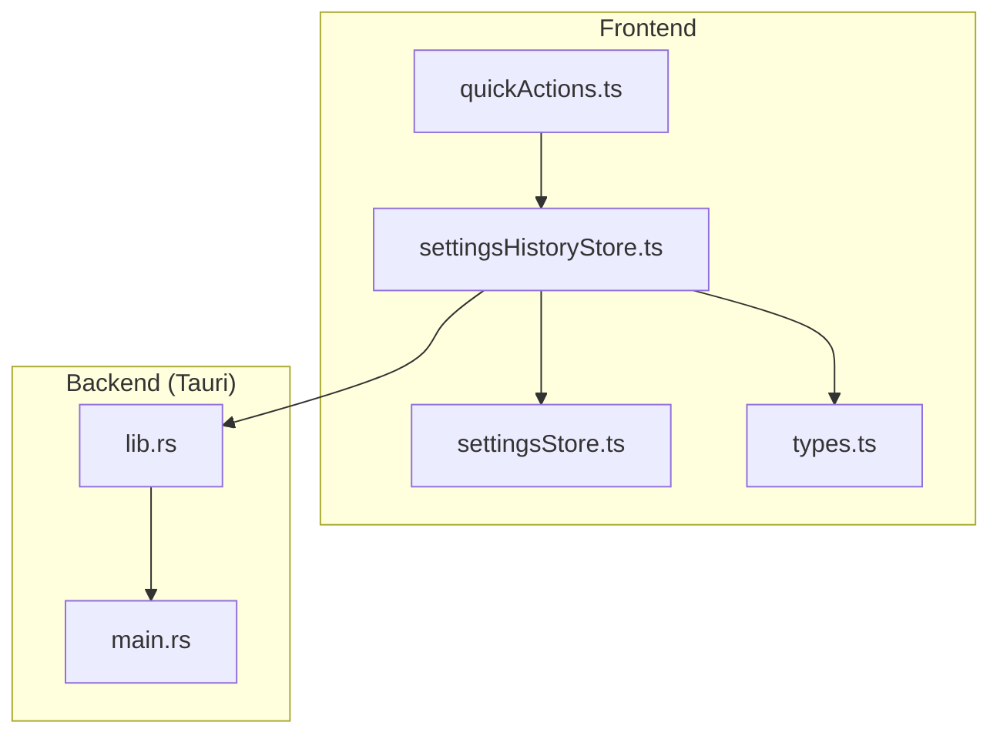
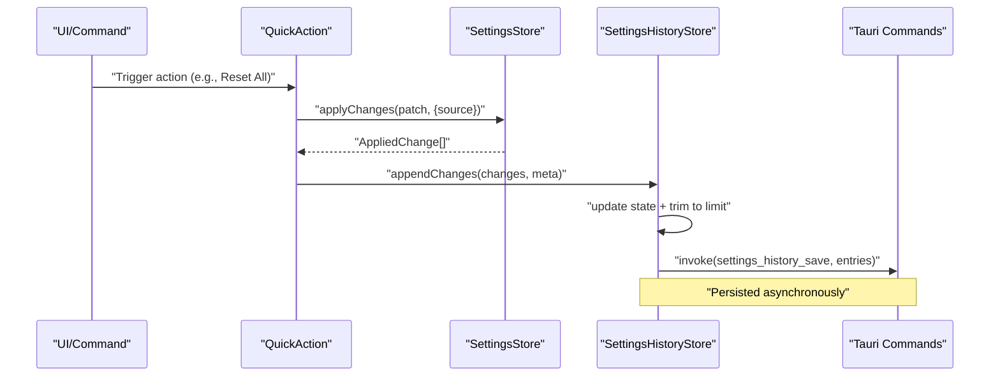
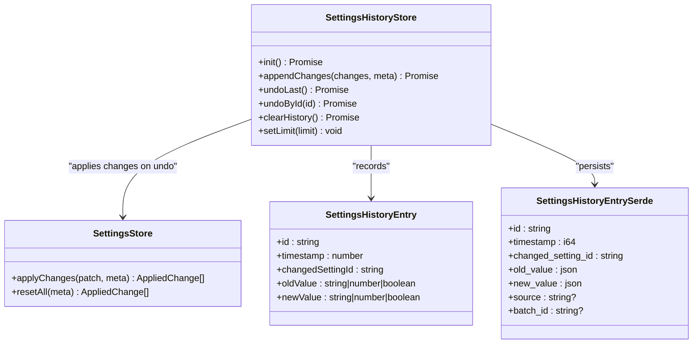
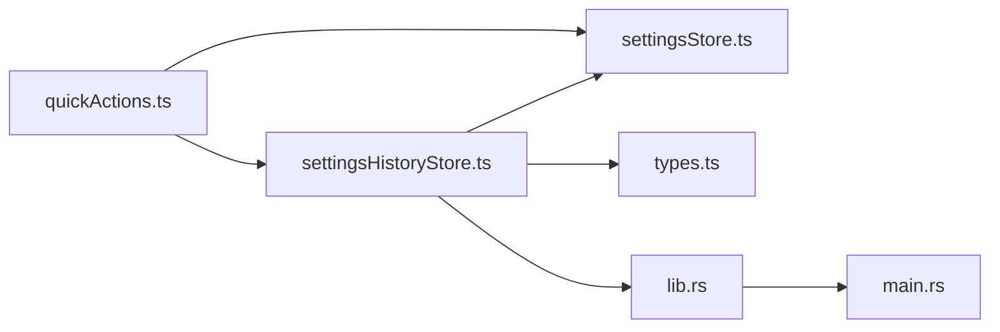

# Settings History

<cite>
**Referenced Files in This Document**
- [settingsHistoryStore.ts](file://src/lib/stores/settingsHistoryStore.ts)
- [settingsStore.ts](file://src/lib/stores/settingsStore.ts)
- [types.ts](file://src/lib/settings/types.ts)
- [quickActions.ts](file://src/lib/settings/quickActions.ts)
- [lib.rs](file://src-tauri/src/lib.rs)
- [main.rs](file://src-tauri/src/main.rs)
</cite>

## Table of Contents

1. [Introduction](#introduction)
2. [Project Structure](#project-structure)
3. [Core Components](#core-components)
4. [Architecture Overview](#architecture-overview)
5. [Detailed Component Analysis](#detailed-component-analysis)
6. [Dependency Analysis](#dependency-analysis)
7. [Performance Considerations](#performance-considerations)
8. [Troubleshooting Guide](#troubleshooting-guide)
9. [Conclusion](#conclusion)

## Introduction

This document explains the Settings History feature in the NC code editor. It covers how configuration changes are tracked over time to support undo/redo-like navigation, the data model for history entries, the maximum history size and cleanup strategy, the API for navigating and restoring previous configurations, examples of how user actions trigger history entries, the serialization format used to persist history, and how history is preserved across application restarts.

## Project Structure

The Settings History feature spans the frontend Svelte store and the Tauri backend commands:

- Frontend store: tracks in-memory history, applies undo/redo, and persists to disk via Tauri commands.
- Backend commands: load/save/clear history entries to a JSON file.

**Diagram sources**

- [settingsHistoryStore.ts](file://src/lib/stores/settingsHistoryStore.ts#L1-L304)
- [settingsStore.ts](file://src/lib/stores/settingsStore.ts#L1-L313)
- [types.ts](file://src/lib/settings/types.ts#L140-L192)
- [quickActions.ts](file://src/lib/settings/quickActions.ts#L1-L188)
- [lib.rs](file://src-tauri/src/lib.rs#L671-L702)
- [main.rs](file://src-tauri/src/main.rs#L1-L7)

**Section sources**

- [settingsHistoryStore.ts](file://src/lib/stores/settingsHistoryStore.ts#L1-L304)
- [lib.rs](file://src-tauri/src/lib.rs#L671-L702)

## Core Components

- SettingsHistoryStore: in-memory store that records timestamped changes, enforces a configurable limit, and integrates with Tauri for persistence.
- SettingsStore: applies changes to real settings and produces applied-change events used to populate history.
- Types: define the minimal contract for history entries and snapshots.
- QuickActions: triggers history entries for user-driven actions like reset-all, import, and profile creation.
- Tauri backend: provides commands to load/save/clear history entries persisted as JSON.

Key responsibilities:

- Track changes with timestamps, setting IDs, and old/new values.
- Enforce a maximum history size by trimming older entries.
- Provide undoLast and undoById APIs that restore previous values.
- Persist history to disk and restore on startup.

**Section sources**

- [settingsHistoryStore.ts](file://src/lib/stores/settingsHistoryStore.ts#L114-L304)
- [settingsStore.ts](file://src/lib/stores/settingsStore.ts#L248-L285)
- [types.ts](file://src/lib/settings/types.ts#L140-L192)
- [quickActions.ts](file://src/lib/settings/quickActions.ts#L117-L173)
- [lib.rs](file://src-tauri/src/lib.rs#L671-L702)

## Architecture Overview

The system uses a layered approach:

- UI and commands trigger changes via SettingsStore.applyChanges.
- SettingsHistoryStore.appendChanges records the change with metadata.
- Tauri commands persist history to a JSON file.
- On initialization, SettingsHistoryStore loads persisted entries and trims to limit.

**Diagram sources**

- [quickActions.ts](file://src/lib/settings/quickActions.ts#L117-L135)
- [settingsStore.ts](file://src/lib/stores/settingsStore.ts#L248-L285)
- [settingsHistoryStore.ts](file://src/lib/stores/settingsHistoryStore.ts#L144-L181)
- [lib.rs](file://src-tauri/src/lib.rs#L684-L692)

## Detailed Component Analysis

### SettingsHistoryStore

Responsibilities:

- Initialize from persisted history and enforce a configurable limit.
- Append changes with metadata (source, optional batchId).
- Undo last change or a specific entry by restoring old values.
- Clear history and adjust limit.

Data model:

- Extended history entry includes: id, timestamp, changedSettingId, oldValue, newValue, source, optional batchId.
- State holds entries array and limit.

Undo behavior:

- undoLast groups entries by batchId (contiguous from the end) and restores old values atomically.
- undoById groups by batchId if present, otherwise operates on a single entry.

Persistence:

- Uses Tauri invoke commands for load/save/clear.
- Asynchronous persistence avoids blocking updates.

Memory and limits:

- Maintains a bounded buffer; when exceeding limit, slices off older entries from the front.

**Section sources**

- [settingsHistoryStore.ts](file://src/lib/stores/settingsHistoryStore.ts#L32-L63)
- [settingsHistoryStore.ts](file://src/lib/stores/settingsHistoryStore.ts#L114-L181)
- [settingsHistoryStore.ts](file://src/lib/stores/settingsHistoryStore.ts#L183-L230)
- [settingsHistoryStore.ts](file://src/lib/stores/settingsHistoryStore.ts#L232-L265)
- [settingsHistoryStore.ts](file://src/lib/stores/settingsHistoryStore.ts#L267-L295)

### SettingsStore

Responsibilities:

- Provide a live snapshot of settings.
- Apply a patch of changes to real settings and return applied changes.
- Reset all settings to baseline.

Integration with history:

- Used by QuickActions to apply changes and by SettingsHistoryStore to restore values during undo.

**Section sources**

- [settingsStore.ts](file://src/lib/stores/settingsStore.ts#L248-L285)
- [settingsStore.ts](file://src/lib/stores/settingsStore.ts#L287-L300)

### Types

Defines the minimal contract for history entries and snapshots:

- SettingsHistoryEntry: id, timestamp, changedSettingId, oldValue, newValue.
- SettingsSnapshot: editor and theme parts.

These contracts ensure the history store remains decoupled from UI and focused on data.

**Section sources**

- [types.ts](file://src/lib/settings/types.ts#L140-L192)

### QuickActions

Examples of user-triggered history entries:

- Reset All: applies changes and appends a history entry with source "quickAction".
- Import JSON: applies changes and appends a history entry with source "import".
- Create Profile from Current: demonstrates optional batch recording with source "profile".

These show how user actions propagate through SettingsStore and into SettingsHistoryStore.

**Section sources**

- [quickActions.ts](file://src/lib/settings/quickActions.ts#L117-L135)
- [quickActions.ts](file://src/lib/settings/quickActions.ts#L161-L173)

### Tauri Backend (Persistence)

Backend commands:

- settings_history_load: reads history.json from the app config directory.
- settings_history_save: writes history entries to history.json.
- settings_history_clear: removes history.json.

Serialization format:

- History entries are serialized as JSON with fields aligned to SettingsHistoryEntrySerde:
  - id, timestamp, changed_setting_id, old_value, new_value, source, batch_id.
- Values are stored as JSON values to accommodate strings, numbers, booleans.

Startup behavior:

- SettingsHistoryStore.init loads persisted entries and trims to configured limit.

**Section sources**

- [lib.rs](file://src-tauri/src/lib.rs#L671-L702)
- [lib.rs](file://src-tauri/src/lib.rs#L86-L97)
- [settingsHistoryStore.ts](file://src/lib/stores/settingsHistoryStore.ts#L125-L141)

## Architecture Overview

**Diagram sources**

- [settingsHistoryStore.ts](file://src/lib/stores/settingsHistoryStore.ts#L40-L63)
- [settingsStore.ts](file://src/lib/stores/settingsStore.ts#L248-L285)
- [types.ts](file://src/lib/settings/types.ts#L171-L178)
- [lib.rs](file://src-tauri/src/lib.rs#L86-L97)

## Detailed Component Analysis

### Data Model and Serialization

- History entry fields:
  - id: unique identifier generated per entry.
  - timestamp: milliseconds since epoch.
  - changedSettingId: SettingId string.
  - oldValue/newValue: SettingValue (string | number | boolean).
  - source: one of user, profile, quickAction, command, import.
  - batchId: optional grouping for multi-setting undo batches.
- Backend serialization:
  - Fields map to SettingsHistoryEntrySerde with snake_case JSON keys.
  - Values are stored as JSON values to preserve types.

Impact on performance:

- JSON serialization is lightweight and compact for small to moderate histories.
- Large histories increase file size and IO overhead; limit controls memory and disk footprint.

**Section sources**

- [settingsHistoryStore.ts](file://src/lib/stores/settingsHistoryStore.ts#L32-L63)
- [lib.rs](file://src-tauri/src/lib.rs#L86-L97)

### Maximum History Size and Cleanup

- Initial limit is configurable (default 200).
- On appendChanges and setLimit, entries exceeding the limit are trimmed from the head.
- Persistence is asynchronous to avoid blocking updates.

Cleanup strategy:

- Head trimming ensures O(n) update cost when exceeding limit.
- Memory usage grows linearly with entries up to limit.

**Section sources**

- [settingsHistoryStore.ts](file://src/lib/stores/settingsHistoryStore.ts#L114-L181)
- [settingsHistoryStore.ts](file://src/lib/stores/settingsHistoryStore.ts#L280-L295)

### API Methods for Navigation and Restoration

- appendChanges(changes, meta):
  - Creates entries with timestamp and metadata; enforces limit and persists asynchronously.
- undoLast():
  - Groups by batchId from the end; restores old values via SettingsStore.applyChanges; removes consumed entries; persists.
- undoById(id):
  - Finds target entry; groups by batchId if present; restores old values; removes consumed entries; persists.
- clearHistory():
  - Empties in-memory entries and invokes backend clear.
- setLimit(limit):
  - Trims entries to new limit and persists.

Batching:

- batchId allows grouping multiple related changes for a single undo operation.

**Section sources**

- [settingsHistoryStore.ts](file://src/lib/stores/settingsHistoryStore.ts#L144-L181)
- [settingsHistoryStore.ts](file://src/lib/stores/settingsHistoryStore.ts#L183-L230)
- [settingsHistoryStore.ts](file://src/lib/stores/settingsHistoryStore.ts#L232-L265)
- [settingsHistoryStore.ts](file://src/lib/stores/settingsHistoryStore.ts#L267-L295)

### How User Actions Trigger History Entries

- Reset All:
  - settingsStore.resetAll returns applied changes; QuickAction appends them to history with source "quickAction".
- Import JSON:
  - QuickAction applies changes and appends them to history with source "import".
- Create Profile from Current:
  - Demonstrates optional batch recording with source "profile".

These flows illustrate how user actions flow through SettingsStore and into SettingsHistoryStore.

**Section sources**

- [quickActions.ts](file://src/lib/settings/quickActions.ts#L117-L135)
- [quickActions.ts](file://src/lib/settings/quickActions.ts#L161-L173)

### Preserving History Across Application Restarts

- On init, SettingsHistoryStore.loadHistoryFromBackend retrieves persisted entries.
- If loaded entries exceed limit, they are truncated to the current limit.
- Subsequent app runs continue from the persisted state.

**Section sources**

- [settingsHistoryStore.ts](file://src/lib/stores/settingsHistoryStore.ts#L125-L141)
- [lib.rs](file://src-tauri/src/lib.rs#L674-L682)

## Dependency Analysis

**Diagram sources**

- [quickActions.ts](file://src/lib/settings/quickActions.ts#L117-L135)
- [settingsHistoryStore.ts](file://src/lib/stores/settingsHistoryStore.ts#L144-L181)
- [settingsStore.ts](file://src/lib/stores/settingsStore.ts#L248-L285)
- [types.ts](file://src/lib/settings/types.ts#L140-L192)
- [lib.rs](file://src-tauri/src/lib.rs#L671-L702)
- [main.rs](file://src-tauri/src/main.rs#L1-L7)

**Section sources**

- [settingsHistoryStore.ts](file://src/lib/stores/settingsHistoryStore.ts#L1-L304)
- [settingsStore.ts](file://src/lib/stores/settingsStore.ts#L1-L313)
- [lib.rs](file://src-tauri/src/lib.rs#L671-L702)

## Performance Considerations

- Memory:
  - In-memory entries are bounded by limit; head trimming keeps memory usage predictable.
- Disk IO:
  - Asynchronous persistence avoids blocking UI updates; frequent writes may occur on appendChanges.
- Serialization:
  - JSON serialization is efficient for small to moderate histories; large histories increase file size and IO.
- Undo operations:
  - undoLast/undoById reconstruct patches from history entries and apply via SettingsStore.applyChanges; batching reduces the number of apply operations.

[No sources needed since this section provides general guidance]

## Troubleshooting Guide

Common issues and resolutions:

- History not restored on startup:
  - Verify settings_history_load returns entries and that the file exists in the app config directory.
- Undo does nothing:
  - Ensure entries exist; undoLast operates only on the last entry; undoById requires a valid entry id.
- Excessive memory usage:
  - Reduce limit via setLimit; confirm trimming occurs on appendChanges and setLimit.
- Persistence errors:
  - Tauri invoke failures are caught and ignored to keep in-memory state consistent; check backend logs for file write/read errors.

**Section sources**

- [settingsHistoryStore.ts](file://src/lib/stores/settingsHistoryStore.ts#L125-L141)
- [settingsHistoryStore.ts](file://src/lib/stores/settingsHistoryStore.ts#L183-L230)
- [settingsHistoryStore.ts](file://src/lib/stores/settingsHistoryStore.ts#L267-L295)
- [lib.rs](file://src-tauri/src/lib.rs#L674-L702)

## Conclusion

The Settings History feature provides robust, user-driven change tracking with undo/redo semantics. It records timestamped, typed changes, enforces a configurable limit, and persists history to disk for continuity across sessions. The design cleanly separates concerns: SettingsStore applies changes, SettingsHistoryStore records and restores them, and Tauri handles persistence. The API supports both single-entry and batched undo, enabling flexible restoration workflows.
