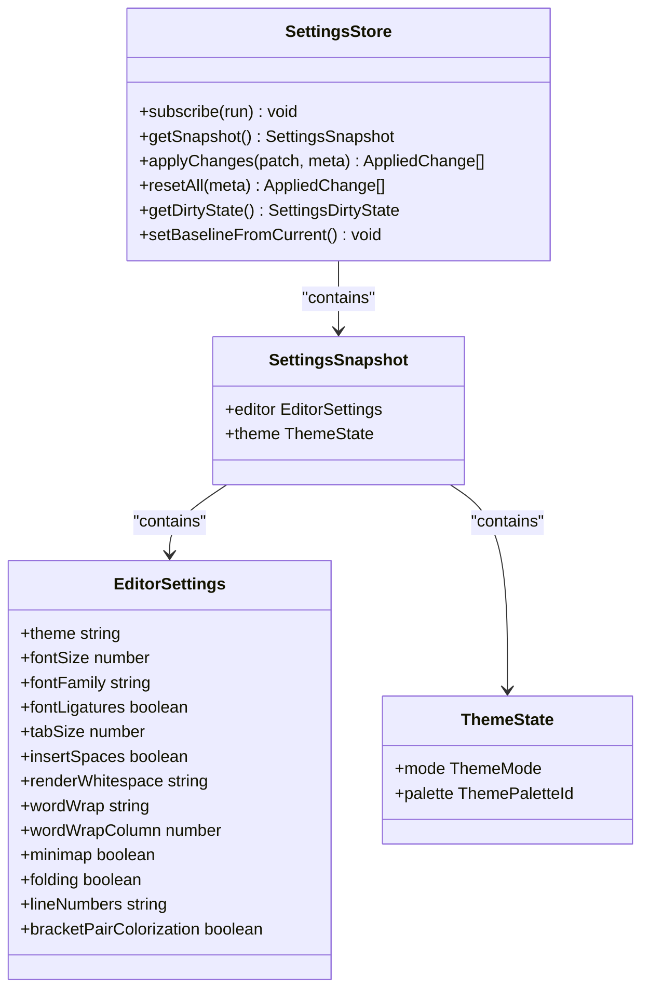
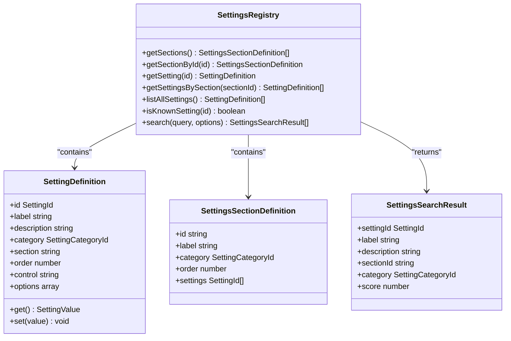
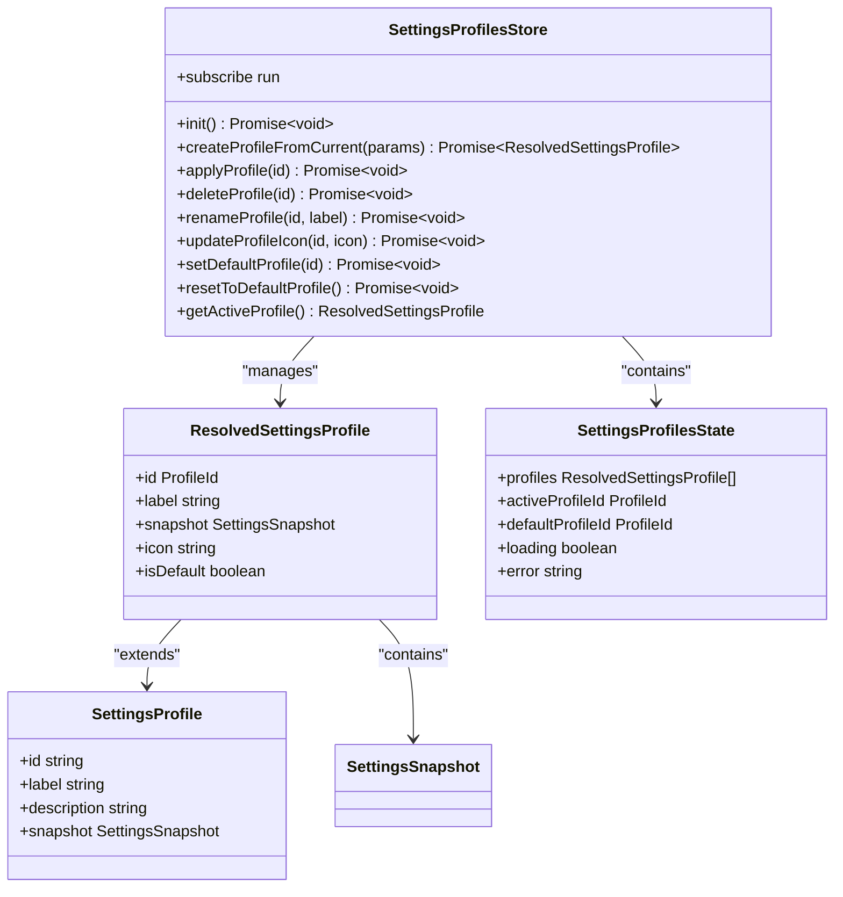
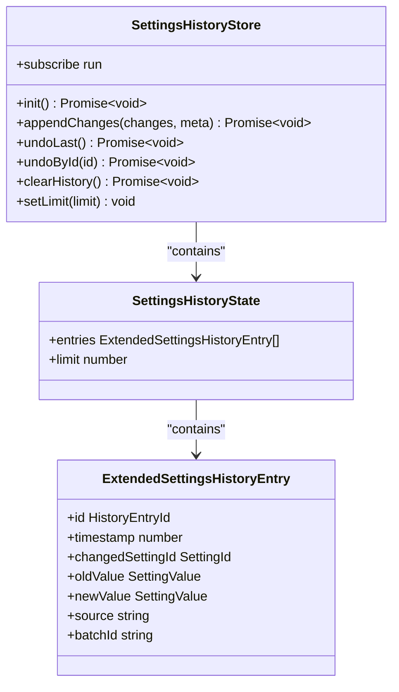
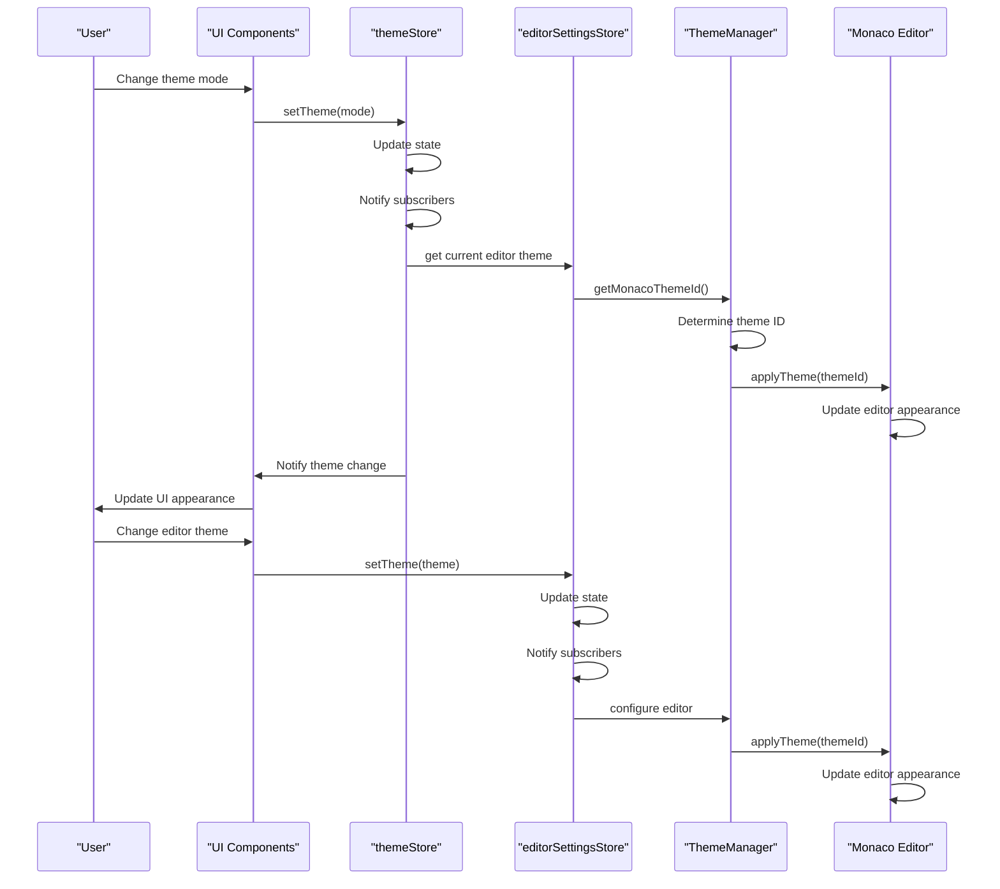

# Settings Management

<cite>
**Referenced Files in This Document**   
- [registry.ts](file://src/lib/settings/registry.ts)
- [types.ts](file://src/lib/settings/types.ts)
- [settingsStore.ts](file://src/lib/stores/settingsStore.ts)
- [settingsProfilesStore.ts](file://src/lib/stores/settingsProfilesStore.ts)
- [settingsHistoryStore.ts](file://src/lib/stores/settingsHistoryStore.ts)
- [themeStore.ts](file://src/lib/stores/themeStore.ts)
- [editorSettingsStore.ts](file://src/lib/stores/editorSettingsStore.ts)
- [THEME_PALETTES.ts](file://src/lib/stores/THEME_PALETTES.ts)
- [themeManager.ts](file://src/lib/editor/themeManager.ts)
- [EditorCore.ts](file://src/lib/editor/EditorCore.ts)
- [commands.ts](file://src/lib/settings/commands.ts)
- [quickActions.ts](file://src/lib/settings/quickActions.ts)
</cite>

## Table of Contents
1. [Introduction](#introduction)
2. [Settings Store](#settings-store)
3. [Settings Registry](#settings-registry)
4. [Settings Profiles](#settings-profiles)
5. [Settings History](#settings-history)
6. [Settings Synchronization](#settings-synchronization)
7. [Settings File Format and Location](#settings-file-format-and-location)
8. [Common Settings Configurations](#common-settings-configurations)
9. [Conclusion](#conclusion)

## Introduction
The NC code editor implements a comprehensive settings management system that enables users to customize their development environment through a flexible and persistent configuration framework. This system provides mechanisms for storing, retrieving, and synchronizing user preferences across different components of the application. The architecture is built around a centralized settings store that maintains application configuration in memory while persisting it to disk through Tauri backend integration. The system supports advanced features such as settings profiles for managing different configuration sets, history tracking for monitoring changes over time, and a registry that defines all available configuration options with their types, defaults, and validation rules.

The settings management system is designed with a modular architecture that separates concerns between different aspects of configuration management. The core components include the settings store for maintaining the current state, the settings registry for defining available options, the profiles system for managing different configuration sets, and the history system for tracking changes. These components work together to provide a cohesive user experience while maintaining clean separation of responsibilities.

**Section sources**
- [registry.ts](file://src/lib/settings/registry.ts#L1-L558)
- [types.ts](file://src/lib/settings/types.ts#L1-L192)
- [settingsStore.ts](file://src/lib/stores/settingsStore.ts#L1-L313)

## Settings Store
The settings store serves as the central in-memory repository for all application configuration in the NC code editor. Implemented as a Svelte readable store, it provides a unified interface for accessing and modifying settings while maintaining reactivity throughout the application. The store orchestrates multiple domain-specific stores, including editor settings and theme settings, to provide a comprehensive snapshot of the current application state.

The settings store implements a baseline snapshot mechanism that enables tracking of changes and supports reset operations. When initialized, it captures the current state as the baseline against which all subsequent changes are compared. This design allows the system to determine when settings have been modified from their default or saved state, providing visual feedback to users about unsaved changes. The store exposes methods for applying changes, resetting to baseline, and retrieving the current dirty state.

The implementation follows a read-only snapshot pattern where the current state is computed on demand from the underlying domain stores. This approach eliminates state duplication and ensures consistency across the application. The store subscribes to changes in the editor settings and theme stores, automatically updating its internal snapshot whenever changes occur. This reactive design ensures that all consumers of the settings store receive up-to-date information without requiring manual synchronization.

**Diagram sources**
- [settingsStore.ts](file://src/lib/stores/settingsStore.ts#L67-L85)
- [types.ts](file://src/lib/settings/types.ts#L148-L152)

**Section sources**
- [settingsStore.ts](file://src/lib/stores/settingsStore.ts#L1-L313)
- [types.ts](file://src/lib/settings/types.ts#L148-L152)

## Settings Registry
The settings registry provides a centralized definition of all available configuration options in the NC code editor. It serves as the single source of truth for settings metadata, including their types, default values, validation rules, and user interface presentation. The registry organizes settings into logical sections and categories, enabling structured navigation and search capabilities within the settings interface.

Each setting in the registry is defined by a `SettingDefinition` interface that includes properties such as the setting ID, human-readable label, description, category, section, control type, and functions for getting and setting the value. The control type property specifies the appropriate UI component for editing the setting, such as toggle, select, slider, or text input. The get and set functions provide a clean abstraction layer between the UI and the underlying storage mechanism, ensuring that all setting operations go through a consistent interface.

The registry also implements a search functionality that allows users to find settings by keyword. The search algorithm scores results based on how well the query matches the setting ID, label, and description, providing relevant results even for partial or fuzzy queries. This feature is integrated with the command palette, enabling users to quickly access and modify settings through keyboard-driven workflows.

**Diagram sources**
- [registry.ts](file://src/lib/settings/registry.ts#L45-L60)
- [types.ts](file://src/lib/settings/types.ts#L69-L122)

**Section sources**
- [registry.ts](file://src/lib/settings/registry.ts#L1-L558)
- [types.ts](file://src/lib/settings/types.ts#L31-L122)

## Settings Profiles
The settings profiles system enables users to save and switch between different sets of configuration options in the NC code editor. This feature is particularly useful for developers who work on different types of projects or prefer different configurations for various tasks. The profiles store maintains a collection of named configuration snapshots that can be applied to the application with a single operation.

Each profile contains a unique identifier, label, description, and a complete snapshot of the application settings at the time of creation. The system supports marking one profile as the default, which is automatically applied when the application starts. Users can create new profiles from the current settings, apply existing profiles, delete unused profiles, and rename profiles to better reflect their purpose.

The profiles system is integrated with the Tauri backend for persistent storage, ensuring that profiles are preserved between application sessions. When a profile is applied, the system computes the differences between the current settings and the target profile, then applies the necessary changes through the settings store. This approach ensures that all setting changes go through the proper channels, triggering any associated side effects such as UI updates or editor reconfiguration.

**Diagram sources**
- [settingsProfilesStore.ts](file://src/lib/stores/settingsProfilesStore.ts#L49-L64)
- [types.ts](file://src/lib/settings/types.ts#L159-L164)

**Section sources**
- [settingsProfilesStore.ts](file://src/lib/stores/settingsProfilesStore.ts#L1-L426)
- [types.ts](file://src/lib/settings/types.ts#L159-L164)

## Settings History
The settings history system tracks changes to user preferences over time, providing an undo mechanism and audit trail for configuration modifications. This feature allows users to revert unwanted changes and understand how their settings have evolved. The history store maintains a record of all setting modifications, including the previous and new values, timestamp, and source of the change.

Each history entry captures the setting ID, old value, new value, timestamp, and source of the change (such as user interaction, profile application, or quick action). The system supports batch operations where multiple related changes are grouped together, enabling atomic undo of complex operations. The history is limited to a configurable number of entries to prevent excessive memory usage, with older entries being automatically removed when the limit is exceeded.

The history system is integrated with the settings store and profiles system, automatically recording changes made through any interface. When a user applies a profile or uses a quick action to modify settings, the system creates appropriate history entries to document the changes. The undo functionality works by applying the inverse of the recorded changes, effectively restoring the previous state of the affected settings.

**Diagram sources**
- [settingsHistoryStore.ts](file://src/lib/stores/settingsHistoryStore.ts#L45-L62)
- [types.ts](file://src/lib/settings/types.ts#L171-L177)

**Section sources**
- [settingsHistoryStore.ts](file://src/lib/stores/settingsHistoryStore.ts#L1-L304)
- [types.ts](file://src/lib/settings/types.ts#L171-L177)

## Settings Synchronization
The NC code editor implements a sophisticated synchronization system that ensures consistency between UI themes and editor themes. This system uses a theme manager to coordinate the appearance of the application interface with the code editor, providing a cohesive visual experience. The synchronization is achieved through a combination of reactive stores and theme mapping logic that translates UI theme selections to appropriate editor configurations.

The theme system is built around a palette-based approach where users can select from multiple color schemes for both light and dark modes. When a user changes the UI theme or palette, the system automatically updates the editor theme to match. This is accomplished through a theme manager that creates custom Monaco editor themes based on the selected UI palette. The manager generates theme definitions that use colors from the selected palette, ensuring visual harmony between the editor and the rest of the application interface.

The synchronization process is bidirectional, allowing changes in the editor theme setting to also affect the UI appearance when appropriate. The system handles edge cases such as invalid theme references and provides fallback mechanisms to ensure a consistent user experience. The theme manager also supports popular third-party themes like Monokai and Dracula, which are loaded asynchronously to avoid impacting application startup performance.

**Diagram sources**
- [themeStore.ts](file://src/lib/stores/themeStore.ts#L36-L120)
- [editorSettingsStore.ts](file://src/lib/stores/editorSettingsStore.ts#L32-L180)
- [themeManager.ts](file://src/lib/editor/themeManager.ts#L34-L274)
- [EditorCore.ts](file://src/lib/editor/EditorCore.ts#L346-L891)

**Section sources**
- [themeStore.ts](file://src/lib/stores/themeStore.ts#L1-L120)
- [editorSettingsStore.ts](file://src/lib/stores/editorSettingsStore.ts#L1-L180)
- [THEME_PALETTES.ts](file://src/lib/stores/THEME_PALETTES.ts#L1-L314)
- [themeManager.ts](file://src/lib/editor/themeManager.ts#L1-L274)
- [EditorCore.ts](file://src/lib/editor/EditorCore.ts#L1-L891)

## Settings File Format and Location
The NC code editor stores user settings in JSON format, providing a human-readable and easily editable configuration file. The settings are persisted to disk through the Tauri backend, which handles file system operations securely and efficiently. The primary settings file contains the current application configuration, while additional files store settings profiles and history data.

The main settings file follows a structured format that mirrors the in-memory representation of the settings store. It includes sections for editor configuration, theme settings, and other application preferences. Each setting is represented as a key-value pair, with the key corresponding to the setting ID defined in the settings registry. The file is automatically created with default values when the application is first launched, ensuring a consistent starting point for new users.

Settings profiles are stored in a separate file that contains an array of profile objects, each with its own configuration snapshot. This separation allows users to share profiles between installations or back up their preferred configurations. The history data is stored in a dedicated file that maintains a chronological record of setting changes, enabling the undo functionality and providing an audit trail of configuration modifications.

**Section sources**
- [settingsProfilesStore.ts](file://src/lib/stores/settingsProfilesStore.ts#L150-L159)
- [quickActions.ts](file://src/lib/settings/quickActions.ts#L48-L63)
- [settingsHistoryStore.ts](file://src/lib/stores/settingsHistoryStore.ts#L84-L91)

## Common Settings Configurations
The NC code editor supports several common settings configurations that cater to different development workflows and preferences. These configurations can be applied individually or combined to create a personalized development environment. The most frequently modified settings include editor theme, font size, tab behavior, and code folding options.

For developers who prefer a dark development environment, a popular configuration includes the "Dark / Default" theme with the Monokai editor theme, a font size of 14px, and the Fira Code font with ligatures enabled. This setup provides high contrast and excellent readability for extended coding sessions. Users working in shared or brightly lit environments often prefer a light theme configuration with the "Light / Default" UI theme and the "GitHub Light" editor theme.

Another common configuration focuses on code organization and navigation, enabling features like minimap, bracket pair colorization, and relative line numbers. This setup helps developers maintain spatial awareness within their code and quickly identify structural elements. For users working with multiple files or complex projects, configurations that optimize tab behavior—such as setting tab size to 4 spaces and enabling word wrap at column 80—are particularly popular.

The settings system also supports specialized configurations for specific development tasks. For example, a "presentation mode" configuration might increase the font size to 18px, disable line numbers and minimap, and use a high-contrast theme to make code more visible during demonstrations. A "distraction-free" configuration could hide all UI elements except the editor, enable word wrap, and use a soft color palette to minimize visual distractions.

**Section sources**
- [registry.ts](file://src/lib/settings/registry.ts#L128-L429)
- [editorSettingsStore.ts](file://src/lib/stores/editorSettingsStore.ts#L34-L49)
- [THEME_PALETTES.ts](file://src/lib/stores/THEME_PALETTES.ts#L75-L155)

## Conclusion
The settings management system in the NC code editor provides a comprehensive and flexible framework for customizing the development environment. By combining a centralized settings store with a well-defined registry, profiles system, and history tracking, the system offers users powerful tools for managing their preferences. The architecture ensures consistency across the application while providing advanced features that enhance productivity and user experience.

The implementation demonstrates careful attention to performance and usability, with asynchronous operations for loading external themes and efficient change tracking to minimize memory usage. The integration between UI themes and editor themes creates a cohesive visual experience, while the support for profiles and history enables sophisticated configuration management. The system's modular design allows for future enhancements while maintaining stability and backward compatibility.

Overall, the settings management system in the NC code editor represents a thoughtful balance between simplicity and power, providing intuitive controls for common preferences while offering advanced capabilities for experienced users. The comprehensive API and well-documented architecture make it easy for developers to extend the system with new settings and integrations, ensuring that the editor can evolve to meet changing development needs.