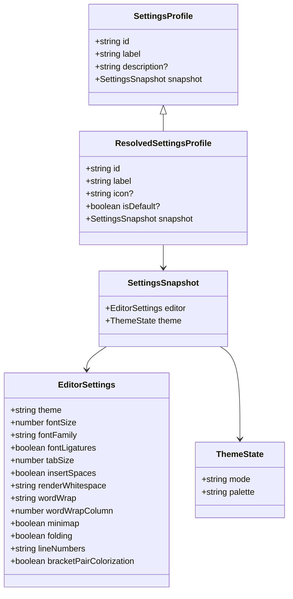
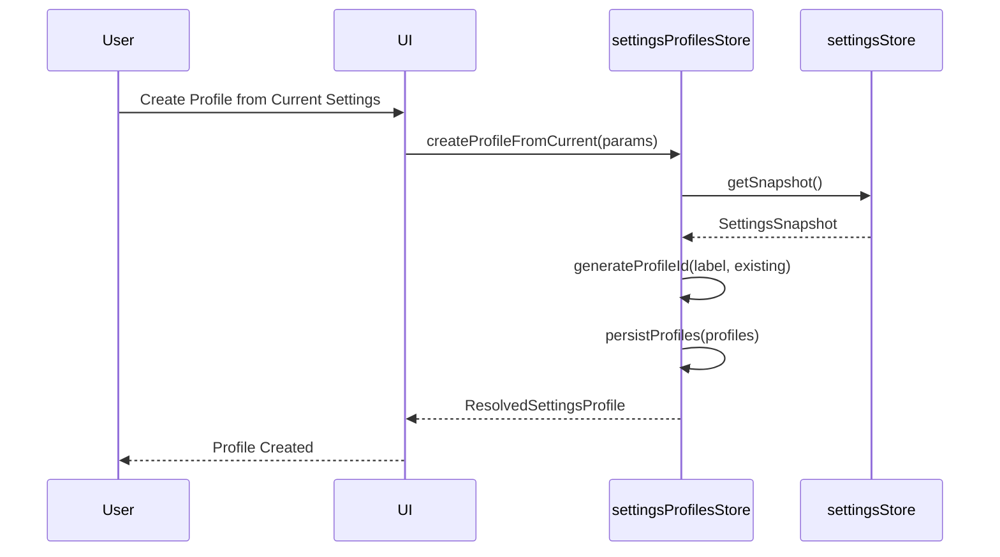
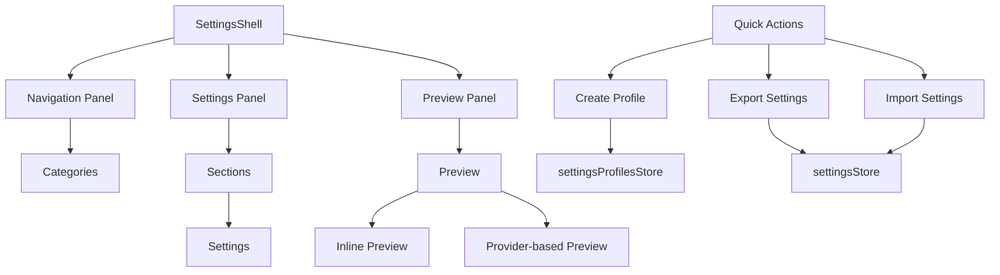
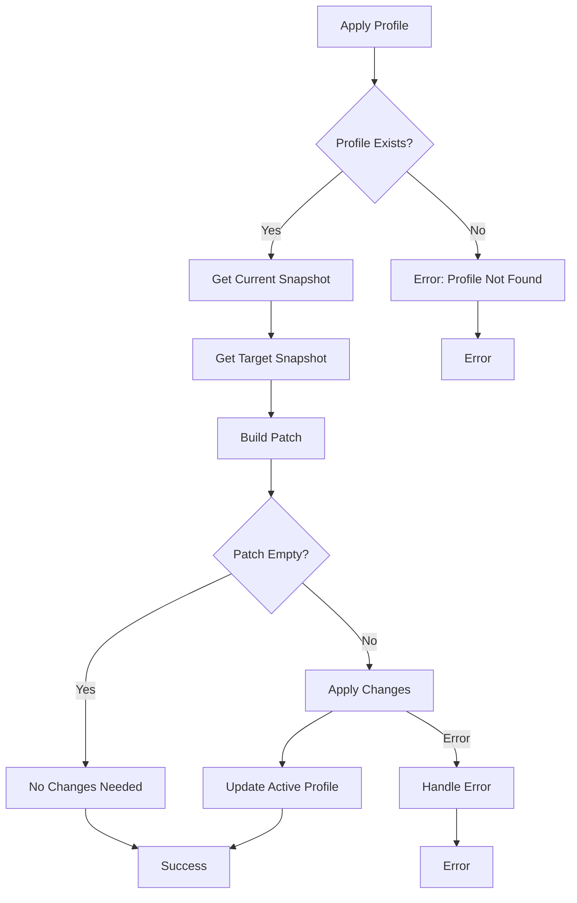

# Settings Profiles

<cite>
**Referenced Files in This Document**   
- [settingsProfilesStore.ts](file://src/lib/stores/settingsProfilesStore.ts)
- [types.ts](file://src/lib/settings/types.ts)
- [registry.ts](file://src/lib/settings/registry.ts)
- [settingsStore.ts](file://src/lib/stores/settingsStore.ts)
- [lib.rs](file://src-tauri/src/lib.rs)
- [quickActions.ts](file://src/lib/settings/quickActions.ts)
</cite>

## Table of Contents

1. [Introduction](#introduction)
2. [Data Model](#data-model)
3. [Profile Management](#profile-management)
4. [UI Components](#ui-components)
5. [Import/Export Functionality](#importexport-functionality)
6. [Profile Application and Conflict Resolution](#profile-application-and-conflict-resolution)
7. [Storage Format and Location](#storage-format-and-location)
8. [Conclusion](#conclusion)

## Introduction

The Settings Profiles system in the NC code editor allows users to create, save, and switch between different sets of configuration preferences. This feature enables users to maintain multiple configurations for different projects or workflows and quickly switch between them. The system is built on a robust architecture that ensures consistency and reliability while providing a user-friendly interface for managing profiles.

**Section sources**

- [settingsProfilesStore.ts](file://src/lib/stores/settingsProfilesStore.ts#L1-L426)

## Data Model

The data model for settings profiles is defined by the `SettingsProfile` and `ResolvedSettingsProfile` interfaces. A profile includes a unique identifier, a label, an optional icon, a flag indicating if it's the default profile, and a snapshot of the current settings.

The `SettingsSnapshot` interface captures the state of the editor and theme settings at a given point in time. It includes properties for the editor settings (such as font size, tab size, and font family) and theme settings (such as color mode and palette).



**Diagram sources**

- [types.ts](file://src/lib/settings/types.ts#L159-L164)
- [settingsProfilesStore.ts](file://src/lib/stores/settingsProfilesStore.ts#L33-L39)

## Profile Management

Users can create, save, and switch between different sets of configuration preferences through the Settings Profiles system. The `settingsProfilesStore` provides methods for creating a new profile from the current settings, applying a profile, deleting a profile, renaming a profile, updating a profile's icon, setting a profile as the default, and resetting to the default profile.

The `createProfileFromCurrent` method creates a new profile using the current settings snapshot. It generates a unique identifier based on the profile label and ensures that no two profiles have the same ID. If the new profile is marked as the default, it updates the `isDefault` flag for all other profiles to false.

The `applyProfile` method applies a profile by comparing the current settings snapshot with the target profile's snapshot and generating a patch of changes. It then applies these changes to the active settings store using the `applyChanges` method.



**Diagram sources**

- [settingsProfilesStore.ts](file://src/lib/stores/settingsProfilesStore.ts#L232-L281)
- [settingsStore.ts](file://src/lib/stores/settingsStore.ts#L72-L75)

**Section sources**

- [settingsProfilesStore.ts](file://src/lib/stores/settingsProfilesStore.ts#L51-L63)

## UI Components

The UI components for managing settings profiles are integrated into the settings interface. The `SettingsShell` component provides a three-panel layout for navigating, viewing, and editing settings. The left panel displays the navigation categories, the middle panel shows the settings sections, and the right panel provides a preview of the selected setting.

The `settingsPreviewStore` manages the state of the preview panel, including the active setting, related settings, and help text. It resolves the preview for a given setting by checking for an inline preview configuration or a provider-based preview.

The `quickActions` module provides a set of predefined actions that can be triggered from the UI, including creating a profile from the current settings, exporting settings as JSON, and importing settings from JSON.



**Diagram sources**

- [settingsPreviewStore.ts](file://src/lib/stores/settingsPreviewStore.ts#L74-L80)
- [quickActions.ts](file://src/lib/settings/quickActions.ts#L148-L187)

**Section sources**

- [settingsPreviewStore.ts](file://src/lib/stores/settingsPreviewStore.ts#L1-L214)
- [quickActions.ts](file://src/lib/settings/quickActions.ts#L117-L188)

## Import/Export Functionality

The import/export functionality allows users to share profiles between installations. The `exportSettingsAsJson` and `importSettingsFromJson` functions are available as quick actions in the settings interface.

When exporting settings, the current settings snapshot is serialized to JSON format and can be saved to a file. When importing settings, a JSON file is read and parsed, and the settings are applied to the active settings store. This allows users to transfer their configuration preferences between different installations of the NC code editor.

The import process uses the `applyChanges` method to apply the settings from the imported JSON file, ensuring that any conflicts are resolved according to the conflict resolution strategy.

**Section sources**

- [quickActions.ts](file://src/lib/settings/quickActions.ts#L176-L185)

## Profile Application and Conflict Resolution

When applying a profile, the system compares the current settings snapshot with the target profile's snapshot and generates a patch of changes. This patch is then applied to the active settings store using the `applyChanges` method.

The conflict resolution strategy ensures that settings are updated consistently and predictably. If a setting has been modified since the profile was created, the new value from the profile takes precedence. This ensures that the applied profile fully reflects the intended configuration.

The `applyChanges` method in the `settingsStore` applies the patch of changes and returns a list of applied changes, which can be used for logging or auditing purposes. If any errors occur during the application of changes, they are caught and handled gracefully, ensuring that the system remains stable.



**Diagram sources**

- [settingsProfilesStore.ts](file://src/lib/stores/settingsProfilesStore.ts#L283-L304)
- [settingsStore.ts](file://src/lib/stores/settingsStore.ts#L248-L285)

**Section sources**

- [settingsProfilesStore.ts](file://src/lib/stores/settingsProfilesStore.ts#L283-L304)
- [settingsStore.ts](file://src/lib/stores/settingsStore.ts#L248-L285)

## Storage Format and Location

Profile data is stored in JSON format on the filesystem. The storage location is determined by the Tauri application's configuration directory, which is platform-specific. On Windows, it is typically located in `%APPDATA%\[app-name]`, on macOS in `~/Library/Application Support/[app-name]`, and on Linux in `~/.config/[app-name]`.

The `settings_profiles_load` and `settings_profiles_save` Tauri commands are used to load and save profile data. These commands are implemented in Rust and interact with the filesystem to read and write the JSON files.

The `SettingsProfileSerde` struct in the Rust code defines the serialization format for profile data. It includes fields for the profile ID, label, snapshot, icon, and default status. The snapshot is stored as a JSON value, allowing for flexible and extensible storage of settings.

```mermaid
erDiagram
SETTINGS_PROFILE {
string id PK
string label
json snapshot
string icon?
boolean is_default
}
```

**Diagram sources**

- [lib.rs](file://src-tauri/src/lib.rs#L76-L84)

**Section sources**

- [settingsProfilesStore.ts](file://src/lib/stores/settingsProfilesStore.ts#L150-L164)
- [lib.rs](file://src-tauri/src/lib.rs#L76-L84)

## Conclusion

The Settings Profiles system in the NC code editor provides a powerful and flexible way for users to manage their configuration preferences. By allowing users to create, save, and switch between different sets of settings, it enhances productivity and customization. The system is built on a robust architecture that ensures consistency and reliability, with a user-friendly interface for managing profiles. The import/export functionality enables sharing profiles between installations, and the conflict resolution strategy ensures that settings are updated predictably. The storage format and location are designed to be platform-agnostic and secure, leveraging the Tauri framework's capabilities.
