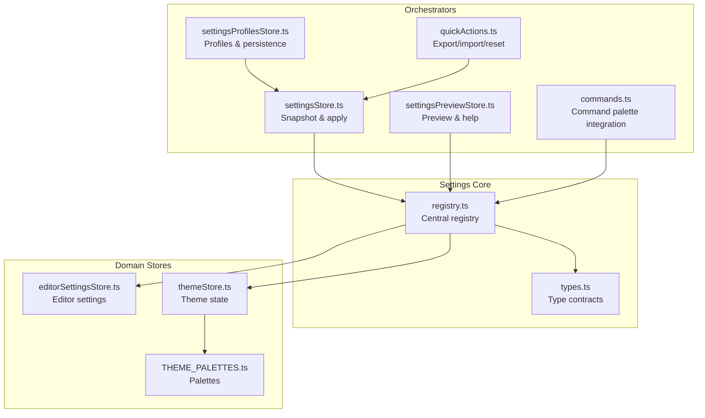
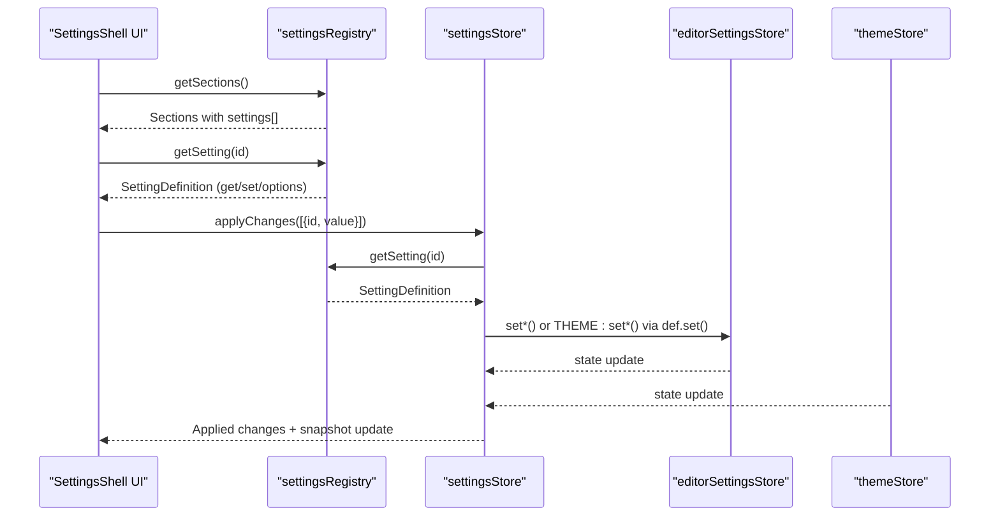
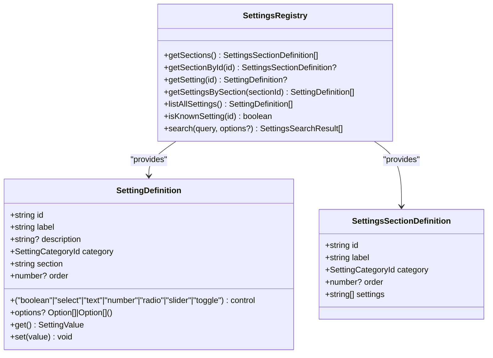
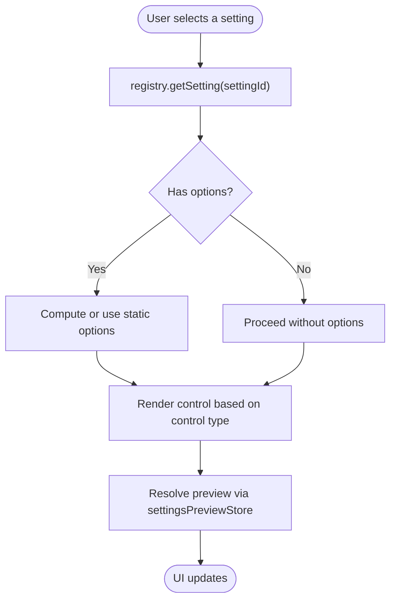
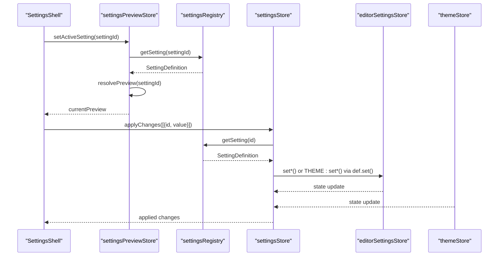
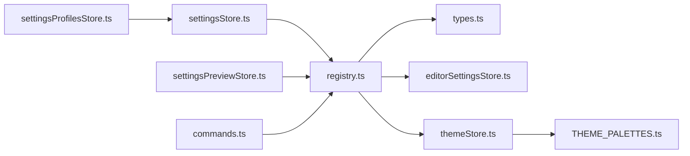

# Settings Registry

<cite>
**Referenced Files in This Document**
- [registry.ts](file://src/lib/settings/registry.ts)
- [types.ts](file://src/lib/settings/types.ts)
- [settingsStore.ts](file://src/lib/stores/settingsStore.ts)
- [settingsProfilesStore.ts](file://src/lib/stores/settingsProfilesStore.ts)
- [settingsPreviewStore.ts](file://src/lib/stores/settingsPreviewStore.ts)
- [commands.ts](file://src/lib/settings/commands.ts)
- [quickActions.ts](file://src/lib/settings/quickActions.ts)
- [editorSettingsStore.ts](file://src/lib/stores/editorSettingsStore.ts)
- [themeStore.ts](file://src/lib/stores/themeStore.ts)
- [THEME_PALETTES.ts](file://src/lib/stores/THEME_PALETTES.ts)
</cite>

## Table of Contents

1. [Introduction](#introduction)
2. [Project Structure](#project-structure)
3. [Core Components](#core-components)
4. [Architecture Overview](#architecture-overview)
5. [Detailed Component Analysis](#detailed-component-analysis)
6. [Dependency Analysis](#dependency-analysis)
7. [Performance Considerations](#performance-considerations)
8. [Troubleshooting Guide](#troubleshooting-guide)
9. [Conclusion](#conclusion)
10. [Appendices](#appendices)

## Introduction

This document explains the Settings Registry in the NC code editor. It covers how configuration options are centrally defined and managed, how core features and extensions can contribute new settings with metadata, the schema definition for each setting, the discovery mechanism that powers the settings UI, examples from the codebase, type safety via TypeScript interfaces, and the categorization system that organizes settings for the user interface. The goal is to make the system accessible to beginners while providing sufficient technical depth for experienced developers.

## Project Structure

The settings subsystem is organized around a central registry that defines sections and settings, a typed contract for their metadata, and supporting stores that orchestrate snapshots, previews, profiles, and commands.

**Diagram sources**

- [registry.ts](file://src/lib/settings/registry.ts#L1-L120)
- [types.ts](file://src/lib/settings/types.ts#L1-L120)
- [settingsStore.ts](file://src/lib/stores/settingsStore.ts#L1-L120)
- [settingsPreviewStore.ts](file://src/lib/stores/settingsPreviewStore.ts#L1-L120)
- [settingsProfilesStore.ts](file://src/lib/stores/settingsProfilesStore.ts#L1-L120)
- [commands.ts](file://src/lib/settings/commands.ts#L1-L80)
- [quickActions.ts](file://src/lib/settings/quickActions.ts#L1-L80)
- [editorSettingsStore.ts](file://src/lib/stores/editorSettingsStore.ts#L1-L80)
- [themeStore.ts](file://src/lib/stores/themeStore.ts#L1-L80)
- [THEME_PALETTES.ts](file://src/lib/stores/THEME_PALETTES.ts#L1-L80)

**Section sources**

- [registry.ts](file://src/lib/settings/registry.ts#L1-L120)
- [types.ts](file://src/lib/settings/types.ts#L1-L120)

## Core Components

- Central Settings Registry: Defines sections and settings, exposes getters, search, and helpers. See [registry.ts](file://src/lib/settings/registry.ts#L45-L120).
- Type Contracts: Define SettingId, SettingValue, SettingDefinition, SettingsSectionDefinition, and related interfaces. See [types.ts](file://src/lib/settings/types.ts#L31-L120).
- Domain Stores: Provide real state for editor and theme settings. See [editorSettingsStore.ts](file://src/lib/stores/editorSettingsStore.ts#L1-L80) and [themeStore.ts](file://src/lib/stores/themeStore.ts#L1-L80).
- Orchestrator Stores:
  - settingsStore orchestrates snapshots and applies changes via the registry. See [settingsStore.ts](file://src/lib/stores/settingsStore.ts#L66-L120).
  - settingsPreviewStore resolves previews and related settings. See [settingsPreviewStore.ts](file://src/lib/stores/settingsPreviewStore.ts#L1-L120).
  - settingsProfilesStore persists and applies profiles using Tauri commands. See [settingsProfilesStore.ts](file://src/lib/stores/settingsProfilesStore.ts#L1-L120).
- Commands and Quick Actions: Integrate with Command Palette and provide bulk actions. See [commands.ts](file://src/lib/settings/commands.ts#L1-L80) and [quickActions.ts](file://src/lib/settings/quickActions.ts#L1-L80).

**Section sources**

- [registry.ts](file://src/lib/settings/registry.ts#L45-L120)
- [types.ts](file://src/lib/settings/types.ts#L31-L120)
- [settingsStore.ts](file://src/lib/stores/settingsStore.ts#L66-L120)
- [settingsPreviewStore.ts](file://src/lib/stores/settingsPreviewStore.ts#L1-L120)
- [settingsProfilesStore.ts](file://src/lib/stores/settingsProfilesStore.ts#L1-L120)
- [commands.ts](file://src/lib/settings/commands.ts#L1-L80)
- [quickActions.ts](file://src/lib/settings/quickActions.ts#L1-L80)

## Architecture Overview

The registry acts as the single source of truth for settings metadata and UI hints. Domain stores hold real state. Orchestrator stores read from the registry and write to domain stores. The UI (SettingsShell) consumes sections and settings from the registry to render controls and previews.

**Diagram sources**

- [registry.ts](file://src/lib/settings/registry.ts#L458-L558)
- [settingsStore.ts](file://src/lib/stores/settingsStore.ts#L248-L310)
- [editorSettingsStore.ts](file://src/lib/stores/editorSettingsStore.ts#L150-L180)
- [themeStore.ts](file://src/lib/stores/themeStore.ts#L100-L120)

## Detailed Component Analysis

### Central Settings Registry

- Purpose: Centralized, static definitions of sections and settings with metadata and control hints.
- Sections: Group settings into logical areas (appearance, editor basics, layout, UI, behavior).
- Settings: Each SettingDefinition includes id, label, description, category, section, order, control type, options (optional), and get/set functions.
- Indexing: Maintains maps for fast lookups and stable ordering within sections.
- Search: Full-text search across id, label, and description with scoring and optional filters.

Key responsibilities and examples:

- Static sections and settings arrays define the surface area of configurable options. See [registry.ts](file://src/lib/settings/registry.ts#L69-L116) and [registry.ts](file://src/lib/settings/registry.ts#L128-L429).
- Control types drive UI generation (boolean, select, text, number, radio, slider, toggle). See [types.ts](file://src/lib/settings/types.ts#L89-L96).
- Options can be static or dynamic (e.g., palette options computed from current theme mode). See [registry.ts](file://src/lib/settings/registry.ts#L156-L174) and [THEME_PALETTES.ts](file://src/lib/stores/THEME_PALETTES.ts#L306-L314).
- Search scoring prioritizes exact id matches, partial label matches, and description matches. See [registry.ts](file://src/lib/settings/registry.ts#L488-L526).

**Diagram sources**

- [registry.ts](file://src/lib/settings/registry.ts#L45-L116)
- [types.ts](file://src/lib/settings/types.ts#L61-L122)

**Section sources**

- [registry.ts](file://src/lib/settings/registry.ts#L45-L120)
- [registry.ts](file://src/lib/settings/registry.ts#L128-L429)
- [registry.ts](file://src/lib/settings/registry.ts#L458-L558)
- [types.ts](file://src/lib/settings/types.ts#L61-L122)

### Type Safety and Schema Definition

- SettingId: Unique string identifier following a dot-delimited namespace convention.
- SettingValue: Union of string, number, boolean.
- SettingDefinition: Metadata and behavior for a single setting, including get/set and optional options.
- SettingsSectionDefinition: Logical grouping of settings.
- Categories: Top-level categories (appearance, editor, workbench, integrations, experimental) for UI organization.
- Validation: Registry enforces valid values by delegating to domain stores and using strict checks (e.g., allowed string literals for editor options).

Examples of validation and defaults:

- Editor options constrained to allowed values; invalid values fall back to safe defaults. See [registry.ts](file://src/lib/settings/registry.ts#L270-L308) and [registry.ts](file://src/lib/settings/registry.ts#L287-L309).
- Numeric sliders enforce numeric bounds and finite checks. See [registry.ts](file://src/lib/settings/registry.ts#L200-L205) and [registry.ts](file://src/lib/settings/registry.ts#L318-L325).
- Palette options are computed from current theme mode and validated against ThemePaletteId. See [registry.ts](file://src/lib/settings/registry.ts#L156-L174) and [THEME_PALETTES.ts](file://src/lib/stores/THEME_PALETTES.ts#L21-L33).

**Section sources**

- [types.ts](file://src/lib/settings/types.ts#L31-L122)
- [registry.ts](file://src/lib/settings/registry.ts#L193-L205)
- [registry.ts](file://src/lib/settings/registry.ts#L236-L325)
- [registry.ts](file://src/lib/settings/registry.ts#L270-L309)
- [THEME_PALETTES.ts](file://src/lib/stores/THEME_PALETTES.ts#L21-L33)

### Discovery Mechanism for Settings UI

- SettingsShell reads sections from the registry and renders navigation and middle panel.
- For each selected setting, the registry provides the SettingDefinition, including control type and options, enabling automatic UI generation without hard-coded conditionals.
- Preview resolution: settingsPreviewStore uses registry-provided SettingDefinition.get() to render inline or provider-based previews. See [settingsPreviewStore.ts](file://src/lib/stores/settingsPreviewStore.ts#L97-L134).

**Diagram sources**

- [registry.ts](file://src/lib/settings/registry.ts#L458-L558)
- [settingsPreviewStore.ts](file://src/lib/stores/settingsPreviewStore.ts#L97-L134)

**Section sources**

- [registry.ts](file://src/lib/settings/registry.ts#L458-L558)
- [settingsPreviewStore.ts](file://src/lib/stores/settingsPreviewStore.ts#L97-L134)

### Registration Process for Core Features and Extensions

- Contribution model: Add new SettingDefinition entries to the static settings array and associate them with a SettingsSectionDefinition. The registry maintains indices and exposes them via getters.
- Example contributions in the codebase:
  - Theme settings: theme.mode and theme.palette. See [registry.ts](file://src/lib/settings/registry.ts#L132-L174).
  - Editor core settings: editor.theme, editor.fontSize, editor.fontFamily, editor.fontLigatures. See [registry.ts](file://src/lib/settings/registry.ts#L179-L231).
  - Editor layout settings: editor.tabSize, editor.insertSpaces, editor.renderWhitespace, editor.wordWrap, editor.wordWrapColumn. See [registry.ts](file://src/lib/settings/registry.ts#L236-L325).
  - Editor UI settings: editor.minimap, editor.folding, editor.lineNumbers, editor.bracketPairColorization. See [registry.ts](file://src/lib/settings/registry.ts#L327-L391).
  - Editor behavior settings: editor.autoSave, editor.autoSaveDelay. See [registry.ts](file://src/lib/settings/registry.ts#L393-L428).
- Sections organize settings into logical groups. See [registry.ts](file://src/lib/settings/registry.ts#L69-L116).

**Section sources**

- [registry.ts](file://src/lib/settings/registry.ts#L69-L116)
- [registry.ts](file://src/lib/settings/registry.ts#L128-L429)

### Categorization System

- Category field on SettingDefinition drives top-level grouping in the UI.
- Categories include appearance, editor, workbench, integrations, experimental.
- Sections also carry a category for hierarchical navigation.

**Section sources**

- [types.ts](file://src/lib/settings/types.ts#L31-L43)
- [registry.ts](file://src/lib/settings/registry.ts#L69-L116)

### Orchestration and Persistence

- settingsStore:
  - Builds a snapshot from domain stores.
  - Applies a patch of SettingPatch entries by delegating to SettingDefinition.set().
  - Computes dirty state and baseline for resetAll.
  - Subscribes to domain stores to keep snapshot fresh.
    See [settingsStore.ts](file://src/lib/stores/settingsStore.ts#L66-L120), [settingsStore.ts](file://src/lib/stores/settingsStore.ts#L142-L178), [settingsStore.ts](file://src/lib/stores/settingsStore.ts#L239-L310).
- settingsProfilesStore:
  - Loads/saves profiles via Tauri commands.
  - Applies a profile by computing a patch from current to target snapshot and invoking settingsStore.applyChanges.
    See [settingsProfilesStore.ts](file://src/lib/stores/settingsProfilesStore.ts#L139-L210), [settingsProfilesStore.ts](file://src/lib/stores/settingsProfilesStore.ts#L283-L304).
- quickActions:
  - Provides reset-all, export/import, and profile creation actions that delegate to settingsStore and settingsProfilesStore.
    See [quickActions.ts](file://src/lib/settings/quickActions.ts#L117-L188).

**Diagram sources**

- [settingsPreviewStore.ts](file://src/lib/stores/settingsPreviewStore.ts#L97-L134)
- [registry.ts](file://src/lib/settings/registry.ts#L458-L558)
- [settingsStore.ts](file://src/lib/stores/settingsStore.ts#L248-L310)
- [editorSettingsStore.ts](file://src/lib/stores/editorSettingsStore.ts#L150-L180)
- [themeStore.ts](file://src/lib/stores/themeStore.ts#L100-L120)

**Section sources**

- [settingsStore.ts](file://src/lib/stores/settingsStore.ts#L66-L120)
- [settingsStore.ts](file://src/lib/stores/settingsStore.ts#L142-L178)
- [settingsStore.ts](file://src/lib/stores/settingsStore.ts#L239-L310)
- [settingsProfilesStore.ts](file://src/lib/stores/settingsProfilesStore.ts#L139-L210)
- [settingsProfilesStore.ts](file://src/lib/stores/settingsProfilesStore.ts#L283-L304)
- [quickActions.ts](file://src/lib/settings/quickActions.ts#L117-L188)

### Command Palette Integration

- Commands are registered to open SettingsShell, open a specific section, or open a specific setting.
- Validation is performed against the registry to ensure the section or setting exists.
- See [commands.ts](file://src/lib/settings/commands.ts#L50-L174).

**Section sources**

- [commands.ts](file://src/lib/settings/commands.ts#L50-L174)

## Dependency Analysis

- Registry depends on domain stores for actual state and on THEME_PALETTES for palette options.
- settingsStore depends on registry for metadata and on domain stores for state.
- settingsPreviewStore depends on registry for SettingDefinition and on domain stores indirectly via def.get().
- settingsProfilesStore depends on settingsStore for snapshot and applyChanges.
- commands depend on registry for validation and on host context to open SettingsShell.

**Diagram sources**

- [registry.ts](file://src/lib/settings/registry.ts#L1-L120)
- [types.ts](file://src/lib/settings/types.ts#L1-L120)
- [settingsStore.ts](file://src/lib/stores/settingsStore.ts#L1-L120)
- [settingsPreviewStore.ts](file://src/lib/stores/settingsPreviewStore.ts#L1-L120)
- [settingsProfilesStore.ts](file://src/lib/stores/settingsProfilesStore.ts#L1-L120)
- [commands.ts](file://src/lib/settings/commands.ts#L1-L80)
- [editorSettingsStore.ts](file://src/lib/stores/editorSettingsStore.ts#L1-L80)
- [themeStore.ts](file://src/lib/stores/themeStore.ts#L1-L80)
- [THEME_PALETTES.ts](file://src/lib/stores/THEME_PALETTES.ts#L1-L80)

**Section sources**

- [registry.ts](file://src/lib/settings/registry.ts#L1-L120)
- [settingsStore.ts](file://src/lib/stores/settingsStore.ts#L1-L120)
- [settingsPreviewStore.ts](file://src/lib/stores/settingsPreviewStore.ts#L1-L120)
- [settingsProfilesStore.ts](file://src/lib/stores/settingsProfilesStore.ts#L1-L120)
- [commands.ts](file://src/lib/settings/commands.ts#L1-L80)

## Performance Considerations

- Registry indexing: Maps by id and section enable O(1) lookups and sorted lists for deterministic rendering.
- Snapshot building: settingsStore builds snapshots on demand and subscribes to domain stores to minimize unnecessary recomputation.
- Search: Linear scan over settings with early filtering by section/category and scoring; suitable for small-to-medium settings sets.
- Preview resolution: Uses SettingDefinition.get() to compute preview context without duplicating state.

[No sources needed since this section provides general guidance]

## Troubleshooting Guide

- Unknown setting id: isKnownSetting returns false; commands and preview handlers handle unknown ids gracefully. See [registry.ts](file://src/lib/settings/registry.ts#L484-L486) and [settingsPreviewStore.ts](file://src/lib/stores/settingsPreviewStore.ts#L139-L151).
- Invalid option values: Registry validates and falls back to safe defaults (e.g., allowed string literals). See [registry.ts](file://src/lib/settings/registry.ts#L270-L308).
- Numeric validation: Sliders enforce numeric and finite checks; invalid values are ignored or replaced with defaults. See [registry.ts](file://src/lib/settings/registry.ts#L200-L205) and [registry.ts](file://src/lib/settings/registry.ts#L318-L325).
- Apply errors: settingsStore.applyChanges catches exceptions during def.set() and continues applying remaining patches. See [settingsStore.ts](file://src/lib/stores/settingsStore.ts#L265-L279).
- Profiles persistence: settingsProfilesStore surfaces Tauri errors into state.error; operations remain predictable. See [settingsProfilesStore.ts](file://src/lib/stores/settingsProfilesStore.ts#L150-L160).

**Section sources**

- [registry.ts](file://src/lib/settings/registry.ts#L484-L486)
- [settingsPreviewStore.ts](file://src/lib/stores/settingsPreviewStore.ts#L139-L151)
- [registry.ts](file://src/lib/settings/registry.ts#L200-L205)
- [registry.ts](file://src/lib/settings/registry.ts#L270-L308)
- [registry.ts](file://src/lib/settings/registry.ts#L318-L325)
- [settingsStore.ts](file://src/lib/stores/settingsStore.ts#L265-L279)
- [settingsProfilesStore.ts](file://src/lib/stores/settingsProfilesStore.ts#L150-L160)

## Conclusion

The Settings Registry provides a centralized, type-safe, and discoverable way to define and manage configuration options. It cleanly separates metadata (sections, settings, control hints) from state (domain stores), enabling robust UI generation, validation, and persistence. The architecture supports extension by adding new SettingDefinition entries and integrates seamlessly with Command Palette, preview, profiles, and quick actions.

[No sources needed since this section summarizes without analyzing specific files]

## Appendices

### Example Registration Patterns from the Codebase

- Theme settings registration: theme.mode and theme.palette with dynamic options based on current mode. See [registry.ts](file://src/lib/settings/registry.ts#L132-L174) and [THEME_PALETTES.ts](file://src/lib/stores/THEME_PALETTES.ts#L306-L314).
- Editor settings registration: core, layout, UI, and behavior settings with appropriate control types and validations. See [registry.ts](file://src/lib/settings/registry.ts#L179-L428).

**Section sources**

- [registry.ts](file://src/lib/settings/registry.ts#L132-L174)
- [registry.ts](file://src/lib/settings/registry.ts#L179-L428)
- [THEME_PALETTES.ts](file://src/lib/stores/THEME_PALETTES.ts#L306-L314)
