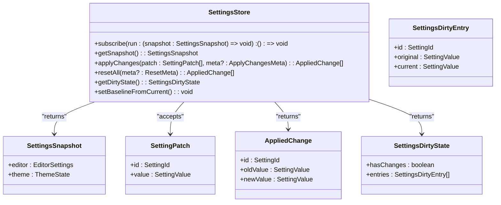
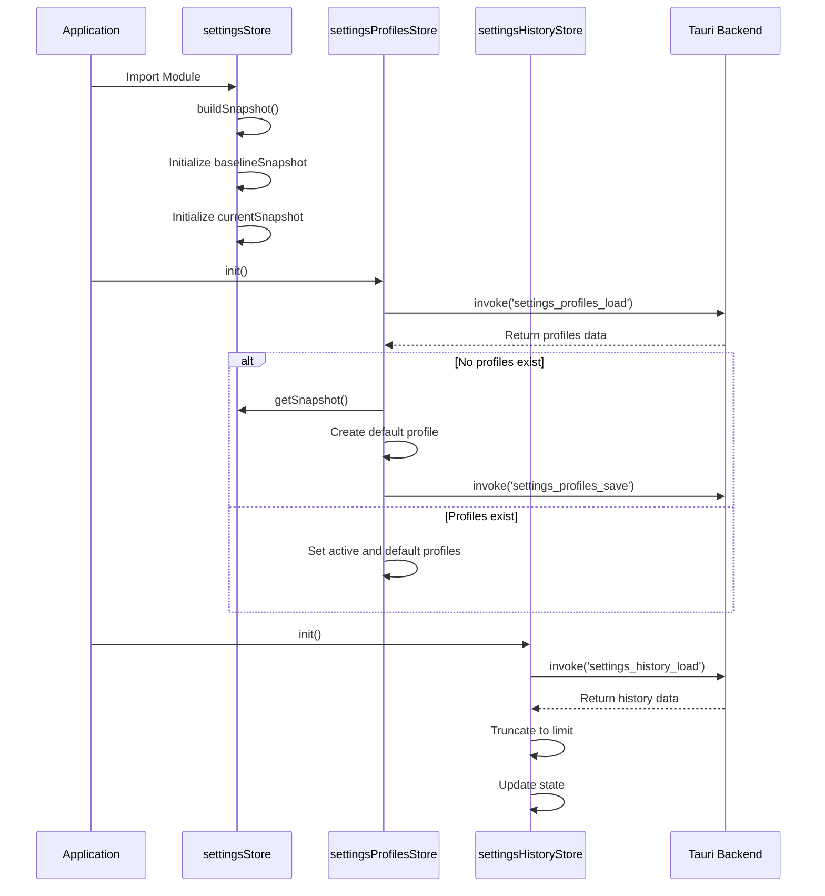
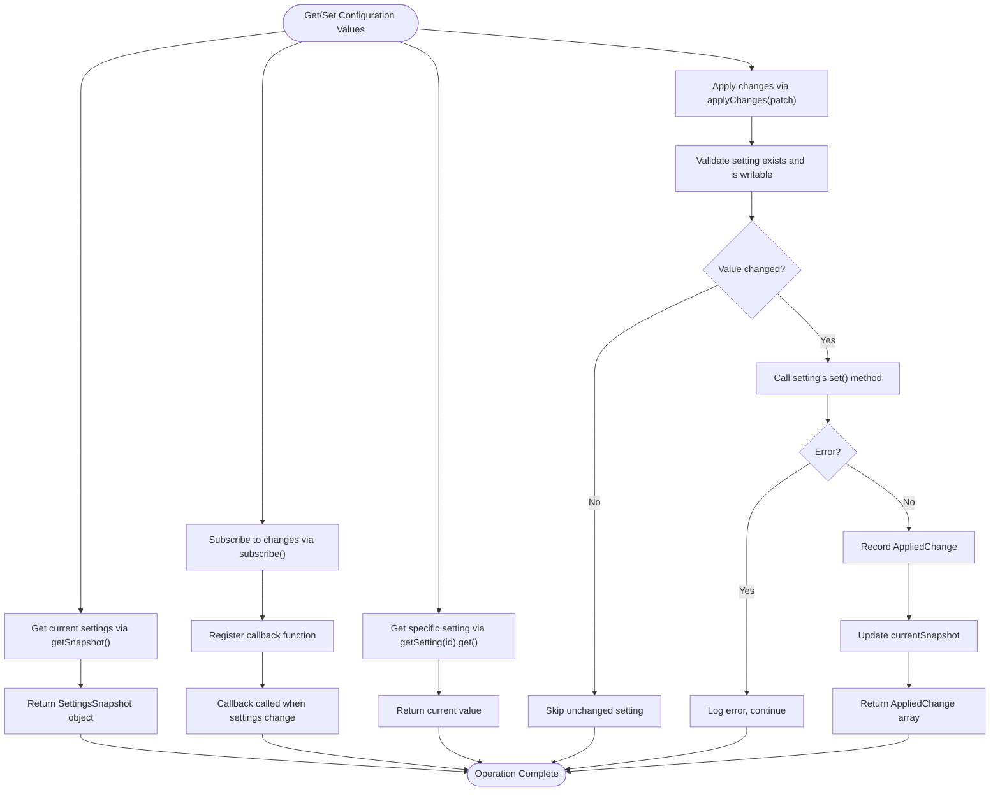
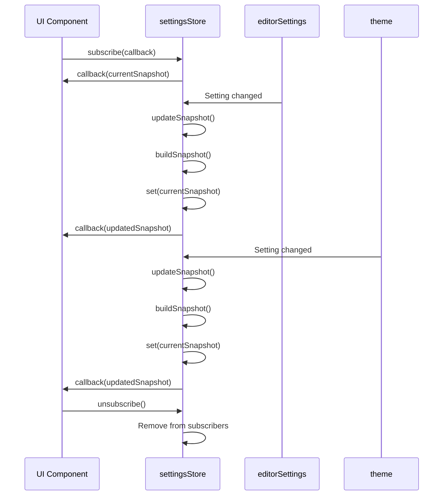
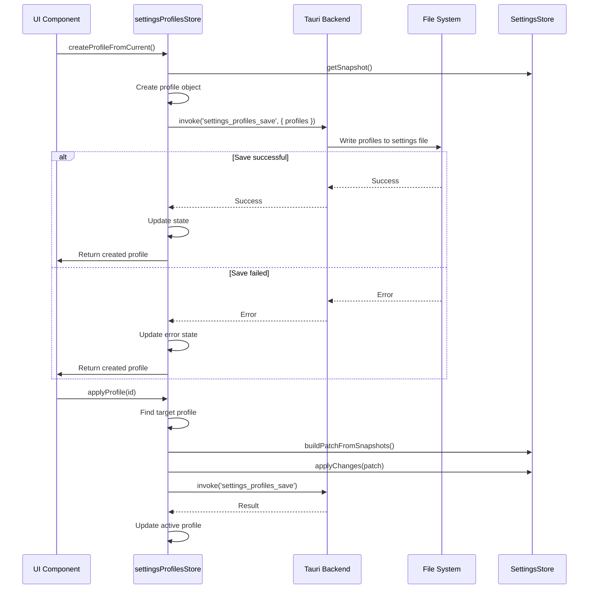
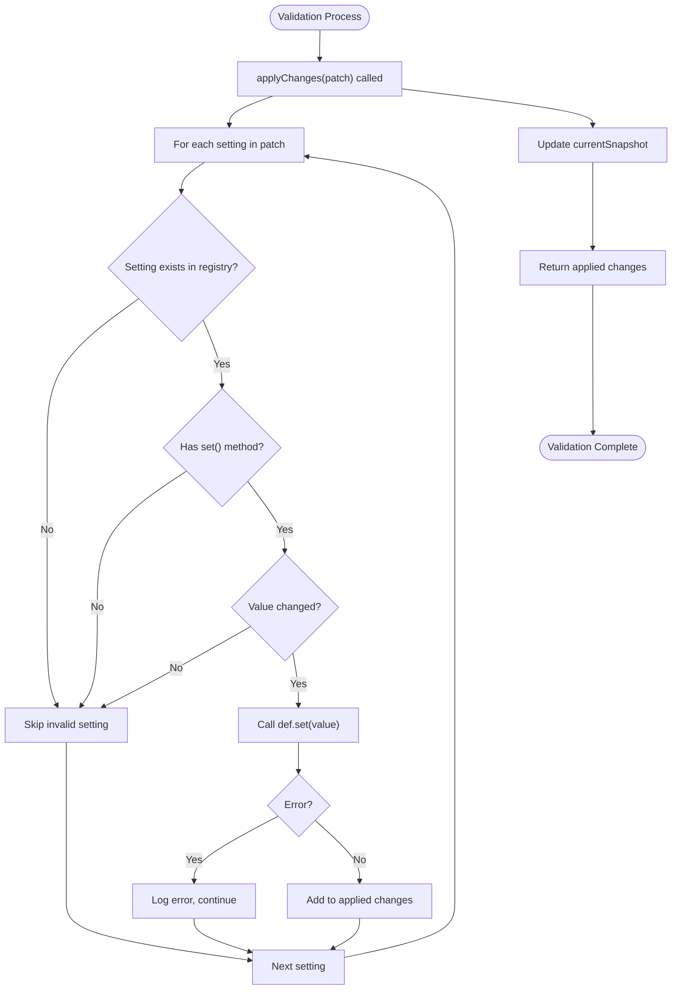

# Settings Store

<cite>
**Referenced Files in This Document**   
- [settingsStore.ts](file://src/lib/stores/settingsStore.ts)
- [types.ts](file://src/lib/settings/types.ts)
- [registry.ts](file://src/lib/settings/registry.ts)
- [editorSettingsStore.ts](file://src/lib/stores/editorSettingsStore.ts)
- [themeStore.ts](file://src/lib/stores/themeStore.ts)
- [settingsProfilesStore.ts](file://src/lib/stores/settingsProfilesStore.ts)
- [settingsHistoryStore.ts](file://src/lib/stores/settingsHistoryStore.ts)
- [settingsPreviewStore.ts](file://src/lib/stores/settingsPreviewStore.ts)
</cite>

## Table of Contents

1. [Introduction](#introduction)
2. [Svelte Store Pattern for Settings Management](#svelte-store-pattern-for-settings-management)
3. [Initialization Process](#initialization-process)
4. [Getting, Setting, and Updating Configuration Values](#getting-setting-and-updating-configuration-values)
5. [Reactive Properties and UI Updates](#reactive-properties-and-ui-updates)
6. [Persistence Mechanism](#persistence-mechanism)
7. [Validation Process](#validation-process)
8. [Conclusion](#conclusion)

## Introduction

The Settings Store implementation in the NC code editor provides a comprehensive system for managing application settings with reactivity, persistence, and type safety. This document explains how the Svelte store pattern is used to manage settings in memory, the initialization process that loads settings from persistent storage, methods for getting and setting configuration values, reactive properties that trigger UI updates, the persistence mechanism that saves settings to disk, and the validation process that ensures settings conform to their defined types and constraints.

**Section sources**

- [settingsStore.ts](file://src/lib/stores/settingsStore.ts#L1-L313)
- [types.ts](file://src/lib/settings/types.ts#L1-L192)

## Svelte Store Pattern for Settings Management

The Settings Store implementation uses the Svelte store pattern to manage application settings in memory with reactivity. The core of this system is the `settingsStore` which is implemented as a readable store that aggregates settings from various domain-specific stores like `editorSettingsStore` and `themeStore`. This approach follows the "single source of truth" principle, ensuring that all components access settings through a unified interface.

The store is designed to be compatible with Svelte 5's readable pattern, using the standard `readable` function from Svelte's store module. It does not duplicate state but instead builds snapshots on demand from the underlying domain stores. This design minimizes memory usage and ensures consistency across the application.

The `SettingsStore` interface defines the public API, including methods for subscribing to changes, getting snapshots, applying changes, resetting settings, and checking dirty state. The implementation uses a baseline snapshot to track changes and determine when settings have been modified from their original state.

**Diagram sources **

- [settingsStore.ts](file://src/lib/stores/settingsStore.ts#L67-L85)
- [types.ts](file://src/lib/settings/types.ts#L148-L152)

**Section sources**

- [settingsStore.ts](file://src/lib/stores/settingsStore.ts#L19-L313)
- [types.ts](file://src/lib/settings/types.ts#L24-L152)

## Initialization Process

The initialization process for the Settings Store begins when the application starts and the `settingsStore` module is imported. During initialization, the store creates a baseline snapshot by calling the `buildSnapshot()` function, which collects the current state from all domain-specific stores. This baseline serves as the reference point for determining dirty state and resetting settings to their original values.

The store maintains two internal state variables: `baselineSnapshot` and `currentSnapshot`. The `baselineSnapshot` is initialized with the current state of all settings and can be updated using the `setBaselineFromCurrent()` method. The `currentSnapshot` is updated whenever settings change and is used to provide a consistent view of the current state.

For features that require persistence, such as settings profiles and history, the initialization process includes loading data from persistent storage. The `settingsProfilesStore` and `settingsHistoryStore` both have `init()` methods that load their respective data from disk using Tauri's `invoke` commands. If no data exists, they create default configurations and save them to disk.

**Diagram sources **

- [settingsStore.ts](file://src/lib/stores/settingsStore.ts#L186-L189)
- [settingsProfilesStore.ts](file://src/lib/stores/settingsProfilesStore.ts#L176-L230)
- [settingsHistoryStore.ts](file://src/lib/stores/settingsHistoryStore.ts#L125-L142)

**Section sources**

- [settingsStore.ts](file://src/lib/stores/settingsStore.ts#L183-L189)
- [settingsProfilesStore.ts](file://src/lib/stores/settingsProfilesStore.ts#L176-L230)
- [settingsHistoryStore.ts](file://src/lib/stores/settingsHistoryStore.ts#L125-L142)

## Getting, Setting, and Updating Configuration Values

The Settings Store provides a type-safe interface for getting, setting, and updating configuration values. The system uses a registry pattern where all settings are defined in the `settingsRegistry` with their metadata, including type information, validation rules, and UI presentation details.

To get a setting value, components can either subscribe to the `settingsStore` to receive updates when any setting changes, or use the `getSnapshot()` method to retrieve the current state of all settings. For individual settings, the `getSetting()` function from the registry can be used to retrieve a specific setting definition, which includes a `get()` method to read the current value.

Setting values is done through the `applyChanges()` method, which accepts an array of `SettingPatch` objects containing setting IDs and new values. This method validates each change by checking if the setting exists in the registry and if the `set()` method is available. It also performs a strict equality check to avoid unnecessary updates when the value hasn't changed.

The `applyChanges()` method returns an array of `AppliedChange` objects that document which settings were actually changed, including their old and new values. This enables features like change tracking and undo functionality. The method is designed to be resilient, catching any errors during the setting process without propagating them to the caller.

**Diagram sources **

- [settingsStore.ts](file://src/lib/stores/settingsStore.ts#L248-L285)
- [registry.ts](file://src/lib/settings/registry.ts#L51-L53)
- [types.ts](file://src/lib/settings/types.ts#L104-L108)

**Section sources**

- [settingsStore.ts](file://src/lib/stores/settingsStore.ts#L248-L285)
- [registry.ts](file://src/lib/settings/registry.ts#L128-L455)
- [types.ts](file://src/lib/settings/types.ts#L69-L108)

## Reactive Properties and UI Updates

The Settings Store implements reactivity through Svelte's store pattern, automatically triggering UI updates when settings change. The core mechanism is the readable store created with Svelte's `readable()` function, which maintains a list of subscribers and notifies them when the state changes.

The store listens to changes in the underlying domain stores (`editorSettings` and `theme`) by subscribing to them during initialization. When any of these stores emit a change notification, the settings store's `updateSnapshot()` function is called, which rebuilds the current snapshot and notifies all subscribers. This ensures that components using the settings store receive updates whenever any setting changes, regardless of which domain store was modified.

Components can subscribe to the settings store using the standard Svelte store subscription pattern. When a component subscribes, it provides a callback function that will be called with the current settings snapshot whenever changes occur. This enables reactive UI updates without requiring components to manually check for changes.

The system also supports derived stores for specific use cases. For example, the `settingsPreviewStore` provides reactive updates for the settings preview panel, while the `settingsProfilesStore` offers reactive state for the profiles management interface. These derived stores build upon the core settings store, adding specialized functionality while maintaining reactivity.

**Diagram sources **

- [settingsStore.ts](file://src/lib/stores/settingsStore.ts#L198-L232)
- [editorSettingsStore.ts](file://src/lib/stores/editorSettingsStore.ts#L155-L157)
- [themeStore.ts](file://src/lib/stores/themeStore.ts#L107-L109)

**Section sources**

- [settingsStore.ts](file://src/lib/stores/settingsStore.ts#L198-L232)
- [editorSettingsStore.ts](file://src/lib/stores/editorSettingsStore.ts#L155-L157)
- [themeStore.ts](file://src/lib/stores/themeStore.ts#L107-L109)

## Persistence Mechanism

The Settings Store implements persistence through integration with Tauri's backend system, saving settings to disk and handling potential write errors. The core settings store itself is in-memory and does not directly handle persistence, but related stores like `settingsProfilesStore` and `settingsHistoryStore` provide persistent storage capabilities.

The persistence mechanism uses Tauri's `invoke` function to call Rust commands that handle file operations. For example, the `settingsProfilesStore` uses `invoke('settings_profiles_save', { profiles })` to save profiles to disk and `invoke('settings_profiles_load')` to load them on startup. This separation of concerns keeps the frontend logic focused on state management while delegating persistence to the secure backend.

When saving settings, the system implements error handling to ensure the application remains functional even if persistence fails. The `persistProfiles()` function in `settingsProfilesStore` catches errors during the save operation, updates the store's error state, but continues execution. This prevents a failed save operation from disrupting the user experience.

The persistence system also handles initialization scenarios, such as when no profiles exist on disk. In this case, the system creates a default profile based on the current settings snapshot and saves it to disk. This ensures that the application always has a valid configuration, even on first launch.

**Diagram sources **

- [settingsProfilesStore.ts](file://src/lib/stores/settingsProfilesStore.ts#L150-L159)
- [settingsProfilesStore.ts](file://src/lib/stores/settingsProfilesStore.ts#L261-L265)
- [settingsHistoryStore.ts](file://src/lib/stores/settingsHistoryStore.ts#L84-L91)

**Section sources**

- [settingsProfilesStore.ts](file://src/lib/stores/settingsProfilesStore.ts#L150-L160)
- [settingsHistoryStore.ts](file://src/lib/stores/settingsHistoryStore.ts#L84-L91)

## Validation Process

The Settings Store implements a comprehensive validation process to ensure settings conform to their defined types and constraints. The validation is primarily handled through the settings registry, which defines the metadata and behavior for each setting.

Each setting in the registry includes a `SettingDefinition` that specifies the setting's type, valid values, and constraints. The `control` property defines the UI control type (boolean, select, text, number, radio, slider, toggle), which determines how the setting is presented and validated in the UI. For select and radio controls, the `options` property defines the allowed values and their labels.

When applying changes, the system validates that the setting ID exists in the registry and that the `set()` method is available. It also performs a strict equality check to avoid unnecessary updates when the value hasn't changed. The `set()` methods in the domain stores perform additional validation specific to each setting type.

For example, the `editor.fontSize` setting validates that the value is a finite number, defaulting to the current value if the input is invalid. Similarly, the `editor.renderWhitespace` setting validates that the value is one of the allowed options ('none', 'selection', 'boundary', 'trailing', 'all'), defaulting to 'selection' if the input is invalid.

The system also includes validation for complex operations like profile management. The `settingsProfilesStore` validates that profile labels are not empty and that default profiles cannot be deleted. When creating a new profile, it generates a unique ID and ensures that only one profile can be marked as default at a time.

**Diagram sources **

- [settingsStore.ts](file://src/lib/stores/settingsStore.ts#L257-L278)
- [registry.ts](file://src/lib/settings/registry.ts#L202-L204)
- [registry.ts](file://src/lib/settings/registry.ts#L280-L284)

**Section sources**

- [settingsStore.ts](file://src/lib/stores/settingsStore.ts#L257-L278)
- [registry.ts](file://src/lib/settings/registry.ts#L128-L455)

## Conclusion

The Settings Store implementation in the NC code editor provides a robust, type-safe system for managing application settings with reactivity and persistence. By leveraging Svelte's store pattern, the system efficiently manages settings in memory while automatically triggering UI updates when changes occur. The initialization process loads settings from persistent storage on startup, ensuring a consistent user experience across sessions.

The architecture separates concerns effectively, with the core settings store focusing on in-memory state management while delegating persistence to specialized stores that integrate with Tauri's backend. This design enables features like settings profiles and history while maintaining a clean, maintainable codebase.

The system emphasizes type safety and validation, ensuring that settings conform to their defined types and constraints. The registry pattern provides a centralized location for setting definitions, making it easy to add new settings and maintain consistency across the application. The reactive properties automatically update the UI when settings change, providing a seamless user experience.

Overall, the Settings Store implementation demonstrates a well-architected approach to configuration management in a modern web application, balancing performance, maintainability, and user experience.
