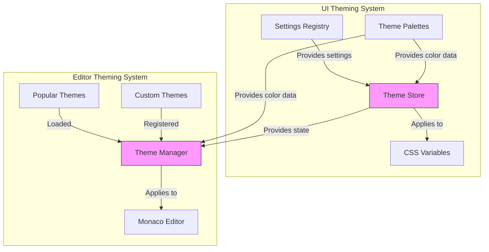
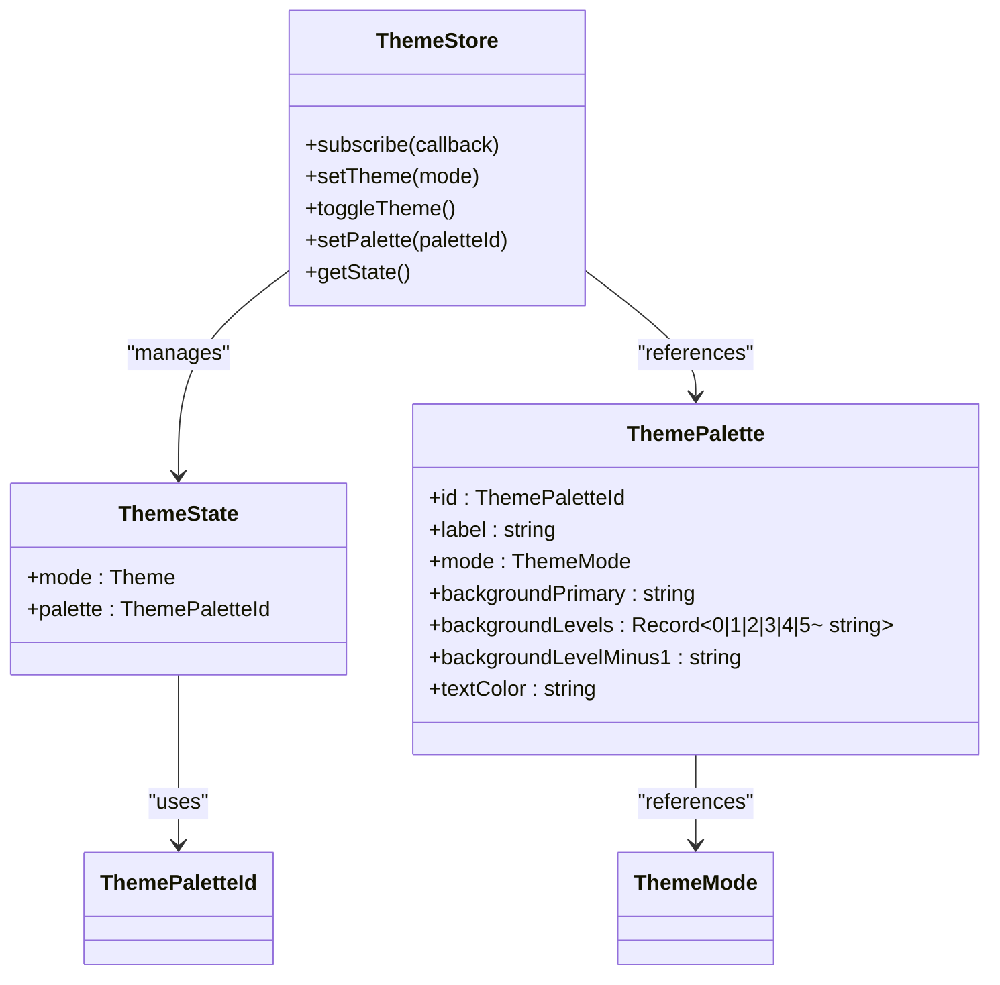
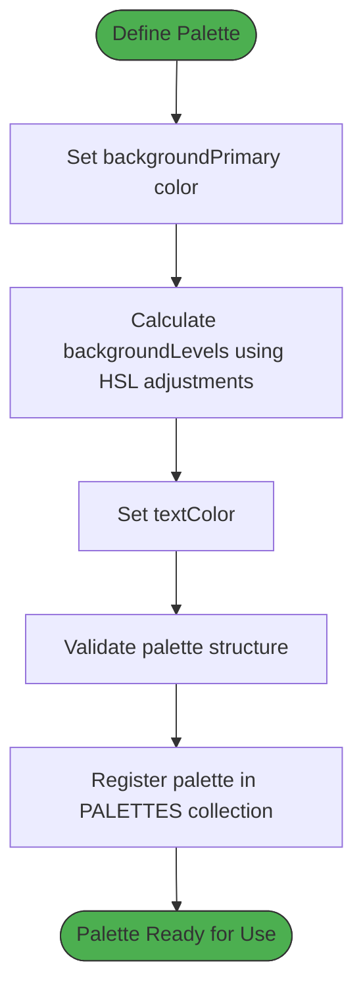
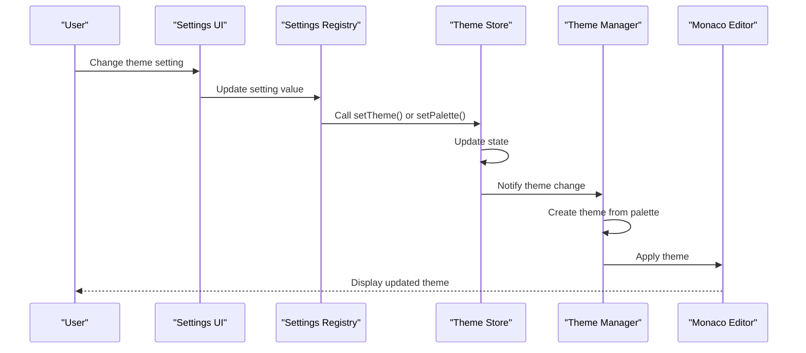
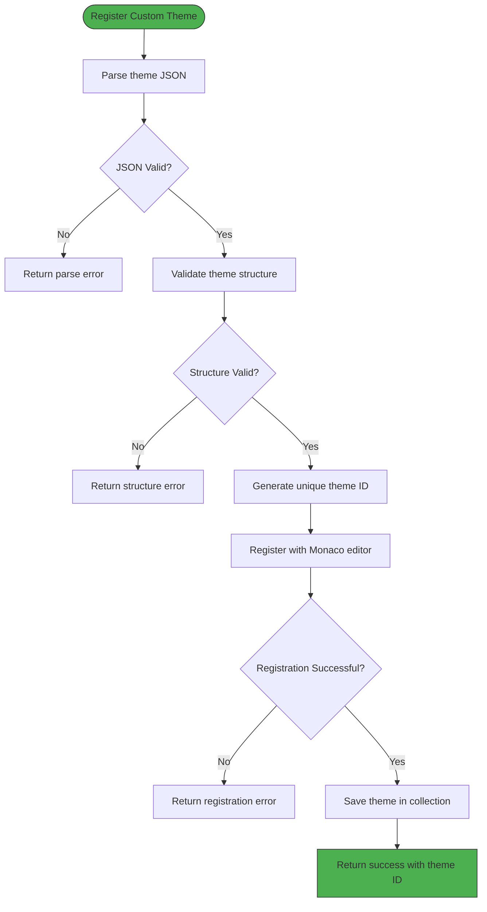
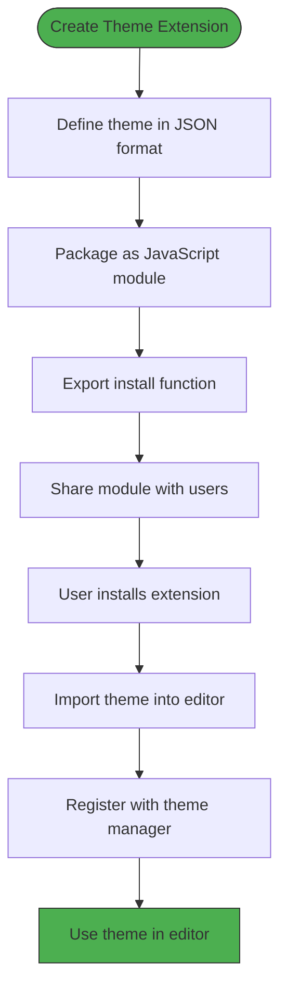

# Custom Themes

<cite>
**Referenced Files in This Document**   
- [themeStore.ts](file://src/lib/stores/themeStore.ts)
- [THEME_PALETTES.ts](file://src/lib/stores/THEME_PALETTES.ts)
- [themeManager.ts](file://src/lib/editor/themeManager.ts)
- [registry.ts](file://src/lib/settings/registry.ts)
- [editorSettingsStore.ts](file://src/lib/stores/editorSettingsStore.ts)
- [app.css](file://src/app.css)
- [THEME_QUICK_START.ts](file://src/lib/stores/THEME_QUICK_START.ts)
</cite>

## Table of Contents

1. [Introduction](#introduction)
2. [Theme Architecture Overview](#theme-architecture-overview)
3. [Theme Store and State Management](#theme-store-and-state-management)
4. [Defining Custom Theme Palettes](#defining-custom-theme-palettes)
5. [Editor Theme Management](#editor-theme-management)
6. [Theme Registration and Application API](#theme-registration-and-application-api)
7. [Theme Validation and Error Handling](#theme-validation-and-error-handling)
8. [Theme Serialization and Storage](#theme-serialization-and-storage)
9. [Creating and Sharing Theme Extensions](#creating-and-sharing-theme-extensions)
10. [Programmatic Theme Creation Examples](#programmatic-theme-creation-examples)

## Introduction

The NC code editor provides a comprehensive theming system that allows users to extend and create custom themes for both the UI interface and editor syntax highlighting. This documentation details the API for registering custom themes, defining theme palettes, creating theme extensions, and managing theme lifecycle operations. The system is built on a modular architecture that separates UI theming from editor syntax theming while maintaining consistency across the application.

The theming system consists of two main components: the UI theme store that manages the application's visual appearance, and the editor theme manager that handles syntax highlighting in the Monaco editor. These components work together to provide a cohesive theming experience while allowing for independent customization of interface and code editor elements.

**Section sources**

- [themeStore.ts](file://src/lib/stores/themeStore.ts#L1-L120)
- [themeManager.ts](file://src/lib/editor/themeManager.ts#L1-L274)

## Theme Architecture Overview

The NC code editor's theming system follows a layered architecture with distinct components for UI theming and editor syntax highlighting. The system is designed to provide a consistent user experience while allowing for extensive customization through programmable APIs.



**Diagram sources**

- [themeStore.ts](file://src/lib/stores/themeStore.ts#L1-L120)
- [themeManager.ts](file://src/lib/editor/themeManager.ts#L1-L274)
- [THEME_PALETTES.ts](file://src/lib/stores/THEME_PALETTES.ts#L1-L314)

## Theme Store and State Management

The theme store is the central state management system for the NC code editor's UI themes. It maintains the current theme mode (light/dark) and selected color palette, serving as the single source of truth for theme-related state across the application.

The theme store exposes several key methods for managing theme state:

- `setTheme(mode)`: Sets the theme mode (light/dark)
- `toggleTheme()`: Toggles between light and dark modes while preserving the palette slot
- `setPalette(paletteId)`: Sets the current color palette
- `getState()`: Returns the current theme state synchronously

The theme state is represented by the `ThemeState` interface, which includes the current mode and palette ID. The store uses Svelte's writable store pattern to provide reactive updates to subscribers, ensuring that all UI components automatically reflect theme changes.



**Diagram sources**

- [themeStore.ts](file://src/lib/stores/themeStore.ts#L1-L120)
- [THEME_PALETTES.ts](file://src/lib/stores/THEME_PALETTES.ts#L1-L314)

**Section sources**

- [themeStore.ts](file://src/lib/stores/themeStore.ts#L1-L120)
- [THEME_PALETTES.ts](file://src/lib/stores/THEME_PALETTES.ts#L1-L314)

## Defining Custom Theme Palettes

Custom theme palettes are defined through the `THEME_PALETTES.ts` module, which serves as the single source of truth for all color palettes in the NC code editor. Each palette is defined with specific color specifications for both UI components and text elements.

The system supports eight predefined palettes: four for light mode (`light-default`, `light-alt-1`, `light-alt-2`, `light-alt-3`) and four for dark mode (`dark-default`, `dark-alt-1`, `dark-alt-2`, `dark-alt-3`). Each palette includes:

- `backgroundPrimary`: The primary background color for the application
- `backgroundLevels`: A record of background colors for different UI hierarchy levels (0-5)
- `backgroundLevelMinus1`: A special background level for tab bars and similar components
- `textColor`: The primary text color for the palette

The background levels follow a specific hierarchy:

- Level 0: Base background (sidebar)
- Level 1-2: Working area/cards (+8-10 points)
- Level 3: Buttons in normal state (+12-14 points)
- Level 4: Intermediate states (+14-16 points)
- Level 5: Hover states (+14-16 points)

For dark themes, background levels become lighter with each level, while for light themes, they become darker. This creates a consistent visual hierarchy across the application.



**Diagram sources**

- [THEME_PALETTES.ts](file://src/lib/stores/THEME_PALETTES.ts#L1-L314)

**Section sources**

- [THEME_PALETTES.ts](file://src/lib/stores/THEME_PALETTES.ts#L1-L314)

## Editor Theme Management

The editor theme management system is responsible for handling syntax highlighting themes in the Monaco editor. It provides a comprehensive API for registering, applying, and managing both built-in and custom themes.

The `ThemeManager` class serves as the central component for editor theme management. It provides methods for:

- Initializing the theme manager with a Monaco editor instance
- Registering built-in themes
- Registering custom themes from JSON
- Applying themes by ID
- Getting the list of available themes
- Exporting custom themes to JSON
- Removing custom themes

The system supports three types of themes:

- Built-in themes: The standard Monaco editor themes (vs, vs-dark, hc-black, hc-light)
- Popular themes: Pre-loaded popular themes like Monokai, Dracula, and Nord
- Custom themes: User-defined themes created programmatically or imported

The theme manager also handles the creation of Monaco themes from application palettes, ensuring consistency between the UI theme and editor syntax highlighting.

```mermaid
classDiagram
class ThemeManager {
+initialize(monacoInstance)
+isInitialized()
+areThemesLoaded()
+registerBuiltInTheme(themeId)
+registerCustomTheme(themeJson)
+applyTheme(themeId)
+getAvailableThemes()
+exportTheme(themeId)
+removeCustomTheme(themeId)
+getCurrentTheme()
+createThemeFromPalette(paletteId)
+loadPopularThemes()
}
class CustomTheme {
+name : string
+base : 'vs' | 'vs-dark' | 'hc-black' | 'hc-light'
+inherit : boolean
+rules : {token, foreground?, background?, fontStyle?}[]
+colors : Record~string, string~
}
ThemeManager --> CustomTheme : "manages"
ThemeManager --> MonacoEditor : "controls"
```

**Diagram sources**

- [themeManager.ts](file://src/lib/editor/themeManager.ts#L1-L274)

**Section sources**

- [themeManager.ts](file://src/lib/editor/themeManager.ts#L1-L274)

## Theme Registration and Application API

The NC code editor provides a comprehensive API for registering and applying custom themes. The API is designed to be intuitive and consistent across both UI and editor theming systems.

For UI themes, the theme store provides methods to set the theme mode and palette:

- `theme.setTheme('light')` or `theme.setTheme('dark')` to set the theme mode
- `theme.setPalette('dark-alt-1')` to set a specific palette
- `theme.toggleTheme()` to toggle between light and dark modes

For editor themes, the theme manager provides methods to register and apply custom themes:

- `themeManager.registerCustomTheme(themeJson)` to register a custom theme from JSON
- `themeManager.applyTheme(themeId)` to apply a theme by ID
- `themeManager.getAvailableThemes()` to get a list of all available themes

The system also integrates with the settings registry, allowing users to configure themes through the UI settings panel. The settings registry defines the 'theme.mode' and 'theme.palette' settings, which are linked to the theme store's methods.



**Diagram sources**

- [themeStore.ts](file://src/lib/stores/themeStore.ts#L1-L120)
- [themeManager.ts](file://src/lib/editor/themeManager.ts#L1-L274)
- [registry.ts](file://src/lib/settings/registry.ts#L1-L558)

**Section sources**

- [themeStore.ts](file://src/lib/stores/themeStore.ts#L1-L120)
- [themeManager.ts](file://src/lib/editor/themeManager.ts#L1-L274)
- [registry.ts](file://src/lib/settings/registry.ts#L1-L558)

## Theme Validation and Error Handling

The NC code editor implements robust validation and error handling for custom themes to ensure stability and prevent rendering issues. The validation process occurs at multiple levels: during theme registration, application, and serialization.

When registering a custom theme via `registerCustomTheme(themeJson)`, the system performs the following validation checks:

- Ensures the theme JSON can be parsed successfully
- Validates that required fields exist (name, base, rules, colors)
- Checks that the base theme is one of the allowed values (vs, vs-dark, hc-black, hc-light)
- Verifies that rules is an array and colors is an object

If any validation check fails, the method returns an error object with a descriptive message. For example:

- "Monaco не инициализирован" if the Monaco editor instance is not available
- "Неверная структура темы" if the theme structure is invalid
- "Ошибка парсинга JSON" if the JSON cannot be parsed

The system also handles errors during theme application. If `applyTheme(themeId)` fails, it returns false and logs the error to the console, preventing the application from crashing while still informing developers of the issue.



**Diagram sources**

- [themeManager.ts](file://src/lib/editor/themeManager.ts#L78-L109)

**Section sources**

- [themeManager.ts](file://src/lib/editor/themeManager.ts#L78-L109)

## Theme Serialization and Storage

Custom themes in the NC code editor are serialized and stored using a JSON-based format that is compatible with the Monaco editor's theme definition structure. This serialization format allows themes to be easily shared, imported, and exported.

The serialization format for custom themes includes the following properties:

- `name`: The display name of the theme
- `base`: The base theme to inherit from (vs, vs-dark, hc-black, hc-light)
- `inherit`: Boolean indicating whether to inherit from the base theme
- `rules`: An array of token rules with foreground, background, and font style specifications
- `colors`: A record of color overrides for specific editor elements

Themes are exported using the `exportTheme(themeId)` method, which returns a JSON string representation of the theme with proper formatting (2-space indentation). This JSON can be saved to a file or shared with other users.

When a theme is registered, it is stored in memory in a Map collection within the ThemeManager instance. The key is a generated theme ID (e.g., "custom-1234567890-abc123"), and the value is the parsed CustomTheme object. This in-memory storage allows for quick access to theme definitions when applying or exporting themes.

The system does not currently persist themes to disk automatically, but the JSON serialization format makes it easy to implement persistent storage by saving the exported theme JSON to a configuration file.

```mermaid
classDiagram
class CustomTheme {
+name : string
+base : 'vs' | 'vs-dark' | 'hc-black' | 'hc-light'
+inherit : boolean
+rules : {token, foreground?, background?, fontStyle?}[]
+colors : Record~string, string~
}
class ThemeManager {
-customThemes : Map~string, CustomTheme~
+registerCustomTheme(themeJson)
+exportTheme(themeId)
+removeCustomTheme(themeId)
}
ThemeManager --> CustomTheme : "stores"
CustomTheme --> JSON : "serializable"
```

**Diagram sources**

- [themeManager.ts](file://src/lib/editor/themeManager.ts#L8-L19)
- [themeManager.ts](file://src/lib/editor/themeManager.ts#L160-L165)

**Section sources**

- [themeManager.ts](file://src/lib/editor/themeManager.ts#L8-L19)
- [themeManager.ts](file://src/lib/editor/themeManager.ts#L160-L165)

## Creating and Sharing Theme Extensions

The NC code editor supports the creation and sharing of theme extensions through its modular theming API. Theme extensions can be distributed as standalone packages or shared as JSON files that can be imported into the editor.

To create a theme extension, developers can programmatically define a custom theme and register it with the theme manager. The extension can be packaged as a JavaScript module that exports a function to install the theme:

```javascript
// theme-extension.js
export function installMyTheme(themeManager) {
  const themeJson = `{
    "name": "My Custom Theme",
    "base": "vs-dark",
    "inherit": true,
    "rules": [
      { "token": "comment", "foreground": "608B4E", "fontStyle": "italic" },
      { "token": "keyword", "foreground": "C589F9", "fontStyle": "bold" },
      { "token": "string", "foreground": "BE643C" }
    ],
    "colors": {
      "editor.background": "#1E1E1E",
      "editor.foreground": "#D4D4D4",
      "editor.selectionBackground": "#264F78"
    }
  }`;

  return themeManager.registerCustomTheme(themeJson);
}
```

Users can share themes by exporting them as JSON using the `exportTheme(themeId)` method. The exported JSON can be saved to a file and distributed to other users, who can then import it using the `registerCustomTheme()` method.

The system also supports popular themes that are pre-loaded from the 'monaco-themes' package. These themes are loaded asynchronously in the background using dynamic imports, ensuring they don't block editor initialization. Supported popular themes include Monokai, Dracula, Nord, GitHub Light/Dark, Solarized, and Night Owl.



**Diagram sources**

- [themeManager.ts](file://src/lib/editor/themeManager.ts#L225-L253)
- [themeManager.ts](file://src/lib/editor/themeManager.ts#L78-L105)

**Section sources**

- [themeManager.ts](file://src/lib/editor/themeManager.ts#L225-L253)
- [themeManager.ts](file://src/lib/editor/themeManager.ts#L78-L105)

## Programmatic Theme Creation Examples

The NC code editor provides several examples of programmatically creating and applying custom themes. These examples demonstrate how to create themes for both the UI interface and editor syntax highlighting.

To create a custom UI theme, developers can use the theme store API:

```javascript
import { theme } from '$lib/stores/themeStore';

// Set light theme
theme.setTheme('light');

// Switch to a specific palette
theme.setPalette('light-alt-2');

// Toggle between light and dark modes
theme.toggleTheme();
```

To create a custom editor theme, developers can use the theme manager API:

```javascript
import { themeManager } from '$lib/editor/themeManager';

// Define a custom theme in JSON format
const myThemeJson = `{
  "name": "Solarized Dark",
  "base": "vs-dark",
  "inherit": true,
  "rules": [
    { "token": "comment", "foreground": "657B83", "fontStyle": "italic" },
    { "token": "keyword", "foreground": "859900", "fontStyle": "bold" },
    { "token": "string", "foreground": "2AA198" },
    { "token": "number", "foreground": "D33682" }
  ],
  "colors": {
    "editor.background": "#002B36",
    "editor.foreground": "#839496",
    "editor.selectionBackground": "#073642",
    "editor.lineHighlightBackground": "#073642"
  }
}`;

// Register the custom theme
const result = themeManager.registerCustomTheme(myThemeJson);
if (result.success) {
  // Apply the newly registered theme
  themeManager.applyTheme(result.themeId);
}
```

The system also provides a utility function to get the Monaco theme ID based on the current UI theme state:

```javascript
import { getMonacoThemeId } from '$lib/editor/themeManager';
import { theme } from '$lib/stores/themeStore';

// Get the current theme state
const themeState = theme.getState();

// Get the appropriate Monaco theme ID
// If editor theme is set to 'auto', it follows the UI palette
// Otherwise, it uses the explicitly set editor theme
const monacoThemeId = getMonacoThemeId(themeState, editorTheme);
```

These examples demonstrate the flexibility of the theming system, allowing developers to create custom themes programmatically and integrate them seamlessly into the editor environment.

**Section sources**

- [themeStore.ts](file://src/lib/stores/themeStore.ts#L13-L117)
- [themeManager.ts](file://src/lib/editor/themeManager.ts#L78-L105)
- [themeManager.ts](file://src/lib/editor/themeManager.ts#L264-L273)
- [THEME_QUICK_START.ts](file://src/lib/stores/THEME_QUICK_START.ts#L1-L25)
