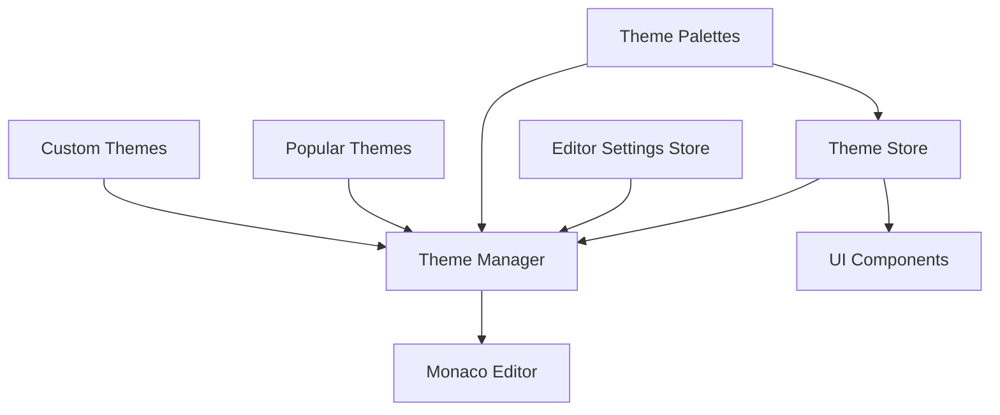
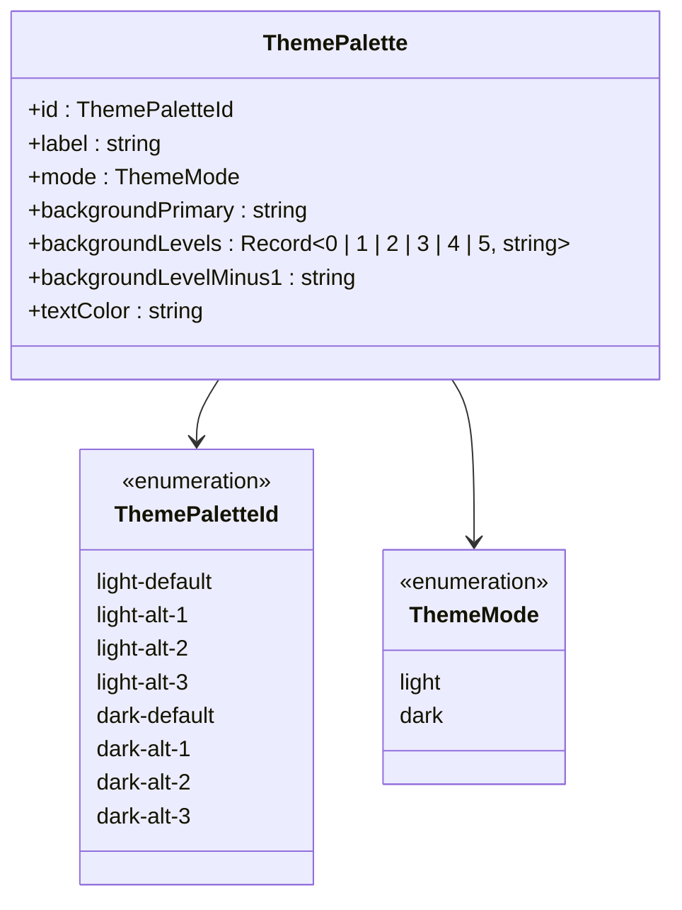
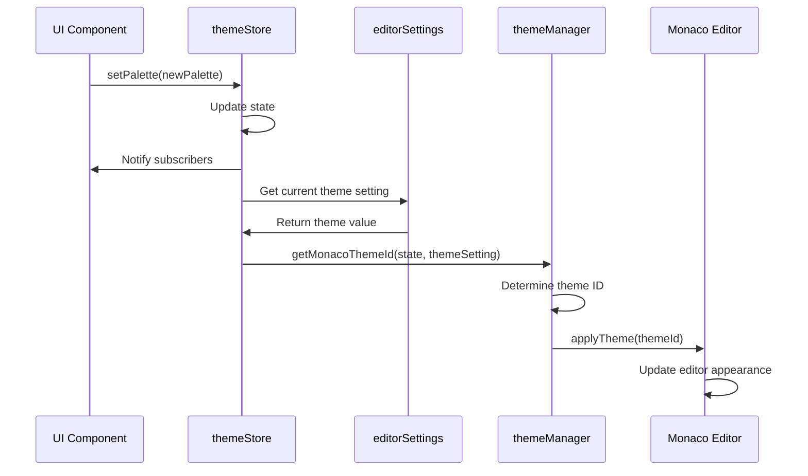
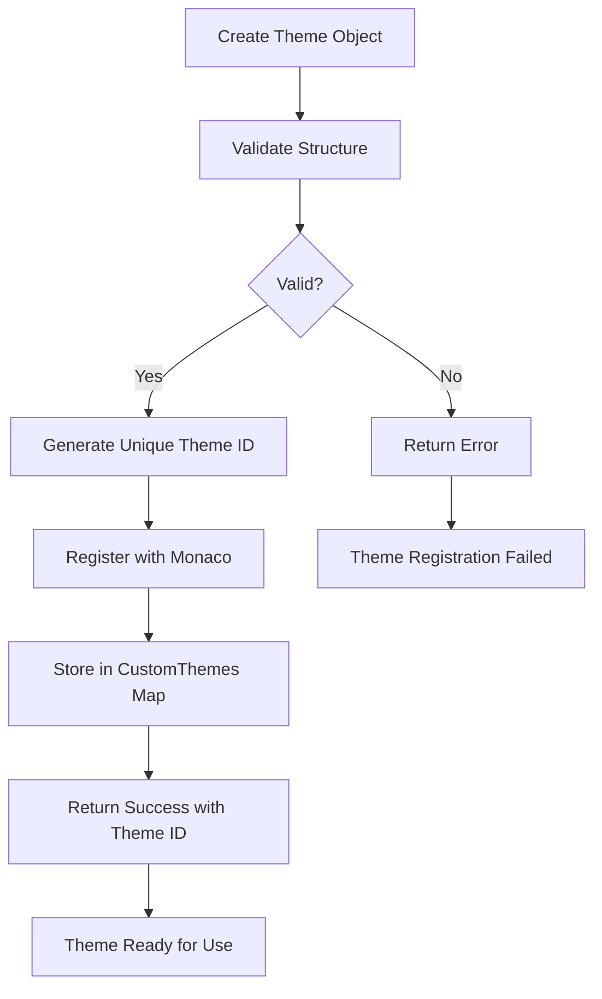
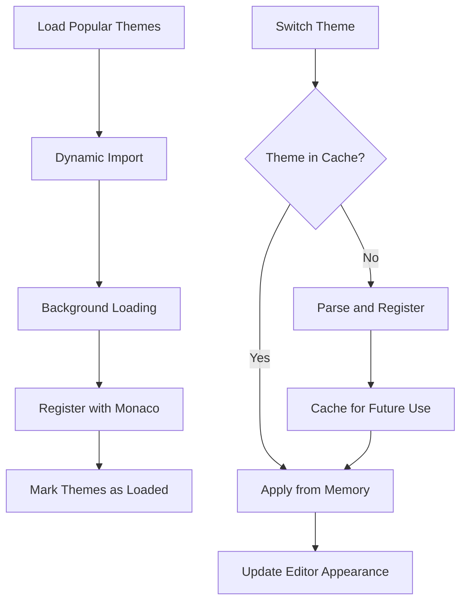

# Editor Themes

<cite>
**Referenced Files in This Document**   
- [themeManager.ts](file://src/lib/editor/themeManager.ts)
- [THEME_PALETTES.ts](file://src/lib/stores/THEME_PALETTES.ts)
- [themeStore.ts](file://src/lib/stores/themeStore.ts)
- [EditorCore.ts](file://src/lib/editor/EditorCore.ts)
- [editorSettingsStore.ts](file://src/lib/stores/editorSettingsStore.ts)
- [monaco-themes.d.ts](file://src/types/monaco-themes.d.ts)
</cite>

## Table of Contents

1. [Introduction](#introduction)
2. [Theme Architecture Overview](#theme-architecture-overview)
3. [Theme Manager Implementation](#theme-manager-implementation)
4. [Theme Palette System](#theme-palette-system)
5. [Monaco Theme Specification Conversion](#monaco-theme-specification-conversion)
6. [UI and Editor Theme Synchronization](#ui-and-editor-theme-synchronization)
7. [Custom Theme Creation and Registration](#custom-theme-creation-and-registration)
8. [Theme Contributions and Language Rules](#theme-contributions-and-language-rules)
9. [Performance Considerations and Caching](#performance-considerations-and-caching)
10. [Conclusion](#conclusion)

## Introduction

The editor themes sub-feature provides a comprehensive system for managing syntax highlighting and code appearance within the Monaco Editor. This documentation details the architecture and implementation of the theme management system, focusing on how custom themes are registered, applied, and synchronized with the application's UI themes. The system enables users to customize their coding experience through various theme options while maintaining performance and consistency across the application.

**Section sources**

- [themeManager.ts](file://src/lib/editor/themeManager.ts#L1-L273)
- [THEME_PALETTES.ts](file://src/lib/stores/THEME_PALETTES.ts#L1-L314)

## Theme Architecture Overview

The theme system consists of several interconnected components that work together to provide a seamless theming experience. At its core, the system separates UI themes from editor themes while maintaining synchronization between them. The architecture includes a theme manager for handling Monaco Editor themes, a theme store for managing application-wide theme state, and a palette system that defines the color schemes used throughout the application.



**Diagram sources**

- [themeManager.ts](file://src/lib/editor/themeManager.ts#L34-L257)
- [themeStore.ts](file://src/lib/stores/themeStore.ts#L36-L119)
- [THEME_PALETTES.ts](file://src/lib/stores/THEME_PALETTES.ts#L75-L155)

## Theme Manager Implementation

The ThemeManager class serves as the central component for managing Monaco Editor themes. It handles the registration and application of both built-in and custom themes, providing a clean API for theme operations. The manager maintains a collection of custom themes and tracks the currently applied theme.

The implementation includes methods for:

- Initializing the theme manager with a Monaco Editor instance
- Registering built-in themes (vs, vs-dark, hc-black, hc-light)
- Registering custom themes from JSON definitions
- Applying themes by ID
- Retrieving available themes (built-in, popular, and custom)
- Exporting and removing custom themes

The theme manager also handles the asynchronous loading of popular themes from the monaco-themes package, using dynamic imports to load theme files on-demand without blocking editor initialization.

```mermaid
classDiagram
class ThemeManager {
-monaco : typeof monaco | null
-customThemes : Map<string, CustomTheme>
-currentThemeId : string | null
-initialized : boolean
-themesLoaded : boolean
+initialize(monacoInstance : typeof monaco) : void
+isInitialized() : boolean
+areThemesLoaded() : boolean
+registerBuiltInTheme(themeId : keyof builtInThemes) : void
+registerCustomTheme(themeJson : string) : { success : boolean; error? : string; themeId? : string }
+applyTheme(themeId : string) : boolean
+getAvailableThemes() : Array<{ id : string; name : string; type : 'built-in' | 'custom' | 'popular' }>
+exportTheme(themeId : string) : string | null
+removeCustomTheme(themeId : string) : boolean
+getCurrentTheme() : string | null
+createThemeFromPalette(paletteId : ThemePaletteId) : CustomTheme
+loadPopularThemes() : Promise<void>
}
class CustomTheme {
+name : string
+base : 'vs' | 'vs-dark' | 'hc-black' | 'hc-light'
+inherit : boolean
+rules : Array<{ token : string; foreground? : string; background? : string; fontStyle? : string }>
+colors : Record<string, string>
}
ThemeManager --> CustomTheme : "manages"
```

**Diagram sources**

- [themeManager.ts](file://src/lib/editor/themeManager.ts#L34-L257)

**Section sources**

- [themeManager.ts](file://src/lib/editor/themeManager.ts#L34-L257)

## Theme Palette System

The theme palette system provides the foundation for both UI and editor theming. It defines a set of approved color palettes that ensure visual consistency across the application. The system includes eight distinct palettes: four for light mode and four for dark mode, each with a default and three alternative variations.

Each palette contains:

- A unique identifier following the pattern `{mode}-{variant}` (e.g., 'light-default', 'dark-alt-1')
- A human-readable label
- A mode designation (light or dark)
- A primary background color
- A hierarchy of background levels for UI depth
- A text color for optimal readability

The system includes utility functions for calculating background levels based on the primary color, ensuring consistent contrast ratios across different palette variations. The palette system is designed to be the single source of truth for color definitions, preventing the creation of arbitrary colors and maintaining design consistency.



**Diagram sources**

- [THEME_PALETTES.ts](file://src/lib/stores/THEME_PALETTES.ts#L24-L32)
- [THEME_PALETTES.ts](file://src/lib/stores/THEME_PALETTES.ts#L35-L54)

**Section sources**

- [THEME_PALETTES.ts](file://src/lib/stores/THEME_PALETTES.ts#L24-L314)

## Monaco Theme Specification Conversion

The system converts theme palette definitions into Monaco theme specifications through the createThemeFromPalette method. This process involves mapping application palette colors to Monaco editor color tokens and defining syntax highlighting rules.

The conversion process includes:

1. Determining the base theme (vs for light mode, vs-dark for dark mode)
2. Mapping palette colors to editor color tokens:
   - editor.background: Uses backgroundLevels[1] for working area
   - editor.foreground: Uses the palette's textColor
   - editor.lineHighlightBackground: Uses backgroundLevels[5] for highlight states
   - editorCursor.foreground: Matches the text color for visibility
   - editor.selectionBackground: Uses mode-specific selection colors
   - editorLineNumber.foreground: Uses appropriate gray tones for line numbers

3. Defining syntax highlighting rules for common token types:
   - Comments: Green with italic font style
   - Keywords: Blue with bold font style
   - Strings: Reddish tones
   - Numbers: Greenish tones

The generated theme IDs follow the pattern "nova-{paletteId}", creating a direct link between the application palette and the corresponding editor theme.

```mermaid
flowchart TD
A[Palette ID] --> B{Is Dark Mode?}
B --> |Yes| C[Base Theme: vs-dark]
B --> |No| D[Base Theme: vs]
C --> E[Map Palette Colors to Editor Tokens]
D --> E
E --> F[Define Syntax Highlighting Rules]
F --> G[Generate Theme ID: nova-{paletteId}]
G --> H[Register Theme with Monaco]
H --> I[Theme Ready for Application]
```

**Diagram sources**

- [themeManager.ts](file://src/lib/editor/themeManager.ts#L187-L213)

**Section sources**

- [themeManager.ts](file://src/lib/editor/themeManager.ts#L187-L213)

## UI and Editor Theme Synchronization

The theme system synchronizes editor themes with UI themes through a state management approach using Svelte stores. The themeStore provides a reactive state management system that serves as the single source of truth for theme-related state.

The synchronization process works as follows:

1. The themeStore maintains the current theme mode (light/dark) and selected palette
2. The editorSettingsStore contains the editor theme setting, which can be set to 'auto' or a specific theme ID
3. The getMonacoThemeId function determines the appropriate Monaco theme ID based on these states:
   - If editorSettings.theme is set to a specific theme (not 'auto'), that theme is used
   - Otherwise, the theme follows the application palette using the "nova-{palette}" pattern

When the UI theme changes (mode or palette), the system automatically updates the editor theme if it's set to 'auto'. This ensures visual consistency between the application interface and the code editor without requiring manual intervention.



**Diagram sources**

- [themeStore.ts](file://src/lib/stores/themeStore.ts#L36-L119)
- [editorSettingsStore.ts](file://src/lib/stores/editorSettingsStore.ts#L32-L179)
- [themeManager.ts](file://src/lib/editor/themeManager.ts#L264-L273)

**Section sources**

- [themeStore.ts](file://src/lib/stores/themeStore.ts#L36-L119)
- [editorSettingsStore.ts](file://src/lib/stores/editorSettingsStore.ts#L32-L179)
- [themeManager.ts](file://src/lib/editor/themeManager.ts#L264-L273)

## Custom Theme Creation and Registration

Users can create custom editor themes by extending existing ones and registering them with the theme manager. The system supports custom themes through a JSON-based definition format that follows the CustomTheme interface.

To create a custom theme:

1. Define a theme object with the required properties:
   - name: Human-readable theme name
   - base: Base theme to inherit from (vs, vs-dark, hc-black, hc-light)
   - inherit: Boolean indicating whether to inherit from the base theme
   - rules: Array of token coloring rules
   - colors: Record of editor color overrides

2. Register the theme using the registerCustomTheme method, which accepts a JSON string representation of the theme.

3. The theme manager validates the theme structure, generates a unique ID, registers it with Monaco, and stores it in memory.

Custom themes can extend existing themes by setting the inherit property to true and specifying a base theme. This allows users to modify specific aspects of an existing theme while preserving its overall character.



**Diagram sources**

- [themeManager.ts](file://src/lib/editor/themeManager.ts#L78-L110)

**Section sources**

- [themeManager.ts](file://src/lib/editor/themeManager.ts#L8-L19)

## Theme Contributions and Language Rules

The theme system supports theme contributions for different programming languages and file types through Monaco's theming capabilities. While the core theme manager handles the registration and application of themes, Monaco Editor itself manages language-specific tokenization and syntax highlighting.

Theme contributions are defined through:

1. Token rules that match specific language constructs
2. Editor color overrides for UI elements
3. Semantic highlighting rules for advanced language features

The system leverages Monaco's built-in language support for tokenization, with themes providing the visual representation of these tokens. When a custom theme is applied, it affects the appearance of all supported languages, with token colors adapting to the theme's defined rules.

For language-specific customizations, developers can extend themes by adding token rules that target specific language scopes. This allows for fine-grained control over the appearance of code in different programming languages while maintaining a consistent overall theme aesthetic.

```mermaid
erDiagram
THEME ||--o{ TOKEN_RULE : "contains"
THEME ||--o{ EDITOR_COLOR : "defines"
TOKEN_RULE ||--o{ LANGUAGE : "applies to"
EDITOR_COLOR ||--o{ UI_ELEMENT : "styles"
class Theme {
+name: string
+base: string
+inherit: boolean
}
class TokenRule {
+token: string
+foreground: string
+background: string
+fontStyle: string
}
class EditorColor {
+colorId: string
+value: string
}
class Language {
+id: string
+extensions: string[]
+aliases: string[]
}
class UIElement {
+elementId: string
+description: string
}
```

**Diagram sources**

- [themeManager.ts](file://src/lib/editor/themeManager.ts#L12-L18)
- [EditorCore.ts](file://src/lib/editor/EditorCore.ts#L115-L127)

**Section sources**

- [themeManager.ts](file://src/lib/editor/themeManager.ts#L12-L18)
- [EditorCore.ts](file://src/lib/editor/EditorCore.ts#L115-L127)

## Performance Considerations and Caching

The theme system incorporates several performance optimizations to ensure smooth operation, especially when loading multiple themes or switching between them frequently.

Key performance considerations include:

1. **Lazy Loading of Popular Themes**: Popular themes are loaded asynchronously using dynamic imports, preventing them from blocking editor initialization. The loadPopularThemes method runs in the background, allowing the editor to become usable immediately.

2. **Theme Caching**: Custom themes are cached in memory within the ThemeManager's customThemes Map. This allows for instant switching between custom themes without re-parsing or re-registering them with Monaco.

3. **Efficient Theme Switching**: The applyTheme method directly calls Monaco's setTheme function, which is optimized for performance. The theme manager maintains the current theme ID to avoid unnecessary re-applications.

4. **Minimal Recalculation**: When creating themes from palettes, color calculations are performed only when needed. The background level calculations are optimized to avoid redundant operations.

5. **Memory Management**: The system provides methods to remove custom themes (removeCustomTheme), allowing for memory cleanup when themes are no longer needed.

The combination of these optimizations ensures that theme switching is fast and responsive, even with a large number of installed themes.



**Diagram sources**

- [themeManager.ts](file://src/lib/editor/themeManager.ts#L225-L253)
- [themeManager.ts](file://src/lib/editor/themeManager.ts#L115-L125)

**Section sources**

- [themeManager.ts](file://src/lib/editor/themeManager.ts#L225-L253)
- [themeManager.ts](file://src/lib/editor/themeManager.ts#L115-L125)

## Conclusion

The editor themes system provides a robust and flexible solution for managing syntax highlighting and code appearance in the Monaco Editor. By separating concerns between UI themes and editor themes while maintaining synchronization through state management, the system offers users extensive customization options without compromising performance or consistency.

Key strengths of the implementation include:

- A clear separation of theme management responsibilities
- Efficient conversion of palette definitions to Monaco themes
- Seamless synchronization between UI and editor themes
- Support for custom theme creation and registration
- Optimized performance through lazy loading and caching

The system's architecture allows for easy extension and maintenance, making it well-suited for future enhancements such as user-defined theme sharing, theme previews, or advanced theme editing capabilities.
