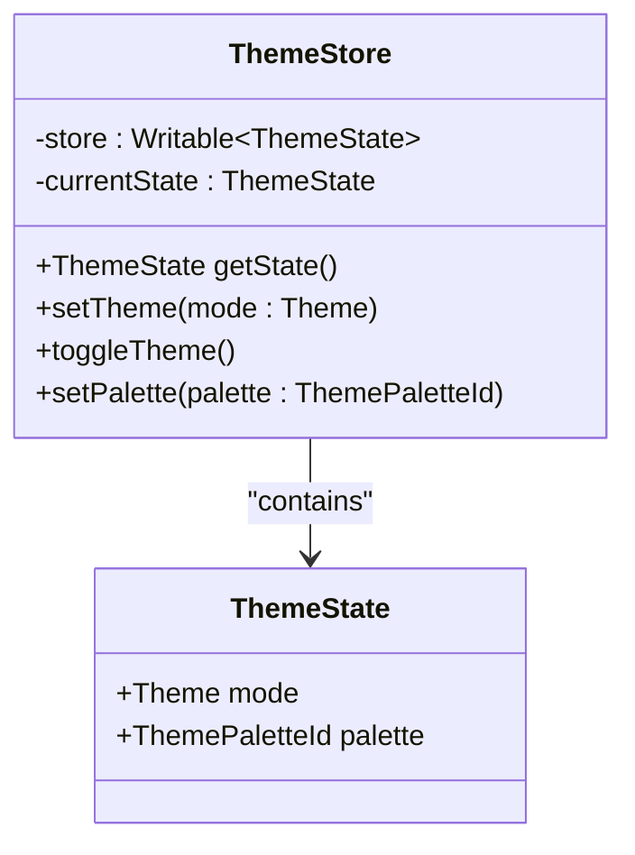
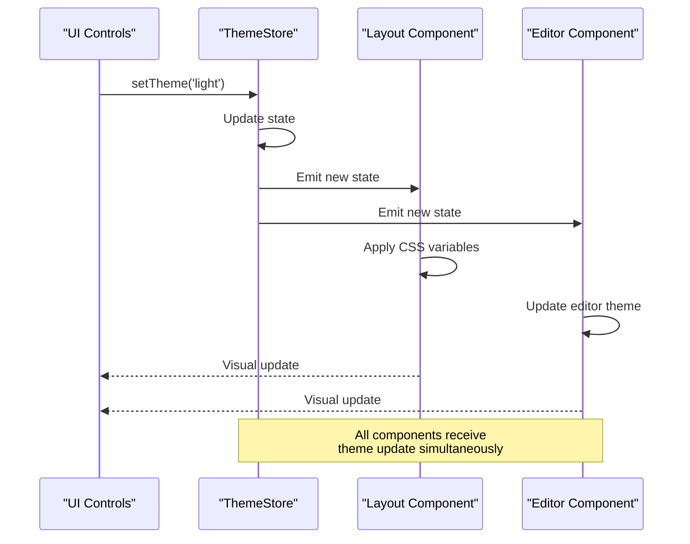
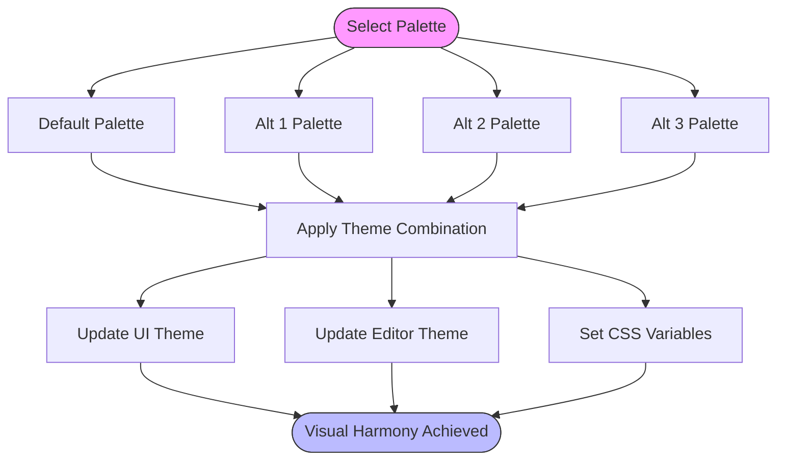
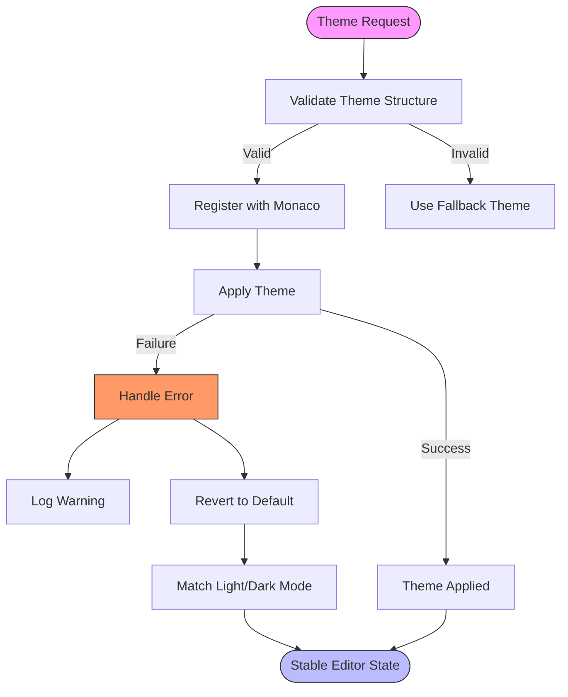
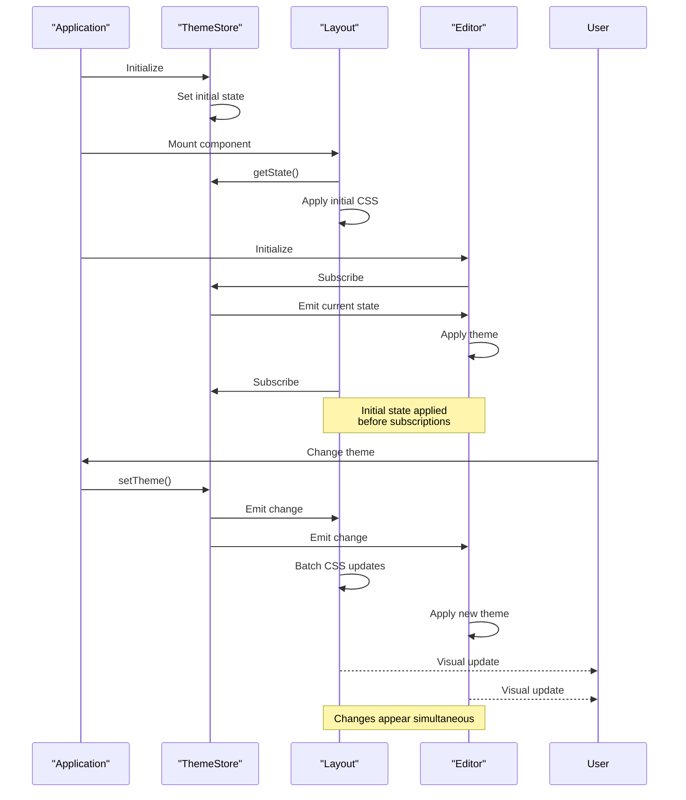
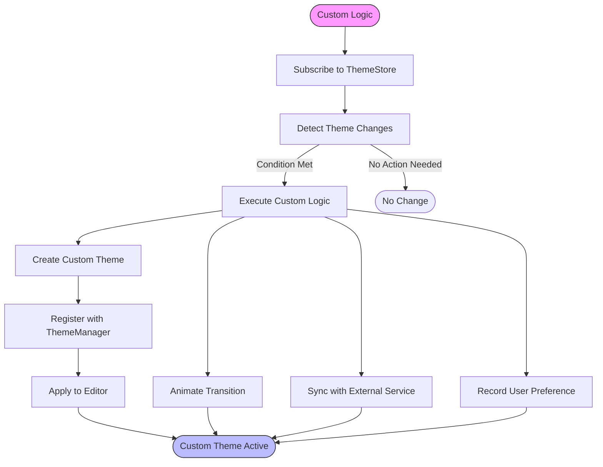

# Theme Synchronization

<cite>
**Referenced Files in This Document**   
- [themeStore.ts](file://src/lib/stores/themeStore.ts)
- [themeManager.ts](file://src/lib/editor/themeManager.ts)
- [THEME_QUICK_START.ts](file://src/lib/stores/THEME_QUICK_START.ts)
- [THEME_PALETTES.ts](file://src/lib/stores/THEME_PALETTES.ts)
- [editorSettingsStore.ts](file://src/lib/stores/editorSettingsStore.ts)
- [registry.ts](file://src/lib/settings/registry.ts)
- [+layout.svelte](file://src/routes/+layout.svelte)
</cite>

## Table of Contents

1. [Introduction](#introduction)
2. [Theme Store as Single Source of Truth](#theme-store-as-single-source-of-truth)
3. [Event-Driven Architecture for Theme Updates](#event-driven-architecture-for-theme-updates)
4. [Quick Start Theme System](#quick-start-theme-system)
5. [Editor Theme Synchronization](#editor-theme-synchronization)
6. [Fallback Mechanisms and Error Handling](#fallback-mechanisms-and-error-handling)
7. [Timing Considerations and Visual Flickering Prevention](#timing-considerations-and-visual-flickering-prevention)
8. [Custom Synchronization Logic Implementation](#custom-synchronization-logic-implementation)
9. [Conclusion](#conclusion)

## Introduction

The theme synchronization system ensures visual consistency between the application interface and code editor by maintaining synchronized themes across both components. This document details the architecture and implementation of this synchronization mechanism, focusing on how UI and editor themes update simultaneously when theme changes occur. The system uses a centralized theme store as the single source of truth, coordinates theme application through a theme manager, provides pre-configured theme combinations through a quick start system, and handles edge cases such as unavailable editor themes and loading errors. The implementation addresses timing considerations to prevent visual flickering during theme transitions.

## Theme Store as Single Source of Truth

The theme store serves as the central authority for theme selection and state management throughout the application. It maintains a unified state that includes both the UI theme mode (light/dark) and the selected color palette, ensuring all components reference the same theme information.

The theme store exposes methods to modify the theme state, including `setTheme()` for changing the light/dark mode, `toggleTheme()` for switching between modes while preserving the palette "slot", and `setPalette()` for selecting a specific color palette. When the theme mode changes, the store intelligently preserves the palette slot (e.g., switching from "dark-alt-2" to "light-alt-2") to maintain visual consistency across mode transitions.



**Diagram sources**

- [themeStore.ts](file://src/lib/stores/themeStore.ts#L1-L120)

**Section sources**

- [themeStore.ts](file://src/lib/stores/themeStore.ts#L1-L120)

## Event-Driven Architecture for Theme Updates

The theme synchronization system employs an event-driven architecture where the theme store acts as the publisher of theme state changes, and various components act as subscribers that react to these changes. This decoupled approach ensures that theme updates propagate consistently throughout the application without tight coupling between components.

When a theme change occurs, the theme store emits the new state through its subscription mechanism. The application layout component subscribes to these changes and responds by updating CSS custom properties that define the visual appearance of the UI. This approach allows for immediate visual updates across all components that use these CSS variables, creating a cohesive and synchronized appearance.

The event-driven nature of this system also enables multiple components to respond to theme changes independently. For example, when the theme changes, the layout updates its visual styling, the editor updates its appearance, and any other theme-sensitive components can respond appropriately—all triggered by the same state change event from the central store.



**Diagram sources**

- [themeStore.ts](file://src/lib/stores/themeStore.ts#L1-L120)
- [+layout.svelte](file://src/routes/+layout.svelte#L1-L478)

**Section sources**

- [themeStore.ts](file://src/lib/stores/themeStore.ts#L1-L120)
- [+layout.svelte](file://src/routes/+layout.svelte#L1-L478)

## Quick Start Theme System

The quick start theme system provides pre-configured combinations of UI and editor themes that ensure visual harmony between the application interface and code editor. This system offers four ready-to-use palettes for both light and dark modes, each with distinct color characteristics that maintain readability and aesthetic consistency.

The available palettes include:

- **Default**: The standard color scheme for each mode
- **Alt 1**: An alternative palette with different base colors
- **Alt 2**: A second alternative option
- **Alt 3**: A third alternative option

These palettes are defined in the `THEME_PALETTES` module, which contains the complete specification for each color scheme, including the primary background color, text color, and calculated background levels for different UI elements. The system ensures that when a user selects a palette, both the UI and editor themes are updated to complementary schemes that work well together, eliminating the need for users to manually coordinate separate UI and editor theme settings.



**Diagram sources**

- [THEME_QUICK_START.ts](file://src/lib/stores/THEME_QUICK_START.ts#L1-L135)
- [THEME_PALETTES.ts](file://src/lib/stores/THEME_PALETTES.ts#L1-L314)

**Section sources**

- [THEME_QUICK_START.ts](file://src/lib/stores/THEME_QUICK_START.ts#L1-L135)
- [THEME_PALETTES.ts](file://src/lib/stores/THEME_PALETTES.ts#L1-L314)

## Editor Theme Synchronization

The editor theme synchronization mechanism ensures that the code editor's appearance remains coordinated with the application's UI theme. This is achieved through the ThemeManager class, which acts as an intermediary between the central theme store and the Monaco editor instance.

The synchronization process follows a specific priority hierarchy. When determining the editor theme, the system first checks if a specific editor theme has been explicitly set in the editor settings. If no explicit theme is set (or if it's set to 'auto'), the system derives the editor theme from the current UI palette by prefixing it with "nova-". This creates a direct mapping between UI palettes and editor themes, ensuring visual consistency.

The ThemeManager class provides methods to create custom themes based on the application's color palettes, register both built-in and custom themes with Monaco, and apply the appropriate theme to the editor instance. When the theme store emits a state change, the editor components respond by retrieving the current theme configuration and applying it to the editor through the ThemeManager.

```mermaid
classDiagram
class ThemeManager {
+initialize(monacoInstance)
+isInitialized()
+areThemesLoaded()
+registerBuiltInTheme(themeId)
+registerCustomTheme(themeJson)
+applyTheme(themeId)
+createThemeFromPalette(paletteId)
+loadPopularThemes()
-monaco : monaco
-customThemes : Map~string,CustomTheme~
-currentThemeId : string
}
class CustomTheme {
+name : string
+base : 'vs' | 'vs-dark' | 'hc-black' | 'hc-light'
+inherit : boolean
+rules : Array~{}
+colors : Record~string,string~
}
class ThemeState {
+Theme mode
+ThemePaletteId palette
}
ThemeManager --> CustomTheme : "creates"
ThemeManager --> ThemeState : "listens to"
ThemeManager --> "monaco.editor" : "controls"
```

**Diagram sources**

- [themeManager.ts](file://src/lib/editor/themeManager.ts#L1-L274)
- [editorSettingsStore.ts](file://src/lib/stores/editorSettingsStore.ts#L1-L180)

**Section sources**

- [themeManager.ts](file://src/lib/editor/themeManager.ts#L1-L274)
- [editorSettingsStore.ts](file://src/lib/stores/editorSettingsStore.ts#L1-L180)

## Fallback Mechanisms and Error Handling

The theme synchronization system includes robust fallback mechanisms and error handling to ensure graceful degradation when theme loading issues occur. When a requested theme is not available, the system implements a hierarchical fallback strategy to maintain functionality and visual coherence.

If a custom theme fails to load or apply, the ThemeManager class catches the error and returns a failure status, allowing the application to handle the situation appropriately. The system validates theme JSON structures before attempting to register them with Monaco, preventing malformed themes from causing editor instability. When theme application fails, the editor typically reverts to a default theme that matches the current light/dark mode.

For popular themes that are loaded asynchronously from external sources, the system implements error handling that allows the editor to initialize without waiting for all themes to load. Failed theme loads are logged as warnings rather than errors, ensuring that a single theme loading failure doesn't disrupt the overall application functionality. This approach prioritizes application stability while still providing access to a wide range of theme options.



**Diagram sources**

- [themeManager.ts](file://src/lib/editor/themeManager.ts#L1-L274)

**Section sources**

- [themeManager.ts](file://src/lib/editor/themeManager.ts#L1-L274)

## Timing Considerations and Visual Flickering Prevention

The theme synchronization system addresses timing considerations to prevent visual flickering during theme transitions. This is achieved through careful coordination of when theme changes are applied and how they propagate through the system.

During application initialization, the system retrieves the current theme state synchronously using the `getState()` method before establishing subscriptions. This ensures that both the UI and editor are initialized with the correct theme from the start, preventing a flash of unstyled content or incorrect theme application.

The CSS variable updates are applied atomically through direct DOM manipulation of the root element's style properties. This approach ensures that all visual changes occur in a single rendering frame, preventing intermediate states where some elements have updated while others have not. The use of CSS custom properties also leverages the browser's native optimization for style changes, minimizing layout recalculations and repaints.

For editor theme changes, the system coordinates the timing between UI updates and editor theme application to ensure they appear simultaneous to the user. The theme manager's asynchronous loading of popular themes is designed not to block editor initialization, allowing the core functionality to be available immediately while additional themes load in the background.



**Diagram sources**

- [themeStore.ts](file://src/lib/stores/themeStore.ts#L1-L120)
- [+layout.svelte](file://src/routes/+layout.svelte#L1-L478)
- [themeManager.ts](file://src/lib/editor/themeManager.ts#L1-L274)

**Section sources**

- [themeStore.ts](file://src/lib/stores/themeStore.ts#L1-L120)
- [+layout.svelte](file://src/routes/+layout.svelte#L1-L478)
- [themeManager.ts](file://src/lib/editor/themeManager.ts#L1-L274)

## Custom Synchronization Logic Implementation

Developers can implement custom synchronization logic for specialized use cases by leveraging the existing theme system's extensible architecture. The system provides several extension points that allow for customized theme behavior while maintaining compatibility with the core synchronization mechanism.

To implement custom logic, developers can subscribe to the theme store and respond to state changes with specialized behavior. For example, a custom component might need to animate between themes rather than applying changes instantly, or a plugin might need to coordinate theme changes with external services. The subscription pattern allows these custom behaviors to be added without modifying the core theme store.

Custom themes can be created and registered through the ThemeManager's `registerCustomTheme()` method, which accepts a JSON representation of a theme. This allows for dynamic theme creation based on user preferences or external configuration. The `createThemeFromPalette()` method provides a foundation for generating themes that are harmonized with the application's color system, which can be extended to create specialized editor themes for particular use cases.



**Diagram sources**

- [themeStore.ts](file://src/lib/stores/themeStore.ts#L1-L120)
- [themeManager.ts](file://src/lib/editor/themeManager.ts#L1-L274)

**Section sources**

- [themeStore.ts](file://src/lib/stores/themeStore.ts#L1-L120)
- [themeManager.ts](file://src/lib/editor/themeManager.ts#L1-L274)

## Conclusion

The theme synchronization system provides a robust and flexible mechanism for maintaining visual consistency between the application interface and code editor. By establishing the theme store as a single source of truth and implementing an event-driven architecture, the system ensures that theme changes are propagated reliably throughout the application. The quick start theme system offers pre-configured combinations that guarantee visual harmony, while the fallback mechanisms and error handling ensure graceful degradation when issues occur. Timing considerations have been addressed to prevent visual flickering during transitions, and the extensible architecture allows for custom synchronization logic in specialized use cases. This comprehensive approach to theme management enhances the user experience by providing a cohesive and predictable visual environment across all application components.
