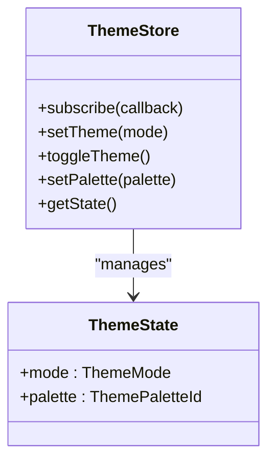
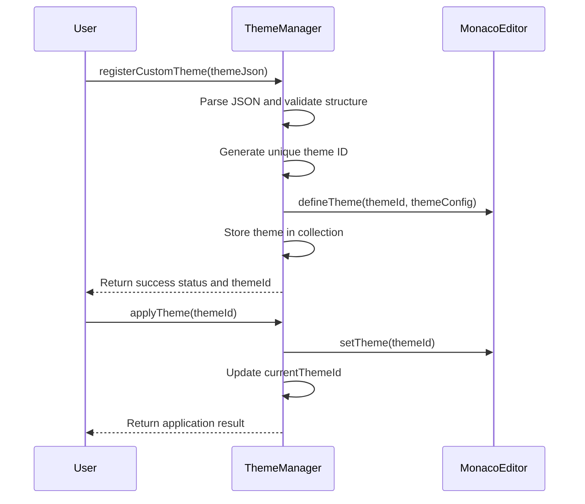
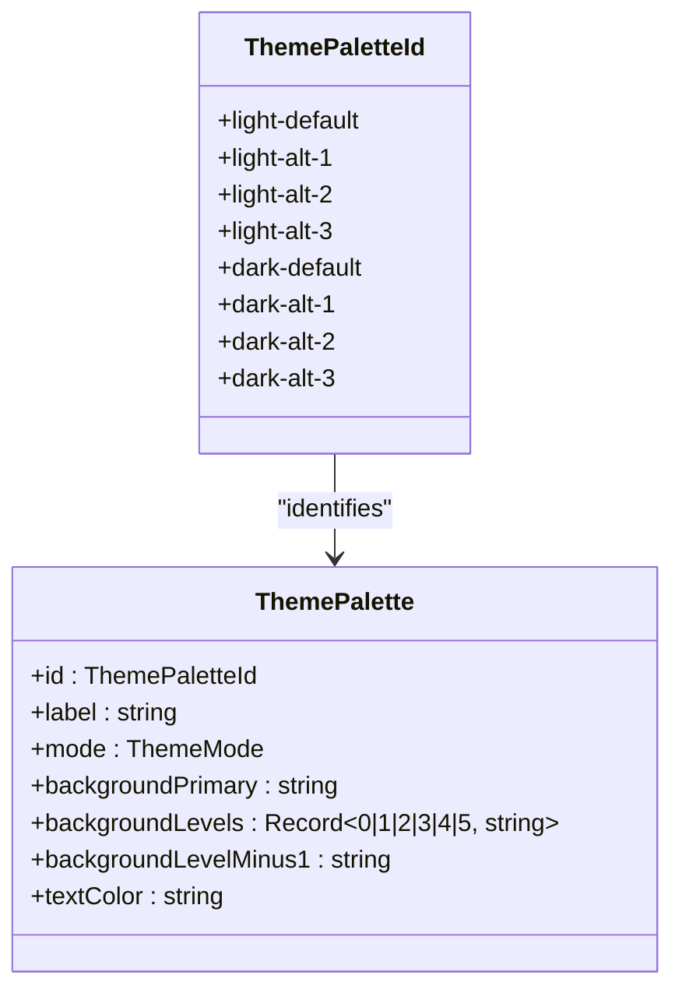

# Theming System

<cite>
**Referenced Files in This Document**   
- [themeStore.ts](file://src/lib/stores/themeStore.ts)
- [THEME_PALETTES.ts](file://src/lib/stores/THEME_PALETTES.ts)
- [THEME_QUICK_START.ts](file://src/lib/stores/THEME_QUICK_START.ts)
- [themeManager.ts](file://src/lib/editor/themeManager.ts)
- [registry.ts](file://src/lib/settings/registry.ts)
- [devicon-dark-theme.css](file://static/devicon-dark-theme.css)
- [app.css](file://src/app.css)
</cite>

## Table of Contents

1. [Dual Theming Approach](#dual-theming-approach)
2. [Theme Store Implementation](#theme-store-implementation)
3. [Theme Manager for Monaco Editor](#theme-manager-for-monaco-editor)
4. [Predefined Theme Palettes](#predefined-theme-palettes)
5. [Quick Start Themes System](#quick-start-themes-system)
6. [Custom Theme Creation and Installation](#custom-theme-creation-and-installation)
7. [Theme Switching and Customization](#theme-switching-and-customization)
8. [Accessibility and Contrast Ratios](#accessibility-and-contrast-ratios)

## Dual Theming Approach

The NC code editor implements a dual theming approach that separates UI themes from editor themes while allowing for synchronization. This architecture provides users with independent control over the application interface appearance and the code editor's visual presentation. The UI theme controls the overall application shell, including sidebars, menus, and panels, while the editor theme specifically manages the syntax highlighting, background, and text colors within the code editing area.

The system allows for both independent configuration and synchronized behavior. Users can choose to have the editor theme automatically follow the UI theme selection, creating a cohesive visual experience, or they can configure them independently for specialized workflows. This flexibility is achieved through the theme store, which serves as the single source of truth for theme state, and the theme manager, which handles the application of themes to the Monaco Editor component.

The separation of concerns between UI and editor theming enables advanced customization scenarios. For example, a user might prefer a dark UI theme for reduced eye strain during long sessions while using a light editor theme for better readability of certain code syntax. The system also supports quick switching between theme combinations through the quick start system, which provides curated theme pairings for immediate use.

**Section sources**

- [themeStore.ts](file://src/lib/stores/themeStore.ts#L1-L120)
- [themeManager.ts](file://src/lib/editor/themeManager.ts#L1-L274)

## Theme Store Implementation

The theme store is implemented as a Svelte writable store that manages the current theme selection and notifies components of changes. It serves as the single source of truth for the application's theme state, ensuring consistency across all UI components. The store maintains two key pieces of state: the theme mode (light or dark) and the selected color palette.

The theme store provides several methods for interacting with the theme state:

- `setTheme(mode)`: Sets the theme mode (light or dark), automatically preserving the palette "slot" when switching between modes
- `toggleTheme()`: Toggles between light and dark modes while maintaining the current palette slot
- `setPalette(palette)`: Sets the specific color palette to use within the current theme mode
- `getState()`: Retrieves the current theme state synchronously

The store's implementation ensures that when switching between light and dark modes, the system attempts to preserve the "slot" of the current palette. For example, if a user is using the "dark-alt-2" palette and switches to light mode, the system will automatically select "light-alt-2" to maintain visual consistency. This behavior provides a seamless transition between modes while preserving the user's preferred aesthetic.

The theme store is designed to be consumed by various components throughout the application, including the layout, settings panel, and editor. Components can subscribe to the store to receive updates when the theme changes, ensuring that the entire interface updates consistently. The store also integrates with the settings system, allowing theme preferences to be persisted across sessions.



**Diagram sources**

- [themeStore.ts](file://src/lib/stores/themeStore.ts#L1-L120)

**Section sources**

- [themeStore.ts](file://src/lib/stores/themeStore.ts#L1-L120)

## Theme Manager for Monaco Editor

The theme manager is responsible for handling Monaco Editor theme registration and application. It acts as a bridge between the application's theme system and the Monaco Editor component, ensuring that editor themes are properly loaded, registered, and applied. The manager is implemented as a class with methods for initializing the theme system, registering both built-in and custom themes, and applying themes to the editor instance.

The theme manager supports three types of themes:

1. **Built-in themes**: The standard themes provided by Monaco Editor (vs, vs-dark, hc-black, hc-light)
2. **Popular themes**: Additional themes loaded from the monaco-themes package, including Monokai, Dracula, Nord, and others
3. **Custom themes**: User-defined themes that can be imported, exported, and managed through the editor interface

The manager provides methods for registering custom themes from JSON configuration, applying themes by ID, and retrieving the list of available themes. It also handles the creation of Monaco Editor themes based on the application's color palettes, ensuring visual consistency between the UI and editor. When a custom theme is registered, the manager generates a unique ID and stores the theme configuration for later retrieval and export.

A key feature of the theme manager is its asynchronous loading of popular themes. Instead of blocking editor initialization, the manager loads popular themes in the background using dynamic imports, allowing the editor to become available quickly while additional themes are loaded in the background. This approach improves the user experience by reducing startup time.



**Diagram sources**

- [themeManager.ts](file://src/lib/editor/themeManager.ts#L1-L274)

**Section sources**

- [themeManager.ts](file://src/lib/editor/themeManager.ts#L1-L274)

## Predefined Theme Palettes

The theming system includes a comprehensive set of predefined theme palettes structured in the THEME_PALETTES configuration. These palettes provide a consistent and accessible color scheme across the application, with carefully selected colors that meet accessibility standards. The palettes are defined in a TypeScript module that exports a record of theme configurations, each with a unique ID, label, mode, and color properties.

There are eight predefined palettes, organized into four variations for each theme mode (light and dark):

- **Light theme palettes**: light-default, light-alt-1, light-alt-2, light-alt-3
- **Dark theme palettes**: dark-default, dark-alt-1, dark-alt-2, dark-alt-3

Each palette includes the following properties:

- `backgroundPrimary`: The primary background color for the application shell
- `backgroundLevels`: A record of background colors for different UI hierarchy levels (0-5)
- `backgroundLevelMinus1`: A special background color for specific UI elements like the tab bar
- `textColor`: The primary text color for the palette

The background levels are calculated algorithmically based on the primary background color, with adjustments made according to the theme mode. For dark themes, each level is progressively lighter (+8-16 brightness points), creating a sense of depth and hierarchy. For light themes, each level is progressively darker (-8-16 brightness points), achieving a similar visual effect. This systematic approach ensures visual consistency across all palettes while providing sufficient contrast for readability.

The predefined palettes are designed to work harmoniously with the application's UI components and provide sufficient contrast for accessibility. The color choices are based on established design principles and have been tested for readability and visual comfort in various lighting conditions.



**Diagram sources**

- [THEME_PALETTES.ts](file://src/lib/stores/THEME_PALETTES.ts#L1-L314)

**Section sources**

- [THEME_PALETTES.ts](file://src/lib/stores/THEME_PALETTES.ts#L1-L314)

## Quick Start Themes System

The quick start themes system provides curated theme combinations for immediate use, allowing users to quickly apply aesthetically pleasing and functionally sound theme configurations. This system is documented in the THEME_QUICK_START module, which serves as both a configuration file and a usage guide for developers and users.

The quick start system offers several key features:

- **Immediate theme switching**: Users can quickly change the theme mode, palette, or both with simple function calls
- **Pre-configured combinations**: Curated pairings of UI and editor themes that work well together
- **Usage examples**: Clear code examples demonstrating how to implement common theme operations
- **CSS variable integration**: Documentation of the CSS variables available for theme customization

The system provides straightforward methods for common operations:

- `theme.setTheme('light')` or `theme.setTheme('dark')` to change the theme mode
- `theme.toggleTheme()` to switch between light and dark modes
- `theme.setPalette('dark-alt-1')` to change the color palette within the current mode
- Subscription to theme changes for reactive updates

The quick start guide also documents the CSS variables that are available for styling components, including background levels (var(--nc-level-0) through var(--nc-level-5)) and palette colors (var(--nc-palette-text), var(--nc-palette-border)). These variables are automatically updated when the theme changes, ensuring that all components using them will reflect the current theme.

Additionally, the quick start system identifies the key files involved in the theming architecture, helping developers understand the system's structure and locate relevant code. This includes the THEME_PALETTES module for color definitions, the themeStore for state management, the layout component for applying CSS variables, and the settings registry for user configuration.

**Section sources**

- [THEME_QUICK_START.ts](file://src/lib/stores/THEME_QUICK_START.ts#L1-L135)

## Custom Theme Creation and Installation

The NC code editor supports custom theme creation and installation, allowing users to import, export, and manage their own theme configurations. This functionality is primarily handled by the theme manager, which provides methods for registering custom themes from JSON configuration and managing the collection of user-defined themes.

To create a custom theme, users can define a JSON configuration that follows the CustomTheme interface structure:

- `name`: The display name of the theme
- `base`: The base theme to inherit from (vs, vs-dark, hc-black, or hc-light)
- `inherit`: Whether to inherit from the base theme
- `rules`: An array of token coloring rules with foreground, background, and font style properties
- `colors`: A record of editor color overrides

Custom themes can be installed by importing a JSON file through the editor's theme management interface. The theme manager validates the JSON structure, generates a unique ID for the theme, registers it with Monaco Editor, and stores it in memory for the current session. Users can also export their custom themes to JSON for sharing or backup.

The system supports both programmatic and UI-based theme management. Developers can use the theme manager's API to register custom themes, while end users can manage themes through the settings interface. Custom themes are listed alongside built-in and popular themes in the theme selection dropdown, with a "custom" type indicator.

When a custom theme is no longer needed, it can be removed using the theme manager's removeCustomTheme method. This removes the theme from the internal collection but does not affect the Monaco Editor instance until a different theme is applied.

**Section sources**

- [themeManager.ts](file://src/lib/editor/themeManager.ts#L1-L274)

## Theme Switching and Customization

The theming system provides multiple methods for switching between themes and customizing individual color elements. Users can change themes through the settings interface, programmatically via the theme store API, or using keyboard shortcuts if configured. The system supports both immediate theme switching and animated transitions between themes.

To switch between themes programmatically, developers can use the methods provided by the theme store:

- `theme.setTheme('light')` or `theme.setTheme('dark')` to change the overall theme mode
- `theme.toggleTheme()` to switch between light and dark modes
- `theme.setPalette('dark-alt-2')` to change the specific color palette

For more granular customization, the system exposes CSS variables that can be used to modify individual color elements. These variables include:

- Background levels: var(--nc-level-0) through var(--nc-level-5) for different UI hierarchy levels
- Palette colors: var(--nc-palette-text) for text color, var(--nc-palette-border) for borders
- Semantic colors: var(--nc-color-primary), var(--nc-color-secondary), etc.

Components can subscribe to theme changes to update their appearance dynamically:

```typescript
theme.subscribe((state) => {
  console.log('Theme mode:', state.mode);
  console.log('Palette:', state.palette);
});
```

The settings interface provides a user-friendly way to customize themes, with visual previews of each palette option. When the user changes the theme mode, the palette selection automatically updates to show only the options available for that mode. The interface also includes a theme editor for advanced users who want to modify individual color values.

**Section sources**

- [themeStore.ts](file://src/lib/stores/themeStore.ts#L1-L120)
- [THEME_QUICK_START.ts](file://src/lib/stores/THEME_QUICK_START.ts#L1-L135)

## Accessibility and Contrast Ratios

The theming system places strong emphasis on accessibility, ensuring that all predefined palettes meet or exceed WCAG AA contrast ratio requirements. The color selections are carefully chosen to provide sufficient contrast between text and background elements, making the editor usable for users with various visual impairments.

The system achieves accessibility compliance through several design principles:

- **High contrast ratios**: Text and background colors are selected to maintain a minimum 4.5:1 contrast ratio for normal text and 3:1 for large text, as required by WCAG AA standards
- **Consistent hierarchy**: Background levels are systematically adjusted to maintain appropriate contrast between adjacent UI elements
- **Color blindness considerations**: Color combinations avoid problematic pairings for common types of color vision deficiency
- **Adaptive icons**: Icon colors are adjusted based on the theme to ensure visibility against different backgrounds

The ICON_COLORS_PALETTE module specifically addresses accessibility for file and technology icons, providing color variants that meet WCAG AA standards for both light and dark themes. For problematic original icon colors that don't provide sufficient contrast, the system applies overrides to ensure readability.

The devicon-dark-theme.css file contains specific fixes for icons that have poor contrast in dark mode, such as changing Markdown's color from black to blue and JSON's color from dark gray to yellow. These adjustments ensure that all icons remain visible and distinguishable regardless of the selected theme.

Additionally, the system uses relative brightness adjustments rather than fixed color values, allowing the contrast ratios to be maintained across different palette variations. This approach ensures that accessibility is preserved even when users select alternative palettes within the same theme mode.

**Section sources**

- [ICON_COLORS_PALETTE.ts](file://src/lib/stores/ICON_COLORS_PALETTE.ts#L1-L800)
- [devicon-dark-theme.css](file://static/devicon-dark-theme.css#L1-L69)
