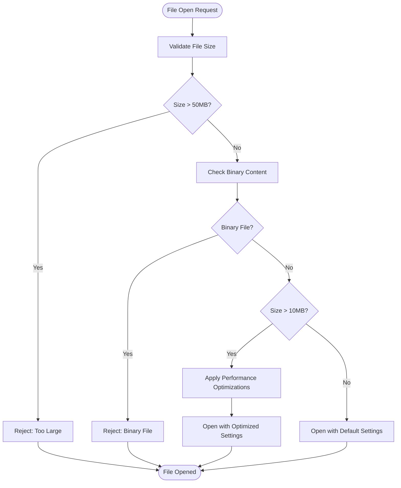
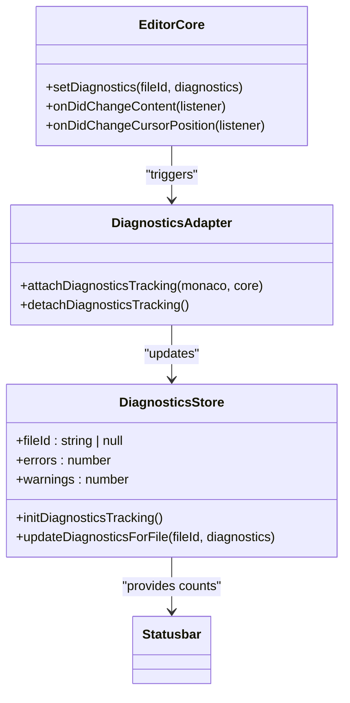
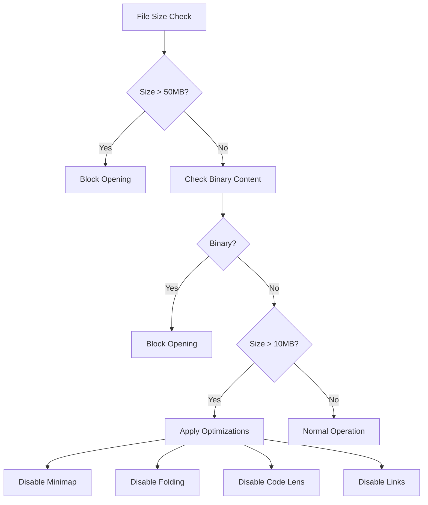

# Troubleshooting

<cite>
**Referenced Files in This Document**   
- [diagnosticsStore.ts](file://src/lib/stores/diagnosticsStore.ts)
- [diagnosticsAdapter.ts](file://src/lib/editor/diagnosticsAdapter.ts)
- [EditorCore.ts](file://src/lib/editor/EditorCore.ts)
- [editorStore.ts](file://src/lib/stores/editorStore.ts)
- [settingsStore.ts](file://src/lib/stores/settingsStore.ts)
- [workspaceStore.ts](file://src/lib/stores/workspaceStore.ts)
- [fileService.ts](file://src/lib/services/fileService.ts)
- [fileValidator.ts](file://src/lib/utils/fileValidator.ts)
- [monacoUnhandledRejection.ts](file://src/lib/editor/monacoUnhandledRejection.ts)
- [app.html](file://src/app.html)
</cite>

## Table of Contents
1. [Introduction](#introduction)
2. [Common Issues and Solutions](#common-issues-and-solutions)
   - [Installation and Startup Issues](#installation-and-startup-issues)
   - [Performance Problems](#performance-problems)
   - [File System Errors](#file-system-errors)
   - [Rendering and Display Glitches](#rendering-and-display-glitches)
3. [Diagnostic Tools and Runtime Information](#diagnostic-tools-and-runtime-information)
4. [Debugging Procedures](#debugging-procedures)
5. [Performance Optimization for Large Files](#performance-optimization-for-large-files)
6. [Known Limitations and Workarounds](#known-limitations-and-workarounds)
7. [Log Collection and Interpretation](#log-collection-and-interpretation)
8. [Application Restart and Configuration Reset](#application-restart-and-configuration-reset)
9. [Platform-Specific Issues](#platform-specific-issues)
10. [Troubleshooting Checklist](#troubleshooting-checklist)

## Introduction
This troubleshooting guide provides comprehensive solutions for common issues encountered with the NC code editor. The document covers installation problems, performance issues, file system errors, and rendering glitches. It explains the diagnostic tools available, including the built-in diagnostics store that captures runtime information. Step-by-step debugging procedures are provided for different types of issues, along with performance optimization tips for handling large files or projects. The guide also documents known limitations, workarounds, and procedures for collecting and interpreting log information for issue reporting.

## Common Issues and Solutions

### Installation and Startup Issues
If the NC code editor fails to start or install properly, check the following:

1. **Missing Dependencies**: Ensure all required dependencies are installed. The application relies on Tauri for system integration and Svelte for the frontend framework.

2. **Workspace Initialization**: If the workspace fails to load, verify that the workspace root is correctly set. The `workspaceStore` manages the workspace files and requires a valid root path to function properly.

3. **File Service Errors**: Check if the file service is properly initialized. The `fileService` provides the interface for file operations and must be correctly configured.

**Section sources**
- [workspaceStore.ts](file://src/lib/stores/workspaceStore.ts#L1-L130)
- [fileService.ts](file://src/lib/services/fileService.ts#L1-L85)

### Performance Problems
Performance issues can occur when working with large files or complex projects. The editor implements several optimizations to handle these scenarios:

1. **Large File Handling**: Files larger than 10MB trigger performance optimizations including disabling minimap, code folding, code lens, and links. Files larger than 50MB cannot be opened in the editor.

2. **Memory Management**: The editor uses a model-based approach where only active files are fully loaded into memory. Inactive files are kept in a lightweight state.

3. **Rendering Optimization**: The Monaco editor is configured with performance optimizations such as disabled smooth scrolling and cursor smooth caret animation.

**Diagram sources**
- [fileValidator.ts](file://src/lib/utils/fileValidator.ts#L1-L130)
- [EditorCore.ts](file://src/lib/editor/EditorCore.ts#L357-L891)

**Section sources**
- [fileValidator.ts](file://src/lib/utils/fileValidator.ts#L1-L130)
- [EditorCore.ts](file://src/lib/editor/EditorCore.ts#L357-L891)

### File System Errors
File system errors can occur during file operations such as reading, writing, or navigating the workspace:

1. **File Access Issues**: Ensure the application has proper permissions to access the workspace directory. The `fileService` handles all file operations through Tauri commands.

2. **File Watching Problems**: The editor uses a file watcher to detect changes. If changes are not detected, restart the file watcher through the workspace store.

3. **Path Resolution Errors**: Verify that file paths are correctly resolved. The `workspaceStore` provides path resolution utilities.

**Section sources**
- [fileService.ts](file://src/lib/services/fileService.ts#L1-L85)
- [workspaceStore.ts](file://src/lib/stores/workspaceStore.ts#L1-L130)

### Rendering and Display Glitches
Rendering issues may include incorrect syntax highlighting, missing UI elements, or display artifacts:

1. **Theme Application Issues**: Check if the theme is properly applied. The editor uses CSS variables defined in `app.html` for theming.

2. **Font and Icon Problems**: Verify that required fonts and icons are loaded. The application includes Devicon fonts for language icons.

3. **Layout Rendering Errors**: If the layout appears broken, check the browser console for JavaScript errors that might prevent proper rendering.

**Section sources**
- [app.html](file://src/app.html#L1-L49)
- [themeStore.ts](file://src/lib/stores/themeStore.ts)

## Diagnostic Tools and Runtime Information
The NC code editor includes several diagnostic tools to help identify and resolve issues:

1. **Diagnostics Store**: The `diagnosticsStore` aggregates error and warning counts for the active file, providing real-time feedback in the status bar.

2. **Editor Core Diagnostics**: The `EditorCore` exposes diagnostic information through the `setDiagnostics` method, which integrates with Monaco's marker system.

3. **Runtime Error Handling**: The `monacoUnhandledRejection` module handles unhandled promise rejections, specifically filtering out cancellation errors which are considered normal during disposal.

**Diagram sources**
- [diagnosticsStore.ts](file://src/lib/stores/diagnosticsStore.ts#L1-L142)
- [diagnosticsAdapter.ts](file://src/lib/editor/diagnosticsAdapter.ts#L1-L61)
- [EditorCore.ts](file://src/lib/editor/EditorCore.ts#L1-L891)

**Section sources**
- [diagnosticsStore.ts](file://src/lib/stores/diagnosticsStore.ts#L1-L142)
- [diagnosticsAdapter.ts](file://src/lib/editor/diagnosticsAdapter.ts#L1-L61)

## Debugging Procedures
Follow these step-by-step procedures to debug common issues:

### General Debugging Steps
1. **Check Console Logs**: Open the browser developer tools and check for any JavaScript errors or warnings.

2. **Verify Workspace State**: Use the workspace store to verify the current workspace state and file tree.

3. **Test File Operations**: Attempt basic file operations to isolate whether the issue is file-system related.

### Editor-Specific Debugging
1. **Model State Verification**: Check the editor model state through the `editorStore` to ensure files are properly registered.

2. **Configuration Validation**: Verify editor configuration settings are correctly applied through the `settingsStore`.

3. **Diagnostic Information**: Examine diagnostic information for the active file to identify syntax or semantic errors.

**Section sources**
- [editorStore.ts](file://src/lib/stores/editorStore.ts#L1-L381)
- [settingsStore.ts](file://src/lib/stores/settingsStore.ts#L1-L313)

## Performance Optimization for Large Files
The editor implements specific optimizations for handling large files:

1. **Automatic Optimization**: Files larger than 10MB automatically have performance optimizations applied, including:
   - Disabling minimap
   - Disabling code folding
   - Disabling code lens
   - Disabling links

2. **Size Limits**: Files larger than 50MB cannot be opened in the editor to prevent performance degradation.

3. **Binary Detection**: The editor detects binary files and prevents them from being opened in the text editor.

**Diagram sources**
- [fileValidator.ts](file://src/lib/utils/fileValidator.ts#L1-L130)

**Section sources**
- [fileValidator.ts](file://src/lib/utils/fileValidator.ts#L1-L130)

## Known Limitations and Workarounds
The NC code editor has several known limitations:

1. **File Size Limit**: Maximum file size is 50MB. Workaround: Use external tools for larger files.

2. **Binary File Support**: Binary files cannot be edited. Workaround: Use specialized binary editors.

3. **Language Support**: Only specific languages are supported. Workaround: Files with unsupported extensions may not have proper syntax highlighting.

4. **Memory Usage**: Large projects may consume significant memory. Workaround: Close unused files to free memory.

**Section sources**
- [fileValidator.ts](file://src/lib/utils/fileValidator.ts#L1-L130)
- [EditorCore.ts](file://src/lib/editor/EditorCore.ts#L1-L891)

## Log Collection and Interpretation
To collect and interpret logs for issue reporting:

1. **Browser Console Logs**: Check the browser developer tools console for JavaScript errors and warnings.

2. **Diagnostic Store**: Examine the diagnostics store for file-specific errors and warnings.

3. **Unhandled Rejections**: The `monacoUnhandledRejection` module captures and filters unhandled promise rejections, particularly cancellation errors.

4. **File Operation Logs**: Monitor file service operations for any failures in reading, writing, or navigating files.

**Section sources**
- [monacoUnhandledRejection.ts](file://src/lib/editor/monacoUnhandledRejection.ts#L1-L30)
- [fileService.ts](file://src/lib/services/fileService.ts#L1-L85)

## Application Restart and Configuration Reset
When experiencing persistent issues:

1. **Restart the Application**: Close and reopen the editor to reset the runtime state.

2. **Clear Configuration**: Reset settings to default by clearing the configuration store.

3. **Refresh Workspace**: Use the workspace store's refresh functionality to reload the file tree.

4. **Reset Settings**: Use the settings store's reset functionality to restore default settings.

**Section sources**
- [settingsStore.ts](file://src/lib/stores/settingsStore.ts#L1-L313)
- [workspaceStore.ts](file://src/lib/stores/workspaceStore.ts#L1-L130)

## Platform-Specific Issues
Platform-specific considerations:

1. **File Path Separators**: The application normalizes file path separators to forward slashes internally.

2. **File Watching**: File system watching behavior may vary between operating systems.

3. **Permissions**: File access permissions differ between platforms, particularly on Unix-like systems.

**Section sources**
- [fileService.ts](file://src/lib/services/fileService.ts#L1-L85)
- [workspaceStore.ts](file://src/lib/stores/workspaceStore.ts#L1-L130)

## Troubleshooting Checklist
Follow this checklist when experiencing problems:

1. **Verify Application Launch**: Ensure the editor starts without immediate errors.

2. **Check Workspace Loading**: Confirm the workspace file tree loads correctly.

3. **Test File Opening**: Attempt to open a small text file to verify basic functionality.

4. **Examine Console**: Check browser developer tools for any errors or warnings.

5. **Validate Settings**: Verify editor settings are correctly applied.

6. **Test File Operations**: Perform read/write operations to confirm file system access.

7. **Check Diagnostics**: Examine the diagnostics store for any file errors.

8. **Restart if Necessary**: Close and reopen the application to reset state.

9. **Clear Configuration**: Reset settings to default if configuration issues are suspected.

10. **Report Issues**: Collect logs and diagnostic information when reporting problems.

**Section sources**
- [diagnosticsStore.ts](file://src/lib/stores/diagnosticsStore.ts#L1-L142)
- [editorStore.ts](file://src/lib/stores/editorStore.ts#L1-L381)
- [settingsStore.ts](file://src/lib/stores/settingsStore.ts#L1-L313)