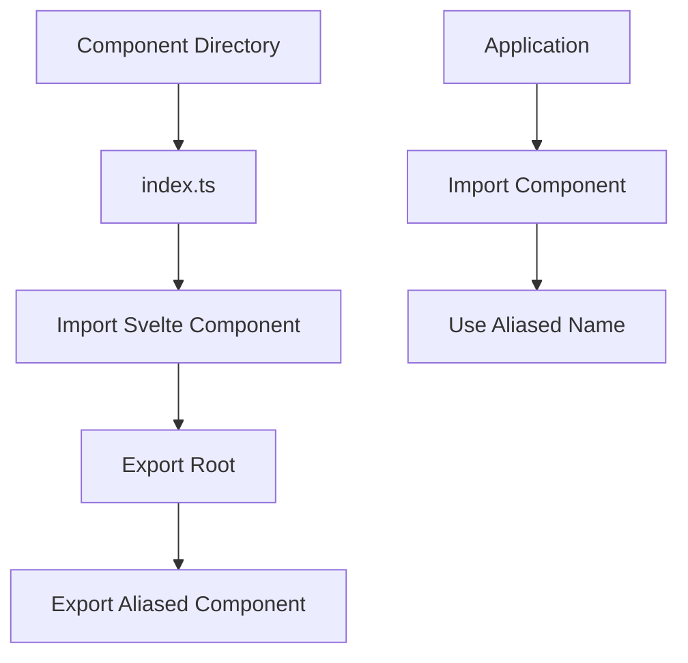
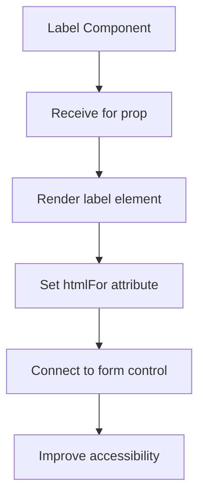
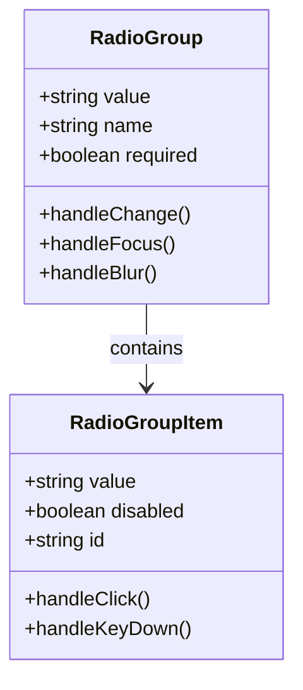
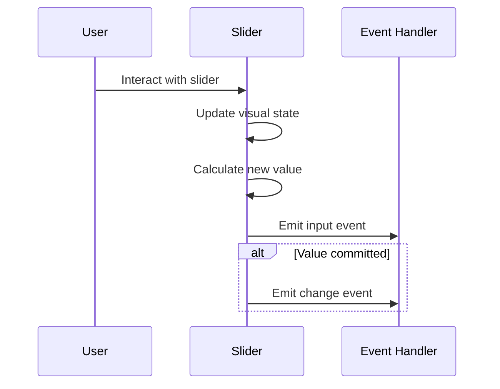
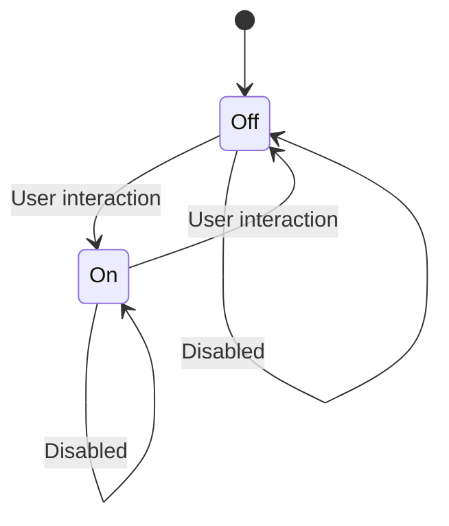
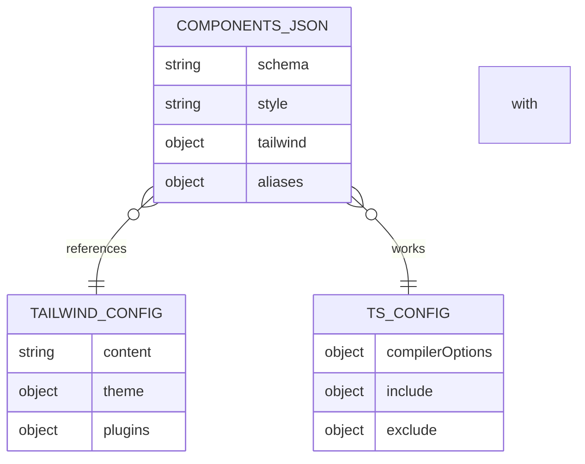

# Components Library

<cite>
**Referenced Files in This Document**   
- [label/index.ts](file://src/lib/components/ui/label/index.ts)
- [radio-group/index.ts](file://src/lib/components/ui/radio-group/index.ts)
- [slider/index.ts](file://src/lib/components/ui/slider/index.ts)
- [switch/index.ts](file://src/lib/components/ui/switch/index.ts)
- [components.json](file://components.json)
- [tailwind.config.js](file://tailwind.config.js)
- [src/app.css](file://src/app.css)
</cite>

## Table of Contents

1. [Introduction](#introduction)
2. [Design System Principles](#design-system-principles)
3. [Component Architecture](#component-architecture)
4. [Label Component](#label-component)
5. [Radio Group Component](#radio-group-component)
6. [Slider Component](#slider-component)
7. [Switch Component](#switch-component)
8. [Styling with Tailwind CSS](#styling-with-tailwind-css)
9. [Component Registration](#component-registration)
10. [Usage Patterns](#usage-patterns)
11. [Common Issues and Solutions](#common-issues-and-solutions)
12. [Conclusion](#conclusion)

## Introduction

The NC code editor's UI components library provides a collection of accessible, reusable components built with Svelte and styled using Tailwind CSS utility classes. This documentation details the implementation, interfaces, and usage patterns for the label, radio-group, slider, and switch components. These components follow a consistent architecture pattern and are designed to integrate seamlessly within the editor's interface while maintaining high accessibility standards.

**Section sources**

- [label/index.ts](file://src/lib/components/ui/label/index.ts#L1-L8)
- [radio-group/index.ts](file://src/lib/components/ui/radio-group/index.ts#L1-L11)
- [slider/index.ts](file://src/lib/components/ui/slider/index.ts#L1-L8)
- [switch/index.ts](file://src/lib/components/ui/switch/index.ts#L1-L8)

## Design System Principles

The UI components in the NC code editor follow several core design principles that ensure consistency, accessibility, and maintainability across the application:

- **Consistent API Patterns**: All components use a standardized export pattern with both Root and aliased exports
- **Accessibility First**: Components are built with ARIA attributes and keyboard navigation in mind
- **Utility-First Styling**: Tailwind CSS classes provide styling with minimal custom CSS
- **Composable Architecture**: Components can be combined and extended for complex UI patterns
- **Type Safety**: TypeScript interfaces ensure proper prop usage and prevent runtime errors

These principles are enforced through the shadcn-svelte framework, which provides the foundation for the component library.

**Section sources**

- [components.json](file://components.json#L1-L13)

## Component Architecture

The UI components follow a consistent architectural pattern that promotes reusability and ease of use. Each component directory contains an index.ts file that exports the component with both a Root alias and a descriptive alias.



**Diagram sources**

- [label/index.ts](file://src/lib/components/ui/label/index.ts#L1-L8)
- [radio-group/index.ts](file://src/lib/components/ui/radio-group/index.ts#L1-L11)

**Section sources**

- [label/index.ts](file://src/lib/components/ui/label/index.ts#L1-L8)
- [radio-group/index.ts](file://src/lib/components/ui/radio-group/index.ts#L1-L11)
- [slider/index.ts](file://src/lib/components/ui/slider/index.ts#L1-L8)
- [switch/index.ts](file://src/lib/components/ui/switch/index.ts#L1-L8)

## Label Component

The Label component provides accessible labeling for form elements in the NC code editor. It follows the WAI-ARIA labeling pattern and ensures proper association between labels and their corresponding controls.

### Implementation Details

The Label component is implemented as a simple wrapper that connects a text label with a form control using the htmlFor and id attributes. It supports all standard HTML label attributes and can be styled using Tailwind CSS utility classes.

### Props

- `for`: String value that matches the id of the associated form control
- Standard HTML label attributes (class, style, etc.)

### Usage

The Label component should be used whenever a form control requires a visible label. It improves accessibility by ensuring screen readers properly announce the relationship between the label and control.



**Diagram sources**

- [label/index.ts](file://src/lib/components/ui/label/index.ts#L1-L8)

**Section sources**

- [label/index.ts](file://src/lib/components/ui/label/index.ts#L1-L8)

## Radio Group Component

The Radio Group component provides a structured way to group related radio buttons, ensuring proper keyboard navigation and accessibility.

### Implementation Details

The RadioGroup component consists of two parts:

- **RadioGroup**: The container that manages the group state
- **RadioGroupItem**: Individual radio button items within the group

The component handles the exclusive selection behavior and provides proper ARIA roles for screen readers.

### Props

**RadioGroup:**

- `value`: Current selected value
- `on:value`: Event handler for value changes
- `name`: Name attribute for the radio group
- `required`: Whether selection is required

**RadioGroupItem:**

- `value`: Value of this specific radio button
- `disabled`: Whether this option is disabled
- `id`: Unique identifier for the radio button

### Events

- `change`: Emitted when the selected value changes
- `focus`: Emitted when the group receives focus
- `blur`: Emitted when the group loses focus



**Diagram sources**

- [radio-group/index.ts](file://src/lib/components/ui/radio-group/index.ts#L1-L11)

**Section sources**

- [radio-group/index.ts](file://src/lib/components/ui/radio-group/index.ts#L1-L11)

## Slider Component

The Slider component provides a visual control for selecting a value from a continuous or discrete range.

### Implementation Details

The Slider component implements a range input with enhanced visual feedback and accessibility features. It supports both horizontal and vertical orientations and can be configured with minimum, maximum, and step values.

### Props

- `value`: Current value of the slider
- `min`: Minimum allowed value (default: 0)
- `max`: Maximum allowed value (default: 100)
- `step`: Step increment (default: 1)
- `orientation`: "horizontal" or "vertical"
- `disabled`: Whether the slider is interactive
- `ariaLabel`: Accessibility label for screen readers

### Events

- `change`: Emitted when the value changes
- `input`: Emitted during value changes (for real-time feedback)
- `focus`: Emitted when the slider receives focus
- `blur`: Emitted when the slider loses focus



**Diagram sources**

- [slider/index.ts](file://src/lib/components/ui/slider/index.ts#L1-L8)

**Section sources**

- [slider/index.ts](file://src/lib/components/ui/slider/index.ts#L1-L8)

## Switch Component

The Switch component provides a toggle control for binary states, such as enabling or disabling a feature.

### Implementation Details

The Switch component implements a checkbox input with a custom visual representation. It follows accessibility best practices by maintaining a visible focus indicator and supporting keyboard navigation.

### Props

- `checked`: Whether the switch is in the "on" position
- `disabled`: Whether the switch is interactive
- `ariaLabel`: Accessibility label for screen readers
- `ariaLabelledby`: ID of element that labels the switch
- `ariaDescribedby`: ID of element that describes the switch

### Events

- `change`: Emitted when the checked state changes
- `click`: Emitted when the switch is clicked
- `focus`: Emitted when the switch receives focus
- `blur`: Emitted when the switch loses focus



**Diagram sources**

- [switch/index.ts](file://src/lib/components/ui/switch/index.ts#L1-L8)

**Section sources**

- [switch/index.ts](file://src/lib/components/ui/switch/index.ts#L1-L8)

## Styling with Tailwind CSS

The UI components are styled using Tailwind CSS utility classes, following the configuration specified in the project's components.json file.

### Configuration

The Tailwind CSS configuration is defined in the components.json file, which specifies:

- CSS file location: src/app.css
- Configuration file: tailwind.config.js
- Base color: slate

### Utility Classes

Components use utility classes for:

- Layout and positioning
- Spacing and sizing
- Colors and backgrounds
- Borders and shadows
- Typography
- States (hover, focus, disabled)

### Customization

The utility-first approach allows for easy customization by modifying the Tailwind configuration or adding custom classes to component instances.

**Section sources**

- [components.json](file://components.json#L1-L13)
- [src/app.css](file://src/app.css)

## Component Registration

Components are registered and made available throughout the application using the components.json configuration file and Svelte's module resolution system.

### components.json Configuration

The components.json file defines aliases that simplify imports:

- `components`: Maps to $lib/components/ui
- `utils`: Maps to $lib/utils

This allows components to be imported using the alias:

```javascript
import { Label } from '$lib/components/ui';
```

### Import Resolution

The Svelte compiler resolves the imports based on the tsconfig.json paths configuration, which maps the $lib alias to the src/lib directory.



**Diagram sources**

- [components.json](file://components.json#L1-L13)

**Section sources**

- [components.json](file://components.json#L1-L13)

## Usage Patterns

The UI components follow consistent usage patterns that make them easy to implement in various contexts within the NC code editor.

### Basic Usage

Components are imported and used with their aliased names:

```svelte
<script>
  import { Label, RadioGroup, RadioGroupItem, Slider, Switch } from '$lib/components/ui';
</script>
```

### Form Integration

Components are commonly used in settings panels and configuration forms:

- Label with input fields
- RadioGroup for option selection
- Slider for numeric values
- Switch for boolean settings

### Accessibility Considerations

Best practices for accessibility include:

- Using Label with htmlFor to connect labels to controls
- Providing aria-label attributes when visible text is not available
- Ensuring keyboard navigation works properly
- Testing with screen readers

**Section sources**

- [label/index.ts](file://src/lib/components/ui/label/index.ts#L1-L8)
- [radio-group/index.ts](file://src/lib/components/ui/radio-group/index.ts#L1-L11)
- [slider/index.ts](file://src/lib/components/ui/slider/index.ts#L1-L8)
- [switch/index.ts](file://src/lib/components/ui/switch/index.ts#L1-L8)

## Common Issues and Solutions

Developers may encounter several common issues when implementing these components, along with their solutions.

### Issue 1: Component Not Found During Import

**Symptom**: Import errors when trying to use components
**Solution**: Ensure the $lib alias is properly configured in tsconfig.json and that the component exists in the specified path

### Issue 2: Styling Not Applied

**Symptom**: Components appear unstyled or with incorrect styling
**Solution**: Verify that src/app.css is properly imported in the application and that Tailwind CSS is processing the utility classes

### Issue 3: Accessibility Issues

**Symptom**: Screen readers don't properly announce component states
**Solution**: Ensure proper use of aria attributes and test with multiple screen readers

### Issue 4: Event Handling Problems

**Symptom**: Change events not firing or values not updating
**Solution**: Verify event binding syntax and ensure the component's value prop is properly bound

### Issue 5: Keyboard Navigation Issues

**Symptom**: Components not accessible via keyboard
**Solution**: Ensure tabIndex is properly set and that all interactive elements can receive focus

**Section sources**

- [components.json](file://components.json#L1-L13)
- [src/app.css](file://src/app.css)

## Conclusion

The NC code editor's UI components library provides a robust set of accessible, reusable components built with Svelte and styled with Tailwind CSS. The label, radio-group, slider, and switch components follow consistent architectural patterns that promote ease of use and maintainability. By leveraging the shadcn-svelte framework and proper configuration in components.json, these components integrate seamlessly into the application while maintaining high accessibility standards. Developers can confidently use these components in various contexts, knowing they follow best practices for both functionality and accessibility.
