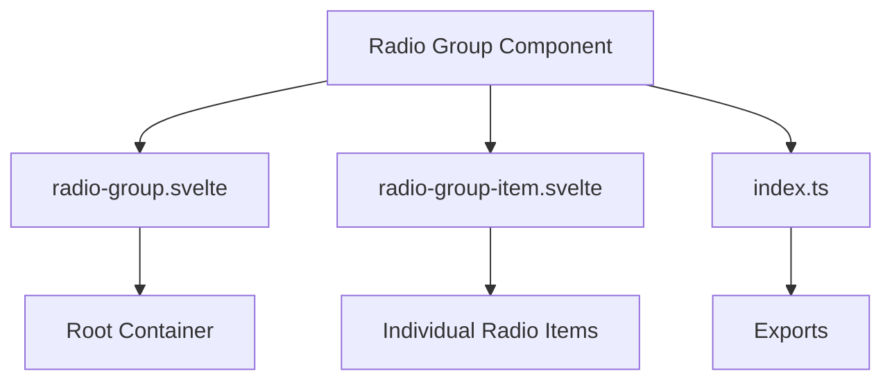
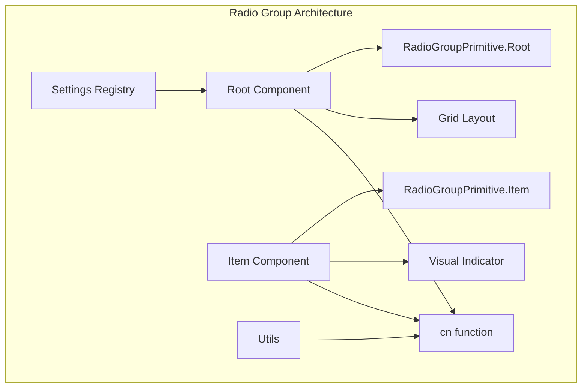
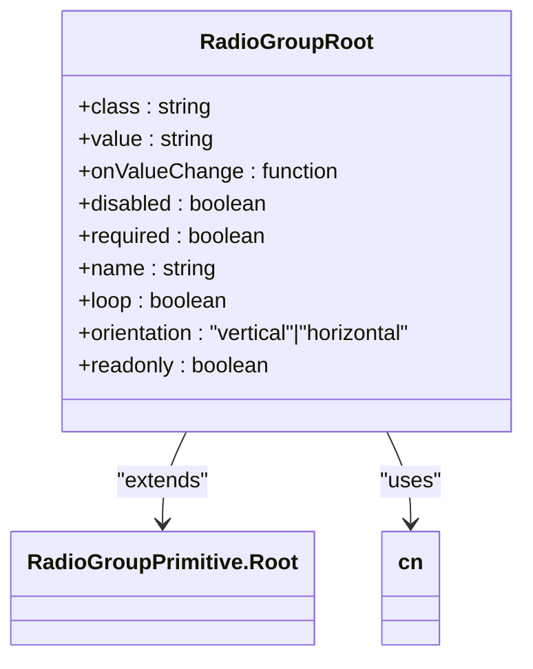
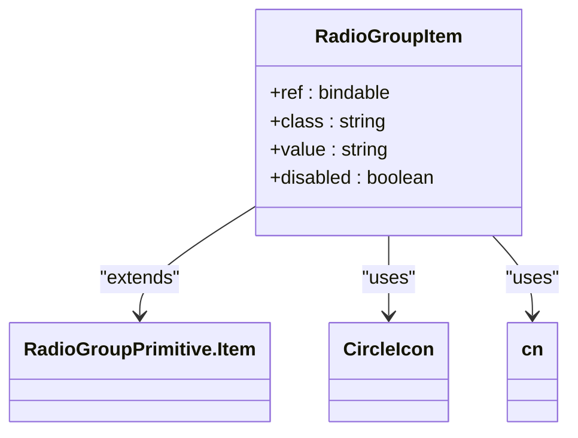
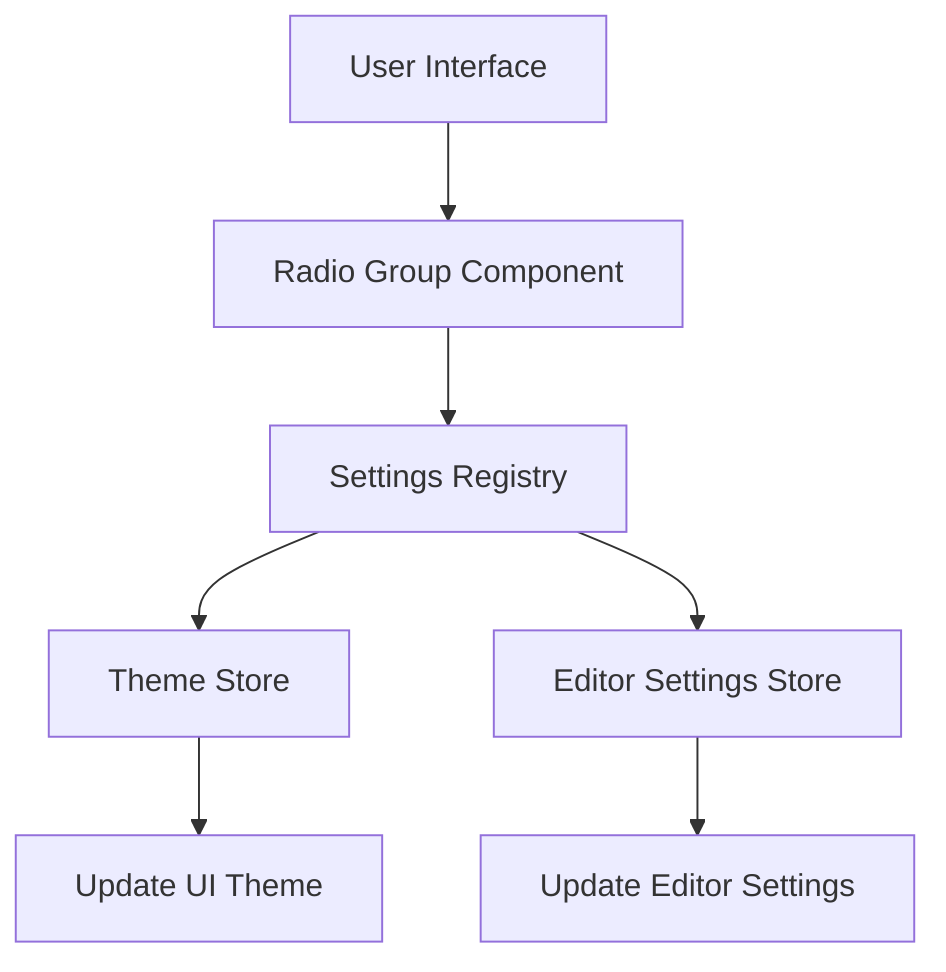
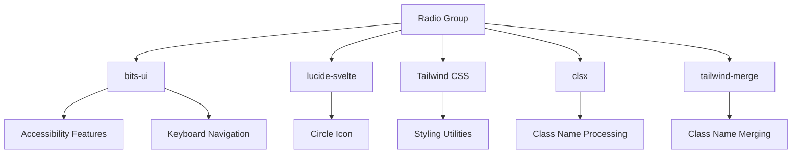

# Radio Group Component

<cite>
**Referenced Files in This Document**   
- [radio-group.svelte](file://src/lib/components/ui/radio-group/radio-group.svelte)
- [radio-group-item.svelte](file://src/lib/components/ui/radio-group/radio-group-item.svelte)
- [index.ts](file://src/lib/components/ui/radio-group/index.ts)
- [utils.ts](file://src/lib/utils.ts)
- [registry.ts](file://src/lib/settings/registry.ts)
- [themeStore.ts](file://src/lib/stores/themeStore.ts)
- [radio-group.api.ts](file://tp/bits-ui/docs/src/lib/content/api-reference/radio-group.api.ts)
- [radio-group.md](file://tp/bits-ui/docs/content/components/radio-group.md)
</cite>

## Table of Contents
1. [Introduction](#introduction)
2. [Project Structure](#project-structure)
3. [Core Components](#core-components)
4. [Architecture Overview](#architecture-overview)
5. [Detailed Component Analysis](#detailed-component-analysis)
6. [Dependency Analysis](#dependency-analysis)
7. [Performance Considerations](#performance-considerations)
8. [Troubleshooting Guide](#troubleshooting-guide)
9. [Conclusion](#conclusion)

## Introduction
The Radio Group component in the NC code editor is a UI element built with Svelte and styled with Tailwind CSS utility classes. It provides a way to group multiple radio button selections under a common name for form submission. This document thoroughly explains its implementation details, interfaces, usage patterns, props, events, and styling options. The component is designed to manage state effectively, support accessibility, and integrate seamlessly with settings and preferences interfaces. It leverages the bits-ui library for core functionality while providing a clean, reusable interface for developers.

## Project Structure
The Radio Group component is located in the `src/lib/components/ui/radio-group` directory and consists of two main Svelte components: `radio-group.svelte` (the root container) and `radio-group-item.svelte` (individual radio buttons). The component uses a modular structure with an index file that exports both components with multiple naming options for flexibility.

**Diagram sources**
- [radio-group.svelte](file://src/lib/components/ui/radio-group/radio-group.svelte)
- [radio-group-item.svelte](file://src/lib/components/ui/radio-group/radio-group-item.svelte)
- [index.ts](file://src/lib/components/ui/radio-group/index.ts)

**Section sources**
- [radio-group.svelte](file://src/lib/components/ui/radio-group/radio-group.svelte)
- [radio-group-item.svelte](file://src/lib/components/ui/radio-group/radio-group-item.svelte)
- [index.ts](file://src/lib/components/ui/radio-group/index.ts)

## Core Components
The Radio Group component consists of two core files: the root container and the individual radio items. The implementation leverages the bits-ui library for accessibility and keyboard navigation features while providing a clean interface through Svelte. The component uses Tailwind CSS utility classes for styling, with the `cn` function from the utils file for class name merging. The root component creates a grid layout for the radio items, while each item includes a visual indicator (a circle icon) that appears when selected.

**Section sources**
- [radio-group.svelte](file://src/lib/components/ui/radio-group/radio-group.svelte)
- [radio-group-item.svelte](file://src/lib/components/ui/radio-group/radio-group-item.svelte)
- [utils.ts](file://src/lib/utils.ts)

## Architecture Overview
The Radio Group component follows a composition pattern where the root component wraps multiple radio items. It uses the bits-ui library's RadioGroup primitives as the foundation, enhancing them with custom styling and layout. The architecture separates concerns between the container (managing group state and layout) and individual items (handling selection state and visual feedback). The component integrates with the application's settings system through the registry pattern, allowing it to be used for configuration options like theme selection.

**Diagram sources**
- [radio-group.svelte](file://src/lib/components/ui/radio-group/radio-group.svelte)
- [radio-group-item.svelte](file://src/lib/components/ui/radio-group/radio-group-item.svelte)
- [utils.ts](file://src/lib/utils.ts)
- [registry.ts](file://src/lib/settings/registry.ts)

## Detailed Component Analysis

### Radio Group Root Analysis
The Radio Group Root component serves as the container for radio items and manages the group's state. It accepts various props to control behavior and appearance, including value binding, orientation, and disabled state. The component uses the `cn` utility function to merge Tailwind CSS classes, applying a grid layout by default.

**Diagram sources**
- [radio-group.svelte](file://src/lib/components/ui/radio-group/radio-group.svelte)
- [utils.ts](file://src/lib/utils.ts)

**Section sources**
- [radio-group.svelte](file://src/lib/components/ui/radio-group/radio-group.svelte)

### Radio Group Item Analysis
The Radio Group Item component represents individual selectable options within the group. Each item displays a visual indicator (a filled circle) when selected and handles keyboard navigation and focus states. The component is styled with Tailwind CSS classes to provide a consistent appearance across the application.

**Diagram sources**
- [radio-group-item.svelte](file://src/lib/components/ui/radio-group/radio-group-item.svelte)
- [utils.ts](file://src/lib/utils.ts)

**Section sources**
- [radio-group-item.svelte](file://src/lib/components/ui/radio-group/radio-group-item.svelte)

### Usage in Settings Context
The Radio Group component is used in settings interfaces to allow users to select from multiple options. For example, in the theme settings, it could be used to select between different color palettes or editor behaviors. The component integrates with the settings registry to persist user preferences.

**Diagram sources**
- [registry.ts](file://src/lib/settings/registry.ts)
- [themeStore.ts](file://src/lib/stores/themeStore.ts)
- [editorSettingsStore.ts](file://src/lib/stores/editorSettingsStore.ts)

**Section sources**
- [registry.ts](file://src/lib/settings/registry.ts)
- [themeStore.ts](file://src/lib/stores/themeStore.ts)

## Dependency Analysis
The Radio Group component has several dependencies that enable its functionality. It relies on the bits-ui library for the underlying radio group primitives, providing accessibility features and keyboard navigation. The component uses lucide-svelte for the circle icon displayed when a radio button is selected. For styling, it depends on Tailwind CSS utilities and the `cn` function from the application's utils file for class name merging.

**Diagram sources**
- [radio-group.svelte](file://src/lib/components/ui/radio-group/radio-group.svelte)
- [radio-group-item.svelte](file://src/lib/components/ui/radio-group/radio-group-item.svelte)
- [utils.ts](file://src/lib/utils.ts)

**Section sources**
- [radio-group.svelte](file://src/lib/components/ui/radio-group/radio-group.svelte)
- [radio-group-item.svelte](file://src/lib/components/ui/radio-group/radio-group-item.svelte)
- [utils.ts](file://src/lib/utils.ts)

## Performance Considerations
The Radio Group component is designed for optimal performance with minimal re-renders. It leverages Svelte's reactivity system to update only when necessary, avoiding unnecessary DOM manipulations. The use of derived stores in the underlying bits-ui implementation ensures that computed properties are only recalculated when their dependencies change. The component's lightweight nature and efficient event handling make it suitable for use in complex settings interfaces without impacting application performance.

## Troubleshooting Guide
When implementing the Radio Group component, developers may encounter several common issues. For value binding problems, ensure that the `bind:value` directive is used correctly with a reactive variable. For group name management, verify that the `name` prop is set when the radio group should be part of a form submission. Accessibility concerns can be addressed by ensuring proper labeling and using the `orientation` prop to control keyboard navigation behavior.

**Section sources**
- [radio-group.api.ts](file://tp/bits-ui/docs/src/lib/content/api-reference/radio-group.api.ts)
- [radio-group.md](file://tp/bits-ui/docs/content/components/radio-group.md)

## Conclusion
The Radio Group component in the NC code editor provides a robust, accessible solution for managing multiple selection options. Built with Svelte and styled with Tailwind CSS, it offers a clean, reusable interface that integrates seamlessly with the application's settings system. The component's architecture separates concerns between container and item components, making it easy to understand and extend. Its integration with the bits-ui library ensures proper accessibility and keyboard navigation, while the use of utility classes provides flexibility in styling. Developers can use this component effectively in various contexts, particularly in settings and preferences interfaces, to create intuitive user experiences.