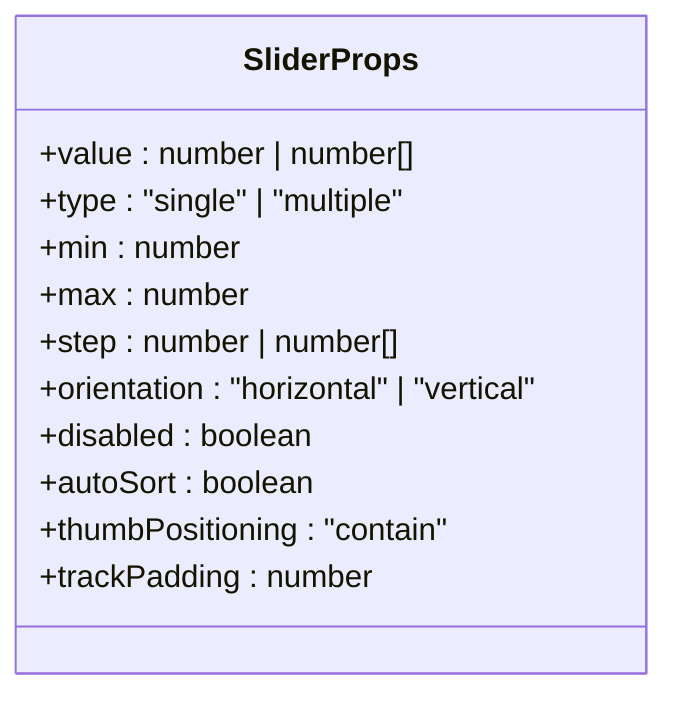
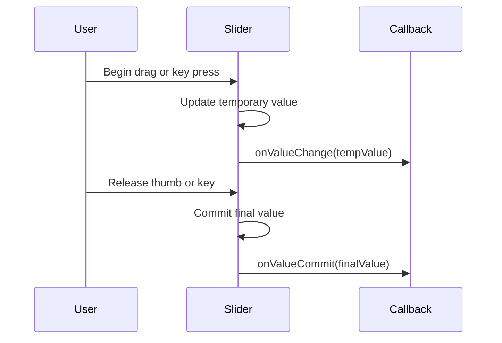
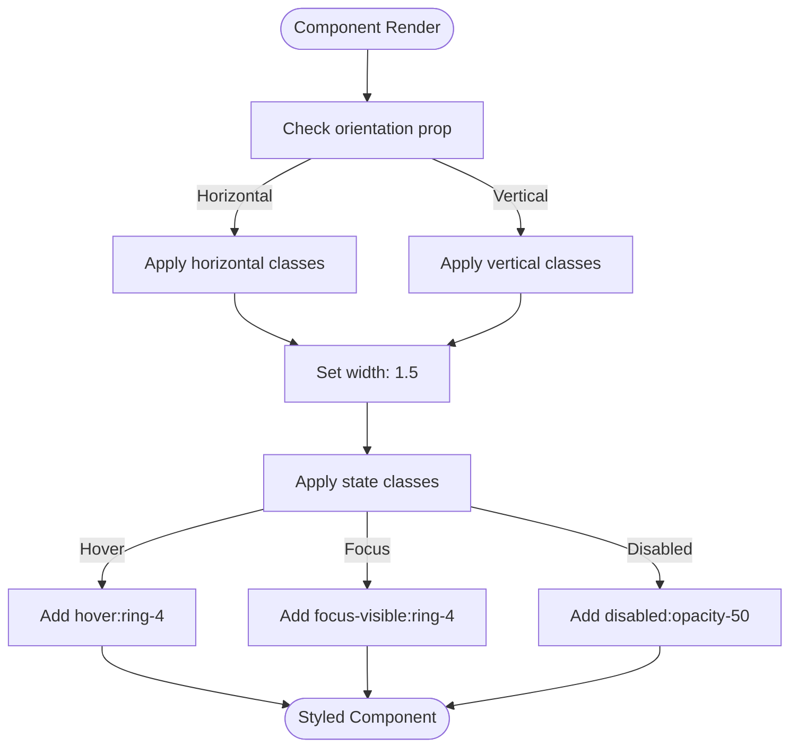

# Slider Component

<cite>
**Referenced Files in This Document**   
- [src/lib/components/ui/slider/index.ts](file://src/lib/components/ui/slider/index.ts)
- [tp/shadcn-svelte/docs/src/lib/registry/ui/slider/slider.svelte](file://tp/shadcn-svelte/docs/src/lib/registry/ui/slider/slider.svelte)
- [tp/bits-ui/packages/bits-ui/src/lib/bits/slider/components/slider.svelte](file://tp/bits-ui/packages/bits-ui/src/lib/bits/slider/components/slider.svelte)
- [tp/bits-ui/packages/bits-ui/src/lib/bits/slider/types.ts](file://tp/bits-ui/packages/bits-ui/src/lib/bits/slider/types.ts)
- [src/lib/settings/registry.ts](file://src/lib/settings/registry.ts)
</cite>

## Table of Contents

1. [Introduction](#introduction)
2. [Architecture Overview](#architecture-overview)
3. [Core Components](#core-components)
4. [Props and Configuration](#props-and-configuration)
5. [Events and Value Binding](#events-and-value-binding)
6. [Styling with Tailwind CSS](#styling-with-tailwind-css)
7. [Usage in Editor Settings](#usage-in-editor-settings)
8. [Common Implementation Issues](#common-implementation-issues)
9. [Conclusion](#conclusion)

## Introduction

The Slider UI component in the NC code editor provides a flexible and accessible way to select values within a range. Built using Svelte and integrated with the bits-ui component library, this slider supports both single and multiple thumb configurations, vertical and horizontal orientations, and precise value control. It is extensively used throughout the editor's settings interface for adjusting numeric values such as word wrap columns and auto-save delays. The component combines robust functionality with modern styling using Tailwind CSS utility classes, making it both powerful and visually consistent with the overall editor design.

**Section sources**

- [src/lib/components/ui/slider/index.ts](file://src/lib/components/ui/slider/index.ts)

## Architecture Overview

```mermaid
graph TD
A[Slider Component] --> B[Root Container]
A --> C[Track]
A --> D[Range Fill]
A --> E[Thumb(s)]
B --> F[Orientation: Horizontal/Vertical]
B --> G[Disabled State]
C --> H[Rounded Full Track]
D --> I[Primary Color Fill]
E --> J[Multiple Thumbs Support]
E --> K[Focus and Hover States]
A --> L[Value Binding]
A --> M[Event Handling]
L --> N[bind:value]
M --> O[onValueChange]
M --> P[onValueCommit]
```

**Diagram sources**

- [tp/shadcn-svelte/docs/src/lib/registry/ui/slider/slider.svelte](file://tp/shadcn-svelte/docs/src/lib/registry/ui/slider/slider.svelte)
- [tp/bits-ui/packages/bits-ui/src/lib/bits/slider/components/slider.svelte](file://tp/bits-ui/packages/bits-ui/src/lib/bits/slider/components/slider.svelte)

## Core Components

The Slider component is structured as a composition of multiple parts, with the main implementation delegating to the bits-ui library. The NC code editor wraps this functionality with a standardized interface that integrates with the editor's settings system. The component supports both single and multiple thumb configurations through its type prop, and handles various input methods including mouse, touch, and keyboard navigation.

The underlying architecture uses a state management pattern where the slider's value, position, and interaction state are managed internally and exposed through bindable props and callback functions. This allows for both controlled and uncontrolled usage patterns while maintaining accessibility and performance.

**Section sources**

- [tp/bits-ui/packages/bits-ui/src/lib/bits/slider/components/slider.svelte](file://tp/bits-ui/packages/bits-ui/src/lib/bits/slider/components/slider.svelte)
- [tp/bits-ui/packages/bits-ui/src/lib/bits/slider/types.ts](file://tp/bits-ui/packages/bits-ui/src/lib/bits/slider/types.ts)

## Props and Configuration

The Slider component accepts a comprehensive set of props that control its behavior and appearance:

- **value**: The current value(s) of the slider (bindable)
- **type**: "single" or "multiple" thumb configuration
- **min**: Minimum value of the range (default: 0)
- **max**: Maximum value of the range (default: 100)
- **step**: Increment/decrement step size (default: 1)
- **orientation**: "horizontal" or "vertical" layout
- **disabled**: Whether the slider is interactive
- **autoSort**: Whether to automatically sort thumb values
- **thumbPositioning**: Positioning strategy for thumbs
- **trackPadding**: Padding percentage for track ends

The component also supports array-based step values, allowing for discrete snap points at specific values rather than a continuous range. This is particularly useful for settings that should only accept certain predefined values.



**Diagram sources**

- [tp/bits-ui/packages/bits-ui/src/lib/bits/slider/types.ts](file://tp/bits-ui/packages/bits-ui/src/lib/bits/slider/types.ts)

**Section sources**

- [tp/bits-ui/packages/bits-ui/src/lib/bits/slider/types.ts](file://tp/bits-ui/packages/bits-ui/src/lib/bits/slider/types.ts)

## Events and Value Binding

The Slider component provides two primary event callbacks for responding to user interactions:

- **onValueChange**: Called continuously as the user drags a thumb or uses keyboard controls
- **onValueCommit**: Called when the user releases a thumb after dragging

These events enable different interaction patterns: onValueChange can be used for real-time feedback (such as live preview of settings), while onValueCommit is suitable for actions that should only occur when the user has finalized their selection.

Value binding is implemented using Svelte's bind:value directive, which creates a two-way binding between the component and the parent scope. This allows the parent component to both read the current value and update the slider's position programmatically.



**Diagram sources**

- [tp/bits-ui/packages/bits-ui/src/lib/bits/slider/components/slider.svelte](file://tp/bits-ui/packages/bits-ui/src/lib/bits/slider/components/slider.svelte)

**Section sources**

- [tp/bits-ui/packages/bits-ui/src/lib/bits/slider/components/slider.svelte](file://tp/bits-ui/packages/bits-ui/src/lib/bits/slider/components/slider.svelte)

## Styling with Tailwind CSS

The Slider component uses Tailwind CSS utility classes for styling, ensuring consistency with the editor's design system. The visual elements include:

- **Track**: A subtle background track with rounded corners
- **Range**: A filled portion indicating the selected value(s) in the primary color
- **Thumb**: Circular control points with hover and focus states
- **Disabled state**: Reduced opacity for non-interactive sliders

The styling is responsive and accessible, with appropriate visual feedback for different interaction states. The component automatically adjusts its layout based on orientation, with horizontal sliders expanding width-wise and vertical sliders expanding height-wise.



**Diagram sources**

- [tp/shadcn-svelte/docs/src/lib/registry/ui/slider/slider.svelte](file://tp/shadcn-svelte/docs/src/lib/registry/ui/slider/slider.svelte)

**Section sources**

- [tp/shadcn-svelte/docs/src/lib/registry/ui/slider/slider.svelte](file://tp/shadcn-svelte/docs/src/lib/registry/ui/slider/slider.svelte)

## Usage in Editor Settings

The Slider component is integrated into the NC code editor's settings system through the settings registry. It is used for various numeric settings that benefit from visual adjustment, such as:

- **Word Wrap Column**: Controls where lines wrap in the editor
- **Auto Save Delay**: Sets the delay before auto-saving in milliseconds

In the settings registry, sliders are configured by setting the control property to 'slider' and providing appropriate get and set functions that interface with the editor's settings stores. The component automatically handles type conversion between string inputs (from user interface) and numeric values (for internal use).

```mermaid
graph TB
A[Settings Registry] --> B[Setting Definition]
B --> C{id: 'editor.wordWrapColumn'}
B --> D{control: 'slider'}
B --> E{min: 1, max: 200, step: 1}
B --> F[get: () => editorSettings.wordWrapColumn]
B --> G[set: (value) => editorSettings.setWordWrapColumn(value)]
H[Settings UI] --> I[Render Slider]
I --> J[Bind to setting value]
J --> K[Update on change]
K --> L[Call set function]
L --> M[Update store]
```

**Diagram sources**

- [src/lib/settings/registry.ts](file://src/lib/settings/registry.ts)

**Section sources**

- [src/lib/settings/registry.ts](file://src/lib/settings/registry.ts)

## Common Implementation Issues

When implementing the Slider component, several common issues may arise:

**Value Binding Problems**: Ensure proper use of bind:value rather than just value to enable two-way data flow. Without binding, the slider will not update when the underlying value changes programmatically.

**Event Handling**: Distinguish between onValueChange (continuous) and onValueCommit (final) events based on use case. Using onValueChange for expensive operations can lead to performance issues.

**Touch/Mouse Interaction**: The component handles both touch and mouse events internally, but ensure that parent containers don't interfere with pointer events. The slider uses standard pointer event APIs for cross-device compatibility.

**TypeScript Issues**: When using discriminated unions with bindable props, TypeScript may require casting values to 'never' to resolve type conflicts, as seen in the shadcn-svelte implementation.

**Accessibility**: The component includes ARIA attributes for screen readers, but ensure that labels are properly associated when used in forms or settings panels.

**Section sources**

- [tp/shadcn-svelte/docs/src/lib/registry/ui/slider/slider.svelte](file://tp/shadcn-svelte/docs/src/lib/registry/ui/slider/slider.svelte)
- [tp/bits-ui/packages/bits-ui/src/lib/bits/slider/components/slider.svelte](file://tp/bits-ui/packages/bits-ui/src/lib/bits/slider/components/slider.svelte)

## Conclusion

The Slider component in the NC code editor provides a robust, accessible, and visually consistent way to select values within a range. Built on the bits-ui foundation and styled with Tailwind CSS, it offers both simplicity for basic use cases and flexibility for advanced configurations. Its integration with the editor's settings system demonstrates a clean separation of concerns, where the UI component handles interaction and presentation while the settings registry manages data flow and persistence. By understanding its props, events, and common usage patterns, developers can effectively implement sliders for various editor configuration options while maintaining a high standard of user experience.
