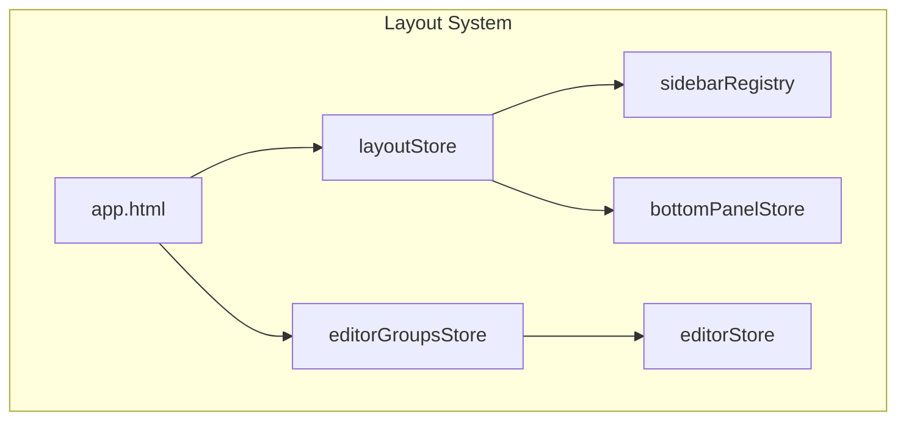
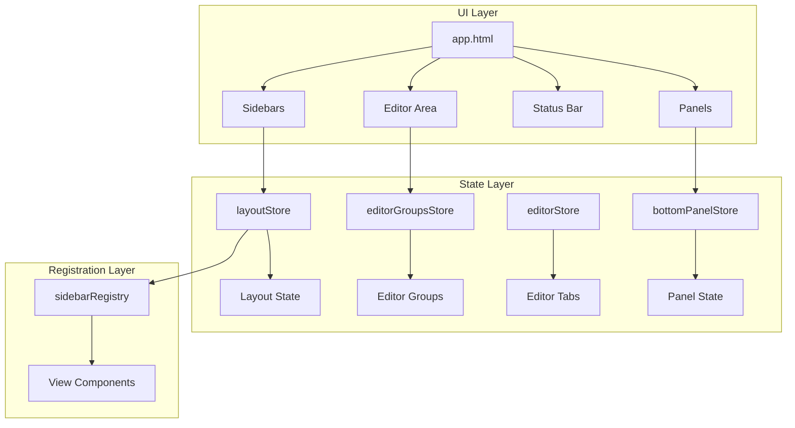
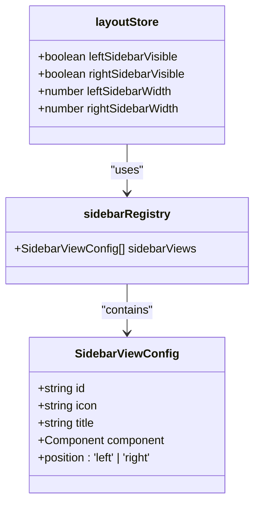
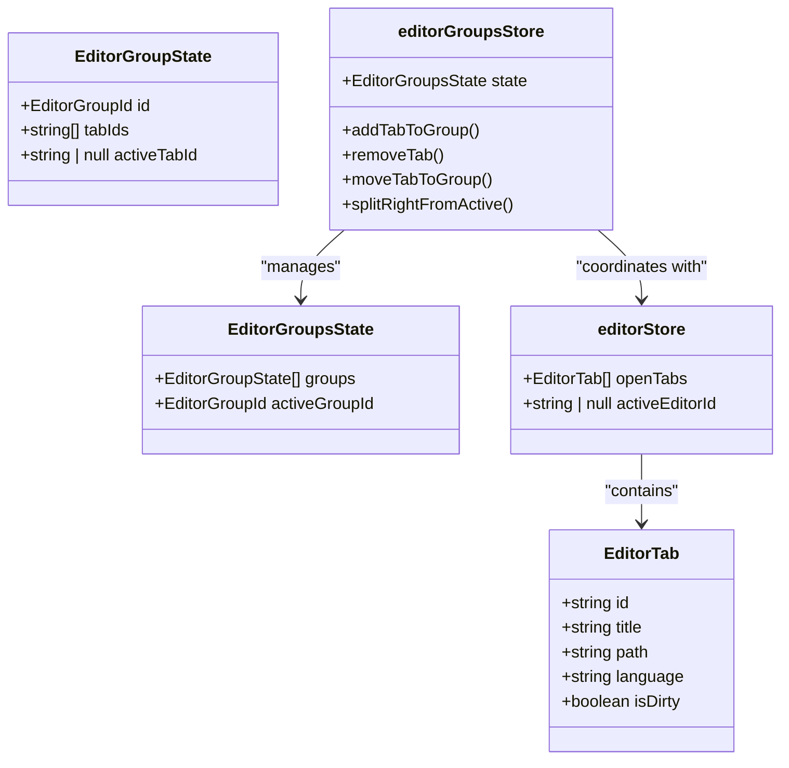
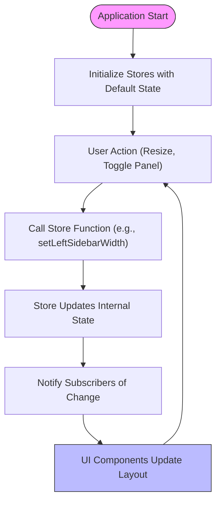
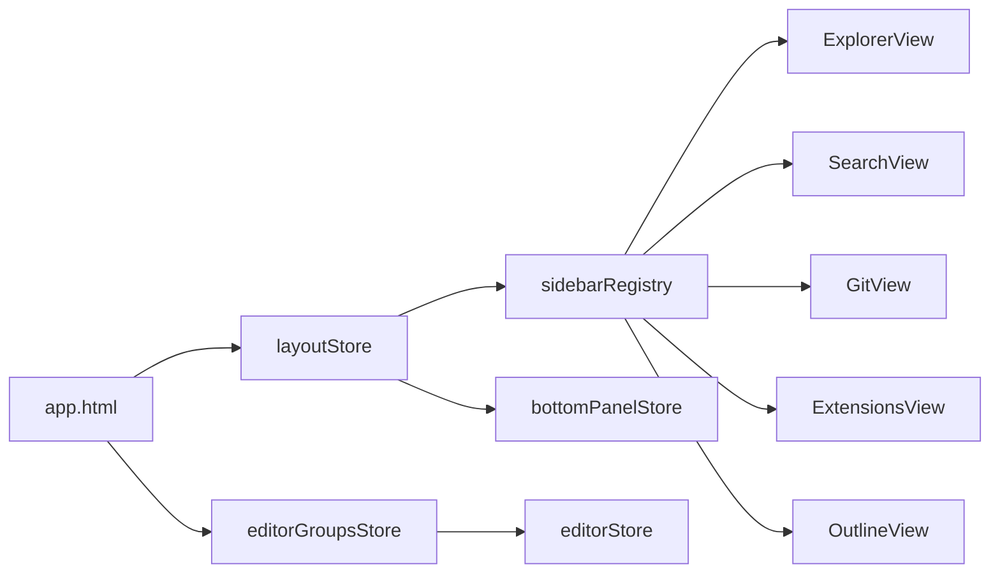

# Layout System

<cite>
**Referenced Files in This Document**   
- [app.html](file://src/app.html)
- [sidebarRegistry.ts](file://src/lib/layout/sidebarRegistry.ts)
- [layoutStore.ts](file://src/lib/stores/layout/layoutStore.ts)
- [editorGroupsStore.ts](file://src/lib/stores/layout/editorGroupsStore.ts)
- [editorStore.ts](file://src/lib/stores/editorStore.ts)
- [bottomPanelStore.ts](file://src/lib/stores/bottomPanelStore.ts)
</cite>

## Table of Contents
1. [Introduction](#introduction)
2. [Project Structure](#project-structure)
3. [Core Components](#core-components)
4. [Architecture Overview](#architecture-overview)
5. [Detailed Component Analysis](#detailed-component-analysis)
6. [Dependency Analysis](#dependency-analysis)
7. [Performance Considerations](#performance-considerations)
8. [Troubleshooting Guide](#troubleshooting-guide)
9. [Conclusion](#conclusion)

## Introduction
The NC code editor implements a flexible and extensible layout system inspired by VS Code's workbench architecture. This document provides a comprehensive analysis of the layout implementation, covering the main application structure, sidebar management, tab grouping, split views, and state persistence. The system is built using Svelte stores for state management, enabling reactive updates across the UI while maintaining clean separation between layout concerns and business logic.

## Project Structure
The layout system is organized across several key directories in the source tree:
- `src/lib/layout/` - Contains layout-specific utilities like the sidebar registry
- `src/lib/stores/layout/` - Houses the core layout stores (layoutStore, editorGroupsStore)
- `src/lib/sidebar/` - Contains sidebar view components (ExplorerView, SearchView, etc.)
- `src/lib/stores/` - Includes supporting stores like bottomPanelStore
- `src/app.html` - The main HTML template that defines the application shell

The architecture follows a modular pattern where layout concerns are separated from UI components and business logic, allowing for independent evolution of each layer.

**Diagram sources**
- [app.html](file://src/app.html)
- [layoutStore.ts](file://src/lib/stores/layout/layoutStore.ts)
- [editorGroupsStore.ts](file://src/lib/stores/layout/editorGroupsStore.ts)

**Section sources**
- [app.html](file://src/app.html)
- [sidebarRegistry.ts](file://src/lib/layout/sidebarRegistry.ts)

## Core Components
The layout system consists of several core components that work together to create the editor interface:
- **Editor Area**: Managed by editorGroupsStore and editorStore, handles multiple editor groups and tabs
- **Sidebar**: Controlled by layoutStore and sidebarRegistry, provides navigation and tool panels
- **Status Bar**: Not explicitly defined in the provided files but implied by the architecture
- **Tab Management**: Handled by the interaction between editorStore and editorGroupsStore

The system uses a store-based architecture where each component subscribes to relevant state changes, ensuring consistent UI updates across the application.

**Section sources**
- [layoutStore.ts](file://src/lib/stores/layout/layoutStore.ts)
- [editorGroupsStore.ts](file://src/lib/stores/layout/editorGroupsStore.ts)
- [editorStore.ts](file://src/lib/stores/editorStore.ts)

## Architecture Overview
The layout architecture follows a layered approach with clear separation of concerns:

**Diagram sources**
- [app.html](file://src/app.html)
- [layoutStore.ts](file://src/lib/stores/layout/layoutStore.ts)
- [editorGroupsStore.ts](file://src/lib/stores/layout/editorGroupsStore.ts)
- [editorStore.ts](file://src/lib/stores/editorStore.ts)
- [bottomPanelStore.ts](file://src/lib/stores/bottomPanelStore.ts)

## Detailed Component Analysis

### Sidebar System
The sidebar system is implemented through a registry pattern that allows for dynamic panel management. The sidebarRegistry.ts file defines a configuration array that maps sidebar views to their respective components, icons, and positions.

**Diagram sources**
- [sidebarRegistry.ts](file://src/lib/layout/sidebarRegistry.ts)
- [layoutStore.ts](file://src/lib/stores/layout/layoutStore.ts)

#### Sidebar Registration Mechanism
The sidebar registration mechanism uses a declarative approach where each sidebar panel is registered with an ID, icon, title, component reference, and position. This eliminates the need for hardcoded switch/case statements and enables easy extension of new panels. The system currently supports left-positioned panels (Explorer, Search, Source Control, Extensions) and one right-positioned panel (Outline).

The registration pattern follows VS Code's approach to view containers, providing a single source of truth for sidebar configurations. Commands for showing specific views (e.g., "workbench.view.explorer") are automatically generated based on the registered views.

**Section sources**
- [sidebarRegistry.ts](file://src/lib/layout/sidebarRegistry.ts)
- [defaultCommands.ts](file://src/lib/commands/defaultCommands.ts)

### Editor Groups and Tab Management
The tab management system is implemented through two cooperating stores: editorStore and editorGroupsStore. This separation of concerns allows the application to manage both the logical state of editor tabs and their spatial arrangement in the UI.

**Diagram sources**
- [editorGroupsStore.ts](file://src/lib/stores/layout/editorGroupsStore.ts)
- [editorStore.ts](file://src/lib/stores/editorStore.ts)

#### Split View Functionality
The split view functionality is implemented through the editorGroupsStore, which manages multiple editor groups that can be arranged horizontally. The `splitRightFromActive()` function creates a new editor group to the right of the current active group, moving the active tab into the new group. This enables side-by-side editing of files, a common workflow in code editors.

The system supports multiple editor groups, each with their own set of tabs and active tab. Users can navigate between groups and move tabs between groups using drag-and-drop or commands. The initial state starts with a single group, maintaining compatibility with simple editing workflows.

**Section sources**
- [editorGroupsStore.ts](file://src/lib/stores/layout/editorGroupsStore.ts)
- [editorStore.ts](file://src/lib/stores/editorStore.ts)

#### Tab Grouping and Window Resizing
Tab grouping is managed by the editorGroupsStore, which maintains the relationship between tabs and their parent groups. Each group maintains its own tab order and active tab state. The system supports reordering tabs within a group and moving tabs between groups.

Window resizing behavior is controlled by the layoutStore, which manages the dimensions of sidebar and panel containers. The store exposes methods to set width and height values, which are then reflected in the UI. The system uses pixel-based measurements for container dimensions, with default values optimized for code editing workflows.

**Section sources**
- [editorGroupsStore.ts](file://src/lib/stores/layout/editorGroupsStore.ts)
- [layoutStore.ts](file://src/lib/stores/layout/layoutStore.ts)

### Layout State Persistence
Layout state is persisted through Svelte stores that maintain the application's UI state throughout the session. The system uses writable stores with initial state values that can be updated through exported functions.

The layoutStore maintains visibility and dimension state for all major UI containers:
- Left sidebar (visible, width)
- Right sidebar (visible, width) 
- Bottom panel (visible, height)

State changes are made through specific setter functions (e.g., `setLeftSidebarVisible()`, `setLeftSidebarWidth()`) rather than direct store mutations, ensuring consistent state updates and enabling potential future enhancements like state validation or persistence.

**Diagram sources**
- [layoutStore.ts](file://src/lib/stores/layout/layoutStore.ts)
- [editorGroupsStore.ts](file://src/lib/stores/layout/editorGroupsStore.ts)

## Dependency Analysis
The layout system has a well-defined dependency structure that promotes loose coupling between components:

**Diagram sources**
- [app.html](file://src/app.html)
- [layoutStore.ts](file://src/lib/stores/layout/layoutStore.ts)
- [editorGroupsStore.ts](file://src/lib/stores/layout/editorGroupsStore.ts)
- [editorStore.ts](file://src/lib/stores/editorStore.ts)
- [sidebarRegistry.ts](file://src/lib/layout/sidebarRegistry.ts)

The system follows a unidirectional data flow pattern where state changes originate from user interactions or programmatic calls to store functions, then propagate through the component tree via store subscriptions. This architecture ensures predictable state updates and simplifies debugging.

## Performance Considerations
The layout system is designed with performance in mind:
- Uses Svelte's reactivity system for efficient UI updates
- Minimizes unnecessary re-renders through proper store subscription management
- Separates layout state from editor content state to reduce update frequency
- Implements lazy loading of sidebar panels through dynamic imports (implied by architecture)
- Uses pixel-based measurements for container dimensions to avoid expensive calculations

The store-based architecture ensures that only components subscribed to specific state changes will update when that state changes, preventing unnecessary re-renders across the entire application.

## Troubleshooting Guide
Common layout-related issues and their solutions:

### Panel Visibility Issues
If sidebar panels are not appearing when expected:
1. Check that the view ID matches one of the registered views in sidebarRegistry
2. Verify that the layoutStore's visibility state is correct (e.g., leftSidebarVisible)
3. Ensure the corresponding command (e.g., "workbench.view.explorer") is being called correctly

### Focus Management Problems
For issues with editor focus:
1. Check that activeTabId is properly set in the editorGroupsStore
2. Verify that setActiveTab() is being called when tabs are clicked or created
3. Ensure editorStore and editorGroupsStore are properly synchronized

### Responsive Behavior Issues
If layout elements don't respond correctly to window resizing:
1. Verify that resize observers are properly attached to container elements
2. Check that layoutStore dimension values are being updated during resize operations
3. Ensure CSS styles don't override the programmatic width/height values

**Section sources**
- [layoutStore.ts](file://src/lib/stores/layout/layoutStore.ts)
- [editorGroupsStore.ts](file://src/lib/stores/layout/editorGroupsStore.ts)
- [sidebarRegistry.ts](file://src/lib/layout/sidebarRegistry.ts)

## Conclusion
The NC code editor's layout system demonstrates a well-architected approach to UI state management, drawing inspiration from established code editors like VS Code while leveraging modern frontend patterns. The separation of layout concerns into dedicated stores provides a clean, maintainable architecture that supports complex features like split views and dynamic panel management. The registry pattern for sidebar views enables extensibility without tight coupling, and the cooperative stores for editor groups and tabs allow for sophisticated tab management workflows. This foundation supports both beginner-friendly single-editor workflows and advanced multi-group editing scenarios, making it adaptable to a wide range of user needs.