# Theme Customization

<cite>
**Referenced Files in This Document**   
- [devicon-base.css](file://static/devicon-base.css)
- [devicon-dark-theme.css](file://static/devicon-dark-theme.css)
- [THEME_PALETTES.ts](file://src/lib/stores/THEME_PALETTES.ts)
- [themeStore.ts](file://src/lib/stores/themeStore.ts)
- [ICON_COLORS_PALETTE.ts](file://src/lib/stores/ICON_COLORS_PALETTE.ts)
- [themeManager.ts](file://src/lib/editor/themeManager.ts)
- [app.css](file://src/app.css)
- [settingsStore.ts](file://src/lib/stores/settingsStore.ts)
- [registry.ts](file://src/lib/settings/registry.ts)
</cite>

## Table of Contents

1. [Introduction](#introduction)
2. [Theme Architecture Overview](#theme-architecture-overview)
3. [Core Theme Components](#core-theme-components)
4. [Theme Switching and Management](#theme-switching-and-management)
5. [Editor Theme Integration](#editor-theme-integration)
6. [Custom Theme Creation](#custom-theme-creation)
7. [Visual Consistency and Accessibility](#visual-consistency-and-accessibility)
8. [Troubleshooting Common Issues](#troubleshooting-common-issues)
9. [Conclusion](#conclusion)

## Introduction

The NC code editor features a comprehensive theme customization system that provides users with extensive control over the visual appearance of both the UI and editor components. The system is built on a modular architecture that separates theme definitions, color palettes, and state management to ensure consistency and maintainability. This documentation provides a detailed explanation of how themes are implemented, managed, and applied throughout the application, with a focus on the interplay between CSS files, TypeScript stores, and UI components. The theme system supports both light and dark modes with multiple palette options, ensuring users can customize their environment to suit their preferences and working conditions.

## Theme Architecture Overview

The theme system in the NC code editor follows a layered architecture that separates concerns between base styling, theme-specific overrides, and dynamic theme management. At the foundation are CSS files that define the base appearance and theme-specific styles, while TypeScript stores manage the application's theme state and provide a centralized interface for theme operations. The architecture ensures that visual consistency is maintained across all components while allowing for flexible customization.

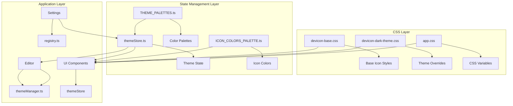

**Diagram sources**

- [devicon-base.css](file://static/devicon-base.css)
- [devicon-dark-theme.css](file://static/devicon-dark-theme.css)
- [app.css](file://src/app.css)
- [themeStore.ts](file://src/lib/stores/themeStore.ts)
- [THEME_PALETTES.ts](file://src/lib/stores/THEME_PALETTES.ts)
- [ICON_COLORS_PALETTE.ts](file://src/lib/stores/ICON_COLORS_PALETTE.ts)
- [themeManager.ts](file://src/lib/editor/themeManager.ts)
- [registry.ts](file://src/lib/settings/registry.ts)

**Section sources**

- [devicon-base.css](file://static/devicon-base.css)
- [devicon-dark-theme.css](file://static/devicon-dark-theme.css)
- [app.css](file://src/app.css)
- [themeStore.ts](file://src/lib/stores/themeStore.ts)
- [THEME_PALETTES.ts](file://src/lib/stores/THEME_PALETTES.ts)
- [ICON_COLORS_PALETTE.ts](file://src/lib/stores/ICON_COLORS_PALETTE.ts)
- [themeManager.ts](file://src/lib/editor/themeManager.ts)

## Core Theme Components

### Base Theme Definition

The foundation of the theme system is established in the `devicon-base.css` file, which defines the base styles for all icons used in the application. This CSS file uses a font-based approach to render icons, leveraging the devicon font family to provide consistent iconography across the interface. The base styles include font-family declarations, text rendering optimizations, and default icon appearances that serve as the starting point for all theme variations.

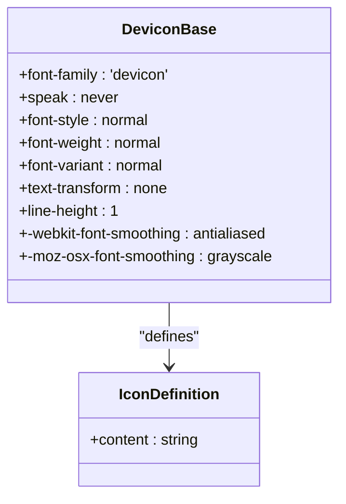

**Diagram sources**

- [devicon-base.css](file://static/devicon-base.css)

**Section sources**

- [devicon-base.css](file://static/devicon-base.css)

### Theme-Specific Overrides

The `devicon-dark-theme.css` file provides theme-specific overrides that address visual issues in the dark theme. This CSS file implements targeted fixes for icons that would otherwise have poor contrast or visibility against dark backgrounds. The overrides use CSS selectors to target specific icon classes and apply appropriate colors that maintain visual consistency while ensuring accessibility.

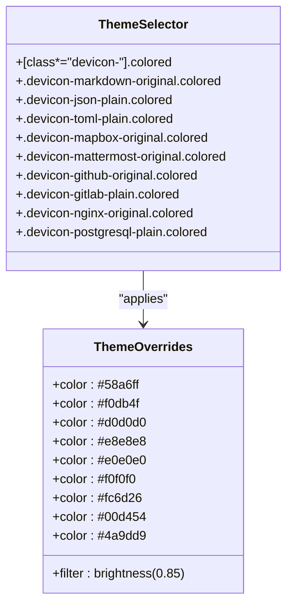

**Diagram sources**

- [devicon-dark-theme.css](file://static/devicon-dark-theme.css)

**Section sources**

- [devicon-dark-theme.css](file://static/devicon-dark-theme.css)

### Color Palette System

The `THEME_PALETTES.ts` file defines the color palette system that serves as the single source of truth for all theme colors in the application. This TypeScript module exports a collection of predefined palettes for both light and dark modes, each with specific background levels, text colors, and primary colors. The palettes are designed to maintain visual harmony and accessibility across different UI components.

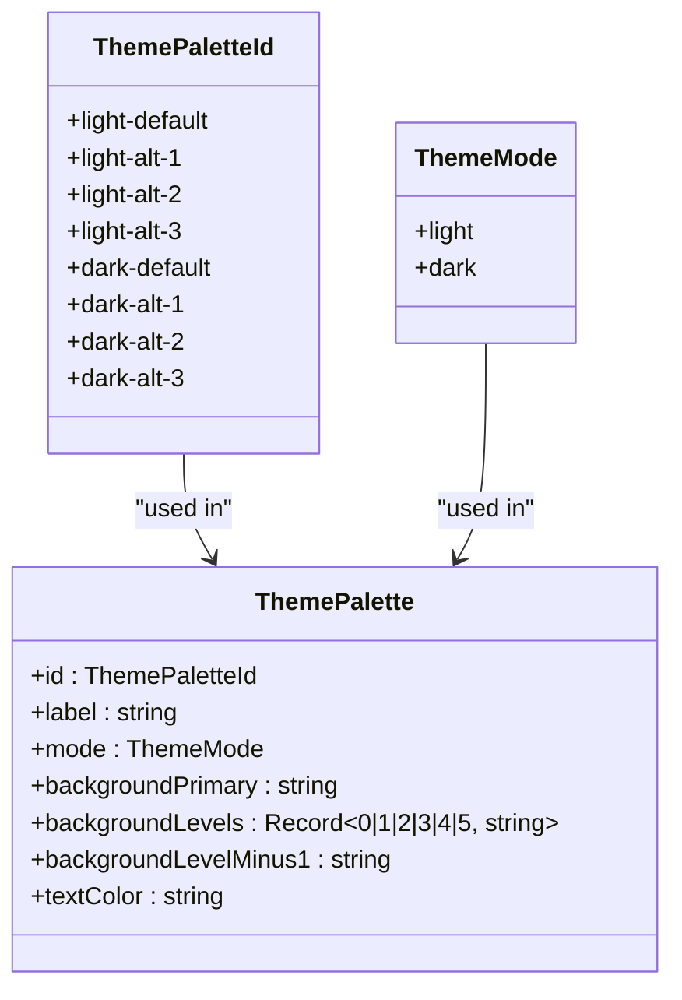

**Diagram sources**

- [THEME_PALETTES.ts](file://src/lib/stores/THEME_PALETTES.ts)

**Section sources**

- [THEME_PALETTES.ts](file://src/lib/stores/THEME_PALETTES.ts)

### Icon Color Management

The `ICON_COLORS_PALETTE.ts` file provides a comprehensive color palette for icons used throughout the application. This module defines base colors for various technologies and adapts them for both light and dark themes to ensure optimal visibility and aesthetic consistency. The system includes functions for retrieving appropriate icon colors based on the current theme and technology name.

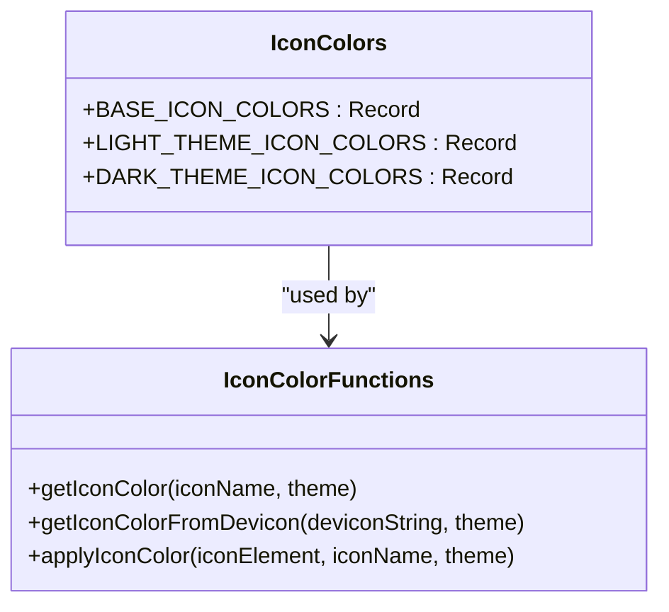

**Diagram sources**

- [ICON_COLORS_PALETTE.ts](file://src/lib/stores/ICON_COLORS_PALETTE.ts)

**Section sources**

- [ICON_COLORS_PALETTE.ts](file://src/lib/stores/ICON_COLORS_PALETTE.ts)

## Theme Switching and Management

### Theme Store Implementation

The `themeStore.ts` file implements the central theme management system using Svelte's writable store pattern. This store maintains the current theme state, including the active mode (light/dark) and selected palette. It provides methods for switching themes, toggling between modes, and setting specific palettes while ensuring that related settings are updated consistently.

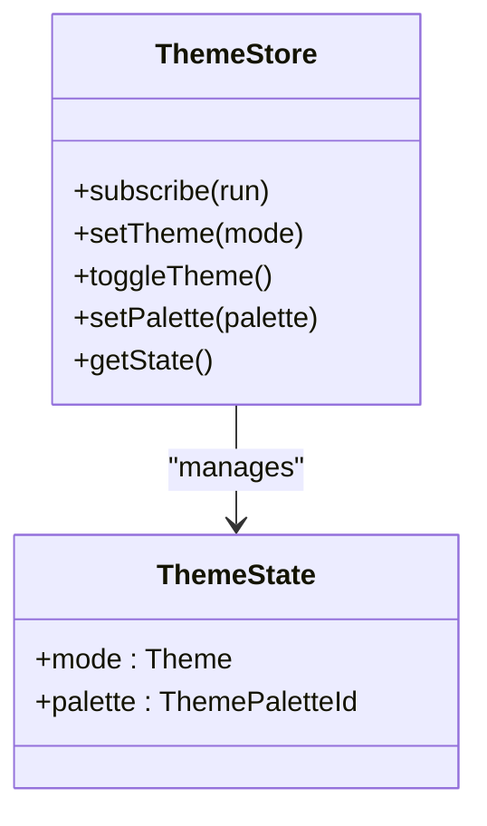

**Diagram sources**

- [themeStore.ts](file://src/lib/stores/themeStore.ts)

**Section sources**

- [themeStore.ts](file://src/lib/stores/themeStore.ts)

### Theme Switching Logic

The theme switching mechanism in the NC code editor preserves the user's palette preference when toggling between light and dark modes. When a user switches from dark to light mode, the system attempts to maintain the same "slot" in the palette selection (e.g., switching from dark-alt-2 to light-alt-2). This approach provides a consistent user experience while allowing for mode-appropriate color adjustments.

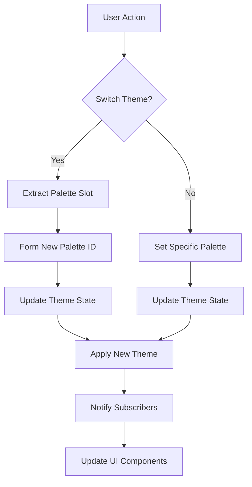

**Diagram sources**

- [themeStore.ts](file://src/lib/stores/themeStore.ts)

**Section sources**

- [themeStore.ts](file://src/lib/stores/themeStore.ts)

### CSS Variable Integration

The `app.css` file defines CSS custom properties that establish the foundation for the theme system. These variables provide a consistent color scheme that can be easily modified to support different themes. The CSS uses the `:root` selector to define light theme variables and the `.dark` class to override them for dark mode, creating a seamless transition between themes.

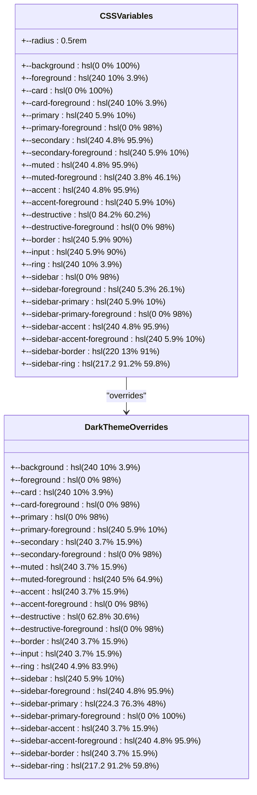

**Diagram sources**

- [app.css](file://src/app.css)

**Section sources**

- [app.css](file://src/app.css)

## Editor Theme Integration

### Monaco Editor Theme Management

The `themeManager.ts` file implements a comprehensive theme management system for the Monaco editor component. This class-based implementation provides methods for registering, applying, and managing both built-in and custom themes for the code editor. The system integrates with the application's theme store to ensure visual consistency between the UI and editor components.

```mermaid
classDiagram
class ThemeManager {
-monaco : typeof monaco
-customThemes : Map<string, CustomTheme>
-currentThemeId : string | null
-initialized : boolean
-themesLoaded : boolean
+initialize(monacoInstance)
+isInitialized()
+areThemesLoaded()
+registerBuiltInTheme(themeId)
+registerCustomTheme(themeJson)
+applyTheme(themeId)
+getAvailableThemes()
+exportTheme(themeId)
+removeCustomTheme(themeId)
+getCurrentTheme()
+createThemeFromPalette(paletteId)
+loadPopularThemes()
}
class CustomTheme {
+name : string
+base : 'vs' | 'vs-dark' | 'hc-black' | 'hc-light'
+inherit : boolean
+rules : Array<{token, foreground?, background?, fontStyle?}>
+colors : Record<string, string>
}
class ThemeState {
+mode : Theme
+palette : ThemePaletteId
}
ThemeManager --> CustomTheme : "uses"
ThemeManager --> ThemeState : "integrates with"
```

**Diagram sources**

- [themeManager.ts](file://src/lib/editor/themeManager.ts)

**Section sources**

- [themeManager.ts](file://src/lib/editor/themeManager.ts)

### Theme Synchronization

The theme system ensures synchronization between the UI theme and editor theme through the `getMonacoThemeId` function. This function determines the appropriate Monaco editor theme based on the current UI theme state and any editor-specific theme overrides. The synchronization mechanism allows users to maintain a consistent visual experience across the entire application.

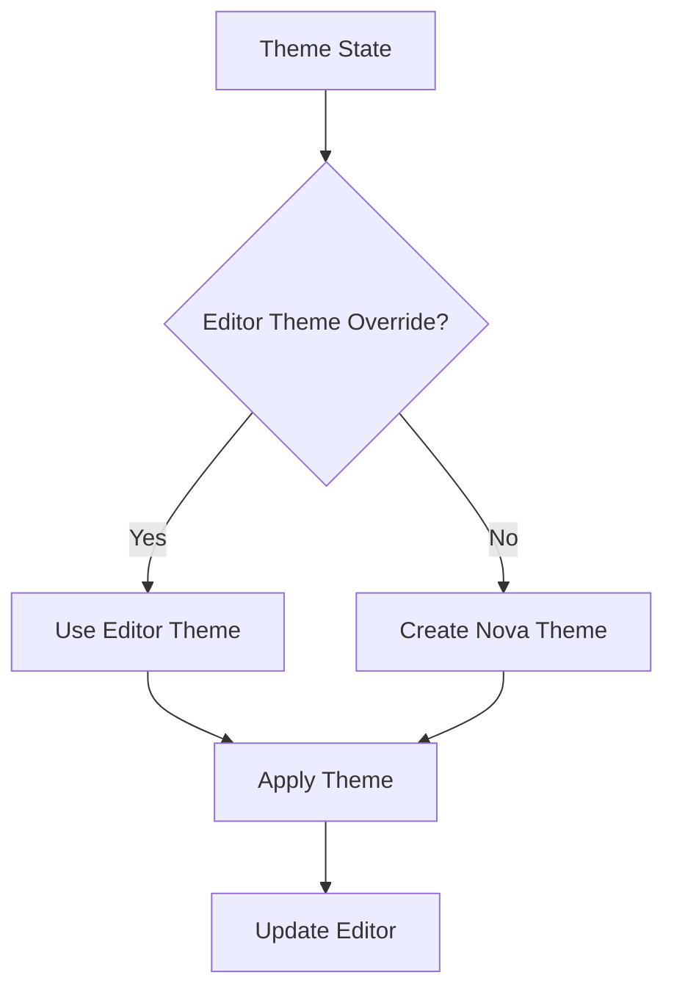

**Diagram sources**

- [themeManager.ts](file://src/lib/editor/themeManager.ts)

**Section sources**

- [themeManager.ts](file://src/lib/editor/themeManager.ts)

## Custom Theme Creation

### Theme Definition Structure

Custom themes in the NC code editor follow a specific structure defined by the `CustomTheme` interface. This structure includes a name, base theme, inheritance flag, token rules, and color mappings that allow for comprehensive customization of the editor's appearance. Users can create and register custom themes through the theme manager API.

```mermaid
classDiagram
class CustomTheme {
+name : string
+base : 'vs' | 'vs-dark' | 'hc-black' | 'hc-light'
+inherit : boolean
+rules : Array<{token, foreground?, background?, fontStyle?}>
+colors : Record<string, string>
}
class TokenRule {
+token : string
+foreground? : string
+background? : string
+fontStyle? : string
}
CustomTheme --> TokenRule : "contains"
```

**Diagram sources**

- [themeManager.ts](file://src/lib/editor/themeManager.ts)

**Section sources**

- [themeManager.ts](file://src/lib/editor/themeManager.ts)

### Theme Registration Process

The theme registration process allows users to import and register custom themes from JSON definitions. The system validates the theme structure before registration and generates a unique ID for each custom theme. Registered themes can be applied, exported, or removed through the theme manager API.

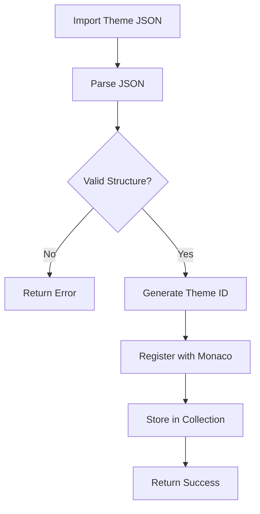

**Diagram sources**

- [themeManager.ts](file://src/lib/editor/themeManager.ts)

**Section sources**

- [themeManager.ts](file://src/lib/editor/themeManager.ts)

## Visual Consistency and Accessibility

### Settings Integration

The theme system integrates with the application's settings framework through the `registry.ts` file. This integration exposes theme-related settings to the user interface, allowing users to configure their preferred theme and palette through the settings panel. The settings registry provides a structured interface for accessing and modifying theme settings.

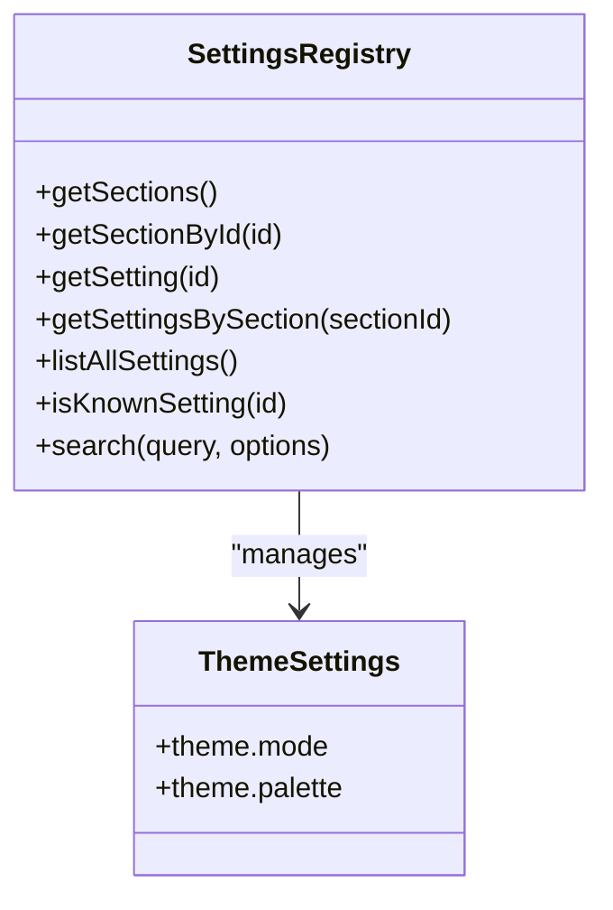

**Diagram sources**

- [registry.ts](file://src/lib/settings/registry.ts)

**Section sources**

- [registry.ts](file://src/lib/settings/registry.ts)

### State Management Integration

The `settingsStore.ts` file provides a unified interface for managing application settings, including theme settings. This store subscribes to changes in the theme store and editor settings store, maintaining a consistent snapshot of the application's state. The integration ensures that theme changes are properly reflected throughout the application.

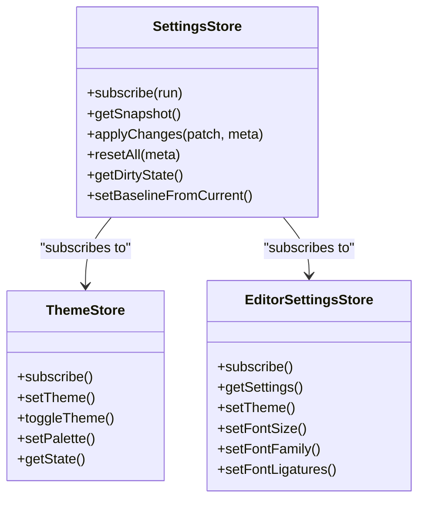

**Diagram sources**

- [settingsStore.ts](file://src/lib/stores/settingsStore.ts)

**Section sources**

- [settingsStore.ts](file://src/lib/stores/settingsStore.ts)

## Troubleshooting Common Issues

### Contrast and Visibility Issues

The theme system addresses contrast and visibility issues through targeted CSS overrides in the `devicon-dark-theme.css` file. These overrides specifically target icons that would otherwise have poor contrast against dark backgrounds, ensuring that all icons remain visible and accessible regardless of the selected theme.

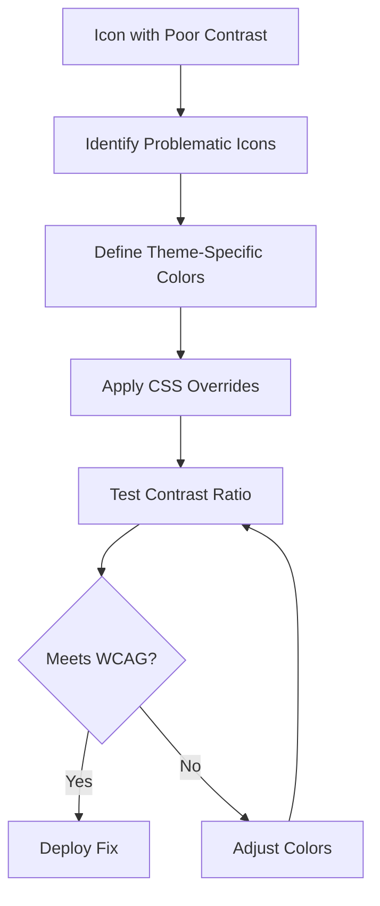

**Diagram sources**

- [devicon-dark-theme.css](file://static/devicon-dark-theme.css)

**Section sources**

- [devicon-dark-theme.css](file://static/devicon-dark-theme.css)

### Theme Persistence

The theme system ensures persistence of user preferences through the settings store and profiles system. User theme selections are saved and restored between sessions, maintaining consistency across application restarts. The profiles system allows users to save and switch between different theme configurations.

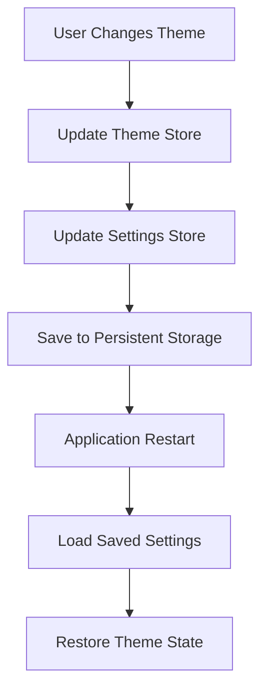

**Diagram sources**

- [settingsStore.ts](file://src/lib/stores/settingsStore.ts)
- [settingsProfilesStore.ts](file://src/lib/stores/settingsProfilesStore.ts)

**Section sources**

- [settingsStore.ts](file://src/lib/stores/settingsStore.ts)
- [settingsProfilesStore.ts](file://src/lib/stores/settingsProfilesStore.ts)

## Conclusion

The theme customization system in the NC code editor provides a comprehensive and flexible approach to visual styling that balances user customization with design consistency. By separating concerns between CSS styling, TypeScript state management, and component integration, the system ensures that themes are applied consistently across all UI elements while remaining accessible and maintainable. The architecture supports both built-in themes and custom theme creation, allowing users to tailor their environment to their specific needs and preferences. Through careful attention to contrast, accessibility, and visual harmony, the theme system enhances the overall user experience while maintaining technical robustness and extensibility.
