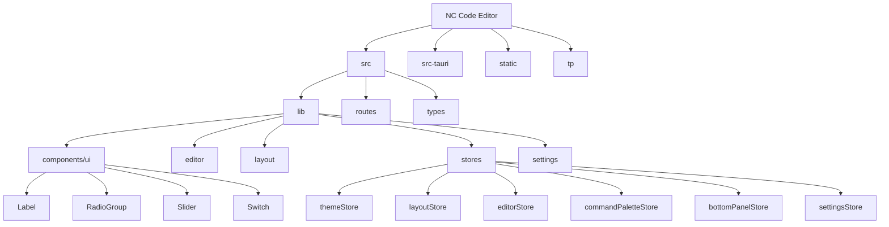
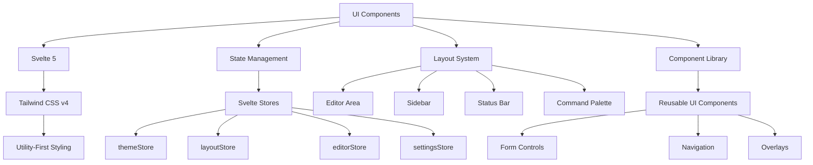
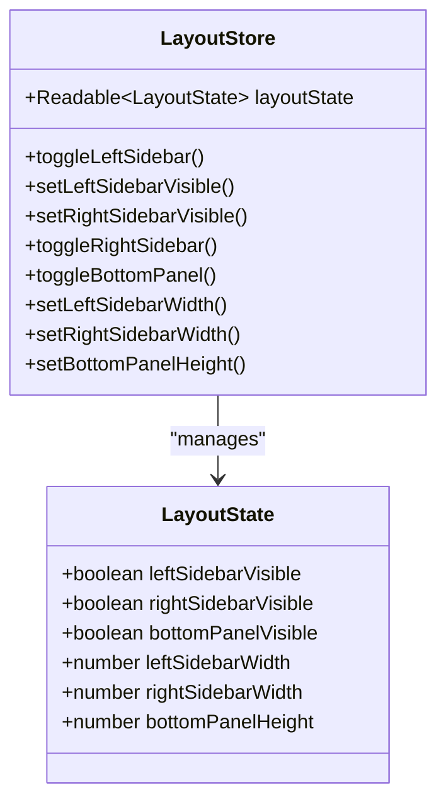
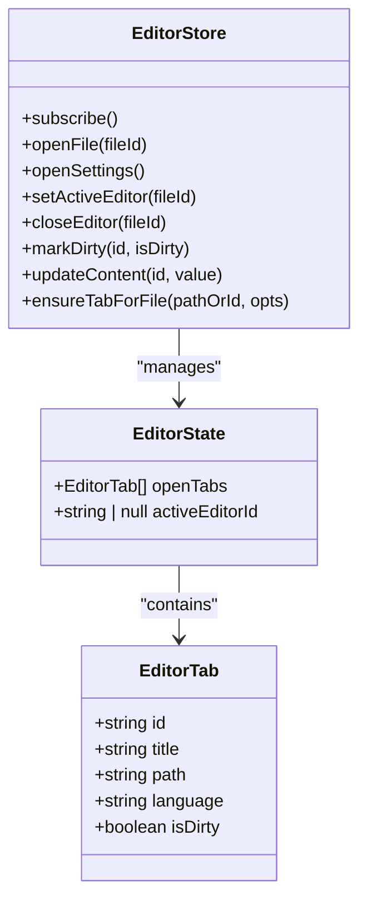
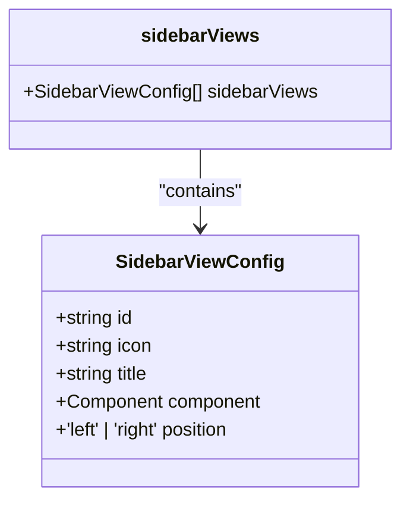
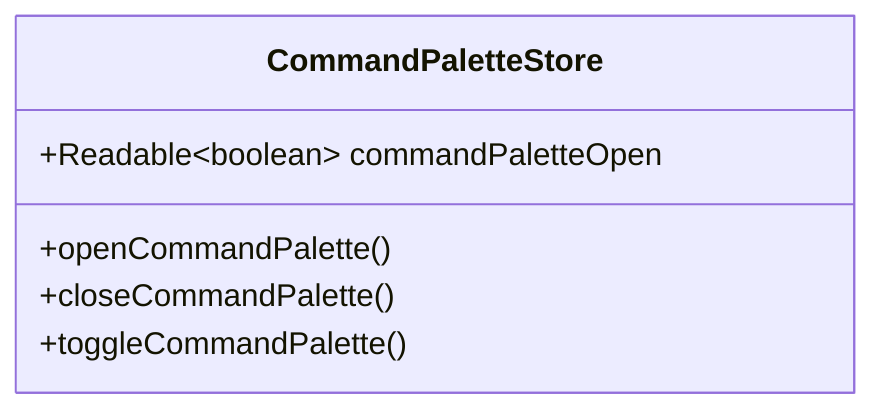
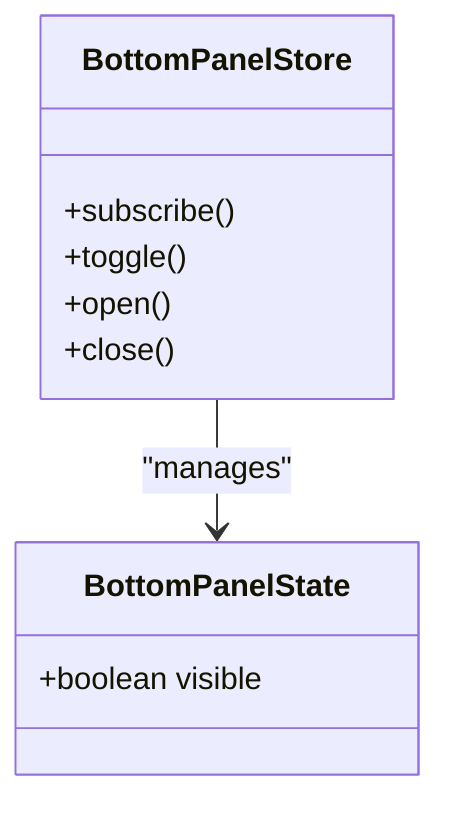
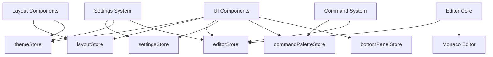

# User Interface

<cite>
**Referenced Files in This Document**   
- [app.html](file://src/app.html)
- [app.css](file://src/app.css)
- [svelte.config.js](file://svelte.config.js)
- [package.json](file://package.json)
- [sidebarRegistry.ts](file://src/lib/layout/sidebarRegistry.ts)
- [themeStore.ts](file://src/lib/stores/themeStore.ts)
- [layoutStore.ts](file://src/lib/stores/layout/layoutStore.ts)
- [editorStore.ts](file://src/lib/stores/editorStore.ts)
- [commandPaletteStore.ts](file://src/lib/stores/commandPaletteStore.ts)
- [bottomPanelStore.ts](file://src/lib/stores/bottomPanelStore.ts)
- [settingsStore.ts](file://src/lib/stores/settingsStore.ts)
- [components/ui](file://src/lib/components/ui)
</cite>

## Table of Contents

1. [Introduction](#introduction)
2. [Project Structure](#project-structure)
3. [Core Components](#core-components)
4. [Architecture Overview](#architecture-overview)
5. [Detailed Component Analysis](#detailed-component-analysis)
6. [Dependency Analysis](#dependency-analysis)
7. [Performance Considerations](#performance-considerations)
8. [Troubleshooting Guide](#troubleshooting-guide)
9. [Conclusion](#conclusion)

## Introduction

The NC code editor features a modern user interface built with Svelte 5 and styled using Tailwind CSS v4. The interface follows a component-based architecture with a clear separation of concerns between UI components, layout management, and application state. The design emphasizes accessibility, responsive behavior, and theme consistency across all interface elements. This documentation provides a comprehensive overview of the UI architecture, component organization, styling approach, and state management patterns that power the editor's user experience.

## Project Structure

**Diagram sources**

- [app.html](file://src/app.html#L1-L49)
- [app.css](file://src/app.css#L1-L111)
- [package.json](file://package.json#L1-L41)

**Section sources**

- [app.html](file://src/app.html#L1-L49)
- [app.css](file://src/app.css#L1-L111)
- [svelte.config.js](file://svelte.config.js#L1-L19)
- [package.json](file://package.json#L1-L41)

## Core Components

The NC code editor's user interface is built around several core components that define the main layout and functionality. These include the editor area, sidebar panels, status bar, command palette, and various UI controls. The components are organized in a hierarchical structure with clear responsibilities and well-defined interfaces. The UI leverages Svelte 5's reactivity system for efficient updates and smooth interactions, while maintaining a clean separation between presentation and business logic.

**Section sources**

- [sidebarRegistry.ts](file://src/lib/layout/sidebarRegistry.ts#L1-L73)
- [components/ui](file://src/lib/components/ui)
- [app.css](file://src/app.css#L1-L111)

## Architecture Overview

**Diagram sources**

- [themeStore.ts](file://src/lib/stores/themeStore.ts#L1-L120)
- [layoutStore.ts](file://src/lib/stores/layout/layoutStore.ts#L1-L131)
- [editorStore.ts](file://src/lib/stores/editorStore.ts#L1-L381)
- [settingsStore.ts](file://src/lib/stores/settingsStore.ts#L1-L313)

## Detailed Component Analysis

### Layout Components

The NC code editor implements a flexible layout system that supports multiple sidebar configurations, resizable panels, and dynamic content areas. The main layout components include the editor area, left and right sidebars, status bar, and command palette. The layout state is managed through dedicated Svelte stores that provide a single source of truth for visibility and dimensions of all layout containers.

**Diagram sources**

- [layoutStore.ts](file://src/lib/stores/layout/layoutStore.ts#L1-L131)

**Section sources**

- [layoutStore.ts](file://src/lib/stores/layout/layoutStore.ts#L1-L131)
- [sidebarRegistry.ts](file://src/lib/layout/sidebarRegistry.ts#L1-L73)

### Editor Area

The editor area is the central component of the NC code editor, providing a rich text editing experience with syntax highlighting, code completion, and diagnostics. The editor functionality is powered by the Monaco editor, integrated through a custom EditorCore component. The editor state is managed through the editorStore, which tracks open tabs, active editor instances, and document dirty states.

**Diagram sources**

- [editorStore.ts](file://src/lib/stores/editorStore.ts#L1-L381)

**Section sources**

- [editorStore.ts](file://src/lib/stores/editorStore.ts#L1-L381)
- [editor](file://src/lib/editor)

### Sidebar System

The sidebar system in the NC code editor provides access to various views including file explorer, search, source control, extensions, and outline. The sidebar implementation follows a registry pattern, where sidebar views are defined in a central registry with their ID, icon, title, and associated component. This approach enables a clean separation between the sidebar container and the individual view components.

**Diagram sources**

- [sidebarRegistry.ts](file://src/lib/layout/sidebarRegistry.ts#L1-L73)

**Section sources**

- [sidebarRegistry.ts](file://src/lib/layout/sidebarRegistry.ts#L1-L73)
- [sidebar](file://src/lib/sidebar)

### Command Palette

The command palette provides a quick way to access editor commands and navigate the interface. The command palette state is managed through a dedicated store that controls its visibility and provides functions to open, close, and toggle the palette. This centralized approach ensures consistent behavior across the application and enables keyboard shortcuts to control the palette from anywhere in the interface.

**Diagram sources**

- [commandPaletteStore.ts](file://src/lib/stores/commandPaletteStore.ts#L1-L29)

**Section sources**

- [commandPaletteStore.ts](file://src/lib/stores/commandPaletteStore.ts#L1-L29)
- [commands](file://src/lib/commands)

### Status and Bottom Panel

The status bar and bottom panel provide additional information and tools for the user. The bottom panel can host various views such as terminal, output, problems, and debug console. The visibility and state of the bottom panel are managed through a dedicated store, allowing for consistent control and integration with other UI components.

**Diagram sources**

- [bottomPanelStore.ts](file://src/lib/stores/bottomPanelStore.ts#L1-L24)

**Section sources**

- [bottomPanelStore.ts](file://src/lib/stores/bottomPanelStore.ts#L1-L24)

## Dependency Analysis

**Diagram sources**

- [themeStore.ts](file://src/lib/stores/themeStore.ts#L1-L120)
- [layoutStore.ts](file://src/lib/stores/layout/layoutStore.ts#L1-L131)
- [editorStore.ts](file://src/lib/stores/editorStore.ts#L1-L381)
- [settingsStore.ts](file://src/lib/stores/settingsStore.ts#L1-L313)
- [commandPaletteStore.ts](file://src/lib/stores/commandPaletteStore.ts#L1-L29)
- [bottomPanelStore.ts](file://src/lib/stores/bottomPanelStore.ts#L1-L24)

**Section sources**

- [themeStore.ts](file://src/lib/stores/themeStore.ts#L1-L120)
- [layoutStore.ts](file://src/lib/stores/layout/layoutStore.ts#L1-L131)
- [editorStore.ts](file://src/lib/stores/editorStore.ts#L1-L381)
- [settingsStore.ts](file://src/lib/stores/settingsStore.ts#L1-L313)
- [commandPaletteStore.ts](file://src/lib/stores/commandPaletteStore.ts#L1-L29)
- [bottomPanelStore.ts](file://src/lib/stores/bottomPanelStore.ts#L1-L24)

## Performance Considerations

The NC code editor's UI architecture is designed with performance in mind. The use of Svelte 5's compile-time reactivity system ensures efficient updates with minimal runtime overhead. The component library follows best practices for reusability and maintainability, reducing code duplication and improving bundle size. The store-based state management pattern minimizes unnecessary re-renders by allowing components to subscribe only to the specific state they need. The integration with Monaco editor is optimized to handle large files and complex language features without impacting the responsiveness of the user interface.

## Troubleshooting Guide

When encountering UI issues in the NC code editor, consider the following common problems and solutions:

1. **Theme not applying correctly**: Ensure the themeStore is properly initialized and that the CSS variables are correctly set in the root element.

2. **Layout components not responding to state changes**: Verify that components are properly subscribing to the relevant stores and that store updates are being triggered correctly.

3. **Command palette not opening**: Check that the keyboard shortcut is not conflicting with other bindings and that the commandPaletteStore is accessible from the current context.

4. **Editor performance issues**: Monitor the number of open tabs and ensure that the Monaco editor is properly disposed of when tabs are closed to prevent memory leaks.

5. **Sidebar views not appearing**: Confirm that the view is properly registered in the sidebarRegistry and that the component path is correct.

**Section sources**

- [themeStore.ts](file://src/lib/stores/themeStore.ts#L1-L120)
- [layoutStore.ts](file://src/lib/stores/layout/layoutStore.ts#L1-L131)
- [editorStore.ts](file://src/lib/stores/editorStore.ts#L1-L381)
- [settingsStore.ts](file://src/lib/stores/settingsStore.ts#L1-L313)

## Conclusion

The NC code editor's user interface represents a modern, component-based architecture built with Svelte 5 and styled with Tailwind CSS v4. The design emphasizes clean separation of concerns, reusability, and maintainability through a well-organized component library and store-based state management system. The layout system provides flexibility for different workflows while maintaining consistency across the interface. The theming system enables easy customization and supports both light and dark modes with multiple color palettes. Overall, the UI architecture balances functionality, performance, and developer experience, providing a solid foundation for a powerful code editing environment.
